# 	Java面试八股


## Java基础

#### 0.JDK，JRE,JVM的区别

**JDK**：Java Development Kit，一套完整的Java开发工具，包括JRE，javac编译器，Javadoc文档生成器，Java调试器等一系列开发工具。

**JRE**：Java Runtime Environment，Java运行环境，包括JVM和核心类库。

**JVM**：Java虚拟机，实现跨平台的关键，负责把.class字节码转成机器码运行。


#### 1.解释下什么是面向对象？面向对象和面向过程的区别？介绍一下面向对象三大特性？

**面向对象**是一种编程思想，强调通过对象来模拟现实世界中的事物。每个对象都有属性和方法，可以通过操作对象来实现功能。

**面向对象与面向过程的区别**：

1. **编程思路**：面向过程关注**功能实现**，面向对象先定义**类、属性、方法**，再通过**对象**完成功能。
2. **封装**：面向过程封装**功能**，面向对象封装**数据**和**功能**。
3. **多态与继承**：面向对象支持**多态性**和**继承性**，面向过程没有这些特性。

**面向对象的三大特性**：

1. **封装**：将**数据和方法捆绑**，隐藏内部实现，只暴露接口，提高代码复用性和安全性。
2. **继承**：子类**继承父类的属性和方法**，支持代码重用和简化结构。
3. **多态**：相同方法在不同对象中有不同表现，增强**灵活性**和可扩展性。

#### 2. Java 中是否可以重写（覆盖）一个 private 或者 static 方法？ 

1. **private方法不能被覆盖**，因为它只能在当前类中访问，子类无法访问和重写。
2. **static方法也不能被覆盖**，因为静态方法是编译时绑定的，与对象实例无关，无法进行动态绑定。虽然静态方法可以被继承，但**如果子类有相同名称和参数的静态方法，它会隐藏父类的方法，而不是覆盖**，这意味着没有多态性。

#### 3. Java 中创建对象的几种方式？（4种）

1. **new**：使用`new`关键字。
2. **反射**：通过`Java.lang.reflect.Constructor`的`newInstance()`方法动态创建对象。
3. **clone**：通过`clone()`方法创建对象的副本。
4. **反序列化**：通过`ObjectInputStream`的`readObject()`方法对象。

#### 4. 抽象类和接口有什么区别？ 

1. **目的不同**：抽象类用于继承，接口用于实现，接口的方法是用于重写的。
2. **构造方法**：抽象类可以有构造方法，接口不能。
3. **方法定义**：抽象类可以有**抽象方法**和**具体方法**，接口只能有**抽象方法**。
4. **成员权限**：抽象类成员可为**public、default、protected**，接口成员只能是**public。**
5. **静态方法**：抽象类可以有静态方法，接口（JDK 1.8前）不能。

**JDK 1.8后的变化：**

1. 接口可以包含有默认实现的**default方法**。
2. 接口可以包含**静态方法**（只能通过接口调用），但不能包含静态代码块。

#### 5. String 为什么要设计为不可变类？（3点）

在Java中将String设计成不可变的是综合考虑到各种因素的结果。主要的原因有以下三点：

1. **字符串常量池**：**字符串常量池**是Java中的一个特殊内存区域，存储字符串常量。当创建一个`String`对象时，如果该字符串已经存在于常量池中，Java会直接引用已有的对象，而不是重新创建一个新的对象。
2. **允许String对象HashCode缓存**：哈希码（hashCode）是对象的一个整型值，常用于在哈希容器（如`HashMap`、`HashSet`）中进行快速查找。`String`在许多数据结构中充当键（例如在`HashMap`中），所以`String`对象的哈希码会被频繁使用。如果每次都要重新计算`String`对象的哈希码，会浪费计算资源并影响性能。
3. **String被许多的Java类（库）用来当做参数**：例如：网络连接地址URL、文件路径path、还有反射机制所需要的**String参数**等，假若String不是固定不变的，将会引起各种安全隐患。

**追加问题：String是怎么设计成不可变的？-- polarDB春招二面问题**

```Java
public final class String {

    /** The value is used for character storage. */
    private final char value[];

    /** Cache the hash code for the string */
    private int hash; // Default to 0
}
```

1. **使用final关键字：**String类声明为final，这意味着它不能被继承。这样可以防止其他类通过继承来修改String类的行为。
2. **字符数组存储：**String类内部使用一个字符数组（char[]）来存储字符串的字符序列。这个字符数组被声明为private和final，以保证其不可被外部修改。
4. **操作返回新对象：**String类的方法（如**`concat()`**、**`substring()`**等）都是返回一个新的String对象，而不是修改原有对象的值。这样确保了字符串的不可变性。
5. **字符串连接优化：**当进行**字符串连接操作**时，Java编译器会自动优化为使用StringBuilder或StringBuffer来构建新的字符串，以提高性能。这是因为StringBuilder和StringBuffer是可变的，效率更高，但在最终得到结果后，会将其转换为不可变的String对象。

#### 6.String、StringBuffer、StringBuilder的区别？

- **String**：
  - **不可变**，修改时会创建新对象。
  - **线程安全**，适用于少量修改场景。
  - 适合用于常量池，但频繁修改时效率低。
- **StringBuffer**：
  - **可变**，修改时不会创建新对象。
  - **线程安全**，适合多线程环境(sychronized同步操作)。
  - 在单线程中性能低于`StringBuilder`，但适合并发修改。
- **StringBuilder**：
  - **可变**，修改时不会创建新对象。
  - **非线程安全**，适用于单线程环境。
  - 在单线程环境中性能优于`StringBuffer`。

**总结**：

- `String`用于不变字符串。
- `StringBuilder`适用于单线程场景，性能更好。
- `StringBuffer`用于多线程环境，保证线程安全。

#### 7. StringBuilder 和 String 有长度限制吗？

1. **String**：
   - 长度上限为2GB（约为2^31-1个字符），因为`String`内部使用的`char[]`数组的索引是整型（**32位**）。
   - 受限于数组大小和Java堆的最大尺寸，理论上最大长度为2GB。

2. **StringBuilder**：
   - 与`String`类似，`StringBuilder`的长度也受限于数组大小和堆内存限制。最大长度同样不能超过Java堆的大小。

**总结**：`String`和`StringBuilder`的长度受限于2GB字符大小，并受Java堆内存限制。

#### 8. String s = new String("abc")创建了几个对象 
- 如果字符串常量池中没有"abc"，则会创建**两个对象**：一个在常量池中，另一个在堆内存中。
- 如果常量池中已经有"abc"，则只在堆内存中创建**一个对象**。

总结：**一个或两个对象**，取决于常量池中是否已存在该字符串。

#### 9. final关键字的4种用法？修饰基本类型和引用类型有什么区别？ 

1. 修饰变量 :
   1. 修饰基本类型时：值不可以改变 
   2. 修饰引用类型时：不可以改变引用，但是可以改变引用的对象的值

2. 修饰方法参数：表示在**方法参数的生命周期中**，**值是不可变**的
3. 修饰方法：表示该方法**无法被重写**
4. 修饰类：表示该类**无法被继承**

#### 10. 为什么 wait/notify 方法放在 Object 类中而不是 Thread 类中？

- **锁是对象级的**，而不是线程级的。`wait()`和`notify()`需要在特定对象的锁上执行，确保线程间的同步。
- 如果这些方法放在`Thread`类中，它们将不再与对象的锁绑定，可能破坏同步机制。
- 将它们放在`Object`类中，符合**面向对象设计原则**，使得线程同步依赖于**对象的锁**，而不是线程本身。

#### 11. final、finally、finalize 的区别？

- **final**：用于声明**常量**、**方法**（不可重写）和**类**（不可继承）。
- **finally**：异常处理中的一部分，**无论是否发生异常，都会执行**。
- **finalize**：`Object`类中的方法，在**垃圾回收时**被调用，曾用于资源清理，但**已弃用**，现代Java建议使用`try-with-resources`等更可靠的方式管理资源。

#### 12. 为什么重写 equals() 就一定要重写 hashCode() 方法？

在 Java 中，当一个类重写了 `equals()` 方法时，强烈推荐同时也重写 `hashCode()` 方法。这是因为 **Java 的集合框架以及其他依赖于散列码的结构**（如 `HashMap`, `HashSet` 等）对这两个方法的实现有特定的要求。

**相关规定**：

- 如果 `equals()` 返回 `true`，则 `hashCode()` 必须相同。
- 如果两个对象的 `hashCode()` 相同，`equals()` 不一定返回 `true`（即哈希碰撞）。
- 默认情况下，`hashCode()` 基于内存地址计算，未重写时对象不会被认为相等。

`HashSet` 的工作流程：

1. **计算哈希码**：添加新对象时，`HashSet` 调用 `hashCode()` 计算哈希码，用来确定存储位置。
2. **哈希碰撞处理**：如果不同对象的哈希码相同，`HashSet` 会使用 `equals()` 判断是否相等。
3. **调用 `equals()`**：如果对象相等，`HashSet` 不会添加新对象；否则，添加对象。

**举例：**

```Java
public class Person {
    private String name;
    private int age;

    public Person(String name, int age) {
        this.name = name;
        this.age = age;
    }

    @Override
    public boolean equals(Object obj) {
        if (this == obj) return true;
        if (obj == null || getClass() != obj.getClass()) return false;
        Person person = (Person) obj;
        return age == person.age &&
               name.equals(person.name);
    }

    @Override
    public int hashCode() {
        return Objects.hash(name, age);
    }
}
```

总结：

- `hashCode()` 和 `equals()` 方法必须协同工作，确保对象在集合中正确存储和比较。
- 仅重写 `equals()` 或 `hashCode()` 其中一个方法可能会导致不符合预期的行为。

#### 13. error 和 exception 的区别？ 

**Error 类**：

- **定义**：通常表示与**虚拟机相关**的问题，例如系统崩溃、虚拟机错误、内存空间不足、栈溢出等。
- **特性**：这种错误通常是无法恢复的，并且程序本身不能通过捕获或处理来解决。
- **处理**：一般情况下，程序无法应对 `Error`，它们往往是致命的，导致程序终止。

**Exception 类**：

- **定义**：表示程序中可能遇到并可以通过捕获处理的异常情况。
- **特性**：可以被捕获并处理，从而避免程序崩溃。
- **分类：**
  1. **受检查异常（编译时异常）**：必须被显式捕获或声明抛出。例如 `IOException`、`SQLException`。
  2. **不受检查异常（运行时异常）**：通常是程序的逻辑错误，运行时抛出并且不强制要求捕获。例如 `ArrayIndexOutOfBoundsException`、`NullPointerException`、`ClassNotFoundException`、`IllegalArgumentException`。

总结：

- **Error**：与虚拟机或系统相关，无法恢复。
- **Exception**：程序可捕获并处理的异常，分为编译时异常和运行时异常。


#### 14. 什么是 Java 的序列化，如何实现 Java 的序列化？

Java的序列化是一个将**对象状态转换为字节流**的过程，使得对象可以持久化到**文件或通过网络**进行传输。与序列化相对应的过程是**反序列化**，即将字节流转换回对象。序列化在跨平台应用、分布式系统和对象持久化中非常有用。

**序列化的实现**

**实现步骤：**

1. **实现 `Serializable` 接口：**只需要实现该接口，没有任何方法要实现，标识该类的对象可以被序列化。
2. **使用 `ObjectOutputStream` 将对象写入流：**`ObjectOutputStream` 提供了 `writeObject(Object obj)` 方法，用于将对象转换为字节流。
3. **使用 `ObjectInputStream` 将字节流转换为对象：**`ObjectInputStream` 提供了 `readObject()` 方法，可以将字节流重新转换为对象。

**注意事项：**

- `serialVersionUID`：
  - `serialVersionUID` 是一个由开发者显式声明的唯一标识符，用于版本控制。它保证反序列化时，类的版本一致性。如果没有显式定义，当类的结构发生变化时，可能会导致 `InvalidClassException`。
- `transient` 关键字：
  - 使用 `transient` 关键字标注的变量不会被序列化。在反序列化时，这些变量会被重置为其默认值（例如，`null` 或 `0`）。

下面是例子，首先，我们需要一个可序列化的类：

```java
import java.io.Serializable;

public class Employee implements Serializable {
    private static final long serialVersionUID = 1L;
    private String name;
    private int age;
    private transient double salary; // transient关键字表明这个字段不会被序列化

    public Employee(String name, int age, double salary) {
        this.name = name;
        this.age = age;
        this.salary = salary;
    }

    // 省略getters和setters为了简洁
}
```

接下来，我们实现序列化过程：

```java
import java.io.FileOutputStream;
import java.io.ObjectOutputStream;

public class SerializationExample {

    public static void main(String[] args) {
        try {
            Employee employee = new Employee("John Doe", 30, 50000.0);
            FileOutputStream fileOut = new FileOutputStream("employee.ser");
            ObjectOutputStream out = new ObjectOutputStream(fileOut);
            out.writeObject(employee);
            out.close();
            fileOut.close();
            System.out.printf("Serialized data is saved in employee.ser\n");
        } catch (Exception e) {
            e.printStackTrace();
        }
    }
}
```

然后，我们实现反序列化过程：

```java
import java.io.FileInputStream;
import java.io.ObjectInputStream;

public class DeserializationExample {

    public static void main(String[] args) {
        Employee deserializedEmployee = null;
        try {
            FileInputStream fileIn = new FileInputStream("employee.ser");
            ObjectInputStream in = new ObjectInputStream(fileIn);
            deserializedEmployee = (Employee) in.readObject();
            in.close();
            fileIn.close();
        } catch (Exception e) {
            e.printStackTrace();
        }
        System.out.println("Deserialized Employee...");
        System.out.println("Name: " + deserializedEmployee.name);
        System.out.println("Age: " + deserializedEmployee.age);
        System.out.println("Salary: " + deserializedEmployee.salary); // 注意：salary可能为默认值，因为它是transient的
    }
}
```

**序列化与反序列化的关键点：**

- `transient` 关键字：
  - 被标记为 `transient` 的字段不会被序列化。例如，在上面的例子中，`salary` 字段被标记为 `transient`，因此它在序列化时会被忽略，并且在反序列化时会恢复为其默认值（例如 `0.0`）。
- `serialVersionUID`：
  - 通过定义 `serialVersionUID`，我们可以保证类的版本兼容性。在类的定义发生变化时，`serialVersionUID` 可用来确保反序列化过程中是否兼容。

**总结：**

- 序列化使得Java对象能够持久化或跨网络传输，反序列化将其恢复为原始对象。
- 为了实现序列化，一个类必须实现 `Serializable` 接口。
- 序列化时，`transient` 关键字用于排除某些字段的序列化，`serialVersionUID` 用于版本控制，确保兼容性。

#### 15. 什么情况下需要序列化？ 

1. **保存对象状态**：将对象保存到文件或数据库中。
2. **网络传输**：通过套接字（Socket）在网络上传输对象。
3. **远程方法调用（RMI）**：在不同的JVM之间传输对象，以支持远程调用。

#### 16.==和equals（）的区别

**`==`** 对于基本类型和引用类型的作用效果是不同的：

- 对于基本数据类型来说，`==` 比较的是值。
- 对于引用数据类型来说，`==` 比较的是对象的内存地址。

> 因为 Java 只有值传递，所以，对于 == 来说，不管是比较基本数据类型，还是引用数据类型的变量，其本质比较的都是值，只是引用类型变量存的值是对象的地址。

`equals()` 方法存在两种使用情况：

- **类没有重写 `equals()`方法**：通过`equals()`比较该类的两个对象时，等价于通过“==”比较这两个对象，使用的默认是 `Object`类`equals()`方法。

  ```java
  public boolean equals(Object obj) {
       return (this == obj);
  }
  ```

- **类重写了 `equals()`方法**：一般我们都重写 `equals()`方法来比较**两个对象中的属性是否相等**；若它们的属性相等，则返回 true(即，认为这两个对象相等)。

#### Object类有哪些方法？

Objcet类有包括`clone` 、`equals`，`finalize`、`getClass`、`hashCode`等方法

#### 有几种序列化方式？


1. **Java 对象序列化**：使用 Java 原生流（如 `ObjectOutputStream` 和 `ObjectInputStream`）进行对象的序列化和反序列化。
2. **JSON 序列化**：通过库（如 Jackson）将对象转化为 JSON 格式或从 JSON 转回对象。这是**常见且广泛使用**的序列化方式。
3. **ProtoBuff 序列化**：一种高效的结构化数据存储格式，适用于压缩数据并减少传输大小，提升系统性能

#### 什么是反射？应用场景？原理？

反射是 Java 提供的一种机制，允许在**运行时检查和操作类的结构**（如字段、方法、构造方法等）。它使得 Java 可以动态地访问和操作类的信息，而不需要在编译时知道类的具体细节。

##### 反射的应用场景：

1. **Spring框架**：大量使用反射来动态加载和管理 Bean。
2. **动态代理**：Java 的动态代理机制利用反射来创建代理类，常用于 **AOP** 和**拦截器**。
3. **测试框架**：JUnit 和 TestNG 通过反射扫描类，查找带有特定注解（如 `@Test`）的方法并执行。

##### 反射的原理：

反射依赖于 JVM 在**类加载时将字节码文件中的类型信息加载到方法区**。反射通过访问这些加载的信息，能够在运行时动态获取类的结构并进行操作。

**例子：**

```Java
import java.lang.reflect.Constructor;
import java.lang.reflect.Method;

public class ReflectionExample {
    public static void main(String[] args) {
        try {
            // 获取 String 类的 Class 对象
            Class<?> stringClass = Class.forName("java.lang.String");

            // 创建 String 类的一个实例
            Constructor<?> constructor = stringClass.getConstructor(new Class[]{String.class});
            Object instance = constructor.newInstance("Hello, World!");

            // 获取 String 类中的方法 toString()
            Method method = stringClass.getMethod("toString");

            // 调用对象的 toString 方法
            Object result = method.invoke(instance);
            System.out.println(result);  // 输出: Hello, World!
        } catch (Exception e) {
            e.printStackTrace();
        }
    }
}
```

#### Java注解你知道吗？有哪些注解？

**Java 注解**是一种特殊的标记，可以附加到类、方法、字段等元素上，**用于提供元数据**，并且可以在编译时或运行时被处理。注解本质上就像生活中的标签或装饰，帮助我们在代码中传递额外的信息。

常见的注解应用有：

- **AOP**：用于标记切点，动态决定何时执行切面逻辑。
- **Lombok**：通过注解生成代码（如 getter/setter、构造器等），在编译时进行处理。

##### 注解生命周期：

1. **RetentionPolicy.SOURCE**：只用于编译时，编译后会丢失，不会写入 `.class` 文件。
2. **RetentionPolicy.CLASS**：编译时保留，编译后写入 `.class` 文件，但运行时会丢弃。
3. **RetentionPolicy.RUNTIME**：编译和类加载时都保留，运行时可以通过反射访问这些注解。

例如，**Spring 的 `@Autowired`** 注解就是运行时注解，可以通过反射在运行时获取注解信息，如是否为 `required`。

#### 重载和重写的区别？

- 方法重载发生在同一个类中，同名的方法如果有不同的参数（参数类型不同、参数个数不同或者二者都不同）。
- 方法重写发生在子类与父类之间，要求子类与父类具有相同的返回类型，方法名和参数列表，并且不能比父类的方法声明更多的异常，遵守里氏代换原则。

#### 什么是Java泛型？

Java 泛型是 Java 1.5 引入的一项特性，允许在定义类、接口或方法时使用**参数化类型**，即让**数据类型**成为**可变的参数**。这样做的目的是提高代码的**重用性**和**类型安全性**，避免手动强制类型转换。

通过泛型，你可以编写灵活的代码，使其能够**在编译时适应不同的数据类型**。例如：

```Java
public class Box<T> {
    private T value;
    public T getValue() {
        return value;
    }
    public void setValue(T value) {
        this.value = value;
    }
}
```

尽管泛型看起来像是改变了对象的类型，但实际上它只存在于编译期间。在编译后的字节码中，所有泛型信息都会被擦除（**类型擦除**）。因此，运行时所有泛型类型都会被转换为其原始类型（例如，`ArrayList<T>` 在运行时变成 `ArrayList`）。

#### Java 中自带的数据结构的延时队列的原理

在 Java 中，延时队列（DelayQueue）是一个实现了 `java.util.Queue` 接口的线程安全队列，属于 `java.util.concurrent` 包的一部分。它的原理是利用队列中的元素带有延迟时间，只有当元素的延迟时间到达时，才能从队列中取出该元素。这种队列通常用于任务调度和定时任务处理。

#### 在Java中，父类和子类静态变量的执行顺序，解释原因

在 Java 中，父类和子类的静态变量初始化顺序是基于类加载机制的。具体来说，静态变量的初始化发生在类被加载时，并且初始化顺序遵循以下规则：

1. **父类静态变量初始化顺序：**
   当一个子类被加载时，Java 会首先加载父类，父类中的静态变量在类加载时就会初始化。所以，在子类的静态变量初始化之前，父类的静态变量会先初始化。
2. **子类静态变量初始化顺序：**
   父类静态变量初始化完成之后，子类的静态变量会被初始化。如果子类没有显式定义静态变量，那么它就不会有任何静态变量的初始化过程。

具体的执行顺序：

1. **父类加载：**
   当 Java 虚拟机加载子类时，首先会检查其父类是否已经加载。如果父类尚未加载，它会先加载父类，并初始化父类的静态变量和静态代码块。
2. **子类加载：**
   父类静态变量初始化完成后，接着会加载子类，并初始化子类的静态变量和静态代码块。

#### Double为什么有精度的问题，在记录金额的时候为什么需要用BigDecimal？

`Double` 类型在Java中是一个双精度浮点数类型，遵循IEEE 754标准。它提供大约15-17位的有效数字精度，但因为其内部使用二进制表示法来存储数值，所以在处理某些十进制小数时可能会遇到精度丢失的问题。这是因为一些十进制小数不能精确地表示为二进制分数。

这就是为什么在记录金额时推荐使用 `BigDecimal` 而不是 `Double` 或 `Float`。`BigDecimal` 提供了更高的精度以及控制舍入行为的能力。它可以表示任意精度的定点数，并且允许用户指定如何进行舍入操作，非常适合用于需要高精度的场景，如财务计算。

#### Java基础类型以及对应的字节数？

| 类型    | 字节数 | 位数 | 取值范围                                                  |
| ------- | ------ | ---- | --------------------------------------------------------- |
| byte    | 1      | 8    | -128 到 127                                               |
| short   | 2      | 16   | -32,768 到 32,767                                         |
| int     | 4      | 32   | -2^31 到 2^31-1 (-2,147,483,648 到 2,147,483,647)         |
| long    | 8      | 64   | -2^63 到 2^63-1                                           |
| float   | 4      | 32   | 大约 ±3.40282347E+38 (有效位数为6-7位)                    |
| double  | 8      | 64   | 大约 ±1.7976931348623157E+308 (有效位数为15位)            |
| char    | 2      | 16   | 使用UTF-16编码，0 到 65,535                               |
| boolean | -      | -    | true 或 false （具体实现依赖于JVM，通常不直接以字节衡量） |

请注意，对于 `boolean` 类型，由于其特殊的用途（仅表示真或假），在不同的JVM实现中可能有不同的存储方式，但通常在数组中每个布尔值会占用1个字节来简化存储结构。然而，这种细节通常是透明于编程人员的，因此更关注其逻辑意义而非物理存储大小。

#### JAVA序列化，serialVersionUID的作用,  怎让字段不序列化

Java序列化是指将对象的状态转换为字节流，以便可以存储到磁盘或通过网络传输。反序列化则是相反的过程，从字节流恢复对象的状态。

`serialVersionUID`的作用

- **版本控制**：`serialVersionUID`是一个唯一标识符，用于在反序列化时验证发送者和接收者的序列化兼容性。如果接收方的`serialVersionUID`与发送方不一致，反序列化过程会失败并抛出`InvalidClassException`。
- **自动生成VS手动指定**：如果没有显式定义`serialVersionUID`，Java会在运行时根据类的各种属性自动生成一个。然而，建议手动定义它以确保稳定性，避免因类结构的小改动而导致的不兼容问题。

**如何让字段不序列化**

在Java中，若想让某个字段不参与序列化过程，可以使用以下方法：

1. **使用`transient`关键字**：
   
   - 在字段声明前加上`transient`关键字，该字段就不会被序列化。例如：
     ```java
     private transient String password;
     ```
   - 这对于那些不需要持久化（如临时状态信息、敏感信息等）的字段非常有用。
   
2. **自定义序列化过程**：
   - 实现`Serializable`接口的类可以通过提供两个特殊的方法来控制序列化过程：
     - `private void writeObject(ObjectOutputStream out) throws IOException` 
     -  `private void readObject(ObjectInputStream in) throws IOException, ClassNotFoundException`。
   - 在这些方法中，你可以选择哪些字段应该被序列化以及如何进行序列化/反序列化处理。

#### 深拷贝与浅拷贝

深拷贝和浅拷贝是处理对象复制时的两种主要方式。简单来说：

- **浅拷贝**：创建一个新对象，然后将现有对象（被拷贝对象）的引用插入到这个新对象中。这意味着如果原对象中有可变对象（如列表、字典等），**浅拷贝的新对象和原对象共享这些可变对象**的内容。
- **深拷贝**：创建一个新对象，并且递归地复制所有对象，包括嵌套的对象。这样，**原始对象和拷贝对象之间没有任何共享的对象**，因此修改一个不会影响另一个。


## Java IO

#### 1.IO是什么？

**输入（Input）:**指将数据从外部设备（如键盘、鼠标、传感器等）传输到计算机内部（如内存、CPU）。例如用户通过键盘输入字符到程序中。

**输出（Output）:**指将数据从计算机内部传输到外部设备（如显示器、打印机、磁盘等）。例如，将处理后的数据输出到屏幕上显示。

- IO是输入/输出，是用户程序与外部设备的交互，比如鼠标、键盘、硬盘、网卡。
- 根据操作系统知识，一个进程的地址空间划分为用户空间和内核空间，用户空间无法进行系统资源相关的操作，比如文件管理、内存管理、网络管理等，因此要执行IO操作需要依靠**内核空间**。
- 应用程序对操作系统发起IO调用（系统调用）时，操作系统负责具体的IO操作，应用程序实际上只是发起了调用。
- 应用程序发起IO调用后，经历了两个过程：
  - **内核准备数据**：内核等待IO设备准备好数据。
  - **内核拷贝数据**：内核将数据从内核空间拷贝到用户空间。
- 常见IO模型：**阻塞IO，非阻塞IO，IO多路复用，信号驱动IO和异步IO。**

#### BIO，NIO，AIO有什么区别？

https://www.bilibili.com/video/BV1gozdYSEkR/?spm_id_from=333.337.search-card.all.click&vd_source=ac954c7dcd7410d266df99a8f47daf81


**BIO（Blocking I/O）**

**同步阻塞 IO 模型中，应用程序发起 read 调用后，会一直阻塞，直到内核把数据拷贝到用户空间。**

- **同步阻塞**：BIO是一种传统的I/O模型，基于流（如`InputStream`和`OutputStream`）。
- **工作模式**：每个客户端连接都需要一个独立的线程来处理，当线程正在读取或写入数据时，它将被阻塞直到操作完成。
- **应用场景**：适用于客户端连接数较少且固定的情况，例如简单的HTTP服务器。


**NIO（Non-blocking I/O /New I/O）**

NIO是一种同步非阻塞的I/O模型，总结起来就是可以**一个线程处理多个Socket的连接**，具体存在一下几个步骤：

1. 通道：客户端连接服务端时会存在一个通道，这个通道就叫做SocketChannel，简称Channel
2. 轮询器 ：服务端会有一个轮询器，客户端上的Channel会注册到这个轮询器上，如果有其他的客户端来连接的话也会把相应的channel注册到轮训器上。
3. 线程：这个轮询器有一个线程，里面一直不断地查询这些通道的状态，看有没有可连接的状态，不断地循环查找，找到一个上可连接的了，那就将该可连接的通道拿出来，改成监听是否可读状态，改为可读状态后，再将其注册到轮询器中，继续不断轮询，当轮询到该channel是可读到状态到时候，那么就可以直接读取数据了。


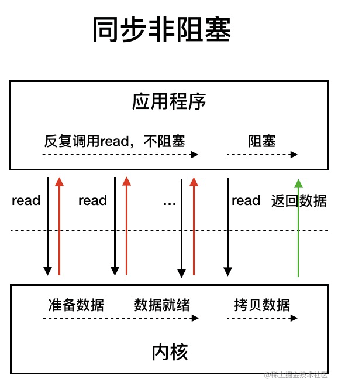


相比于同步阻塞 IO 模型，同步非阻塞 IO 模型确实有了很大改进。通过轮询操作，避免了一直阻塞。

但是，这种 IO 模型同样存在问题：**应用程序不断进行 I/O 系统调用轮询数据是否已经准备好的过程是十分消耗 CPU 资源**，每一次都轮询都需要从用户空间切换到内核空间，这就极其消耗CPU资源。

**应用场景**：适用于高并发场景，如聊天服务器或网络代理服务器,当非高并发场景下，NIO性能可能不如BIO。

**I/O多路复用**

IO 多路复用模型中，线程首先发起 select 调用，询问内核数据是否准备就绪，等内核把数据准备好了，用户线程再发起 read 调用。read 调用的过程（数据从内核空间 -> 用户空间）还是阻塞的。


AIO（Asynchronous I/O）

- **异步非阻塞**：AIO也称为异步I/O，它是NIO的扩展，使用异步通道（如`AsynchronousSocketChannel`和`AsynchronousFileChannel`）。
- **工作模式**：应用程序发起I/O操作后立即返回，操作系统在I/O操作完成时通过回调机制通知应用程序。
- **应用场景**：适用于**长时间运行的应用**，如文件服务器，因为可以避免长时间的等待操作阻塞线程。


同步和异步指的是I/O操作拷贝数据的操作是不是业务线程自己完成的，BIO和NIO最终拷贝数据都是自己完成，AIO拷贝数据也是由内核线程去完成。

一图总结三个模型的区，然后通知业务线程可以进行后续操作。


#### 五种网络I/O模型？

UNIX 系统下， IO 模型一共有 5 种：

1. 阻塞 I/O(BIO)
2. 非阻塞 I/O(NIO)
3. 异步 I/O(AIO)
4. I/O 多路复用：让单个进程可以监听多个文件描述符，一旦某个描述符就绪，就能够通知程序进行相应的读写操作
5. 信号驱动 I/O （用的较少）

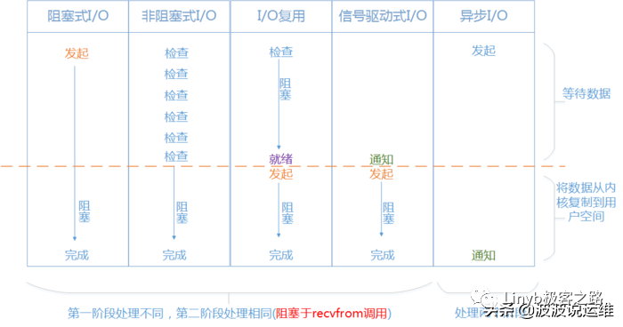


#### I/O多路复用

IO多路复用（I/O Multiplexing）是一种高效管理多个I/O操作的模型，**核心思想是通过一个进程/线程同时监控多个文件描述符（如Socket），当某个描述符就绪（可读、可写或异常）时，通知程序进行对应操作**。它解决了传统阻塞I/O模型中“一连接一线程/进程”的资源消耗问题，是高并发网络编程的核心技术之一。（select/poll/epoll都是一种IO多路复用模型）

为什么需要IO多路复用？

- **传统阻塞I/O模型**：每个连接需独占一个线程/进程，线程切换和内存开销大，无法应对高并发（如C10K问题）。
- **非阻塞I/O轮询**：单线程轮询所有连接的I/O状态，但频繁系统调用（如 `read`）导致CPU空转。
- **多路复用优势：**
  - **单线程处理多连接**：通过**内核机制批量**检测I/O事件，减少资源消耗。
  - **事件驱动**：仅处理就绪的连接，避免无效轮询。

具体步骤：

1. 查询数据状态，若数据尚未准备完毕，则然后交出CPU执行权。
2. 数据准备就绪后，**回调函数返回。**
3. **阻塞应用程序开始读取数据**。
4. 读取数据完毕后，返回。


#### select/poll/epoll的区别

三者都是**IO多路复用**的具体实现，用于**监视一组文件描述符，等待一个或者多个文件描述符成为就绪状**

> 文件描述符：简称fd，当应用程序请求内核打开/新建一个文件时，内核会返回一个文件描述符用于对应这个打开/新建的文件，其实fd本质上就是一个非负整数，读写文件也是需要使用这个文件描述符来指定待读写的文件的

- select，poll是基于轮询实现的，将fd_set从用户空间复制到内核空间，然后让内核空间进行轮询，一旦有其中一个**fd**对应的设备活跃了，那么就把整个fd_set返回给客户端（复制到用户空间），再由**客户端**来轮询每个fd的，找出发生了IO事件的fd。**poll相比select无文件数量限制**，**poll用链表存储文件描述符**，**select用数组存储文件描述符**。

- epoll是基于**事件驱动**实现的，加入一个新的fd，会调用epoll_ctr函数为该fd注册一个回调函数，然后将该fd结点注册到内核中的epoll红黑树中，当IO事件发生时，就会调用回调函数，将该fd结点放到就绪链表中，epoll_wait函数实际上就是从这个就绪链表中获取这些fd。

- epoll分为EPOLLLT（水平触发，默认状态）和EPOLLET（边缘触发，效率高）

  > 并不是所有的情况中epoll都是最好的，比如当fd数量比较小的时候，epoll不见得就一定比select和poll好。

[浅谈select，poll和epoll的区别](https://juejin.cn/post/6844904174862204935)

**select**:

原理：select方法本质其实就是维护了一个文件描述符（fd）数组，一般**限制大小为1024**。select的函数结构是 `int select(int maxfdpl, fd_set *readfds, fd_set *writefds, fd_set *exceptfds, struct timeval *timeout);`

其中fd_set是一个集合，表示用于监听的是哪一个文件描述符。当调用select时，会把fd_set由用户态拷贝到内核态，然后select函数阻塞，当有fd活跃时fd_set置位并返回，否则一直阻塞等待。

缺点：

- fd_set不能复用，新的fd进来要重新创建。
- 单个进程可监控的fd数量有限制，无论是1024还是2048，对于很多情景来说都是不够用的。
- fd_set在用户空间和内核空间的频繁复制，效率低
- 基于轮询来实现，效率低

**poll**:

poll本质上和select没有区别，依然需要进行数据结构的复制，依然是基于轮询来实现，但区别就是，select使用的是fd数组，**而poll则是维护了一个链表**，所以从理论上，**poll方法中，单个进程能监听的fd不再有数量限制。**但是轮询，复制等select存在的问题，poll依然存在。解决了select的前两个问题

**epoll**:

相对于select来说，epoll没有描述符个数限制，只有Linux平台（Redis, Nginx, Java NIO）支持epoll，而所有平台都支持 select。

原理：它的核心思想是基于**事件驱动**来实现的，实现起来也并不难，就是给**每个fd注册一个回调函数**，当fd对应的设备发生IO事件时，就会调用这个回调函数，**将该fd放到一个链表中**，然后由客户端从该链表中取出一个个fd，以此达到O（1）的时间复杂度。

epoll操作实际上对应着有三个函数：**epoll_create**，**epoll_ctr**，**epoll_wait**，这三个函数分别对应epoll操作的三种功能，创建红黑树、注册回调函数、从就绪链表取结点。


**epoll_create**

epoll会调用epoll_create，**调用后会在内核中开启两个空间，一个红黑树，另一个是双向链表**。红黑树用于存放fd节点，新增的fd节点都会被注册到这个epoll**红黑树**上，当文件准备就绪，fd就会被放到**双向链表**（就绪链表）中。

**epoll_ctr**

当有新增fd节点时，epoll_ctr会给新增的fd文件描述符节点注册一个回调函数，然后将fd节点注册到红黑树上，当fd节点准备就绪，那么该节点就会被存放在一个就绪链表中。

**epoll_wait**

epoll_wait直接就是**从就绪链表中取结点**，这也解决了轮询的问题，时间复杂度变成O(1)

**所以综合来说，epoll的优点有：**

- **没有最大并发连接的限制**，远远比1024或者2048要大。（江湖传言1G的内存上能监听10W个端口）
- **效率变高**。epoll是基于事件驱动实现的，不会随着fd数量上升而效率下降
- **减少内存拷贝的次数**

补充:epoll的水平触发和边缘触发

**水平触发**的意思就是说，只要条件满足，对应的事件就会一直被触发。所以如果条件满足了但未进行处理，那么就会**一直被通知**

**边缘触发**的意思就是说，条件满足后，对应的事件只会被触发一次，无论是否被处理，都只会**触发一次**。

## Java集合

说说常见的集合框架


### List

#### 2. ArrayList 和 LinkedList 的区别？ 

- **ArrayList**：底层是基于数组实现的，查找快，增删较慢（主要是移动数据比较慢）
- **LinkedList**: 底层是基于链表实现的。确切的说是循环双向链表,查找慢、增删快。

除此之外LinkedList还实现了Deque接口

**ArrayList 的增删未必就是比 LinkedList 要慢**：

1. 如果增删都是在末尾来操作【每次调用的都是 remove() 和 add()】，此时 ArrayList 就不需要移动 和复制数组来进行操作了。
2. 如果删除操作的位置是在中间。由于 LinkedList 的消耗主要是在遍历上，ArrayList 的消耗主要是 在移动和复制上

 tips:`LinkedList`的作者自己都不用`LinkedList`!

#### 3.ArrayList的扩容机制了解吗?

`ArrayList` 是基于数组实现的动态数组。它的扩容机制如下：

1. **检查扩容条件**：当向 `ArrayList` 添加元素时，会先检查当前容量是否足够。如果数组的容量已满（即当前长度 + 1 超过了容量），就需要进行扩容。
2. **扩容比例**：扩容时，`ArrayList` 会创建一个新数组，大小是原数组容量的 **1.5倍**（在早期版本中是2倍，JDK 7之后是1.5倍）。然后将原数组中的所有元素复制到新数组中。
3. **性能考虑**：每次扩容都会涉及数组的复制操作，因此频繁的扩容可能影响性能，通常建议预设初始容量或合理设置容量，避免频繁扩容。


#### 4.ArrayList LinkedList 用for循环和forEach谁更快

- **ArrayList**: `for` 循环更快，因为可以直接通过下标定位元素。
- **LinkedList**: `forEach` 更快，因为底层使用迭代器，避免了 `get(i)` 方法的多次遍历操作。

**总结**:

- 对于 `ArrayList`，`for` 循环可能略快于 `forEach`，因为 `forEach` 需要创建迭代器。
- 对于 `LinkedList`，`forEach` 更快，因为它通过迭代器直接遍历，而不需要使用 `get(i)` 方法进行遍历。

#### 5.有哪几种实现ArrayList线程安全的方法？

1. **`Collections.synchronizedList()`**: 返回一个线程安全的 List，所有操作都加锁。
2. **`CopyOnWriteArrayList`**: 线程安全，采用**写时复制**原则。每次修改时会复制一个新数组，并对其加锁，其他线程仍可访问旧数组，修改后将引用切换到新数组。

### Map

#### 能说一下HashMap的底层数据结构吗？

**JDK 8** 中，`HashMap` 使用 **数组 + 链表 + 红黑树** 组合：

- **数组**：存储数据的基础结构。
- **链表**：在哈希冲突时，多个元素通过链表存储在同一个位置。
- **红黑树**：当链表长度超过 8 且数组容量大于 64 时，链表转为红黑树，查询效率提高到 O(logn)。

**扩容机制**：

- 初始容量为 16，负载因子为 0.75，扩容后，容量为原始的2倍。
- 扩容时会重新计算元素的哈希值并将其放入新的数组，扩容是性能开销较大的操作。


#### 你对红黑树了解多少，为什么不用二叉树/平衡树呢？

红黑树是一种自平衡的二叉查找树，具有以下特性：

1. 每个节点要么是红色，要么是黑色；
2. 根节点是黑色；
3. 所有叶子节点是黑色的（下图中的 NULL 节点）；
4. 红色节点的子节点必定是黑色；
5. 从任一节点到其叶子的路径中，黑色节点的数量相同。

**普通二叉树**：在插入有序数据时，二叉树会退化为链表，导致查询效率变为 O(n)，**性能很差**。

**平衡二叉树**：虽然保证左右子树高度差为 1，但每次插入或删除都可能需要频繁旋转，增加**维护成本**。

红黑树的优势：

- **折中方案**：红黑树在保证平衡的同时，插入和删除操作的维护成本较低，查询效率为 O(logn)。


#### 红黑树怎么保持平衡的？

红黑树有两种方式保持平衡：`旋转`和`染色`。

##### 1.旋转：旋转分为两种，左旋和右旋


##### 2.染色

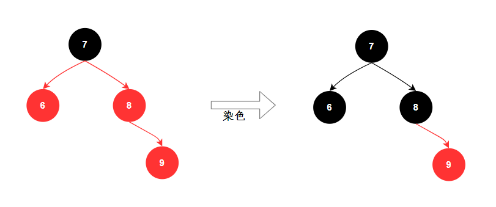

#### 4. HashMap 的put的执行过程？ 

HashMap的put流程

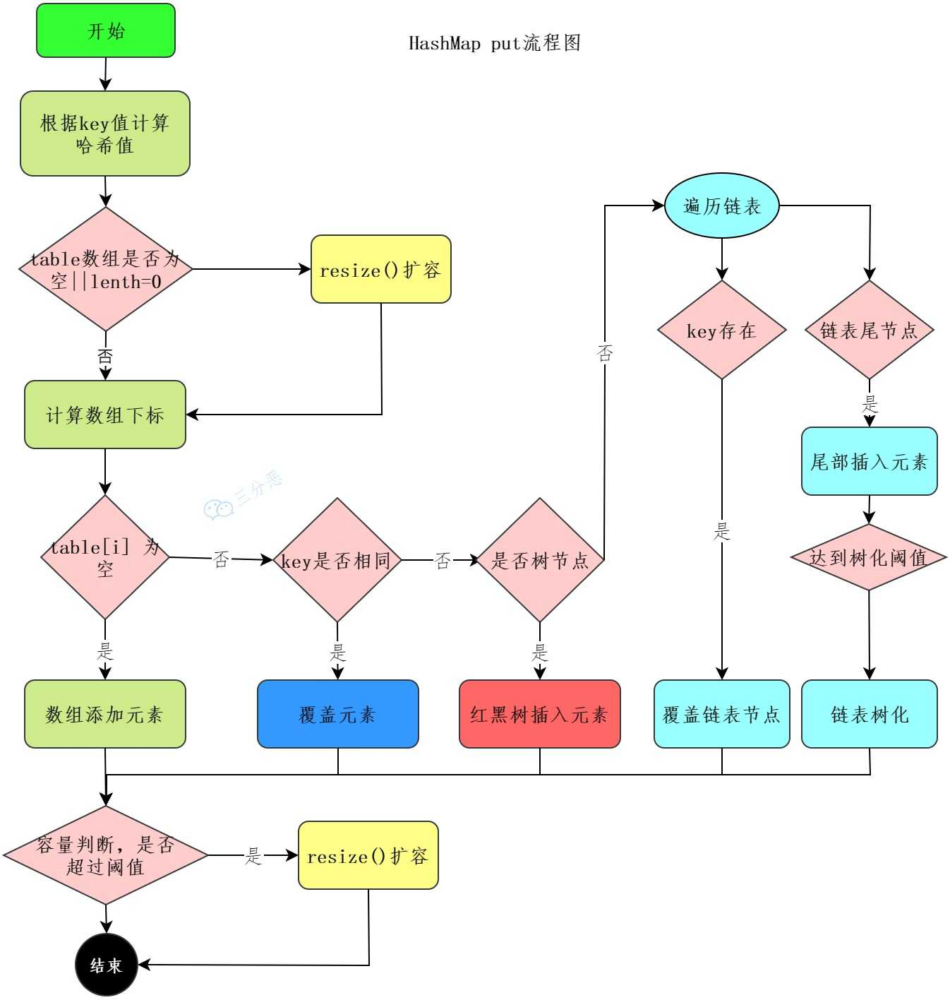

第一步，通过 hash 方法计算 key 的哈希值。

```Java
static final int hash(Object key) {
    int h;
    return (key == null) ? 0 : (h = key.hashCode()) ^ (h >>> 16);
}
```

第二步，数组进行第一次扩容。

```Java
if ((tab = table) == null || (n = tab.length) == 0)
    n = (tab = resize()).length;
```

第三步，根据哈希值计算 key 在数组中的下标，如果对应下标正好没有存放数据，则直接插入。

```Java
if ((p = tab[i = (n - 1) & hash]) == null)
    tab[i] = newNode(hash, key, value, null);
```

如果对应下标已经有数据了，就需要判断是否为相同的 key，是则覆盖 value，否则需要判断是否为树节点，是则向树中插入节点，否则向链表中插入数据。

```Java
else {
    Node<K,V> e; K k;
    if (p.hash == hash &&
        ((k = p.key) == key || (key != null && key.equals(k))))
        e = p;
    else if (p instanceof TreeNode)
        e = ((TreeNode<K,V>)p).putTreeVal(this, tab, hash, key, value);
    else {
        for (int binCount = 0; ; ++binCount) {
            if ((e = p.next) == null) {
                p.next = newNode(hash, key, value, null);
                if (binCount >= TREEIFY_THRESHOLD - 1) // -1 for 1st
                    treeifyBin(tab, hash);
                break;
            }
            if (e.hash == hash &&
                ((k = e.key) == key || (key != null && key.equals(k))))
                break;
            p = e;
        }
    }
}
```

注意，在链表中插入节点的时候，如果链表长度大于等于 8，则需要把链表转换为红黑树。

```Java
if (binCount >= TREEIFY_THRESHOLD - 1) // -1 for 1st
    treeifyBin(tab, hash);
```

所有元素处理完后，还需要判断是否超过阈值`threshold`，超过则扩容。

```Java
if (++size > threshold)
    resize();
```

####  HahsMap的get方法执行流程


HashMap 的查找就简单很多：

1. 使用扰动函数，获取新的哈希值
2. 计算数组下标，获取节点
3. 当前节点和 key 匹配，直接返回
4. 否则，当前节点是否为树节点，查找红黑树
5. 否则，遍历链表查找

#### HashMap的Hash函数是怎么设计的？

HashMap 的哈希函数是先拿到 key 的 hashcode，是一个 32 位的 int 类型的数值，然后让 hashcode 的高 16 位和低 16 位进行异或操作。

那当数组长度比较小的时候，我们就需要设计一种比较巧妙的 hash 算法，来避免发生哈希冲突，尽可能地让元素均匀地分布在数组当中。

要达到这个目的，HashMap 在两方面下足了功夫，

1. 第一个就是数组的长度必须是 2 的整数次幂，这样可以保证 `hash & (n-1)` 的结果能均匀地分布在数组中。其作用就相当于 hash % n，n 为数组的长度，比如说数组长度是 16，hash 值为 20，那么 20 % 16 = 4，也就是说 20 这个元素应该放在数组的第 4 个位置；hash 值为 23，那么 23 % 16 = 7，也就是说 23 这个元素应该放在数组的第 7 个位置。
2. `&` 操作的结果就是哈希值的高位全部归零，只保留 n 个低位，用来做数组下标访问。比如说 hash & ($2^{4} - 1$) 的结果实际上是取 hash 的低 4 位，这四位能表示的取值范围刚好是 0000 到 1111，也就是 0 到 15，正好是数组长度为 16 的下标范围。

#### 手撕HashMap

- 从三个点回答：
  - 散列函数：使用hashCode()对长度取余；
  - 哈希冲突解决方案：拉链法；
  - 扩容：节点重新hash获取位置。
- 每个节点需要有key，value

#### 为什么 HashMap 的容量必须是 2 的整数次方？

HashMap 的容量必须是 2 的整数次方，因为在定位元素时，使用 `hash & (n - 1)` 计算位置。这样，哈希值的高位被清零，只保留低位，从而提高效率。由于**位运算比取余运算更快**，**当容量是 2 的幂时，`hash & (n - 1)` 等同于 `hash % n`，因此能更高效地计算元素位置**。

#### 如果初始化HashMap,传入一个17容量，它会怎么处理?

HashMap 会将这个值转换为大于或等于 17 的最小的 2 的幂。这是因为 HashMap 的设计是基于哈希表的，而哈希表的大小最好是 2 的幂，这样可以优化哈希值的计算，并减少哈希冲突。

所以，如果你传入 17 作为初始容量，HashMap 实际上会被初始化为大小为 32 的哈希表。


####  HashMap 与 HashTable的区别是什么? 

1. **继承体系**：HashTable 基于 `Dictionary` 类，而 HashMap 基于 `AbstractMap` 类。`Map` 接口是为了取代 `Dictionary` 类而出现的。
2. **线程安全性**：HashTable 是线程安全的，采用了同步机制；而 HashMap 不是线程安全的，适用于单线程或外部同步的场景。

#### HashMap线程安全吗？

1. **扩容时死循环（JDK 1.7）**：在多线程环境下，JDK1.7下HashMap使用头插法插入元素，多线程下扩容可能导致环形链表，进而引发死循环。JDK 8 已修复此问题，扩容时使用尾插法插入元素，以保持链表顺序。
2. **元素丢失**：在多线程并发的 `put` 操作中，可能会覆盖相同位置的元素，导致丢失。
3. **并发 `put` 和 `get` 导致返回 null**：在扩容期间，`put` 操作会改变内部数组（`table`），这时另一个线程执行 `get`，可能会读取到 null，因为数据还未完全迁移。

因此，HashMap 并不适合多线程环境。如果需要线程安全的操作，可以使用 `ConcurrentHashMap`。

#### 有什么办法解决HashMap线程不安全的问题？ConcurrentHashMap是什么？

1. **`Collections.synchronizedMap(Map)`**：通过该包装器，可以将一个普通的 `Map` 转换为线程安全的 `Map`，但它在每个操作上都会加锁，性能可能较差。
2. **`ConcurrentHashMap`**：这是 Java 提供的线程安全的哈希表实现，它采用了分段锁技术（在 JDK 1.7）和桶级别的锁（JDK 1.8），使得多个线程可以并发地访问不同的部分，避免了全表锁定，提升了性能。

#### jdk1.7中和jdk1.8中ConcurretHashMap的区别？

##### JDK 1.7 中的 `ConcurrentHashMap`

- **分段锁（Segmentation）**：哈希表被分成多个段（Segment），每个段都有自己的锁。操作一个段时不会影响其他段的并发读写。
- **写操作**：（如 `put`）需要锁定对应的段。多个线程可以并发地写入不同的段。
- **读操作**：通过 `volatile` 保证可见性，读操作不需要加锁，支持并发读取。

##### JDK 1.8 中的 `ConcurrentHashMap`

- **简化锁机制**：去掉了分段锁，采用了更细粒度的锁和 CAS（Compare and Swap）机制。在插入和更新操作中使用 CAS 操作来尽量减少锁的使用。
- **树化**：当链表长度超过阈值（默认为 8）时，链表会转为红黑树，提升高负载下的查询性能。
- **链表优化**：使用链表和红黑树的混合结构提高了性能，避免了长链表导致的性能下降。
- **写操作**：使用 CAS 操作来尽量减少锁的使用，只有在 CAS 失败多次后才会用到锁（例如，通过 `synchronized` 关键字）。
- **读操作**：基本无锁，支持高效的并发读操作。读操作通过 `volatile` 保证可见性，可以并发地访问所有节点，而不会阻塞其他读操作。

详情：[吊打Java面试官之ConcurrentHashMap（线程安全的哈希表） | 二哥的Java进阶之路](https://javabetter.cn/thread/ConcurrentHashMap.html#jdk-1-7)

#### 3. LinkedHashMap 的实现原理?（LinkedHashMap怎么实现有序的？）

`LinkedHashMap` 通过维护一个双向链表来记录元素的插入顺序或访问顺序。每个元素包含 `before` 和 `after` 引用，用于链接到前后元素，形成双向链表。

**关键特性：**

1. **`accessOrder`**：控制排序方式，`false` 为按插入顺序排序，`true` 为按访问顺序排序。
2. **`head` 和 `tail`**：分别指向链表的头和尾。
3. **`Entry`**：内部类，继承 `HashMap.Node`，并增加 `before` 和 `after` 引用，维护双向链表。

**主要方法**

1. **`put`**：向 `LinkedHashMap` 添加元素时，调用父类`HashMap`的 `put` 方法并更新链表。
2. **`get`**：访问元素时调用父类 `HashMap` 的 `get` 方法取值，若 `accessOrder` 为 `true`，会将被访问元素移动到链表末尾。

#### 为什么HashMap链表转红黑树的阈值为8？

红黑树节点的大小大概是普通节点大小的两倍，所以转红黑树，牺牲了空间换时间，更多的是一种兜底的策略，保证极端情况下的查找效率。

阈值为什么要选 8 呢？**和统计学有关。理想情况下，使用随机哈希码，链表里的节点符合泊松分布，出现节点个数的概率是递减的，节点个数为 8 的情况**，发生概率仅为`0.00000006`。

至于红黑树转回链表的阈值为什么是 6，而不是 8？**是因为如果这个阈值也设置成 8，假如发生碰撞，节点增减刚好在 8 附近，会发生链表和红黑树的不断转换，导致资源浪费。**

#### HashMap扩容在什么时候呢?为什么扩容因子是0.75？

**HashMap在什么时候扩容？**

HashMap 会在存储的键值对数量超过阈值（即容量 * 加载因子）时进行扩容。

**为什么扩容因子是0.75？**

0.75 是空间和时间成本的平衡点：

1. 如果因子设得较大，扩容较晚，**哈希冲突的概率增加**，查找的时间成本也会增加。
2. 如果因子设得较小，扩容较早，**哈希冲突减少**，查找更快，但会导致**更多的空间浪费**。

#### TreeMap怎么实现有序的？

TreeMap 通过 **键（key）的比较器** 来决定元素的顺序，如果没有指定比较器，键必须实现 `Comparable` 接口：

- TreeMap 的底层是 **红黑树**，它是一种自平衡的二叉查找树，保持元素按键的顺序排列。
- 在插入或删除元素时，红黑树通过 **旋转和着色** 来保证树的平衡。
- 查找元素时，利用二叉查找树的特性，**从根节点开始递归地向左或右子树查找，直到找到目标元素**。


#### TreeMap和HashMap的区别？

1. **底层数据结构**：
   - **HashMap**：基于**数组 + 链表 + 红黑树**实现。元素通过计算哈希值来定位，若发生哈希冲突，则使用链表或红黑树解决。
   - **TreeMap**：基于红黑树实现，元素通过比较器（或 `Comparable`）来确定顺序，保证有序。
2. **操作原理**：
   - **HashMap**：
     - `put`：计算哈希值，将元素插入对应索引位置，若发生冲突，则使用链表或红黑树。
     - `get`：通过哈希值定位元素，若遇到链表或红黑树，则通过 `equals` 方法进行比较。
   - **TreeMap**：
     - `put`：通过比较器判断元素应该插入到左子树还是右子树，维持红黑树的平衡。
     - `get`：通过比较器递归查找元素。
3. **时间复杂度**：
   - **HashMap**：查找操作的平均时间复杂度是 **O(1)**，适用于频繁查找的场景。
   - **TreeMap**：查找操作的时间复杂度是 **O(log n)**，适用于需要有序遍历或范围查找的场景。
4. **排序**：
   - **HashMap**：不保证元素的顺序。
   - **TreeMap**：保证元素按键的自然顺序（或提供的比较器顺序）排列。

### Queue

#### ArrayBlockingQueue

- 实现原理：
  - 底层用一个数组存储元素。
  - 用ReentrantLock对读写进行同步。
  - 用Condition实现线程等待和唤醒。
  - 容量有限，创建就不能改。
  - 有非阻塞存取元素方法，一般不用。
- ArrayBlockingQueue和LinkedBlockingQueue
  - **底层实现**：ABQ是数组，LBQ是链表。
  - **是否有界**：ABQ有界，LBQ默认Integer.MAX_VALUE，所以无界。
  - **锁是否分离**：ABQ不分离，LBQ分离。
  - **内存占用**：ABQ会留出余量。
- ArrayBlockingQueue和ConcurrentLinkedQueue
  - **底层实现：**ABQ是数组，CLQ是链表。
  - **是否有界：**ABQ有界，CLQ无界。
  - **是否阻塞操作：**ABQ有，CLQ只支持非阻塞。

#### PriorityQueue

- 二叉堆，默认使用自然排序对插入元素排队，默认是小顶堆，可以用自定义比较器排序。

#### DelayQueue

- **实现原理：**底层使用优先队列PriorityQueue，实际上是使用二叉小顶堆确保值小的元素排在前面；使用ReentrantLock实现线程安全；使用Condition实现多个线程的等待和唤醒。
- **使用场景：**任务调度和缓存过期场景。任务调度时，DelayQueue中默认根据任务所剩时间升序排序，确保任务按剩余时间顺序执行；缓存过期场景中，数据进入缓存时，可以将其key封装成一个任务加入DelayQueue，当到时间了则删除。
- **Delay接口：**DelayQueue中存储的元素必须实现Delay接口，重写getDelay()方法和compareTo()方法。Delay接口定义了任务的剩余时间和比较大小方式。

### Set

#### 讲讲HashSet的底层实现？

`HashSet` 实际上是基于 `HashMap` 来实现的，它使用一个 `HashMap` 来存储`Entry`，而`Entry`的值始终是一个固定的 `Object` 对象。`HashSet` 用键来存储元素，利用 `HashMap` 键的唯一性来保证集合中的元素不重复。

1. **核心实现**：`HashSet` 底层维护了一个 `HashMap`，元素作为 `HashMap` 的键，固定的一个 `Object`（`PRESENT`）作为值。
2. **去重原理**：由于 `HashMap` 的键是唯一的，如果添加相同的元素，新的键值对会覆盖旧的键值对。因此，`HashSet` 会自动去重。

```Java
public class HashSet<E> extends AbstractSet<E> implements Set<E>, Cloneable, java.io.Serializable {
    private transient HashMap<E, Object> map;
    private static final Object PRESENT = new Object();
}
```

#### **HashSet与ArrayList的区别**

1. **底层实现**：ArrayList 使用动态数组，HashSet 使用 HashMap。
2. **元素重复性**：ArrayList 允许重复元素，HashSet 保证元素唯一，基于 `hashCode` 和 `equals` 方法判断。
3. **顺序性**：ArrayList 保持插入顺序，支持通过索引访问；HashSet 不保证顺序，顺序依赖哈希算法。

`HashSet` 的 `add` 方法是通过 `HashMap` 的 `put` 实现的，底层逻辑相同。

## **多线程**

### 什么是多线程？

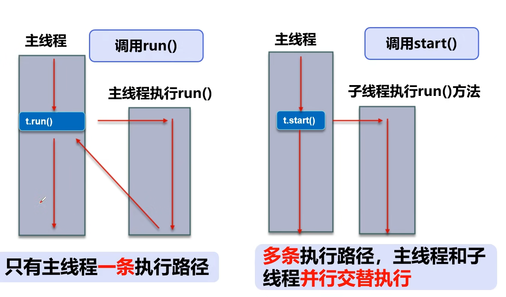

Thread调用`run`方法，则主线程只有一条执行路径，Thread调用`start`方法，开启一个新的子线程，多条执行路径，主线程和子线程并行交替执行

### 编程

#### 1.创建线程的几种方法

##### 1.继承Thread类实现(以匿名内部类的形式继承`Thread`)

```Java
//通过继承Thread接口创建线程
Thread t1 = new Thread("t1" ){
    @Override
    public void run() {
        System.out.println("Hello JUC");
    }
};
t1.start();
```

##### 2.实现Runnable 接口并构造Thread对象

```Java
//通过实现Runable接口创建线程
Runnable task = new Runnable() {
    @Override
    public void run() {
        System.out.println("Hello, Runable");
    }
};
Thread t2 = new Thread(task, "t2");
t2.start();

//用Lambda表达式实现更加简洁
  Thread t3 = new Thread( ()->{
            System.out.println("Hello Runnable2");
},"t3");
t3.start();
```

##### 3.FutureTask 配合 Thread实现

 FutureTask 能够接收 Callable 类型的参数，**用来处理有返回结果的情况**

```java
//FutureTask实现
FutureTask<Integer> futureTask = new FutureTask<>(
    () -> {
        System.out.println("Hello Callable");
        return 100;
    }
);
new Thread(futureTask, "t3").start();
//获取返回结果
try {
        Integer result = futureTask.get();
        System.out.println("result: " + result);
    } catch (Exception e) {
        throw new RuntimeException(e);
    }
```

##### 4.线程池

```java
//线程池实现
ExecutorService executorService = Executors.newFixedThreadPool(3);
executorService.execute(new Runnable() {
    @Override
    public void run() {
        System.out.println("Hello, Executors");
    }
});

// 定义一个任务
Runnable task1 = () -> System.out.println("Hello, Executors from task1");
executorService.execute(task1);
```

#### 2.多线程打印的几种方法（多线程轮流打印ABC/打印 0 - 100）

##### 1.基于 （synchronized + wait/notify）

```Java
public class ThreadPrintTest {
    private int num;
    private static final Object LOCK = new Object();
    /**
    * 多个线程交替打印，多种实现方式，主要是考察线程的同步方式
    */
    public static void main(String[] args) {
        ThreadPrintTest threadPrint = new ThreadPrintTest();
        new Thread(() -> {
            threadPrint.printABC(0);
        }, "thread-0").start();
        new Thread(() -> {
            threadPrint.printABC(1);
        }, "thread-1").start();
        new Thread(() -> {
            threadPrint.printABC(2);
        }, "thread-2").start();
    }

    /**
     * 打印ABC
     */
    private void printABC(int targetNum) {
        for(int i = 0; i < 10; i++){
            synchronized (LOCK) {
                while (num % 3 != targetNum) { //这里只能用while,下次抢占锁如果还是不等于目标值继续wait
                    try {
                        LOCK.wait();
                    } catch (InterruptedException e) {
                        e.printStackTrace();
                    }
                }
                if (num % 3 == 0) {
                    System.out.println(Thread.currentThread().getName() + ": A");
                } else if (num % 3 == 1){
                    System.out.println(Thread.currentThread().getName() + ": B");
                } else {
                    System.out.println(Thread.currentThread().getName() + ": C");
                }
                num++;
                LOCK.notifyAll();
            }
        }
    }
    /**
     * 轮流打印 1 - 100
     */
    private void printOrder(int targetNum) {
        while(true){
            synchronized (LOCK) {
                while (num % 3 != targetNum) { //这里只能用while,下次抢占锁如果还是不等于目标值继续wait
                    if(num > 100) {
                        break;
                    }
                    try {
                        LOCK.wait();
                    } catch (InterruptedException e) {
                        e.printStackTrace();
                    }
                }
                if(num > 100) {
                    break;
                }
                System.out.println(Thread.currentThread().getName() + ": " + num);
                num++;
                LOCK.notifyAll();
            }
        }
    }
}
```

##### 2.基于ReentrantLock

```Java
public class ThreadPrintByLock {
    private int num;
    private Lock lock = new ReentrantLock();

    public static void main(String[] args) {
        ThreadPrintByLock threadPrintByLock = new ThreadPrintByLock();
        new Thread(() -> {
            threadPrintByLock.printABC(0);
        }, "thread - 0").start();
        new Thread(() -> {
            threadPrintByLock.printABC(1);
        }, "thread - 1").start();
        new Thread(() -> {
            threadPrintByLock.printABC(2);
        }, "thread - 2").start();
    }

    private void printABC(int targetNum) {
        for(int i = 0; i < 10; ){
            lock.lock();
            if(num % 3 == targetNum){
                num++;
                i++;
                System.out.println(Thread.currentThread().getName());
            }
            lock.unlock();
        }
    }
}
```

##### 3.基于ReentrantLock + Condition

```Java
public class ThreadPrintByLockAndCondition {

    private int num;
    private static Lock lock = new ReentrantLock();
    private static Condition c1 = lock.newCondition();
    private static Condition c2 = lock.newCondition();
    private static Condition c3 = lock.newCondition();

    private void printABC(int targetNum, Condition currentThread, Condition nextThread) {
        for (int i = 0; i < 10; ) {
            lock.lock();
            try {
                while (num % 3 != targetNum) {
                    currentThread.await();
                }
                num++;
                i++;
                System.out.println(Thread.currentThread().getName());
                nextThread.signal();
            } catch (InterruptedException e) {
                throw new RuntimeException(e);
            } finally {
                lock.unlock();
            }
        }
    }

    public static void main(String[] args) {
        ThreadPrintByLockAndCondition print = new ThreadPrintByLockAndCondition();
        new Thread(() -> {
            print.printABC(0, c1, c2);
        }, "A").start();
        new Thread(() -> {
            print.printABC(1, c2, c3);
        }, "B").start();
        new Thread(() -> {
            print.printABC(2, c3, c1);
        }, "C").start();

    }

}
```

##### 4.生产者-消费者模型

```Java
import java.util.LinkedList;  

class ProducerConsumer {  
    private LinkedList<Integer> buffer = new LinkedList<>();  
    private int capacity = 5;  

    public void produce() throws InterruptedException {  
        int value = 0;  
        while (true) {  
            synchronized (this) {  
                // 检查缓冲区是否已满  
                while (buffer.size() == capacity) {  
                    wait();  
                }  
                System.out.println("生产者生产: " + value);  
                buffer.add(value++);  

                // 通知消费者可以消费  
                notify();  

                // 等待一段时间，模拟生产过程  
                Thread.sleep(1000);  
            }  
        }  
    }  

    public void consume() throws InterruptedException {  
        while (true) {  
            synchronized (this) {  
                // 检查缓冲区是否为空  
                while (buffer.isEmpty()) {  
                    wait();  
                }  

                int value = buffer.removeFirst();  
                System.out.println("消费者消费: " + value);  

                // 通知生产者可以继续生产  
                notify();  

                // 等待一段时间，模拟消费过程  
                Thread.sleep(1000);  
            }  
        }  
    }  
}  

public class Main {  
    public static void main(String[] args) {  
        ProducerConsumer pc = new ProducerConsumer();  

        // 创建生产者线程  
        Thread producerThread = new Thread(() -> {  
            try {  
                pc.produce();  
            } catch (InterruptedException e) {  
                e.printStackTrace();  
            }  
        });  

        // 创建消费者线程  
        Thread consumerThread = new Thread(() -> {  
            try {  
                pc.consume();  
            } catch (InterruptedException e) {  
                e.printStackTrace();  
            }  
        });  

        // 启动生产者和消费者线程  
        producerThread.start();  
        consumerThread.start();  
    }  
}  
```

### 线程的基本问题

#### 1. **创建线程的几种方式？** 

1. 继承Thread类创建线程
2. 实现Runnable接口创建线程
3. 通过Callable和FutureTask创建线程
4. 通过线程池创建线程

>  注：实现Runnable是一个匿名内部类，因为只需要一个对象即可，如果getClass()输出具体类名，会显示外部大类的类名（因为是内部类）。Callable地位相当于Runnable, FutureTask可以相当于那个匿名内部类，只不过此时是通过传入Callable参数，而不是继承Runnable接口（当然FutureTask本身也继承了Runnable，用的也是public Thread(Runnable target, String name)构造器）

#### 2. **多线程的使用场景？** 

- **文件下载和上传:**文件传输协议(FTP)或多点下载可以通过多线程加快下载速度，上传大文件到服务器时，也可以利用多线程来提高效率。
- **服务端并发处理：**多线程可以用来处理多个网络连接，例如在服务器端处理来自多个客户端的多个并发连接。
- **异步处理：**异步处理任务，比如**发送电子邮件通知**，记录日志等，这些任务可以在后台线程中完成而不影响主线程的工作。

#### 3. **线程状态及转换？** 


线程在其生命周期中会经历多种状态，这些状态反映了线程在不同时间点的活动情况。在Java中，线程状态由`java.lang.Thread`类的状态模型定义，主要包括以下几种状态：

1. **NEW（新建）**:
   - 线程对象已经被创建，但`start()`方法尚未被调用。此时线程还没有开始执行。
2. **RUNNABLE（可运行）**:
   - 线程已经启动并且准备好运行，但不一定正在CPU上执行。线程可能正在等待CPU时间片，也可能正在执行中。
3. **BLOCKED（阻塞）** 或 **WAITING（等待）**:
   - 线程因为等待某种条件满足而被阻塞，不能继续执行。例如，调用了`Object.wait()`、`Thread.join()`或`Thread.sleep(long millis)`等方法，线程将进入等待状态，直到相应的条件被满足或等待时间结束。
4. **TIMED_WAITING（计时等待）**:
   - 类似于WAITING状态，但线程将在一定时间后自动恢复到可运行状态。`Thread.sleep()`和`Object.wait(long timeout)`等方法可以使线程进入此状态。
5. **TERMINATED（终止）**:
   - 线程已经执行完毕或因异常而终止，不再处于任何可运行状态。

线程状态之间的转换可以通过各种方法触发，以下是一些常见的状态转换：

- **NEW → RUNNABLE**:
  - 当`Thread.start()`方法被调用时，线程从NEW状态变为RUNNABLE状态。
- **RUNNABLE → BLOCKED/WAITING/TIMED_WAITING**:
  - 当线程调用阻塞方法（如`wait()`、`join()`或`sleep()`）时，它会从RUNNABLE状态变为相应的阻塞状态。
- **BLOCKED/WAITING/TIMED_WAITING → RUNNABLE**:
  - 当等待的条件被满足，或者指定的等待时间结束，线程将从阻塞状态回到RUNNABLE状态。
- **RUNNABLE → TERMINATED**:
  - 当线程的`run()`方法执行完毕，或者线程因异常而终止，线程将进入TERMINATED状态。

#### 4. 在 Java 程序线程安全性问题体现在？ 

线程安全性在三个方面体现（简洁版）：

1. **原子性**：提供互斥访问，同一时刻**只能有一个线程对数据进行操作**(atomic, synchronized)
2. **可见性**：一个线程**对主内存的修改可以及时地被其他线程**看到(synchronized, volatile)
3. **有序性**：一个线程观察其他线程中的指令执行顺序，由于**指令重排序**，该观察结果一般杂乱无序(happens-before原则)。Java内存模型通过**synchronized**和**volatile**来禁止指令重排序。

---

详细版：

1. **原子性**（Atomicity）
   - 原子性指的是一个操作或一组操作要么全部完成，要么全部都不做，不会被中断。在多线程环境下，如果没有适当的同步措施，多个线程可能会同时修改同一个变量，导致数据的不一致性。
   - Java中的`synchronized`关键字和`atomic`类（如`AtomicInteger`）可以提供原子操作，确保在执行这些操作时，不会被其他线程打断，从而避免数据竞争和不一致的问题。
2. **可见性**（Visibility）
   - 可见性确保当一个线程修改了共享变量的值，其他线程能够看到这个修改。在多线程环境中，每个线程可能有自己的工作内存，其中包含了共享变量的副本。如果没有适当的同步机制，线程间的数据交换可能会出现延迟，导致一个线程看到的共享变量的值不是最新的。
   - `synchronized`和`volatile`关键字可以提供可见性保证。`synchronized`可以确保在释放锁之前，**对共享变量的修改会刷新回主内存，而其他线程在获取锁时会从主内存中读取最新的值**。`volatile`则**直接确保了变量的修改对所有线程都是立即可见的**。
3. **有序性**（Ordering）
   - 有序性涉及到程序执行的顺序。在单处理器或多处理器系统中，为了优化性能，编译器和处理器可能会重新安排指令的执行顺序。然而，这种重排序可能会**导致多线程程序的行为不符合程序员的预期，因为它破坏了代码中的依赖关系。**
   - Java内存模型（JMM）定义了`happens-before`原则，这是一个偏序关系，它**定义了哪些操作在其他操作之前发生**。`happens-before`规则确保了操作的顺序性和可见性，**即使在存在指令重排序的情况下也能保证正确的程序行为**。`synchronized`和`volatile`同样在实现有序性方面发挥作用，通过限制编译器和处理器的重排序，确保代码的执行顺序符合预期。

#### 5. **Java 线程同步的几种方法？**

1. 使用sychronized关键字
2. 使用ReentrantLock关键字
3. 使用wait和notify
4. 使用join方法
5. 使用特殊域volatile实现线程同步
6. 使用阻塞队列
7. 使用信号量Semaphore

### 同步（锁）

#### 1 synchronized

##### 1.说一说自己对于 synchronized 关键字的了解？

简洁版：

synchronized关键字可以保证被它修饰的方法或代码在任意时刻只能有一个线程执行。在早期版本，synchronized属于重量级锁，效率低下。JDK6对锁的实现进行大量优化，如**偏向锁、轻量级锁、自旋锁、锁消除、锁粗化**等。

详细版：

1. **功能：** synchronized关键字解决的是多个线程之间访问资源的同步性，**synchronized关键字可以保证被它修饰的方法或者代码块在任意时刻只能有一个线程执行。**

2. **过去特性：**在Java**早期版本**中，synchronized 属于**重量级锁**，效率低下，因为它是利用Monitor对象实现的加锁，Monitor依赖于操作系统的Mutex Lock,而**操作系统实现线程之间的切换**时需要从**用户态转换到内核态**，这个状态之间的**转换需要相对比较长的时间**，时间成本相对较高，这也是为什么早期的synchronized 效率低的原因

3. **目前特性：**在 **JDK6** 之后 Java 官方对从 JVM 层面对synchronized 进行大量优化，所以现在的 synchronized 锁效率也优化得很不错了。JDK6 对锁的实现引入了大量的优化，如**偏向锁，轻量级锁，自旋锁，锁消除，锁粗化**等技术来减少锁操作的开销。

##### 2.说说 JDK1.6 之后的 synchronized 关键字底层做了哪些优化，可以详细介绍 一下这些优化吗？

 锁主要存在四种状态，依次是：**无锁状态、偏向锁状态、轻量级锁状态、重量级锁状态**，它们会随着竞争的激烈而逐渐升级。注意**锁可以升级不可降级，这种策略是为了提高获得锁和释放锁的效率**。

 synchronized关键字用Java对象作为锁，而Java的对象头含有一个**32位的Mark Word**，它主要记录的锁的几种状态。每个线程的栈帧都会包含一个**锁记录（Lock Record）**的对象，内部可以存储锁定对象的 Mark Word。


- **偏向锁**：这种锁机制假设在大多数情况下，锁不仅不存在竞争，而且总是由相同的线程多次获得。为了减少不必要的轻量级锁操作，JVM会先让一个线程获得锁的同时设置一个标志，并偏爱于该线程，使其再次获取锁时不需要执行任何额外的步骤。
- 引入偏向锁和引入轻量级锁的目的很像，它们都是考虑到没有多线程竞争的情况下，减少传统重量级锁加锁解锁操作引起的性能消耗。偏向锁顾名思义，即偏向第一个线程，在接下来的执行过程中，只会检查线程ID是否为Mark Word记录的线程ID。**它和轻量级锁不同的地方是**，**轻量级锁会在无竞争的情况下使用CAS操作去替代对象头中的Mark Word，而偏向锁在无竞争的情况下会把整个同步都消除掉，连CAS操作都没有了**。当有其他线程来竞争的时候，偏向锁会先升级为轻量级锁。
- **轻量级锁**：在JDK 1.6中引入了轻量级锁，它允许在没有竞争的情况下使用线程特有的数据结构来代替重量级的内核锁，从而减少了系统调用的开销。**当一个线程尝试获取一个未被任何线程持有的锁时，虚拟机会尝试使用CAS（Compare and Swap）操作来抢占锁。**如果成功，则称作“轻量级锁”；如果失败，则转为重量级锁。
- 轻量级锁是一种乐观锁的设计方式，**它加锁和解锁都用了CAS操作**。它也是为了在没有竞争的情况下，避免申请互斥量的开销。轻量级锁会用CAS操作替换对象头的Mark word, 在解锁的时候，将对象原来的Mark Word返回。


- **重量级锁**：如果有另一个线程来竞争锁，该线程的CAS操作（获取轻量级锁）失败，**会进入锁膨胀的过程，将轻量级锁升级为重量级锁**。即为Object对象申请Monitor锁，将Object的Mark word改为指向monitor对象的指针，然后自己的线程进入EntryList阻塞。


- **自旋锁**：轻量级锁失败后，虚拟机为了避免线程真实地在操作系统层面挂起，还会进行一项称为自旋锁的优化手段。**再尝试几次获取锁的过程。**
- **锁消除**：**JVM可以自动检测并消除那些不可能存在共享数据冲突的锁。**例如，当一个对象在一个方法中构造后，就在构造方法中被锁定，然后这个对象还没有被外部引用之前就释放了锁，那么这样的锁就可以被消除。
- **锁粗化**：如果一个线程在短时间内需要多次锁定同一资源进行一些操作，那么可以考虑将这些操作合并在一起，在一次锁定期间完成所有相关工作，从而减少锁的开销。

##### 3.讲一下 synchronized 关键字的底层原理？Monitor的原理？

 **synchronized 关键字底层原理属于 JVM 层面**，**synchronized** 同步语句块的实现使用的是 `monitorenter` 和 `monitorexit` 指令， 其中 monitorenter 指令指向同步代码块的开始位置，monitorexit 指令则指明同步代码块的结束位 置。当执行 monitorenter 指令时，**线程试图获取锁也就是获取 monitor的持有权。**


 **关于Monitor原理**

 Monitor 被翻译为监视器或管程，每个 Java 对象都可以关联一个 Monitor 对象，**如果使用 synchronized 给对象上锁（重量级）之后，该对象头的 Mark Word 中就被设置指向 Monitor 对象的指针**。Monitor是调用了操作系统的Mutex Lock，加锁的开销很大。

 **Monitor的结构如下**：


- `Owner`: 当前持有锁的线程;
- `EntryList`: 想要获取锁正在阻塞的线程;
- `WaitSet`: 调用 obj.wait()的方法，放弃了对锁的竞争。当被notify唤醒的时候，会重新进入EntryList阻塞等待。

##### 4. 谈谈 synchronized 和 ReentrantLock 的区别？

1. **一个是关键字，一个是类**：  **synchronized**是和for、while一样的**关键字**，ReentrantLock是**实现AQS框架的类**，这是二者本质的区别。
2. **ReentrantLock更灵活**: ReentrantLock 是类，那么它就提供了比 synchronized 更多更灵活的特性
3. **等待可中断**：ReentrantLock可以使用 `lockInterruptibly()` 方法来获取锁，如果当前线程被中断，那么方法将抛出 `InterruptedException` 并且返回，这样**线程可以及时响应中断请求**，这一特性是ReentrantLock相较于`synchronized`的关键优势之一。
4. **可实现公平锁**：`synchronized` 默认是**非公平锁**，而 `ReentrantLock` 则**允许你选择创建公平锁还是非公平锁**。公平锁指的是锁的分配遵循先进先出的原则，即最先等待的线程最有可能获得锁。
5. **可实现选择性通知**（锁可以绑定多个条件）：ReentrantLock的**可实现选择性通知**是指通过`Condition`接口，允许在一个锁对象中创建多个条件变量（即多个`Condition`实例），从而实现对不同线程组的精准唤醒。这一特性使得线程可以根据特定条件被选择性唤醒，避免了`synchronized`中`notify()`随机唤醒或`notifyAll()`全部唤醒的局限性。
6. **一个依赖JVM，一个依赖API**：synchronized 依赖于 JVM 而 ReenTrantLock 依赖于 API。
1. synchronized 是依赖于 JVM 实现的， JDK1.6 为 synchronized 关键字进行了很多优化，但是这些优化都是在**虚拟机层面**实现的，并没有直接暴露给我们。


   1. ReenTrantLock 是 **JDK 层面**实现的（也就是 API 层面，需要 lock() 和 unlock()方法配合 try/finally 语句块来完成）。

#### 	2.volatile(非常重要)

volatile是JVM提供的轻量级的同步机制。 **volatile关键字是用来保证有序性和可见性的。** volatile的底层原理与Java内存模型有关，我们所写的代码，并不是一定按我们写的顺序执行的，编译器和CPU会做重排序，这样做是为了减少流水线阻塞，提升CPU的执行效率。除此之外，**一些变量可能已经更改了，但是我们读取的还是缓存中未更改的变量，用volatile关键字可以保证我们每次都是从主存中读取变量**。 两个作用：

1. 防止指令重排 
2. 保证读取主存中的最新变量

**原理：**

##### **可见性：**

当对 volatile 变量进行写操作的时候，JVM 会向处理器发送一条 lock 前缀的指令，将这个缓存中的变量回写到系统主存中。所以，如果一个变量被 volatile 所修饰的话**，在每次数据变化之后，值都会被强制写入主存**。而其他处理器的缓存由于遵守缓存一致性协议，就会把变量的值从主存读取到自己的工作内存中。这就保证了 volatile 在并发编程中，其值在多个缓存中是可见的。


#####  **如何保证有序性**：

**在 Java 中，`volatile` 关键字除了可以保证变量的可见性，还有一个重要的作用就是防止 JVM 的指令重排序。** 如果我们将变量声明为 **`volatile`** ，在对这个变量进行读写操作的时候，会通过插入特定的 **内存屏障** 的方式来禁止指令重排序。

- **写屏障会确保指令重排序时，不会将写屏障之前的代码排在写屏障之后**
- **读屏障会确保指令重排序时，不会将读屏障之后的代码排在读屏障之前**


##### volatile是线程安全的吗？（不是线程安全的，快手日常考了）

- **原子性**：对于复合操作（例如i++），即使变量是`volatile`的，也无法保证操作的原子性。因此，在多线程环境下，这样的操作仍然需要额外的同步机制（如使用`synchronized`关键字或`java.util.concurrent.atomic`包中的类）来确保原子性。
- **复杂状态的一致性**：如果一个变量依赖于另一个变量的状态，或者需要维护一组变量之间的不变量，则仅仅将这些变量标记为`volatile`并不足以确保线程安全。

假设我们需要一个标志位来通知其他线程停止执行。在这种情况下，可以使用`volatile`变量：

但是，对于需要保证原子性的操作，例如计数器的递增操作（`i++`），`volatile`并不足够。因为`i++`实际上包含了读取-修改-写入三个步骤，并不是原子操作。此时应该使用同步机制或者`AtomicInteger`等并发工具类：

#### 3 乐观锁和悲观锁

##### 3.1乐观锁常见的两种实现方式是什么？分别有什么问题？ 

乐观锁有两种常见的实现方式：

1. **版本号机制（Version Number）**
2. **CAS（Compare-and-Swap）操作**

**1. 版本号机制**

版本号机制是通过给记录增加一个版本号字段来实现的。当更新记录时，会检查当前版本号是否与数据库中的版本号相匹配，如果不匹配，则说明在此期间有其他线程修改了该记录，此时更新操作失败，需要重试。

优点：

- 实现简单，易于理解和实现。
- 在没有冲突的情况下，性能较好。
- 版本号只增加可以解决ABA问题

缺点：

- 如果更新操作频繁失败，会导致大量的重试，影响性能。
- 需要在表结构中添加版本号字段，增加了存储开销。

##### **2.CAS（Compare-and-Swap）操作**

CAS操作是一种特殊的CPU指令，用于**比较并交换内存中的值**。它通常用于实现原子变量，如`AtomicInteger`中的`getAndIncrement`方法。

优点：

- 不需要额外的版本号字段。
- 原子性保证，可以避免某些类型的并发问题。

缺点：

- 在高并发情况下，可能会出现ABA问题，即如果一个线程将一个变量由A改成了B ，又由B改成了A，这个变量实际上已经被修改过了，但是另一个线程在做CAS时，发现这个变量仍然是A，此时CAS操作会误认为没有变化。
- 需要专门的硬件支持，如x86架构中的`cmpxchg`指令。
- 由于CAS是基于自旋的，所以在高并发下可能会消耗较多的CPU资源

##### 3.2什么是 CAS，内部怎么实现的？

CAS就是Compare And Set,即为**比较和交换**。CAS机制中使用了3个基本操作数：**内存地址V，旧的预期值A，要修改的新值B**。只有当变量的预期值A和内存地址V当中的实际值相同时，才会将内存地址V对应 的值修改为B。CAS操作是基于处理器的CMPXCHG指令（**比较并交换操作数，是一条原子的汇编指令**）实现的。

##### 3.3 原子类和Unsafe类的compareAndSwap

- 并发情况下i++这种操作分三步（i取出来，+1，塞回去），原子类比如AtomicInteger，底层的incrementAndGet方法能保证这个操作的原子性，再底层是通过调用C代码，使用汇编操作cmpxchg实现的。

##### 3.4 AtomicInteger原理

- 使用Unsafe类的compareAndSwap实现CAS。
- 值用volatile修饰，直接操作主存，而不是操作缓存。

##### 3.5 悲观锁

- 总是假设最坏的情况，因此获取共享资源时都会上锁，其他线程阻塞，比如synchronized和ReentrantLock

##### 3.6 适用情况

- 悲观锁适合**写多读少**，因为乐观锁可能会频繁重试影响性能（但是解决了频繁失败重试的话也能用乐观锁，如LongAdder）
- 乐观锁适合**读多写少**，竞争少。但是只能对一个共享变量CAS，多个不行，除非AtomicReference把多个组合起来。

### AQS

#### 1. **说下对同步器 AQS 的理解？** 

AQS 的全称为：`AbstractQueuedSynchronizer`，翻译过来就是**抽象队列同步器**。这个类在 java.util.concurrent.locks 包下面。**AQS 是一个用来构建锁和同步器的框架，使用 AQS 能简单且高效地构造出应用广泛的大量的同步器**，比如：我们提到的 ReentrantLock，Semaphore，其他的诸如ReentrantReadWriteLock，SynchronousQueue，FutureTask 等等皆是基于 AQS 的。当然，我们自己也能利用 AQS 非常轻松容易地构造出符合我们自己需求的同步器。

总结：**是一个框架**（有一个AbstractQueuedSynchronizer类），**很多阻塞式锁和相关同步器的实现都是用到了这个框架**（或者继承了这个类）。

特点：

- State表示资源的状态，子类来定义如何维护这个状态，控制如何获取和释放锁。
- 提供了基于FIFO的等待队列，类似于Monitor的EntrySet.
- 条件变量来实现等待、唤醒机制，支持多个条件变量，类似于Monitor的WaitSet.


#### 2. **AQS的原理是什么？**

AQS的核心思想是：一般用State表示共享资源的状态，**如果被请求的共享资源空闲，则将当前请求资源的线程设置为有效的工作线程，并且将共享资源设置为锁定状态（改变State的状态）**。

如果被请求的共享资源被占用，那么就需要一**套线程阻塞等待以及被唤醒时锁分配的机制**，**这个机制AQS使用CLH队列锁实现的，即将暂时获取不到锁的线程加入到队列中**。


**CLH队列：**

CLH(Craig, Landin, and Hagersten)**队列是一个虚拟的双向队列**（**虚拟的双向队列即不存在队列实例，仅存在结点之间的关联关系**）。AQS 是将每条请求共享资源的线程封装成一个 CLH 锁队列的一个结点（Node）来实现锁的分配。

AQS 使用一个 int 成员变量 (**state**) 来表示同步状态，通过内置的 FIFO 队列来完成获取资源线程的排队工作。AQS 使用 CAS 对该同步状态进行原子操作实现对其值的修改。

```Java
// 共享变量，使用 volatile 修饰保证线程可见性
private volatile int state;
```

#### 3. **AQS对资源的共享模式有哪些？** 

1. Exclusive（独占）：只有一个线程能执行，如：ReentrantLock，又可分为公平锁和非公平锁：
2. Share（共享）：多个线程可同时执行，如：CountDownLatch、Semaphore、 CyclicBarrier、ReadWriteLock。

#### 4. state在不同子类的不同含义

`state` 是 `AbstractQueuedSynchronizer`（AQS）类中的一个关键成员变量，它在不同的子类中具有不同的含义。下面详细解释 `state` 在几个典型子类中的意义：

**1. 在 `ReentrantLock` 中**

- **含义**：在 `ReentrantLock` 中，`state` 代表加锁状态。
  - 当 `state` 为 `0` 时，表示没有线程获得锁。
  - 当 `state` 大于等于 `1` 时，表示已经有线程获得锁。
  - 当 `state` 大于 `1` 时，表示获得锁的线程进行了多次重入。
- **实现**：`ReentrantLock` 继承自 `Lock` 接口，并且内部维护了一个继承自 `AbstractQueuedSynchronizer` 的 `Sync` 类（同步器实现），用来利用 AQS 的思想实现锁。

**2. 在 `ReentrantReadWriteLock` 中**

- **含义**：在 `ReentrantReadWriteLock` 中，`state` 代表锁的状态。
  - 当 `state` 为 `0` 时，表示没有线程持有锁。
  - `state` 的高 `16` 位代表读锁状态，低 `16` 位代表写锁状态。通过位运算可以获取读写锁的实际值。
- **实现**：`ReentrantReadWriteLock` 是 `Lock` 接口的一种实现方式，它允许多个读线程同时访问共享资源，但不允许写线程和读线程、写线程和写线程同时访问。相较于排他锁（如 `ReentrantLock`），`ReentrantReadWriteLock` 提高了并发性，尤其是在**读操作远多于写操作的情况下，能够提供更好的并发性和吞吐量。**

**3.在 `CountDownLatch` 中**

- 含义：在CountDownLatch中，state代表门闩或者说计数值。
  - `state` 的初始值通常设置为一个正整数，表示需要等待的事件数量。
  - 每当一个事件发生时，`state` 减少 `1`。
  - 当 `state` 减少到 `0` 时，所有等待的线程都被释放。

#### 5.说下对 ReentrantLock 的理解？

概述：顾名思义，ReentrantLock是可重入锁，它实现了Lock接口，是基于AQS构造出来的一种同步器。同synchronized一样，ReentrantLock也是可重入的，与synchronized相比增加了一些高级功能，主要有以下三项：**等待可中断、可实现公平锁、锁可以绑定多个条件**。

- **等待可中断：** **是指当持有锁的线程长期不释放锁的时候，正在等待的线程可以选择放弃等待，改为处理其他事情。**可中断特性对处理执行时间非常长的同步块很有帮助。
- **公平锁：**是指多个线程在等待同一个锁时，必须按照申请锁的时间顺序来依次获得锁；而非公平锁则不保证这一点，在锁被释放时，任何一个等待锁的线程都有机会获得锁。synchronized中的锁是非公平的，ReentrantLock在默认情况下也是非公平的，但**可以通过带布尔值的构造函数要求使用公平锁。不过一旦使用了公平锁，将会导致ReentrantLock的性能急剧下降，会明显影响吞吐量**。
- **锁绑定多个条件：**是指一个ReentrantLock对象可以同时绑定多个Condition对象。**在synchronized中，锁对象的wait()跟它的notify()或者notifyAll()方法配合可以实现一个隐含的条件，如果要和多于一个的条件关联的时候，就不得不额外添加一个锁**；而ReentrantLock则无须这样做，多次调用newCondition()方法即可。

**公平锁原理**：对ReentrantLock，state = 0 或 1表示该锁是否被持有，阻塞的线程会被放入CLH队列（FIFO），对于非公平锁，当持有锁的线程释放锁时（state = 0），**队列中的线程和新加入的线程可以一起竞争**。对于公平锁的实现，就只会让队列头的线程获取锁，新加入的线程放入阻塞队列。

**可重入的原理**：用state来标记重入的次数。

**条件变量实现原理：**条件变量允许线程在等待某个条件满足时暂时放弃锁，并在新的条件满足时重新获取锁继续执行。每个条件变量实际上对应着一个等待队列，这个队列保存了那些因为等待特定条件而暂时放弃锁的线程。当唤醒时，会从条件变量的等待队列中唤醒一个或所有等待的线程。这些线程将被重新加入到 AQS 的阻塞队列中，等待重新竞争锁。

#### ReentrantLock 的底层原理？

#### 6.谈谈对CountDownLatch和CyclicBarrier理解

**CountDownLatch**

**用途**

`CountDownLatch` 是一个同步工具类，用于等待一组操作的完成。它**提供了一个计数器，当计数器的值为零时，所有等待在 `await()` 方法上的线程会被释放，继续执行后续操作。**`CountDownLatch` 主要用于等**待一组任务的完成，或者等待某个外部事件的发生。**

**实现原理**

`CountDownLatch` 的内部实现基于 `AbstractQueuedSynchronizer`（AQS）框架。`CountDownLatch` 维护了一个内部状态（`state`），这个状态表示剩余需要计数的次数。每次调用 `countDown()` 方法时，状态值会减少。当状态值为零时，所有等待在 `await()` 方法上的线程会被唤醒。

**使用场景**

- **初始化完成**：在启动服务或应用程序时，可能需要等待一系列初始化步骤完成后再启动主线程。这时可以使用 `CountDownLatch` 来等待所有初始化线程完成。
- **异步任务完成**：如果有多个异步任务需要完成，可以使用 `CountDownLatch` 来等待所有任务完成后再进行下一步操作。
- **定时任务**：等待一定时间后触发某个事件，比如在一定时间后关闭某个连接。

**CyclicBarrier**

**用途**

`CyclicBarrier` 是一个循环屏障，允许一组线程相互等待，直到所有线程都到达屏障点后再继续执行。它适用于需要多次重用的场景。

**实现原理**

`CyclicBarrier` 的内部实现同样基于 `AbstractQueuedSynchronizer`（AQS）。`CyclicBarrier` 维护了一个计数器，每当一个线程调用 `await()` 方法时，计数器减一。当计数器减至零时，所有等待在 `await()` 方法上的线程被释放，并且计数器重置为初始值。

**使用场景**

- **多线程阶段同步**：在一个多阶段的任务中，每个阶段需要等待所有线程完成后再进入下一个阶段。
- **测试场景**：在多线程测试环境中，可以使用 `CyclicBarrier` 来确保所有测试线程在相同的起始条件下开始测试。
- **周期性同步**：如果需要定期同步一组线程的状态，可以使用 `CyclicBarrier` 来实现。

**区别：**

1. **重用性**：`CountDownLatch` 不能重置，适合一次性事件；`CyclicBarrier` 可以重复使用，适合多次阶段性事件。
2. **等待方式**：`CountDownLatch` 可以让一个或多个线程等待多个事件完成；`CyclicBarrier` 主要让一组线程相互等待。
3. **使用场景**：`CountDownLatch` 适合**主线程等待多个任务完成**（一个线程执行多次countDown）的场景；`CyclicBarrier` 适合**多线程同步分阶段执行**的场景。

### JUC

#### 1.JDK7 HashMap为什么会形成并发死链

 主要是JDK7HashMap采用的头插法导致的这个问题。**当两个线程同时对HashMap进行扩容时**（执行rehash操作），一个线程已经将Entry节点放入了扩容后的桶里（由于是头插法，此时位于链表头的entry会移到链表尾部），当另一个线程恢复时，仍然保留了当前entry的e和next指向的值，此时再将e插入到新的桶的头部，e.next就会指向曾指向它的元素，所以形成了死链。

 **概括地说**，是因为JDK1.7之前采用的是**头插法构建链表，线程一在进行扩容的时候，会改变链表中的元素顺序，导致两个线程中出现元素相互指向而形成循环链表**，JDK1.8采用了尾插法，杜绝了这种问题的产生。

#### 2. ConcurrentHashMap的是实现原理是什么

**JDK7**: JDK7中采用了锁分段（Segment）技术，Segment继承自`ReentrantLock`, 将整个Hash表分段成了几个小的片段Segment（默认的并发级别为16，也就是默认创建16个Segment,`Segment` 的个数一旦**初始化就不能改变**），每个小的Segment对应一个锁，每个线程对一个Segment操作不会影响其他Segment。在插入（put操作）元素的时候，通过Segmentshift和Segmentmask定位到对应的分段（Segment）,并获取这个分段的segment锁，这样就减少了锁的粒度。

如果遇到了**扩容**，只需要对segment扩容，segment内部也是数组+链表的结构，同样也是2的N次方。


**JDK8**: JDK8采用了Sychronized+Node数组+链表/红黑树的结构，和JDK7最大的不同是**对每个Hash表中的每个桶的位置加锁，拥有了更高的并发度**。并且，JDK8采用了更多的CAS操作（例如添加链表头，初始化Hash表等操作），一般只在在put操作时，先用哈希找到相应的桶的位置，如果还没有Node，通过CAS来完成Node的插入，如果发生哈希冲突，就需要使用sychronized来锁对应桶中链表的头节点。如果桶的元素正在扩容，会用`ForwardingNode`来标记。当`get`操作发现了该标记，则会去扩容后的table中检索。`ForwardingNode`来会标记已经转变为红黑树的桶。


总结：

Java7 中 ConcurrentHashMap 使用的分段锁，也就是每一个 Segment 上同时只有一个线程可以操作，每一个 Segment 都是一个类似 HashMap 数组的结构，它可以扩容，它的冲突会转化为链表。但是 Segment 的个数一但初始化就不能改变。

Java8 中的 ConcurrentHashMap 使用的 **Synchronized 锁加 CAS 的机制**。结构也由 Java7 中的 **Segment 数组 + HashEntry 数组 + 链表** 进化成了 **Node 数组 + 链表 / 红黑树**，Node 是类似于一个 HashEntry 的结构。它的冲突再达到一定大小时会转化成红黑树，在冲突小于一定数量时又退回链表。

ConcurrentHashMap可以实现读读并发，读写并发，写写互斥。因为只有Put操作的时候才会加锁。

### 线程池

#### 1. 如何创建线程池？  2. 创建线程池的参数有哪些（有7个参数）？

**非常重要**

方式1：通过`ThreadPoolExecutor`的构造方法实现

```Java
public ThreadPoolExecutor(int corePoolSize, 
                          int maximumPoolSize, 
                          long keepAliveTime, 
                          TimeUnit unit, 
                          BlockingQueue<Runnable> workQueue, 
                          ThreadFactory threadFactory,
                          RejectedExecutionHandler handler)
```

1. **corePoolSize**：线程池的基本大小，在任何时候都至少有这么多的线程存活，即使没有任务要执行。
2. **maximumPoolSize**：线程池允许的最大线程数量，达到这个值之后，线程池就不会再创建新的线程。
3. **keepAliveTime**：空闲线程的存活时间，单位由参数 `TimeUnit` 指定，当线程池中的线程数目大于 `corePoolSize` 时，**多余的空闲线程最多只能存活这么长的时间**，之后会被销毁，直到线程池中的线程数目等于 `corePoolSize`。
4. **TimeUnit unit**：参数 `keepAliveTime` 的单位。
5. **workQueue**：当线程池中所有线程都忙于执行任务时，workQueue用于存放等待执行的任务的阻塞队列。常见的队列类型有 `ArrayBlockingQueue`、`LinkedBlockingQueue`、`SynchronousQueue` 等。
6. **threadFactory**：用于创建新线程的工厂，可以用来**定制化线程属性，如命名规则等**，默认情况下使用 `Executors.defaultThreadFactory()`。
7. **handler**：拒绝策略，当提交的任务无法被处理时（如超出最大容量），如何处理这些任务。常见的拒绝策略有 `AbortPolicy`（抛出异常）、`CallerRunsPolicy`（调用者运行）、`DiscardOldestPolicy`（丢弃队列中最老的任务）、`DiscardPolicy`（直接丢弃任务）等。

方式2：通过 `Executor` 框架的工具类 `Executors` 工具类实现

1. **FixedThreadPool**：返回一个固定线程数量的线程池。该线程池中的线程数量始终不变。当有一个新的任务提交时，线程池中若有空闲线程，则立即执行。若没有，则新的任务会被暂存在一 个任务队列中，待有线程空闲时，便处理在任务队列中的任务。
2. **SingleThreadExecutor**：返回一个只有一个线程的线程池。若多于一个任务被提交到该线程池，任务会被保存在一个任务队列中，待线程空闲，按先进先出的顺序执行队列中的任务。
3. **CachedThreadPool**：返回一个可根据实际情况调整线程数量的线程池。线程池的线程数量不确定，但若有空闲线程可以复用，则会优先使用可复用的线程。若所有线程均在工作，又有新的任务提交，则会创建新的线程处理任务。所有线程在当前任务执行完毕后，将返回线程池进行复用。
4. **ScheduledThreadPool**：创建一个定长线程池，支持定时及周期性的任务执行。

**注意：** 《阿里巴巴Java开发手册》中强制线程池不允许使用 Executors 去创建，而是通过 ThreadPoolExecutor 的方式，**这样的处理方式让写的同学更加明确线程池的运行规则，规避资源耗尽的风险**。 **Executors 创建线程池对象的弊端如下：** 

1. FixedThreadPool 和 SingleThreadExecutor ：允许请求的队列长度为 Integer.MAX_VALUE，可能堆积 大量的请求，从而导致 OOM。
2. CachedThreadPool 和 ScheduledThreadPool ： 允许创建的线程数量为 Integer.MAX_VALUE ，可能会创建大量线程，从而导致 OOM。

#### 3. 线程池中的的线程数一般怎么设置？需要考虑哪些问题？ 

线程池中的线程数设置需要综合考虑任务的性质、系统资源使用情况、以及下游系统的并发承受能力。

1. **线程执行任务的性质**
   1. **计算密集型任务**（如计算圆周率、视频解码）：这类任务主要依赖 CPU，因此建议线程数设置为 **等于或略多于 CPU 核数（核数+1）**，以保证高效利用 CPU，而不会因过多线程抢占 CPU 导致资源浪费。
   2. **I/O 密集型任务**（如网络、磁盘 I/O 操作）：I/O 操作等待时间较长，CPU 使用率相对较低，因此可以设置较多的线程数，以便在 I/O 等待时，CPU 能够继续执行其他任务。一般建议线程数为 **核数的两倍左右（核数 \* 2）**。
2. **CPU 使用率**
   1. **线程切换与销毁的开销**：线程的初始化、切换、销毁会消耗一定的 CPU 资源，如果线程数设置过多，可能会导致频繁的线程切换，使 CPU 负载过高。
   2. **CPU 利用率的波动**：当线程数过多时，任务执行会过于集中，容易导致 CPU 短时间内使用率飙升，然后快速下降至闲置状态。这种波动不利于 CPU 的持续高效利用。因此，合理设置线程数，让任务在队列中适当等待，可以使 CPU 使用率维持在一个稳定的水平。
   3. **在线监控调优**：可以通过系统上线后的 CPU 使用率和负载监控，适时调整线程数，使 CPU 资源的使用保持在合理的范围。
3. **内存使用率**
   1. **线程数与任务队列的大小**：线程数过多以及过大的队列容量都会消耗大量内存。队列的大小应根据任务的实际数量来预估设置，**以防止队列过小导致溢出，触发拒绝策略，影响性能或增加复杂度。**
   2. **平衡队列容量与线程数量**：合理分配线程数量和队列大小，避免内存占用过多或任务溢出而被拒绝。
4. **下游系统的抗并发能力**
   1. **考虑下游系统的处理能力**：如果线程池中的线程数超出下游系统的并发承载能力，会对其造成较大压力，可能引发请求延迟或错误。**因此，线程池设置时需要适应下游系统的并发能力，避免对其造成不必要的负担。**

#### 4.线程池执行流程

1. 提交一个任务后，判断线程池中的存活线程数与核心线程数的大小关系
   1. 提交一个任务后，**当线程池中存活的线程数小于核心线程数（corePoolSize）时，线程池就会创建一个核心线程来处理提交的任务**
   2. 如果当前**线程数大于或等于核心线程数，则将任务放入任务队列中**，等待被核心线程执行。
2. 如果**任务队列也被放满**就会创建非核心线程（受限于最大线程数）。
3. 如果**最大线程数也满**了，就会采用拒绝策略 


#### 5.说说对阻塞队列的了解

[阻塞队列实现原理](https://juejin.cn/post/7150297762783838222?searchId=20241028134415A98A904815F0C6DE5CED)

Java中的阻塞队列（Blocking Queue）是一种特殊的队列，它提供了线程安全的操作，并且在**队列为空或队列已满时，能够自动阻塞或唤醒线程，以实现线程间的同步与协作**。阻塞队列常用于多线程编程的场景，特别适用于生产者-消费者模型。

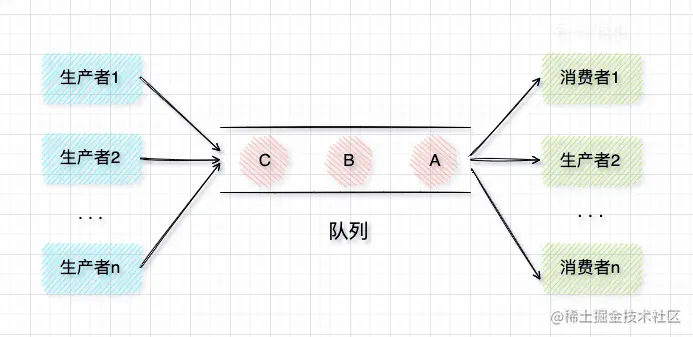

Java提供了多种实现阻塞队列的类，常用的有以下几种：

1. **`ArrayBlockingQueue`**：基于数组实现的有界阻塞队列，具有固定的容量。
2. **`LinkedBlockingQueue`**：基于链表实现的可选有界或无界阻塞队列。
3. **`PriorityBlockingQueue`**：基于优先级堆实现的无界阻塞队列，元素按优先级进行排序。

使用阻塞队列时，可以通过以下几个常用方法进行操作：

- **`put(E element)`**：将元素添加到队列的末尾，如果队列已满，则阻塞等待。
- **`take()`**：从队列的头部获取并移除一个元素，如果队列为空，则阻塞等待。
- **`offer(E element)`**：尝试将元素添加到队列的末尾，如果队列已满，则返回false。
- **`poll()`**：从队列的头部获取并移除一个元素，如果队列为空，则返回null。
- **`size()`**：返回队列中当前元素的数量。

#### 6.为什么要有线程池，线程池的作用是什么？

1. **资源复用，降低开销** 
   线程池通过预先创建并维护一组可复用的线程，避免了频繁创建/销毁线程的系统开销（如内存分配、线程初始化等），减少了上下文切换的资源消耗。

2. **提高响应速度** 
   任务到达时可直接使用空闲线程执行，无需等待线程创建过程。这对高并发场景（如网络服务器处理请求）尤为重要。

3. **控制资源占用** 
   通过限制最大线程数，防止系统因线程过多导致内存耗尽或CPU过载，避免资源竞争和调度混乱。

4. **统一管理与监控** 
   线程池可集中管理线程生命周期、任务队列状态及异常处理，提供任务排队、优先级调度等机制，并支持动态调整参数以适应负载变化。

5. **提升系统稳定性** 
   通过拒绝策略（如丢弃任务或调用者执行）防止任务堆积导致的系统崩溃，同时支持错误隔离，单一线程异常不会影响整体运行。

**核心作用**：在多线程环境下，以可控的线程数量实现任务的高效执行与资源优化，平衡性能与稳定性。

#### 如何监控线程池运行情况？


#### 线程池开小了，导致队列阻塞严重，但不想停机，如何热更新线程池？


### ThreadLocal

[ThreadLocal的原理与概述](https://juejin.cn/post/7332001319287390217?searchId=2024102814055742FE603A7C7B9EEE04B9)

#### 1. 谈谈对ThreadLocal的理解？

`ThreadLocal` 是 Java 提供的一种**线程局部变量**实现机制，用于让每个线程独立**存储**和**访问**自己的变量副本，即每个线程都有自己独立的 `ThreadLocal` 值，线程间的数据互不影响。它特别适合在**多线程环境下为每个线程提供线程独立的对象**，避免共享数据带来的并发问题。

```Java
//代码示例
public class Main {
    static ThreadLocal<Integer> threadLocal = new ThreadLocal<>();//定义一个ThreaLocal
    public static void main(String[] args) throws InterruptedException {
        Thread thread1 = new Thread(() -> {
            System.out.println(threadLocal.get());
            threadLocal.set(0);
            System.out.println(threadLocal.get());
        });
        Thread thread2 = new Thread(() -> {
            System.out.println(threadLocal.get());
            threadLocal.set(1);
            System.out.println(threadLocal.get());
        });
        thread1.start();
        thread1.join(); // 让thread1先执行完再执行thread2
        thread2.start();
    }
}
```

输出结果：

```Java
null
0
null
1
//表明threadLocal变量是线程各自私有的
```

1. get() 方法是用来获取 ThreadLocal 在当前线程中保存的变量副本；
2. set() 用来设置当前线程中变量的副本；
3. remove() 用来移除当前线程中变量的副本；  因为通常会使用线程池，所以为了防止一个线程在使用完ThreadLocal之后，下一次请求又使用了用过的ThreadLocal，因此每次使用完之后都应该调用remove，销毁ThreadLocal
4. initialValue() 是一个 protected 方法，一般是用来在使用时进行重写的，如果在没有 set 的时候就调用 get，会调用 initialValue 方法初始化内容。

#### 2.谈谈ThreadLocal的实现原理？

- **`ThreadLocalMap` 存储结构**：`ThreadLocal` 实际上通过每个 `Thread` 对象内部的 `ThreadLocalMap` 实现了线程局部存储。每个 `Thread` 实例都包含一个 `ThreadLocalMap`，可以理解为一种定制的 `HashMap`，它的键是 `ThreadLocal` 对象本身，值是存储的对象。
- **变量的存储方式**：当线程调用 `ThreadLocal.set()` 时，`ThreadLocalMap` 会将 `ThreadLocal` 对象作为键，将值作为值，存储在 `entry` 数组中。这样，每个线程的 `ThreadLocalMap` 只会存储该线程自己设置的变量，线程间互不干扰，形成线程局部变量的隔离。
- **`ThreadLocal` 和 `ThreadLocalMap` 的关系**：`ThreadLocal` 并不直接持有变量的值，而是通过 `ThreadLocalMap` 来存储。`ThreadLocal` 的主要作用是提供 `get()` 和 `set()` 方法，方便线程将变量传递到 `ThreadLocalMap` 中存储。


#### 3.为什么ThreadLocal会有内存泄露问题？怎么解决？

**问题描述：**

`ThreadLocalMap` 中使用的 key 为 `ThreadLocal` 的弱引用,而 value 是强引用。所以，如果 `ThreadLocal` 没有被外部强引用的情况下，在垃圾回收的时候，key 会被清理掉，而 value 不会被清理掉。这样一来，`ThreadLocalMap` 中就会出现 key 为 null 的 Entry。**假如我们不做任何措施的话，value 永远无法被 GC 回收，这个时候就可能会产生内存泄露**。

**解决方案：**

为了防止这种情况发生，需要再`ThreadLocal`不再使用的时候及时调用`remove()`方法。

#### 4.所以ThreadLocal的key为什么要设计成弱引用？

1. **ThreadLocalMap 的作用域**:

   `ThreadLocalMap` 是 `Thread` 类的一个成员变量，这意味着每个线程都有一个单独的 `ThreadLocalMap` 存储与其相关的 `ThreadLocal` 数据。**`ThreadLocalMap` 的生命周期与线程本身的生命周期相同**，只要线程还在运行，`ThreadLocalMap` 就不会被销毁。

2. **强引用的影响**:

   如果 `ThreadLocal` 的键是强引用，那么即使 `ThreadLocal` 对象不再被其他地方直接引用，它也无法被垃圾收集器回收。由于 `ThreadLocalMap` 的生命周期比 `ThreadLocal` 自身的生命周期长得多，这就可能导致 `ThreadLocal` 对象长时间保留在内存中，即使它们已经不再需要。这会最终导致`ThreadLocal`对象不能被垃圾收集器回收占据宝贵的内存空间，特别在高并发环境下，这会造成严重的内存消耗问题，甚至出现内存溢出问题。

**总结一下：ThreadLocal的key设计为弱引用主要是为了避免内存泄漏，但是这并不能完全解决问题，正确使用ThreadLocal的方法应该是每次使用后都调用remove()方法。**

#### 5.ThreadLocal 应用场景

1. **数据库连接管理:**在多线程应用程序中，**每个线程可能需要自己的数据库连接**。使用 `ThreadLocal` 可以确保每个线程都有自己的数据库连接，避免了多线程共享同一个连接带来的并发问题。
2. **用户会话信息：**在 Web 应用中，可以使用 `ThreadLocal` **存储用户的会话信息**，确保每个请求的线程都能访问到正确的会话数据。
3. **日志记录：**在日志记录中，可以使用 `ThreadLocal` 存储请求的唯一标识符，以便**在日志中追踪每个请求的执行路径**。

### 什么是乐观锁，什么是悲观锁？

**乐观锁**和**悲观锁**是并发编程中两种不同的锁机制，主要用于解决**多线程并发时的数据一致性问题**。

**1.悲观锁**

- **概念**：悲观锁**假设数据在并发环境中会经常发生冲突（被修改），因此每次访问数据时，都会加锁**，确保其他线程无法同时访问该数据。只有锁定的线程可以操作数据，其他线程只能等待锁被释放。
- **应用场景**：适用于写操作频繁、冲突概率高的场景，例如传统数据库的行锁、表锁等，常用于银行转账等对数据一致性要求高的场景。
- **实现方式**：一般通过数据库锁或同步机制（如 `synchronized` 和 `ReentrantLock`）来实现。
- **示例**：数据库中 `SELECT ... FOR UPDATE` 语句，会对选中的记录加上锁，阻止其他事务对该记录进行修改。

**2. 乐观锁**

- **概念**：乐观锁**假设并发冲突很少发生，因此不会在访问数据时加锁，而是通过在更新数据时检查是否有其他线程修改过该数据。**如果检测到冲突，乐观锁会尝试重试操作，直到成功。
- **应用场景**：适用于**读操作多、冲突少**的场景，避免频繁加锁带来的性能开销。**常用于电商系统中的库存更新等轻量级并发场景。**
- **实现方式**：乐观锁常用**版本号**或**时间戳**来实现。每次更新前，检查记录的版本号是否与期望的版本号一致，只有一致时才允许更新。
- **示例**：数据库中的 `CAS`（Compare and Swap，比较并交换）操作，或带版本号的更新操作，如 `UPDATE table SET stock = stock - 1, version = version + 1 WHERE id = ? AND version = ?`，若版本号不一致则更新失败，重试。

**对比总结**

- **锁定方式**：**悲观锁通过加锁来控制并发，乐观锁则通过版本检测来控制并发**。
- **性能影响**：悲观锁性能较低，但适用于冲突多的场景；乐观锁性能更好，但适用于冲突少的场景。
- **使用场景**：悲观锁常见于数据库和银行系统，**乐观锁则更适合高并发的应用，如电商、库存系统等**。


### 多线程练习真题


该练习的解决方案包括两个类，Cinema对象类，和ThreadDemo实现类

```Java
package com.itheima.hw1;  
  
public class Cinema extends Thread{  
  
    static Object obj;  
    static int ticket = 1000;  
  
    @Override  
    public void run() {  
        while(true){  
            synchronized(Thread.class){  
                if(ticket <= 0){  
                    break;  
                }  
                else {  
                    try {  
                        Thread.sleep(30);  
                    } catch (InterruptedException e) {  
                        throw new RuntimeException(e);  
                    }  
                    System.out.println(getName()+"卖出第"+ticket+"张票");  
                    ticket--;  
                }  
            }  
        }  
    }  
}
```

```Java
package com.itheima.hw1;  
  
public class ThreadDemo {  
    public static void main(String[] args) {  
        /*  
        *  hw1:卖电影票  
        * */  
        Cinema c1 = new Cinema();  
        Cinema c2 = new Cinema();  
  
        c1.setName("窗口1");  
        c2.setName("窗口2");  
  
        c1.start();  
        c2.start();  
  
    }  
}
```

## 计算机网络

#### 1 网络分层模型

##### 1.1 为什么要分层

- 就像平时开发框架一样，分为控制层，业务逻辑层，持久层
- 优点：
  - 各层独立，互不影响。
  - 灵活性好，每一层内部可以修改。
  - 易于实现和维护。
  - 促进标准化，每一层的服务都有说明。

##### 1.2 OSI七层


传输层管理两个节点之间数据的传输，分为**可靠传输**和**不可靠传输**，也就是大家熟知的**TCP**与UDP，传输层一方面为两台主机匹配对应的进程，另一方面还有流量控制来确保传输速度，再加上错误控制来进行数据完整的接收。

会话层用来管理应用程序之间的会话，比如说登录网站的时候，网站记录了你的登录信息，比如说，你看电影，再去看的时候可以同步到上一个时间段。

表示层负责对文件进行加解密（HTTPS的SSL/TLS），文件压缩也是这一层的。

应用层则是为计算机用户提供服务，比如说HTTP协议，比如说DNS服务，比如说SMTP协议。

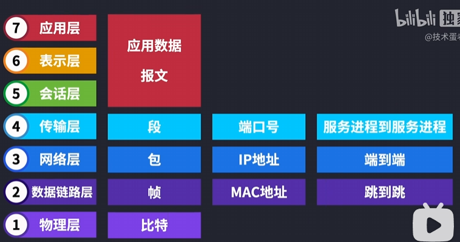


##### 1.3 TCP/IP四层


应用层，传输层，网络层，**网络接口层**

##### 1.4 五层

应用层，传输层，网络层，数据链路层，物理层

##### 1.5 五层模型每层作用和数据单元

- **应用层**：为用户的**应用进程**提供数据传输服务，单位是**报文**
- **传输层**：为不同**主机的进程提供数据**传输服务，网络层只负责将数据从源节点发送到目标节点，但是传输层负责**如何传输**。包含TCP和UDP协议，TCP数据单位为**报文段**，UDP数据单位为**用户数据报**。
- **网络层**：为**不同主机之间**提供传输服务，负责路由和寻址。把传输层传递下来的报文段和用户数据报封装成数据单位：**分组/包**。
- **数据链路层：**网络层负责不同主机之间传输，而主机之间存在很多数据链路，数据链路层负责为**同一链路的主机**提供传输服务。数据单位：把网络层传下来的分组封装成**帧**。
- **物理层：**在**物理媒介**上传输比特流。数据单位：**比特流**。物理层的作用是尽可能地屏蔽传输媒体和通信手段的差异，使数据链路层感受不到这些差异。

##### 1.6 每层常见协议


##### 1.7 五层模型中，各层有哪些设备

- 应用层：无，通过软件实现。
- 传输层：无，通过软件实现。
- 网络层：路由器。
- 数据链路层：交换机。
- 物理层：集线器、中继器。

#### 2 从输入网址到网页显示，发生了什么

[2.2 键入网址到网页显示，期间发生了什么？ | 小林coding (xiaolincoding.com)](https://www.xiaolincoding.com/network/1_base/what_happen_url.html)

1. **HTTP**：输入URL，对URL解析，得到Web服务器域名和请求的文件名，生成HTTP请求。
2. **DNS**：域名解析成目标IP地址，`www.server.com`中，其实最后还有一个`.`，`.`为根域DNS服务器，`.com`为顶级域DNS服务器，`server.com`为权威DNS服务器。若缓存中有这个域名的IP地址，则直接得到目标IP，否则从**根域DNS服务器**开始往下顺藤摸瓜**查找到目标IP**。查询过程看上面网址。
3. **协议栈**：属于操作系统，通过DNS获取IP后，将传输工作交给协议栈，协议栈内部对传输规则进行了规定。
4. **TCP**：**三次握手建立连接**进行可靠传输，若应用层给的报文太长，需要进行分割，之后添加TCP头部，成为TCP**报文段**。TCP只记录发出和目标的**端口**，没有具体位置。
5. **IP**：将TCP报文段添加IP头部，成为**分组/包**。这时候如果机器有**多张网卡**，会根据**本地路由表**计算目标地址的网络号，然后决定用哪张网卡作为源地址发送。
6. **MAC**：以太网上不用IP这套，要用MAC地址，网络包需要加上MAC头部，通过**ARP缓存或广播方式**得到目标的MAC地址，加上MAC头部。
7. **网卡**：将数字信息转换为电信号，加分隔符和校验序列。网卡有自己的MAC地址。
8. **交换机**：交换机将电信号转换为数字信号，交换机没有MAC地址，也不核验MAC地址，根据MAC地址发送到自己对应的端口上。


9. **路由器**：路由器每个端口都有MAC地址和IP地址，和计算机网卡一样，如果MAC包是自己的，那就放入接收缓冲区中，接收了之后**去掉MAC头部**，重新将转发的下一个MAC头部包上去。
9. 回传的HTTP数据通过浏览器渲染成页面展示。


#### 3 TCP与UDP

##### 3.1 TCP与UDP各自特点和区别

- **TCP三大特点**：面向连接，可靠传输，面向字节流。

- **区别**：

  - **是否面向连接：**TCP传输前要**一对一**建立连接，结束了要释放连接，而UDP不用。

  - **是否可靠传输：**TCP可靠传输，UDP不可靠。TCP有**三次握手四次挥手**、确认、**流量控制（窗口）**、重传、**拥塞控制**等机制，保证传的数据无差错、不重复、不丢失、无乱序。UDP只尽最大可能交付，不保证可靠交付。

  - **是否有状态：**TCP有状态，会维护自己发送消息的状态，比如是否发送了，是否接收了，但是UDP没有。

  - **传输效率：**TCP低，UDP高。

  - **传输形式：**TCP面向字节流（字节流之间没有明显分隔符），UDP面向报文（或数据报，把数据划分为这些单元，每个报文都有边界）。

  - **首部开销：**TCP首部开销（20-60字节）大于UDP（8字节）。
  - **是否支持广播/多播：**TCP不支持，只能点对点（全双工，两边都有发送和接收缓存），UDP支持。

##### 3.2 使用TCP和UDP的协议

- 使用TCP的协议：

- - HTTP（3.0之前）：用于本地浏览器和服务器之间传输超文本信息。 
  - FTP：用于文件传输，可以屏蔽操作系统差异和文件存储方式。不安全。
  - SMTP：简单邮件传输协议，只负责邮件发送，不负责接受。
  - POP3/IMAP：邮件接收协议。
  - Telnet：远程登录，不安全。
  - SSH：远程登陆，安全。

- 使用UDP的协议：
  - HTTP（3.0之后）
  - DNS：域名解析协议，负责域名和IP地址的映射。
  - TFTP（Trivial File Transmission Protocal）：简单文件传输协议。

##### 3.3 TCP首部字段

- **源端口（Source Port）和目标端口（Destination Port）：**标识发送端和接收端的应用程序。
- **序列号（Sequence Number）：**用于对发出的报文段排序，使接收端能按序重组数据。
- **确认号（Acknowledgment Number）：**用于可靠传输，表示期望接收的下一个报文段的序列号。和对方发来的报文段的序列号有关
- **数据偏移（Data Offset）：**用来表示首部的长度，分割首部和数据。
- **控制位（Control Bits）：**

- - **SYN：**同步位，表明是连接请求报文或连接接收报文。
  - **ACK：**确认位，表示收到了某次操作的响应。<font color='red'>ACK报文不能重传</font>
  - **FIN：**终止位，表示此报文段的发送方已经发完，要求释放连接。
  - **URG：**紧急位，表示此报文段为紧急数据。
  - **RST**：异常中断

- **窗口大小（Window Size）：**用于表示接收端可接受的数据量。
- **校验和（Checksum）：**用于错误检测。

##### 3.4 TCP三次握手过程

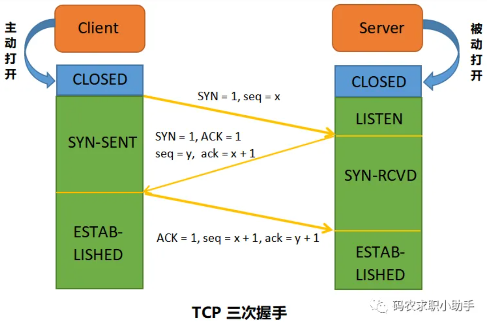

- 名词解释：

- - SYN：同步位，表示建立连接，TCP规定SYN=1时不能携带数据，但是要消耗一个序列号seq，因此随机选取一个序列号seq=x的报文段。
  - ACK：确认位，表示响应。ACK=1表示连接成功。
  - seq：序列号，发送端（发送端可以是客户端，也可以是服务端，不固定，看方向而定）报文段的初始序号。
  - ack：确认号，接收方希望发送方下一个传的报文段的序列号，接收方ack=x+1表示接收方已经接收到x及之前所有报文段。

- 因此SYN和ACK同时为1表示建立连接之后的响应，单个的SYN=1只是建立连接。
- 三次握手过程：
  - 第一次：A端发送一个SYN=1，随机选取一个seq=x的报文段发送。A端进入**SYN-SENT（同步已发送）**阶段。
  - 第二次：B端收到连接请求报文后，返回一个SYN=1，ACK=1，随机选取seq=y，ack=x+1的报文段，B端进入**SYN-RCVD（同步收到）**阶段。
  - 第三次：A收到B的确认报文段后，还要给B确认，发送一个ACK=1，seq=x+1，ack=y+1的报文段，此时连接建立，A进入**ESTABLISHED（已建立连接）**阶段。

##### 3.5 为什么只有第三次握手能携带数据

- 因为第一次和第二次握手发送的报文段SYN都为1，按照规定SYN为1的报文段不能携带数据，因为SYN=1表示尝试建立连接，不一定建立好，带数据可能丢失。
- 为了防止有人不管握没握上，都用SYN=1的报文段携带大量数据攻击服务器。

##### 3.6 为什么不能两次握手

- 原因一：<font color='red'>防止历史过期连接建立（详见小林coding）</font>。如果有历史连接比新连接先从A到B，那么两次握手情况下B就会建立连接，但是三次握手情况下，B在第二次握手返回的ack确认号，能让A发现这是个历史连接（因为B要求的ack不等于最新连接第一次握手的syn+1）。

- 原因二：需要双方确认各自发送接收正常。

  - 第一次握手：A端什么都不能确认，B确认了A的发送和B的接收没问题。

  - 第二次握手：A确认了A的发送和接收，B的发送和接收没问题。

  - 第三次握手：B确认了A的接收和B的发送没问题。至此完整。


##### 3.7 为什么不用四次握手

A发起

- 有人可能会说 A 发出第三次握手的信息后，在没有接收到 B 的请求的情况下就已经进入了连接状态，那如果 A 的这个确认包丢失或者滞留了怎么办？
- 我们需要明白一点，完全可靠的通信协议是不存在的。在经过三次握手之后，客户端和服务端已经可以确认之前的通信状况，都收到了确认信息。所以即便再增加握手次数也不能保证后面的通信完全可靠，所以是没有必要的。

##### 3.8 TCP四次挥手过程


- **第一次挥手：**A发起终止连接请求，FIN=1，seq=u（等于起那面已经发送过的报文段的seq+1），进入**FIN-WAIT-1（终止等待1）状态**。
- **第二次挥手：**B收到A发来的连接释放报文段后立即发出确认，ACK=1，seq=v（等于B前面已经发送过的的报文段的seq+1），ack=u+1，**B进入CLOSE-WAIT（关闭等待）**阶段，A处于**FIN-WAIT-2（终止等待2）状态**，**TCP连接处于半关闭状态**。<font color='red'>CLOSE_WAIT代表需要等待B调用close函数执行断开连接</font>
- **第三次挥手：**由于A发送完了，B可能还没发送完，B要过一会。等B发送完后，B发一个连接释放报文段，FIN=1，seq=w（在半关闭状态，B可能又发送了一些数据，但是没有接收到数据了，因此seq和之前v不一样），ack=u+1，**B进入LAST-ACK（最后确认）状态**，等待A的确认。
- **第四次挥手：**A在收到B的连接释放报文后，发出一个报文段ACK=1，ack=w+1，seq=u+1，进入**TIME-WAIT（时间等待）状态**。经过时间等待计数器设置的时间2MSL（MSL：最长报文段寿命）才能进入**CLOSED状态**。

##### 3.9 为什么主动发起请求的一方有TIME-WAIT状态，且要等待2MSL时间

- **避免历史报文影响新的连接**：因为2MSL时间，传输中的所有信息都不会在途。如果没有TIME_WAIT，那么立马建立新的连接后，一些残留在传输途中的历史报文会影响新的连接。
- 要等待两个方向上数据信息都传送完成，如果没有TIME_WAIT，要是断开连接后立马新建了连接，那么遗留在传输过程中的数据可能会再次被接收导致错误。
- **保证被动关闭方能够正确关闭连接**：为了保证第四次挥手时，A发出的ACK报文段能到达B，如果B没接收到，会超时重传第三次挥手时的FIN报文段。因此A需要等待（2MSL是A传ACK但B没收到，B重传FIN，两个加起来的时间），确保B没有重传（即收到了A第四次挥手发出的ACK报文段）。如果没有TIME_WAIT，第四次挥手丢失的话，B段重传但是A不会返回正常的ACK，而是返回RST报文，导致B异常终止，不够优雅。

##### 3.10 为什么不把服务端B的ACK和FIN合在一起（即第二次和第三次挥手）

因为B发送ACK时，可能还有部分数据没有传完，不能立即发送FIN。

**其实有时候是可以的，如果被动断开端已经发完数据的话**。

- **第一次挥手**：A 说“我没啥要说的了”
- **第二次挥手**：B 回答“我知道了”，但是 B 可能还会有要说的话，A 不能要求 B 跟着自己的节奏结束通话
- **第三次挥手**：于是 B 可能又巴拉巴拉说了一通，最后 B 说“我说完了”
- **第四次挥手**：A 回答“知道了”，这样通话才算结束。

##### 3.11 TCP流量控制

[ps://javaguide.cn/cs-basics/network/tcp-reliability-guarantee.html#tcp-%E5%A6%82%E4%BD%95%E5%AE%9E%E7%8E%B0%E6%B5%81%E9%87%8F%E6%8E%A7%E5%88%B6](https://javaguide.cn/cs-basics/network/tcp-reliability-guarantee.html#tcp-如何实现流量控制)

**防止丢包，合理利用网络资源。**

**TCP 利用滑动窗口实现流量控制。流量控制是为了控制发送方发送速率，保证接收方来得及接收。** 接收方发送的确认报文中的窗口字段可以用来控制发送方窗口大小，从而影响发送方的发送速率。将窗口字段设置为 0，则发送方不能发送数据。**TCP发送/接收的数据实际上是先到内核缓冲区中，然后根据发送/接收窗口大小读取**。

**为什么需要流量控制?** 这是因为双方在通信的时候，发送方的速率与接收方的速率是不一定相等，如果发送方的发送速率太快，会导致接收方处理不过来。如果接收方处理不过来的话，就只能把处理不过来的数据存在 **接收缓冲区(Receiving Buffers)** 里（失序的数据包也会被存放在缓存区里）。如果缓存区满了发送方还在狂发数据的话，接收方只能把收到的数据包丢掉。出现丢包问题的同时又疯狂浪费着珍贵的网络资源。因此，我们需要控制发送方的发送速率，让接收方与发送方处于一种动态平衡才好

##### 3.12 TCP拥塞控制

- 拥塞控制和流量控制不同，前者是一个全局性的过程，而后者指点对点通信量的控制。在某段时间内，如果对网络中某一资源的需求超过了该资源所能提供的可用部分，网络的性能就要变坏。这种情况就叫拥塞。


- 拥塞控制四个算法：
  - **慢开始：**当主机发送数据，立即把大量数据字节注入网络，可能直接超过网络限制而阻塞，较好的方法是先探测一下。拥塞窗口数值cwnd 初始值为 1，每经过一个传播轮次，cwnd 加倍。
  - **拥塞避免：**拥塞避免算法的思路是让拥塞窗口 cwnd 缓慢增大，即每经过一个往返时间 RTT 就把发送方的 cwnd 加 1。
  - **快重传**：首先要求**接收方**每收到一个**失序**的报文段就立即发出**重复确认**。如果**发送方**连续收到三个重复确认，就要立即重传对方尚未收到的报文段，而不必等待**重传计时器**到期。如果双方都启用了**SACK**功能，那么只会重传失序的部分，如果没启用，就会重传失序之后的所有报文。
  - **快恢复**：发送方收到三个重复确认发生快重传时，就把**拥塞窗口减半**，再执行**拥塞避免**（拥塞避免是在这个时候执行，而不是和慢开始一样在开头执行）。

##### 3.13 TCP快速建立连接 Fast Open

- 由于每次新的TCP连接完成，发送一个HTTP请求，拿到响应都要2.5RTT或2RTT的时延，所以有了一个cookie机制，防止每次TCP连接都需要三次握手。
  - 2RTT情况是在第三次握手的时候带上数据。


- 在第一次客户端和服务端建立连接时，在第二次握手，服务端返回的数据中带上cookie，之后每次这个客户端和服务端建立TCP连接时，第一次握手带上这个cookie，就可以避免重新三次握手。

##### 3.14 HTTP的Keep-Alive和TCP的Keepalive

- 不同。
- HTTP的是HTTP1.1开始的**长连接**，指两次HTTP请求可以共享一个TCP连接。
- TCP的Keepalive是TCP的**保活机制**，指的是如果长时间没有TCP传输，会发送TCP探测报文给对端，以此检查连接是否正常。

#### 4 IP

##### 4.1 **谈下你对 IP 地址分类的理解？**   ✅

==IP地址是指互联网协议地址，是IP协议提供的一种统一的地址格式，它为互联网上的每一个网络和每一台主机分配一个逻辑地址，以此来屏蔽物理地址的差异。==IP地址编制方案将IP地址空间划分为A、B、C、D、E五类，其中A、B、C是基本类，D、E类作为多播和保留使用，为特殊地址。

每个IP地址包括两个标识码(ID)，即**网络ID和主机ID**。同一个物理网络上的所有主机都是用同一个网络ID，网络上的一个主机（包括网络上工作站，服务器和路由器等）有一个主机ID与其对应。A~E类地址的特点如下：

+ A类地址：以0开头，第一个字节范围：0~127；用1个字节表示网络号，3个字节表示主机号	
+ B类地址：以10开头，第一个字节范围：128~191；2个字节表示网络号，2个字节表示主机号
+ C类地址：以110开头，第一个字节范围：192~223；3个字节表示网络号，1个字节表示主机号
+ D类地址：以1110开头，第一个字节范围：224~239；
+ E类地址：以1111开头，保留地址


- 主机数量-2是因为全0和全1是特殊的，全0代表当前网络号，全1代表广播地址。

##### 4.2 **子网掩码的作用？**   ✅

- 子网掩码是为了区分各个不同的子网而设置的，与主机IP地址进行位与操作，从而区分出是否在同一网段，从而确定局域网的范围。

##### 4.3 ARP协议

- ARP 协议，全称 **地址解析协议（Address Resolution Protocol）**，它解决的是网络层地址和链路层地址之间的转换问题。因为一个 IP 数据报在物理上传输的过程中，总是需要知道下一跳（物理上的下一个目的地）该去往何处，但 IP 地址属于逻辑地址，在**以太网**上不是用IP地址，而是用MAC地址。MAC 地址才是物理地址，ARP 协议解决了 IP 地址转 MAC 地址的一些问题。
- **ARP分组**是一种特殊报文，有两种，**查询分组**和**响应分组**，都包含了发送和接受的IP地址和MAC地址（如果MAC地址是要问询的，会用一个特殊值代替）。
- **同一局域网内原理：**
  - 主机A检索自己ARP表，若发现没有B的IP地址对应的映射条目，将构建一个**ARP查询分组**，广播到A所在局域网。
  - 主机A的查询分组在局域网中广播，所有设备都会收到并检查自身IP是否为目标IP，如果不是则丢弃，如果是则继续。
  - 主机B验证是对自己的问询，构造一个**ARP响应分组**发给A，同时在自己的ARP表中构造一条主机A的IP-MAC映射。
  - 主机A收到了主机B发回的响应分组，在自己的ARP表中加入主机B的IP-MAC映射。
- **不同局域网内：**
  - 涉及到路由器的转发。
  - [**https://javaguide.cn/cs-basics/network/arp.html#%E4%B8%8D%E5%90%8C%E5%B1%80%E5%9F%9F%E7%BD%91%E5%86%85%E7%9A%84-mac-%E5%AF%BB%E5%9D%80**](https://javaguide.cn/cs-basics/network/arp.html#不同局域网内的-mac-寻址)


##### 4.4 Ping的过程

- ICMP协议
  - Ping是基于ICMP（Internet Control Message Protocol，互联网控制报文协议）协议工作的，ICMP主要功能就是**确认Ping的数据包是否到达目标，如果没有到达发生了什么问题，以及改善网络设置。**
  - ICMP报文封装在IP包中，工作在网络层。包头字段分为两种类型：**查询报文类型**（用于诊断网络的查询消息）和**差错报文类型**（用来通知错误原因的错误消息）。
  - ICMP查询报文中，有两种正常情况下用的，**回送请求**和**回送应答**。
- Ping的发送接收过程
  - Ping命令执行时，源主机构建一个**ICMP回送请求数据包**。
  - 把ICMP回送请求包交给IP层，包上IP头部，IP层根据目标IP通过ARP找到目标主机MAC，包上MAC头部。
  - 目标主机构建**ICMP回送应答数据包**回传。
  - 规定时间内没有收到回送响应数据包，说明不可达。
- Ping本机地址127.0.0.1（回环地址），断网了也能Ping通，因为不会经过网卡。

#### 5 数据链路层ARQ协议

##### 5.1 ARQ协议

- Automatic Repeat reQuest，自动重传请求协议。
- 停止等待ARQ：
  - 停止等待协议中超时重传是指只要超过一段时间仍然没有收到确认，就重传前面发送过的分组（认为刚才发送过的分组丢失了）。因此每发送完一个分组需要设置一个超时计时器，其重传时间应比数据在分组传输的平均往返时间更长一些。这种自动重传方式常称为自动重传请求 ARQ。
  - 没有接收到确认就不发下一个分组，因此信道利用率低。

- 连续ARQ协议：
  - 连续ARQ 协议可提高信道利用率。发送方维持一个发送窗口，凡位于发送窗口内的分组可以连续发送出去，而不需要等待对方确认。接收方一般采用累计确认，对按序到达的最后一个分组发送确认，表明到这个分组为止的所有分组都已经正确收到了。
  - 若只收到部分，比如传的是x~x+10，收到x+5，那么x+6~x+10都重传。


#### 6 粘包问题

##### 6.1 粘包的原理

- 发生在**传输层**，传送时数据报边界发生错误，特别是在使用**TCP协议**时，因为TCP面向字节流，而UDP面向报文，每个用户数据报之间有边界，不会粘包。
- 粘包是指接收方在接收数据时可能把多个包接收为一个包，或者把一个包分成了多个包。
- 如图所示，当前的socket缓存中已经有6个数据分组到达，其大小如图中数字。而应用程序在对数据进行收取时(如图2)，采用了300字节的要求去读取，则会**误将pkg1和pkg2一起收走当做一个包来处理**。而实际上，很可能**pkg1是一个文本文件的内容**，而**pkg2则可能是一个音频内容**，这**风马牛不相及的两个数据包**却**被揉进一个包**进行处理，显然有失妥当。严重时可能因为丢了pkg2而导致软件陷入异常分支产生乌龙事件。


##### 6.2 粘包的原因

- **发送方的原因**：发送方连续发送多个包，因为网络问题粘在一起。
- **接收方的原因**：接收方接收时多个包读取成了一个包，或者一个包分开读取。
- **网络原因**：路由器，交换机的缓存机制也有可能造成粘包。

##### 6.3 解决方案

- **固定长度**：每个数据包长度相同，发送方和接收方统一，但是会导致资源浪费。
- **添加分隔符**
- **头部添加长度**：每个数据包头部添加固定长度的一段，用于表示该数据包大小。**目前最好方法。**
- **应用层协议**：通过应用层协议解决这个问题。


## JavaWeb（Http）

#### 6. **在浏览器中输入 URL 地址到显示网页的过程？(重要）**

简洁版

1. DNS解析：浏览器查询DNS，获取域名对应的IP地址
   1. 具体过程包括**浏览器搜索自身的DNS缓存、搜索操作系统的DNS缓存、读取本地的Host文件和向本地DNS服务器进行查询**等。
   2. 对于向本地DNS服务器进行查询。
      1. ①如果要查询的域名包含在本地配置区域资源中，则返回解析结果给客户机，完成域名解析（此解析具有权威性）；
      2. ②如果要查询的域名不由本地DNS服务器区域解析，但该服务器已经缓存了此网址映射关系，则调用这个IP地址映射，完成域名解析（此解析不具有权威性）；
      3. ③如果**本地域名服务器**并未缓存该网址映射关系，那么将根据其设置向**根DNS**->**顶级域名服务器**->**权威DNS**发起**递归查询**或者**迭代查询**；

2. TCP连接：浏览器获得域名对应的IP地址以后，**浏览器向服务器请求建立连接**，发起三次握手；
3. 发送HTTP请求：TCP连接建立起来后，浏览器向服务器发送HTTP请求；
4. 服务器**处理请求并返回HTTP报文**：服务器接收到这个请求，并根据路径参数映射到特定的请求处理器进行处理，并将处理结果及相应的视图返回给浏览器；
5. 浏览器**解析渲染页面**：浏览器解析并渲染视图，若遇到对js文件、css文件及图片等静态资源的引用，则重复上述步骤并向服务器请求这些资源；**浏览器根据其请求到的资源、数据渲染页面，最终向用户呈现一个完整的页面；**
6. 连接结束。

超级简洁版：

1. DNS 解析
2. TCP 连接
3. 发送 HTTP 请求
4. 服务器处理请求并返回 HTTP 报文
5. 浏览器解析渲染页面
6. 连接结束

#### 1. **HTTP协议是什么？HTTP格式？**

**超文本传输协议**。是一种详细规定了**浏览器和万维网服务器之间相互通信**的规则，通过因特网传送万维网文档和数据的协议。

不论是HTTP请求报文还是响应报文，都包含以下四部分内容：


1. 请求行/状态行：GET  [www.baidu.com](http://www.baidu.com/)  HTTP/1.1 只占一行
2. 请求头 / 响应头：Accept-Language:en
3. 空白行
4. 可选的消息体（请求体/响应体）

#### 2. **说几个你知道的 HTTP 状态码？** 


**2xx Success（成功状态码）**

- **200 OK** ：请求被成功处理。比如我们发送一个查询用户数据的HTTP 请求到服务端，服务端正确返回了用户数据。这个是我们平时最常见的一个 HTTP 状态码。
- **201 Created** ：请求被成功处理并且在服务端创建了一个新的资源。比如我们通过 POST 请求创建一个新的用户。
- **202 Accepted** ：服务端已经接收到了请求，但是还未处理。
- **204 No Content** ： 服务端已经成功处理了请求，但是没有返回任何内容。

**3xx Redirection（重定向状态码）**

- **301 Moved Permanently** ： 资源被永久重定向了。比如你的网站的网址更换了。
- **302 Found** ：资源被临时重定向了。比如你的网站的某些资源被暂时转移到另外一个网址。

**4xx Client Error（客户端错误状态码）**

- **400 Bad Request** ： 发送的HTTP请求存在问题。比如请求参数不合法、请求方法错误。
- **401 Unauthorized** ： 未认证却请求需要认证之后才能访问的资源。
- **403 Forbidden** ：直接拒绝HTTP请求，不处理。一般用来针对非法请求。（后端规定Post请求，前端用Get请求就是这个状态码）
- **404 Not Found** ： 你请求的资源未在服务端找到。比如你请求某个用户的信息，服务端并没有找到指定的用户。
- **409 Conflict** ： 表示请求的资源与服务端当前的状态存在冲突，请求无法被处理。

**5xx Server Error（服务端错误状态码）**

- **500 Internal Server Error** ： 服务端出问题了（通常是服务端出Bug了）。比如你服务端处理请求的时候突然抛出异常，但是异常并未在服务端被正确处理。
- **502 Bad Gateway** ：我们的网关将请求转发到服务端，但是服务端返回的却是一个错误的响应

#### 3.HTTP1.0和HTTP1.1和HTTP2.0的区别？

- HTTP1.1 的主要变化(四点）：

1. HTTP1.0 经过多年发展，在 1.1 提出了改进。首先是提出了长连接，HTTP 可以在一次 TCP 连接 中不断发送请求而不是每次发送一个请求都重新创建一个TPC连接（HTTP1.0),因为建立TCO连接相当耗时。

2. 然后 HTTP1.1 支持只发送 header 而不发送 body。**原因是先用 header 判断能否成功，再发数据，节约带宽，事实上，post 请求默认就是这样做的（先发option请求）**。

3. HTTP1.1 加入了 **host 字段**。由于虚拟主机可以支持多个域名，所以一般将域名解析后得到 host。

   > HTTP/1.1 引入了 `Host` 字段，这使得虚拟主机技术变得更加可行。在 HTTP/1.0 中，如果多个网站共享同一个 IP 地址，则服务器无法区分接收到的请求是针对哪个网站的。然而，在 HTTP/1.1 中，因为 `Host` 字段的存在，服务器可以根据请求头中的域名来识别出正确的网站，并返回相应的网页内容。这对于支持多个域名的虚拟主机是非常重要的。

4. HTTP1.1改进了**缓存技术**，通过**避免用户与源服务器的频繁交互**，节约了大量的网络带宽，降低了用户接收信息的延迟。

- HTTP2.0 的主要变化（4点）：

1. **HTTP2.0 支持多路复用，同一个连接可以并发处理多个请求**，方法是把 HTTP数据包拆为多个帧， 并发有序的发送，根据序号在另一端进行重组，而不需要一个个 HTTP请求顺序到达。（通过多路复用，HTTP/2 能够显著减少页面加载时间和整体延迟，提高了用户体验和网络性能。）
2. **HTTP2.0 支持服务端推送**，就是服务端在 HTTP 请求到达后，除了返回数据之外，**还推送了额外的内容给客户端**。
3. HTTP2.0 压缩了请求头，同时基本单位是二进制帧流，这样的数据占用空间更少；。
4. HTTP2.0 只适用于 HTTPS 场景，因为其在 HTTP和 TCP 中间加了一层 SSL 层。

#### 4. **forward（请求转发） 和 redirect（重定向） 的区别？**

**转发是服务器行为，重定向是客户端行为**

1. **从地址栏显示来说**： forward是服务器将request域中的对象转发给另一个servlet,转发是在服务器内部进行的，所以地址栏上显示的是旧的URL。 redirect是服务端根据逻辑发送一个请求路径（状态码）,告诉浏览器重新去请求那个地址，所以地址栏显示的是新的URL。
2. **从数据共享来说**：forward:转发页面和转发到的页面可以共享request域里面的数据, redirect:不能共享数据。
3. **从运用地方来说** ：forward:一般用于用户登陆的时候,根据角色转发到相应的模块.  redirect:一般用于用户注销登陆时返回主页面和跳转到其它的网站等.
4. **从效率来说**： forward:高,服务器压力大 redirect:低, 服务器压力小。

**直接转发与间接转发**

**举个通俗的例子：**　

直接转发就相当于：“A 找 B 借钱，B 说没有，B 去找 C 借，借到借不到都会把消息传递给 A”。

间接转发就相当于："A 找 B 借钱，B 说没有，让 A 去找 C 借"。

重定向有两种：一种是302响应，称为临时重定向，一种是301响应，称为永久重定向。两者的区别是，如果服务器发送301永久重定向响应，浏览器会缓存`/hi`到`/hello`这个重定向的关联，下次请求`/hi`的时候，浏览器就直接发送`/hello`请求了。


请求转发


[重定向与转发 - Java教程 - 廖雪峰的官方网站 (liaoxuefeng.com)](https://liaoxuefeng.com/books/java/web/servlet-adv/redirect-forward/index.html)

#### 5. **说下 GET 和 POST 的区别？**

> 关于这个问题可以先了解一下报文（包括请求报文和相应报文）的结构：https://zhuanlan.zhihu.com/p/346408612

GET和POST本质**都是HTTP请求**，只不过对他们的作用做了界定和适配，并且让他们适应各自的场景。

**本质区别**：GET只是一次HTTP请求，POST先发**请求头**再发**请求体**，实际上是两次请求。

> get 请求在发送过程中会产生一个 TCP 数据包；post 在发送过程中会产生两个 TCP 数据包。对于 get 方式的请求，浏览器会把 http header 和 data 一并发送出去，服务器响应 200（返回数据）；而对于 post，浏览器先发送 header，服务器响应 100 continue，浏览器再发送 data，服务器响应 200 ok（返回数据）

1. 从功能上讲
   1. GET 一般用来从服务器上**获取**资源
   2. POST 一般用来**更新**服务器上的资源。
2. 从 REST 角度上说
   1. GET 是幂等的，即读取同一个资源，总是得到相同的数据
   2. POST 不是幂等的，因为每次请求对资源的改变并不是相同的；进一步地，GET 不会改变服务器上的资源，而 POST 会对服务器资源进行改变。
3. 从请求参数形式上
   1. GET 请求的数据会附在 URL 之后，即将请求数据放置在 HTTP 报文的 **请求头** 中，**以 ? 分割 URL 和传输数据，参数之间以 & 相连**。特别地，如果数据是英文字母/数字，原样发送；否则，会将其编码为 application/x-www-form-urlencoded **MIME** 字符串(如果是空格，转换为+，如果是**中文/其他字符**，则直接把字符串用 **BASE64 加密**，得出如：%E4%BD%A0%E5%A5%BD，其中 ％XX 中的 XX 为该符号以 16 进制表示的 ASCII)。
   2. POST 请求会把提交的数据则放置在 HTTP 请求报文的 **请求体** 中。
4. 就安全性而言
   1. POST 的安全性要比 GET 的安全性高，因为 GET 请求提交的数据将明文出现在 URL 上。
   2. POST 请求参数则被包装到请求体中，相对更安全。
5. 从请求的大小看
   1. GET 请求的长度受限于浏览器或服务器对 URL 长度的限制，允许发送的数据量比较小。
   2.  POST 请求则是没有大小限制的。

#### 7.谈下对HTTPS的理解？（SSL/TLS的工作流程你了解吗？）

HTTPS 协议（Hyper Text Transfer Protocol Secure），是 HTTP 的加强安全版本。HTTPS 是基于 HTTP 的，也是用 TCP 作为底层协议，并额外使用 SSL/TLS 协议用作加密和安全认证。默认端口号是 443。

HTTP存在以下缺点

1. 明文传输，传输的报文可能会被窃听
2. 无法验证通信双方的身份
3. 无法验证报文的完整性，请求和响应的内容可能被篡改。

历史上，HTTPS协议曾使用过SSL协议，但是由于SSL的各个版本被发现存在多个安全漏洞，因此，现代的HTTPS使用**TLS**作为加密协议。**HTTPS是添加了TLS协议加密和认证机制的HTTP**

**TLS的工作流程：**


1. Client Hello
   1. 客户端向服务器发送一个Client Hello消息，其中包含客户端支持的TLS版本、加密套件、压缩方法、随机数（用于生成会话密钥）以及其他扩展信息。

2. Server Hello
   1. 服务器回复一个Server Hello消息，**选择一个客户端提供的加密套件**，并发送一个**随机数**。

3. 证书交换
   1. 服务器发送其证书，证书包含公钥。
   2. 客户端验证证书的有效性。

4. Client Key Exchange
   1. 客户端生成一个预主密钥，并使用服务器证书中的**公钥**将其加密后发送给服务器，服务器会用**私钥**解密获得预主密钥。
   2. 双方基于**预主密钥**和之前交换的**随机数**生成**会话密钥**。

5. Change Cipher Spec
   1. 双方发送Change Cipher Spec消息，表示从此刻开始，所有通信将使用新生成的会话密钥加密。

6. Finished
   1. 客户端发送一个Finished消息，使用**会话密钥**对握手过程中发生的数据进行哈希并加密。
   2. 服务器同样发送一个Finished消息，确认握手成功。

#### 8. **HTTPS 的工作过程？**

1、浏览器发起请求（客户端say hello)

2、服务端返回**随机数**+**证书**（包含公钥）

3、客户端从验证证书得到服务端的公钥；

4、客户端生成预主密钥，并用从服务端证书中得到的公钥加密后发送给服务端；

5、服务器用私钥解密后得到预主密钥，双方基于**预主密钥和之前交换的随机数**生成**会话密钥**，用会话秘钥进行对称加密。

6、用**对称密钥**加密数据传输

#### 9.HTTP和HTTPS的区别

1. 资源消耗：HTTP是超文本传输协议，信息是明文传输，HTTPS则是具有安全性的SSL/TLS加密传输协 议，需要消耗更多的CPU和内存资源；
2. 端口不同：HTTPS和HTTPS使用的是完全不同的连接方式，用的端口也不一样，前者是80，后者 是443；
3. 安全性：HTTP的连接很简单，是无状态的；HTTPS协议是由SSL/TLS+HTTP协议构建的可进行加密传输、身份认证的网络协议，比HTTP协议安全
4. 开销：HTTPS协议需要到**CA申请证书**，一般免费证书很少，需要交费；

#### 10. **什么是数字签名？什么是数字证书？** 

**数字签名：**

数字签名是一种基于非对称加密和数字摘要技术的电子签名方式，用于验证信息的真实性、完整性和不可抵赖性。。其核心原理是发送方使用私钥对信息进行加密（签名），接收方通过公钥解密验证，确保信息未被篡改且来源可信。
为确保数据在传输过程中不被篡改（如黑客恶意修改报文内容），数字签名机制的核心原理是：

1. **发送端生成签名**：发送方使用哈希算法（如MD5、SHA-256）对原始数据生成唯一的**数字摘要**，再使用**发送方的私钥**对该摘要进行加密，形成数字签名。随后将原始数据与签名一同发送。
2. **接收端验证签名**：接收方首先用相同的哈希算法对收到的数据重新计算摘要；同时，使用**发送方的公钥**对接收到的数字签名进行解密，得到原始摘要。
3. **完整性校验**：若接收方计算的摘要与解密后的原始摘要一致，则说明数据未被篡改且确实来自发送方。

--- JWT也是用了加数字签名的技术。

**数字证书：**

对称加密中，双方使用公钥进行解密。如果公钥也被替换，则仍然可以伪造数据，因为用户不知道对方提供的公钥其实是假的。所以为了保证发送方的公钥是真的，**CA 证书机构会负责颁发一个证书，里面的公钥保证是真的**，用户请求服务器时，服务器将证书发给用户，这个证书是经由系统内置证书的备案的。

#### 11. **常用的加密算法有哪些？**

|  **类型**  | **典型算法** |           **适用场景**           |
| :--------: | :----------: | :------------------------------: |
|  对称加密  |   AES、SM4   | 大数据加密（如文件传输、数据库） |
| 非对称加密 |   RSA、SM2   |        密钥交换、数字证书        |
|  哈希算法  | SHA-256、SM3 |     密码存储、数据完整性校验     |

#### 12. **了解cookies吗？**

由于HTTP是无状态协议，为了保持客户端与服务器之间的一些关系，便引入了cookies和session。

cookies是服务器在客户端本地存储的一小段文本，**用于跟踪用户访问该网站的习惯**（什么时间访问、访问了哪些页面、每个页面停留的时间等），并随着每一个请求发送至同一个服务器。服务器通过HTTP响应头向客户端发送cookies，客户端浏览器解析这些cookies，并将它们保存为一个本地文件，就会在下一次访问服务器时附带上这些cookies。

**cookies的过期时间：**

- **会话cookies：**如果不设置过期时间，则cookies的生命周期为浏览器会话期间，cookie保存在内存里，关闭浏览器cookies就会消失。
- **持久cookies：**如果不设置过期时间，浏览器会把cookies保存到硬盘上，即使关闭浏览器，cookies也不会丢失。

------

#### 14. **了解session吗？** 

session机制是一种**服务端的机制**。服务器使用一种类似**散列表**的结构来保存信息。

当服务器需要为某个客户端创建session时，会检查这个客户端是否包含了一个session标志，称为session_id。**如果检测到，表明该客户曾经创建过session_id，服务器会把这个ID检索出来使用（如果没检索到就创建一个）**，session_id既不会重复也不会被仿造。

**session_id的储存：**

1. 保存session_id可以使用cookies，这样交互过程中浏览器可以把这个标志返回给服务器，一般该变量名与session有关，比如github的session_id为user_session；
2. 由于cookies可以被人为地禁止，因此必须有其他机制可以保证session_id被传回服务器，经常使用的一种方式是URL重写，也就是直接把session_id附在URL后面，作为路径的附加信息或查询字符；
3. 另一种技术是**表单隐藏字段**，服务器自动修改表单加入一个隐藏字段，便于传回session_id

------

#### 15. **Session 和 Cookie 的区别？**

1. **存取方式不同：**cookie只能保存ASCII字符，Unicode及二进制数据需要编码，cookie不能直接存取java对象，存储略微复杂的信息较为艰难。而session中能够存取任何类型的数据，包括不限于string、integer、list、map，而且可以直接存取java的类对象，十分方便
2. **隐私策略不同**：cookie存储在**客户端浏览器**中，对客户端可见，客户端可以窥探甚至是修改cookie内容。而**session**存储在**服务器**上，不存在泄露风险。cookie可以像google及baidu一样将敏感信息加密后保存，在服务器上进行解密。
3. **有效时间不同**：由于session依赖于session_id的cookie，而session_id过期时间默许为-1，关闭浏览器即消失。而cookie可以设置长期的保存
4. **服务器压力不同**：由于不同的储存方式，储存在客户端的cookie不会给服务器造成压力，而session由于存在服务器上，对服务器压力较大。
5. **浏览器支持不同**：**cookie**是需要**客户端浏览器**支持的，假如客户端禁用了cookie或者不支持cookie，则会话跟踪会失效。假如客户端不支持cookie，就需要运用session及url地址重写。**需要注意的是一切用到session的程序url都需要进行重写，否则session会话还是会失效**
6. **跨域支持不同：**cookie支持跨域名访问，一切以相同后缀的域名均可以访问该cookie，跨域名cookie被广泛应用session仅在当前域名有效。

#### 17.说说对JWT的理解？JWT解决了什么问题？

JWT （JSON Web Token） 是目前最流行的跨域认证解决方案，是一种基于 **Token 的认证授权机制**。 从 JWT 的全称可以看出，JWT 本身也是 Token，一种规范化之后的 JSON 结构的 Token。

**无状态认证**: 在传统的基于 session 的认证机制中，服务器需要存储用户的 session 信息，并在每次请求时检查这个 session。然而，**在分布式系统和负载均衡环境中，这种做法变得复杂且低效**。JWT 提供了一种无状态的替代方案，它将**用户身份信息和权限编码**到一个 token 中，客户端在每次请求时都携带这个 token。这样，任何服务器节点都可以独立验证 token 而无需查询数据库或与其他节点通信。

>  Session适用于中小型Web应用程序。对于大型Web应用程序来说，通常需要避免使用Session机制。

如果多台Web Server采用无状态集群，那么反向代理总是以轮询方式将请求依次转发给每台Web Server，这会造成一个用户在Web Server 1存储的Session信息，在Web Server 2和3上并不存在，即从Web Server 1登录后，如果后续请求被转发到Web Server 2或3，那么用户看到的仍然是未登录状态。要解决这个问题，方案一是在所有Web Server之间进行Session复制，但这样会严重消耗网络带宽，并且，每个Web Server的内存均存储所有用户的Session，内存使用率很低。

另一个方案是采用粘滞会话（Sticky Session）机制，即反向代理在转发请求的时候，总是根据JSESSION ID的值判断，相同的JSESSION ID总是转发到固定的Web Server，但这需要反向代理的支持。

无论采用何种方案，使用Session机制，会使得Web Server的集群很难扩展，因此，Session适用于中小型Web应用程序。对于大型Web应用程序来说，通常需要避免使用Session机制。

JWT组成：

**Header** : 描述 JWT 的元数据，定义了生成签名的算法以及 `Token` 的类型。

**Payload** : 用来存放实际需要传递的数据

**Signature（签名）** ：用于验证令牌完整性，防止篡改。通过头部指定的算法，结合密钥（Secret）对**编码（默认用HMAC SHA256）后的Header和Payload**进行签名生成

这个签名的生成需要用到：

- Header + Payload。
- 存放在服务端的密钥(一定不要泄露出去)。
- 签名算法。

#### 16.说说对RestFul规范的理解

**REST** 是 `REpresentational State Transfer` 的缩写。这个词组的翻译过来就是“**表现层状态转化**”， “资源”在网络传输中以某种“表现形式”进行“状态转移” 。客户端通过特定的 **HTTP 动词，对服务器端资源进行操作**，实现"表现层状态转化"。

规范：

**HTTP动作**：

`GET`：请求从服务器获取特定资源。举个例子：`GET /classes`（获取所有班级）

`POST` ：在服务器上创建一个新的资源。举个例子：`POST /classes`（创建班级）

`PUT` ：更新服务器上的资源（客户端提供更新后的整个资源）。举个例子：`PUT /classes/12`（更新编号为 12 的班级）

`DELETE` ：从服务器删除特定的资源。举个例子：`DELETE /classes/12`（删除编号为 12 的班级）

**接口命名**：

1. **网址命名只能有名词，不能有动词**
2. **用斜杠拼接来表示操作的资源。**

| 操作     | 传统方式         | REST风格                |
| :------- | :--------------- | :---------------------- |
| 查询操作 | getUserById?id=1 | user/1-->get请求方式    |
| 保存操作 | saveUser         | user-->post请求方式     |
| 删除操作 | deleteUser?id=1  | user/1-->delete请求方式 |
| 更新操作 | updateUser       | user-->put请求方式      |

```Java
@RestController
@RequestMapping("/api/books")
public class BookController {

    private Map<Long, Book> books = new HashMap<>();
    private Long idCounter = 1L;

    // GET: Retrieve a book by ID
    @GetMapping("/{id}")
    public ResponseEntity<Book> getBook(@PathVariable Long id) {
        Book book = books.get(id);
        if (book == null) {
            return new ResponseEntity<>(HttpStatus.NOT_FOUND);
        }
        return new ResponseEntity<>(book, HttpStatus.OK);
    }

    // POST: Add a new book
    @PostMapping
    public ResponseEntity<Book> createBook(@RequestBody Book book) {
        book.setId(idCounter++);
        books.put(book.getId(), book);
        return new ResponseEntity<>(book, HttpStatus.CREATED);
    }

    // PUT: Update a book by ID
    @PutMapping("/{id}")
    public ResponseEntity<Book> updateBook(@PathVariable Long id, @RequestBody Book updatedBook) {
        if (!books.containsKey(id)) {
            return new ResponseEntity<>(HttpStatus.NOT_FOUND);
        }
        updatedBook.setId(id);
        books.put(id, updatedBook);
        return new ResponseEntity<>(updatedBook, HttpStatus.OK);
    }

    // DELETE: Delete a book by ID
    @DeleteMapping("/{id}")
    public ResponseEntity<Void> deleteBook(@PathVariable Long id) {
        if (!books.containsKey(id)) {
            return new ResponseEntity<>(HttpStatus.NOT_FOUND);
        }
        books.remove(id);
        return new ResponseEntity<>(HttpStatus.NO_CONTENT);
    }
}
```

#### 19.说说RPC调用和HTTP调用的区别？

1. **协议与思想**：
   - **HTTP** 是一种传输协议，应用于请求和响应的标准化。
   - **RPC** 是一种远程过程调用思想，依赖框架，通常基于 TCP 传输，注重高效性能。
2. **传输与序列化**：
   - **RPC** 使用 TCP 进行高效传输，要求请求和响应数据进行**序列化**和**反序列化**。
   - **HTTP** 使用文本协议（如 JSON、XML）进行数据传输，通常在应用层进行操作。
3. **应用场景**：
   - **RPC** 适用于需要高性能和低延迟的内部服务间通信，尤其是分布式系统中。
   - **HTTP** 适用于 Web 应用和公开的 API，具有跨语言的优势。
4. **Spring Cloud 选择 HTTP**：
   - Spring Cloud 采用 HTTP 是因为其兼容性和生态优势，尤其是 **RESTful API** 流行。
   - 也支持其他 RPC 技术（如 gRPC），允许根据需求选择合适的通信方式。

总结：

- **RPC** 提供高性能和低延迟，但需要高语言依赖和框架支持。
- **HTTP** 适合公开 API 和 Web 应用，跨语言支持强，灵活性较高。

## JVM

### 引言

#### 1.什么是JVM？

**JVM**（Java 虚拟机）是 Java 实现跨平台的核心。它的作用是将编译后的 Java 字节码（.class 文件）转换为特定平台上的机器指令并执行。具体过程是：

1. **编译阶段**：Java 程序（.java 文件）被编译成平台无关的**字节码**（.class 文件）。
2. **运行阶段**：JVM 将字节码解释或编译成平台相关的机器指令，并执行。

JVM 的存在使得 Java 具备 **"一次编译，处处运行"** 的跨平台特性。

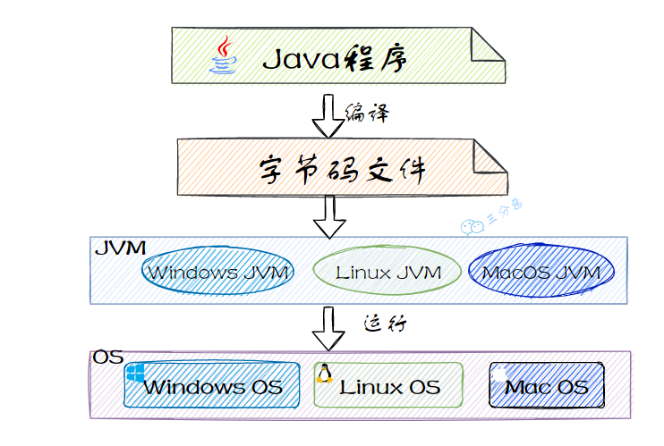

#### 2.说说JVM的其他特性？

1. **垃圾回收**：JVM 自动管理内存，使用垃圾回收机制（GC）清理不再使用的对象，避免内存泄漏。
2. **JIT 编译器**：即时编译器（JIT）将热点代码编译成机器码，缓存后直接执行，提高运行效率。
3. **多语言支持**：JVM 支持多种语言，如 Groovy、Kotlin、Scala 等，这些语言可以与 Java 一起运行。


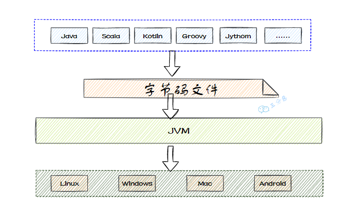

#### 3.JVM的组织架构

1. **类加载器**：负责加载 `.class` 文件，将其转换为 Java 内存中的类对象。

2. **运行时数据区**（内存区域）：JVM 在内存中分配区域处理数据，主要包括：
   - **方法区(元空间）**：**静态编译时产生的数据存储位置**，存储类信息、常量、静态变量等。
   
   - **堆**：**动态运行时产生的数据存储位置**，存储对象和数组。
   
   - **Java虚拟机栈**：**方法调用有关的数据，生命周期较堆更短。**每个线程都有栈，存储局部变量、方法调用信息。
   
   - **程序计数器**：存储当前线程执行的字节码指令地址。
   
   - **本地方法栈**：处理 Native 方法调用（Java调用C/C++方法）。
   
3. **执行引擎**：负责执行字节码指令，包括：
- **解释器**：**执行字节码**。
  
- **JIT 编译器**：将热点**字节码**编译为**机器码**以提高执行效率。
  
- **垃圾回收器**：自动管理内存回收。


### 类加载器

开始介绍类加载器和双亲委派模型之前，简单回顾一下类加载过程。

- 类加载过程：**加载->连接->初始化（实例化）**。
- 连接过程又可分为三步：**验证->准备->解析**。

加载是类加载过程的第一步，主要完成下面 3 件事情：

1. 通过**全类名获取定义此类的二进制字节流**
2. 将字节流所代表的**静态存储结构转换为方法区的运行时数据结构**
3. 在**内存**中生成一个代表该类的 `Class` 对象，作为方法区这些数据的访问入口


#### 1. **有哪些类加载器？分别有什么作用？**

1. **启动类加载器（Bootstrap Class Loader）**
   - **名称**：通常称为 `bootstrap loader` 或 `BSClassLoader`。
   - **作用**：**负责加载 Java 核心类库**（如 `java.lang` 包中的类），这些类库位于 `$JAVA_HOME/jre/lib/rt.jar` 或者是 `$JAVA_HOME/jre/classes` 中。
   - **特点**：它是用原生代码（C/C++）实现的，没有父类加载器。
   - **加载路径**：默认情况下是 `$JAVA_HOME/jre/lib/rt.jar`。
2. **扩展类加载器（Extensions Class Loader）**
   - **名称**：通常称为 `extensions loader` 或 `ExtClassLoader`。
   - **作用**：**负责加载扩展类库**（如 `javax.*` 包中的类），这些类库位于 `$JAVA_HOME/jre/lib/ext` 或者由 `-Djava.ext.dirs` 系统属性指定的位置。
   - **特点**：它是用 Java 实现的，它的父类加载器是 Bootstrap Class Loader。
   - **加载路径**：默认情况下是 `$JAVA_HOME/jre/lib/ext`。
3. **应用程序类加载器（Application Class Loader）**
   - **名称**：通常称为 `application loader` 或 `AppClassLoader`。
   - **作用**：负责**加载用户应用程序**的类，这些类通常位于 `CLASSPATH` 或者由 `-classpath` 命令行参数指定的位置。
   - **特点**：它是用 Java 实现的，默认情况下是用户程序可以显式使用的类加载器。
   - **加载路径**：由 `CLASSPATH` 环境变量或 `-classpath` 命令行参数指定。
4. **用户自定义类加载器（User-defined Class Loaders）**
   - **名称**：用户可以继承 `java.lang.ClassLoader` 类来创建自己的类加载器。
   - **作用**：用户自定义类加载器可以**根据需要加载类，例如从数据库、网络或者其他存储位置加载类**。
   - **特点**：用户自定义类加载器通常继承自 `java.lang.ClassLoader` 类，并重写 `findClass` 方法**来实现自定义的类查找逻辑**。
   - **加载路径**：由具体的实现逻辑决定。


#### 2.什么是双亲委派模型

 如果一个类加载器收到类加载的请求，他首先不会自己去尝试加载这个类，而是把这个请求委派给父类加载器去完成，每一个层次的类加载器都是如此，因此所有的加载请求最终都应该传送到最顶层的启动类加载器中，只有当父加载器反馈自己无法完成这个加载请求时，子加载器才会尝试自己去完成加载。


#### 双亲委派模型执行流程

1. **类加载检查**：系统首先检查类是否已经加载。如果已经加载，则直接返回；如果没有加载，才会继续尝试加载。

2. **委派给父加载器**：类加载器不会自己直接加载类，而是会将加载请求委派给父类加载器（调用父加载器的 `loadClass()` 方法）。

3. **顶层加载器加载**：所有请求最终会被传递到顶层的启动类加载器（`BootstrapClassLoader`）。父加载器首先尝试加载类。

4. **子加载器尝试加载**：如果父加载器不能加载该类（即在其搜索范围内没有找到类），子加载器才会尝试加载类（调用自己的 `findClass()` 方法）。

5. **加载失败**：如果子加载器也无法加载该类，则抛出 `ClassNotFoundException` 异常。

**总结**：**双亲委派模型通过层层委派，确保类的唯一性和安全性，避免重复加载。**

#### 3. **双亲委派的好处?**

**1、防止类的重复加载：**防止内存中出现多份同样的字节码。试想，如果没有双亲委派机制模型而是由各个类加载器自行加载的话，如果用户编写了一个java.lang.Object的同名类并放在ClassPath中，多个类加载器都会去加载这个类到内存中，系统中将会出现多个不同的Object类，那么**类之间的比较结果**及**类的唯一性将无法保证**。

**2、保证程序安全，防止核心API被篡改：**由于所有的用户类都会先通过BootStrap ClassLoder（启动类加载器）查看里面有没有该类资源，有则直接安装或者加载，**从而保证了底层的类一定是预先加载的，这样可以对虚拟机的安全得到了很好的保证。**而不是说我又自己用自定义的类加载器在加载一个object类，这样就出现了两个object类，产生混乱。

#### 4. **怎么实现一个自定义的类加载器？需要注意什么？**

若要实现自定义类加载器，**只需要继承java.lang.ClassLoader类，并且重写其findClass()方法即可**。

#### 5. 怎么打破双亲委派模型

1. 自己写一个类加载器，继承`ClassLoader`。
2. **重写loadClass()方法，打破双亲委派逻辑**
3. 重写findClass()方法，定义自己的加载方式 

#### 6.什么情况下打破双亲委派模型？

双亲委派模型是 Java 类加载器的核心机制，确保类的唯一性和安全性，但在以下情况下需要打破这一模型：

1. **Tomcat加载Web类：**
   **Tomcat 的类加载器** 会优先加载自己的类，而不是委派给父类，从而实现不同 Web 应用间的类隔离。
2. **SPI（Service Provider Interface）：**
   SPI 机制允许运行时动态加载服务实现，例如 **JDBC 驱动的加载**。
   - **启动类加载器**负责加载接口（如 `java.sql.Driver`）。
   - **应用类加载器**负责加载具体的实现类（如 MySQL 驱动、ClickHouse驱动），
     因此，类加载器需要打破双亲委派模型，**允许加载由不同加载器加载的实现类**。

**总结：**
打破双亲委派模型通常是为了特定需求，如实现类的隔离（Tomcat）或动态加载服务实现（SPI）。

### 对象创建过程和类的加载过程

#### **1.说一下Java对象的创建过程？**


Java 对象的创建过程包括以下几个步骤：

1. **类加载检查**：
   - 当遇到 `new` 指令时，JVM 会首先检查**常量池中是否能找到该类的符号引用**，并确保该类已经加载、解析和初始化。如果没有加载过，则执行类加载过程。
2. **内存分配**：
   - JVM 为对象分配内存。对象所需的内存大小在类加载时确定，分配内存的方式有“指针碰撞”和“空闲列表”两种方式，具体选择哪种方式取决于 JVM 堆的布局。
3. **初始化零值**：
   - 在内存分配后，JVM 会为对象的实例字段设置默认零值，确保这些字段在 Java 代码中可以直接使用，无需显式赋值。
4. **设置对象头**：
   - JVM 会设置**对象的元数据**，如**对象所属的类、对象的哈希码、GC 分代年龄**等。这些信息存储在对象头中（如 `MarkWord`），不同的虚拟机状态（如启用偏向锁）会影响对象头的设置。
5. **执行构造函数**：
   - 最后，JVM 执行构造函数 (`<init>` 方法)，初始化对象的属性，并执行构造器中定义的其他逻辑。

#### 2.Java对象一定是在堆上进行分配吗？你有没有了解过逃逸分析技术？

在 Java 中，对象的内存分配通常发生在堆（Heap）上，但并不是所有对象都必须在堆上分配。Java 虚拟机（JVM）提供了几种优化技术，可以在某些情况下将对象分配到栈（Stack）上，以提高性能。其中一种重要的优化技术就是 **逃逸分析（Escape Analysis）**。

**逃逸分析**

逃逸分析是一种用于确定对象生命周期的技术。通过逃逸分析，JVM 可以判断一个对象是否会被多个线程共享，或者是否会在方法调用之外仍然存在。**如果一个对象不会逃逸出当前方法或当前线程，那么它可以被分配在栈上，而不是堆上。**

**逃逸分析的工作原理：**

1. **局部变量分析**：
   - 如果一个对象只在一个方法内部使用，并且不会被其他方法或线程访问，那么这个对象可以被认为是“不逃逸”的。
   - 不逃逸的对象可以被分配在栈上，这样可以减少堆内存的分配和垃圾回收的开销。
2. **标量替换**：
   - 如果一个对象的成员变量可以单独处理，而不需要作为一个整体对象来处理，那么可以将这些成员变量直接分配在栈上，而不是分配整个对象。
   - 这种技术称为 **标量替换（Scalar Replacement）**。
3. **栈上分配**：
   - 如果一个对象被确定为不逃逸，那么它可以被分配在栈上，而不是堆上。
   - 栈上的对象在方法结束时会自动被销毁，不需要垃圾回收器的干预。

**逃逸分析的优势**

1. **减少堆内存分配**：通过将不逃逸的对象分配在栈上，可以减少堆内存的分配，从而降低垃圾回收的频率和开销。
2. **提高性能**：**栈上的对象分配和销毁比堆上的对象更高效**，因为栈上的操作是连续的，不需要复杂的垃圾回收算法。

**逃逸分析的局限性**

1. **复杂性**：逃逸分析的实现较为复杂，需要对对象的生命周期进行精确的分析。
2. **准确性**：逃逸分析的结果依赖于编译器的优化能力，有时可能无法完全准确地判断对象的逃逸情况。

####  3.类加载机制你了解吗？

类加载机制是Java虚拟机（JVM）将类的字节码文件加载到内存并初始化的核心机制，其核心流程可分为**加载、链接（验证、准备、解析）和初始化**三个阶段，同时依托类加载器的层次结构实现动态性与安全性。


类的生命周期从加载到卸载，分为以下7个阶段：

1. **加载**（Loading）：
   - 类加载器从外部存储（如文件系统或网络）加载类的字节码（`.class` 文件），并将其转化为 JVM 能理解的 `Class` 对象。
2. **验证**（Verification）：
   - 对类的字节码进行验证，确保字节码文件的正确性和安全性，验证字节码是否符合 JVM 的规范，不会破坏 JVM 的安全性。
3. **准备**（Preparation）：
   - 为类的**静态变量分配内存并设置默认值**，但不进行初始化。在此阶段，类的静态变量和静态方法会被初始化成默认值。
4. **解析**（Resolution）：
   - 将类中的**符号引用（如方法、字段）解析为直接引用**。这个过程是根据类加载器、符号表和符号引用来完成的。
5. **初始化**（Initialization）：
   - 执行类的**静态初始化代码（包括静态块、静态变量的初始化等）**，在此阶段，静态字段会赋予初始值。
6. **使用**（Using）：
   - 类的实际使用阶段，**即类实例化并执行类的逻辑或方法**。此时，类已经完全准备好，可以用于创建对象或执行方法。
7. **卸载**（Unloading）：
   - **当类不再被使用时，类加载器会将其卸载，释放相关内存**。这个阶段通常会在类不再被引用，且垃圾回收器清理掉相关的 `Class` 对象时进行。

#### 4.Java加载的类什么时候被卸载呢?

Java 类在以下条件全部满足时，才会被卸载：

1. **类的实例被回收**：Java 堆中没有该类的任何实例存在，即该类的所有对象都被垃圾回收。
2. **类加载器被回收**：加载该类的 `ClassLoader` 对象已被垃圾回收。通常，`ClassLoader` 会与应用生命周期一致，当整个 `ClassLoader` 被回收时，其加载的所有类也将失效。
3. **类对象没有引用**：`java.lang.Class` 对象不再有任何引用，无法通过反射等机制访问类的方法和属性。

当上述**三个条件**均满足时，JVM 会在方法区的垃圾回收时卸载该类，这相当于在方法区中清除类的元数据信息，从而终结类的生命周期。

### 内存管理

#### 1.能说一下JVM的内存区域（运行时数据区）吗？

JVM 的内存区域按 Java 虚拟机规范可细分为以下几部分，其中`方法区`和`堆`是**线程共享**的，`Java虚拟机栈`、`本地方法栈`和`程序计数器`是**线程私有**的：

1. **程序计数器 (Program Counter Register)**：
   - **作用**：存储当前线程执行的**字节码指令地址**，控制代码执行顺序。
   - **特点**：线程私有，独立于其他线程，支持分支、循环、异常处理等。
2. **Java 虚拟机栈 (Java Virtual Machine Stack)**：
   - **作用**：存储**方法调用和局部变量**。
   - **特点**：每个方法对应一个栈帧，栈帧中包含**局部变量、操作数栈、动态链接**等信息。线程私有。
3. **本地方法栈 (Native Method Stack)**：
   - **作用**：支持本地方法（C/C++）的执行。
   - **特点**：与虚拟机栈类似，线程私有，支持 JNI 调用。
4. **Java 堆 (Java Heap)**：
   - **作用**：存储**对象实例**，是所有**线程共享**的内存区域。
   - **特点**：几乎所有**对象和数组**在这里分配。垃圾回收在堆中进行。
5. **方法区 (Method Area)**：
   - **作用**：存储已加载的**类信息、常量、静态变量**等。
   - **特点**：线程共享，存储类的结构、方法、常量池等。Java 8 后，方法区移至本地内存的**元空间**（Metaspace）。

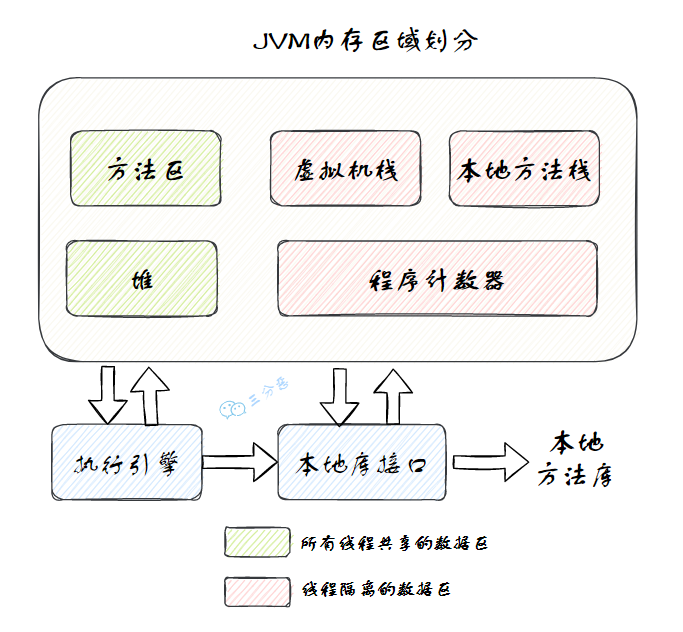

#### 2. **谈谈对堆和栈(Java虚拟机栈)的理解？**

1. **内存分配与共享**
   - **栈**：每个线程独立的内存区域，生命周期和线程相同。用于存储方法调用的局部变量、操作数栈等，是**线程私有**的。
   - **堆**：所有线程共享的内存区域，用于存储对象实例。堆中的对象可以被多个线程访问，是**线程共享**的。

2. **存储内容**
   - **栈**：存储基本数据类型和对象的引用（指向堆中的对象）。生命周期短，随着方法调用结束自动释放。
   - **堆**：存储对象实例和数组等。对象的生命周期较长，由垃圾回收机制管理，直到不再被引用。

3. **作用与特点**
   - **栈**：管理程序的执行顺序，存储每个方法调用的局部变量和方法执行的状态。**快速、高效**。
   - **堆**：为所有对象实例分配内存，解决数据存储和共享问题。所有线程可以访问堆中的对象。

4. **生命周期与管理**
   - **栈**：**生命周期与线程相同**。每个线程在创建时分配栈，线程结束时栈自动释放。栈管理简单，方法入栈、出栈。
   - **堆**：**生命周期从 JVM 启动到关闭**。由垃圾回收机制管理，自动回收不再被引用的对象。


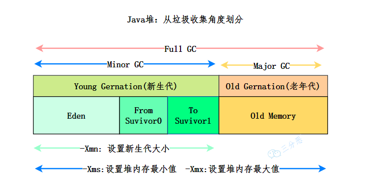

#### 3. **谈谈对内存泄漏的理解？** 

**内存泄漏指的是程序中存在一些不再使用却没有被垃圾回收的对象**。其特点是：

1. **可达**：对象可以被访问或引用。
2. **无用**：这些对象在程序中不再被使用。

内存泄漏会导致内存资源无法释放，最终可能导致程序崩溃。

#### 4. **内存泄漏的原因和案例？** 

**长生命周期的对象持有短生命周期对象的引用就很可能发生内存泄漏（ThreadLocal）**，尽管短生命周期对象已经不再需要，但是因为长生命周期持有它的引用而导致不能被回收。

1. **静态集合类：**静态集合类的生命周期与整个程序一致，如果它们引用了其它对象，则有可能造成内存泄漏；
2. **监听器：**释放对象的时候没有删除监听器；
3. **各种连接：**比如数据库连接（dataSourse.getConnection()），网络连接(socket) 和 IO 连接，除非其显式的调用了其 close() 方法将其连接关闭，否则是不会自动被 GC 回收的；
4. **单例模式：**单例对象在初始化后将在 JVM 的整个生命周期中存在（以静态变量的方式），如果单例对象持有外部的引用，那么这个对象将不能被 JVM 正常回收，导致内存泄漏。

### **垃圾回收的判断/引用问题**

从以下几个方面展开：

- JVM运行时数据区（堆、方法区、本地方法栈、Java虚拟机栈...）
- 判断垃圾回收的算法（可达性分析）
- 堆内存分代（新生代、老年代）
- 垃圾收集算法（标记-清除、复制、标记-整理）
- 垃圾收集器
- 内存分配和垃圾回收策略（Minor GC, Full GC）

如何判断对象是否死亡（两种方法）

#### 1. **垃圾回收的流程是什么** 

垃圾回收的过程从**Java栈**（栈帧）开始。**Java栈**存储着方法的局部变量，包括对象引用。如果这些引用指向的对象依然被使用，垃圾回收器就不会回收它们。

具体来说，垃圾回收的过程如下：

1. **从栈开始**：垃圾回收器会检查每个线程的栈，栈中的局部变量表包含了对对象的引用。通过这些引用可以**确定哪些对象仍然被使用**。

2. **遍历GC Roots**：垃圾回收从GC Roots（如虚拟机栈中的引用、类的静态属性、常量等）开始，沿着对象的**引用链**进行**可达性分析**。

3. **标记不可达的对象**：如果某个对象无法通过任何引用链从GC Roots访问到，就认为它是**不可达的**，可以回收。

4. **回收不可达对象**：回收器会对这些不可达的对象进行回收，释放它们占用的内存。

总结：**垃圾回收从Java栈开始，检查栈中保存的对象引用，然后通过GC Roots可达性分析找到所有未被引用的对象进行回收。**

#### 2. **判断垃圾可以回收的方法有哪些（死亡对象判断方法）？有什么优缺点？**

堆中几乎放着所有的对象实例，对堆垃圾回收前的**第一步就是要判断哪些对象已经死亡**（即不能再被任何途径使用的对象）。判断死亡对象共有两种方法：1.引用计数法 2.可达性分析。

##### 引用计数法

给每个对象分别添加一个引用计数器：

- 每当有一个地方引用它，计数器就加 1；
- 当引用失效，计数器就减 1；
- 任何时候计数器为 0 的对象就是不可能再被使用的死亡对象。

**这个方法实现简单，效率高，但是目前主流的虚拟机中并没有选择这个算法来管理内存，其最主要的原因是它很难解决对象之间循环引用的问题。**

**循环引用** 是指两个或多个对象相互引用形成闭环，导致它们的引用计数永远不会为零，即使它们不再被使用，于是引用计数算法无法通知 GC 回收器回收他们。


##### 可达性分析

这个算法的基本思想就是通过一系列的称为 **“GC Roots”** 的对象作为起点，从这些节点开始向下搜索，节点所走过的路径称为引用链，当一个对象到 GC Roots 没有任何引用链相连的话，则证明此对象是不可用的，需要被回收。

下图中的 `Object 6 ~ Object 10` 之间虽有引用关系，但它们到 GC Roots 不可达，因此为需要被回收的对象。


**哪些对象可以作为 GC Roots 呢？**

- 虚拟机栈(栈帧中的局部变量表)中引用的对象
- 本地方法栈(Native 方法)中引用的对象
- 方法区中**类静态属性**引用的对象
- 方法区中**常量**引用的对象
- 所有被**同步锁**持有的对象
- JNI（Java Native Interface）引用的对象

**总结**

- **引用计数法**实现简单，但无法处理**循环引用**问题。
- **可达性分析**算法更为复杂但可以有效判断**所有不可达的对象**，并且可以处理循环引用的情况。

#### 3 **被标记为垃圾的对象一定会被回收吗？** 

即使对象在可达性分析中被标记为不可达，它也不会立即被回收。垃圾回收需要经过两次标记过程，确保对象确实不再需要使用：

1. **第一次标记**：当对象无法通过GC Roots访问到时，标记为**不可达**。此时，它被视为“垃圾”，准备进行回收。
2. **第二次标记**：在第一次标记后，垃圾回收器会判断是否需要执行`finalize()`方法。
   - **如果不需要执行`finalize()`**：对象直接被回收。
   - **如果需要执行`finalize()`**：执行`finalize()`方法，该方法提供了对象在销毁前进行清理和恢复引用的机会。如果`finalize()`方法中成功**恢复**了与引用链的关系，该对象将避免被回收。

总结：被标记为垃圾的对象，不一定立刻回收，必须经过两次标记和`finalize()`方法的判断后，才能最终决定是否回收。

#### 4. **谈谈对 Java 中引用的了解？** 

Java 中有四种类型的引用，按引用强度依次递减：

1. **强引用**：如 `Object obj = new Object()`，只要强引用存在，对象就不会被回收。
2. **软引用**：适用于描述**非必须**的对象。当内存不足时，JVM 会尽量回收这些对象，**只有在内存溢出之前才会被回收**。
3. **弱引用**：比软引用更弱。弱引用关联的对象会在下次垃圾回收时被回收，不管内存是否足够。
4. **虚引用**：用于**追踪垃圾回收过程**，虚引用不会影响对象的生命周期。对象在被垃圾回收前，如果有虚引用，会在引用队列中注册，用于获取回收的通知。

**引用队列**：用于**存储非强引用的对象**，表示这些对象**即将被回收**，方便开发者处理对象回收前的清理工作。

### 垃圾回收算法

#### 1. **常用的垃圾收集算法有哪些？各自的优缺点是什么？** 

**复制算法 (Copying)**：

- **过程**：内存分为两块，每次使用一块，回收时将存活对象复制到另一块，清理原内存。
- **优点**：没有内存碎片。
- **缺点**：内存利用率只有50%。
- **应用**：常用于**新生代**回收。HotSpot虚拟机使用**Eden区和两个Survivor区**，比例为 8:1，空间利用率高。

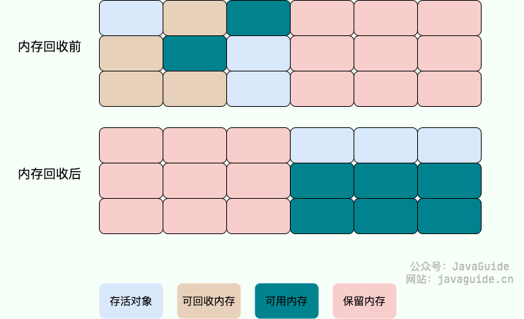

**标记-整理算法 (Mark-Compact)**：

- **过程**：标记存活对象后，将它们移动到一端，清理非存活对象。
- **优点**：不会产生内存碎片。
- **缺点**：需要移动对象，效率较低。


**标记-清除算法 (Mark-Sweep)**：

- **过程**：从 GC ROOT 开始，标记所有存活对象，最后回收未标记的对象。
- **优点**：不需要移动对象，只回收不存活的对象。
- **缺点**：效率低，容易产生内存碎片。


**分代收集算法**：

- **核心思想**：根据对象生命周期将堆内存分为**老年代**和**新生代**，不同区域使用不同算法。
- **新生代**：采用**复制算法**，每次回收大量短生命周期对象。
- **老年代**：采用**标记-清除或标记-整理算法**，回收较少的长期存活对象。

#### 2.分代收集下的新生代和老年代应该采用什么样的垃圾回收算法？

在现代JVM中，垃圾回收采用**分代收集算法**，将内存分为新生代和老年代，根据对象生命周期选择不同回收策略：

1. **新生代**：对象生命周期短，回收时大多数对象被回收，采用**复制算法**。  
   - **原理**：将内存分为Eden区和两个Survivor区，存活对象复制到另一个Survivor区，清理之前的区域。  
   - **优点**：避免内存碎片，高效回收。

2. **老年代**：对象生命周期长，对象存活率高，被清除的对象少，采用**标记-清除算法**或**标记-整理算法**。  
   - **标记-清除算法**：标记存活对象，清理未标记的对象。  
   - **标记-整理算法**：标记存活对象后，将它们移动到一端，避免内存碎片。

#### 3.**详细说下垃圾回收策略？/ 垃圾回收时机？** 

- **Minor GC（新生代回收）**

  - **触发条件**：新生代的Eden区满时触发。
  - **过程**：对象分配在Eden区，Eden区满时进行Minor GC，回收新生代的Eden和Survivor区。
  - **空间分配担保**：在Minor GC**之前**检查老年代空间。如果空间不足，触发**Full GC**。

  **Full GC（全堆回收）**

  - **触发条件**：老年代空间不足时触发。
  - **过程**：**回收整个堆（新生代、老年代和永久代）**，耗时较长，应尽量减少Full GC。

**垃圾回收过程细节**

1. **对象分配**：大多数对象分配在Eden区，Eden区满时触发Minor GC。
2. **大对象直接分配到老年代**：如长字符串、大数组等，避免在Eden和Survivor区间的频繁复制。
3. **长期存活对象晋升到老年代**：对象在Eden区存活并经过若干次Minor GC后，进入Survivor区，若存活足够长，转移到老年代。
4. **动态调整晋升条件**：当Survivor区空间不足时，年龄大于一定值的对象直接进入老年代。
5. **老年代空间不足时**：触发Full GC，先进行Minor GC尽量减少新生代内存，避免频繁触发Full GC。

#### 4.为什么分代年龄阈值是15？

JVM中对象的GC年龄存储在对象头里，对象头有4个bit位用于存储GC年龄，因此最大值是15。所以，分代年龄的上限是15次，这是由对象头的存储限制决定的。


### 垃圾收集器

#### 1. **常用的垃圾收集器有哪些？**


垃圾收集器可以按是否支持多线程和是否并发运行来分类。常用的**7**种收集器通过不同组合应用于新生代和老年代。它们主要特性如下：

- **单线程与多线程**：单线程垃圾收集器使用一个线程工作，多线程垃圾收集器可以并发多个线程来提升效率。
- **并发与并行**：并行指多个垃圾收集线程同时工作，但用户线程仍会暂停；并发则指垃圾回收和用户程序同时运行，通常依赖多核CPU支持。这类收集器包括CMS和G1。

##### 垃圾收集器一览

1. **Serial 收集器（复制算法)**

   新生代单线程收集器，标记和清理都是单线程，优点是简单高效。是 client 级别默认的 GC 方式，可以通过 `-XX:+UseSerialGC` 来强制指定。

2. **Serial Old 收集器（标记-整理算法）**

   老年代单线程收集器，Serial 收集器的老年代版本。主要是在 client 场景下使用，如果在 server 环境下使用，主要有两种用途：
   
   1. 在 JDK1.5 版本之前与 Parallel Scavenge 收集器配合使用；
   2. 作为 CMS 收集器的后备预案，在并发收集发生 Concurrent Mode Failure 时使用。

3. **ParNew 收集器（复制算法）**

   新生代收集器，可以认为是 Serial 收集器的多线程版本，在多核 CPU 环境下有着比 Serial 更好的表现。是 server 级别默认采用的 GC 方式。

4. **Parallel Scavenge 收集器（复制算法）**

   并行收集器，追求 **高吞吐量**，高效利用 CPU，而其他收集器的目标一般是尽可能缩短停顿时间。吞吐量一般为 99%， 吞吐量 = 用户线程时间 / (用户线程时间 + GC 线程时间)，也就是用户程序时间占总时间的比值。

   

   停顿时间越短越适合与用户交互。而 **高吞吐量** 可以高效率地利用 CPU 时间，尽快完成运算任务，所以 Parallel Scavenge **适合后台应用等对交互响应**要求不高的场景。可用 `-XX:+UseParallelGC` 来强制指定，用 `-XX:ParallelGCThreads=4` 来指定线程数。

   可以通过打开 `-XX:+UseAdaptiveSizePolicy` 开启 **自适应 GC 调节策略**，自动调整吞吐量和停顿时间。

5. **Parallel Old 收集器（标记-整理算法）**

   Parallel Scavenge 收集器的老年代版本，并行收集器，吞吐量优先。

6. **CMS (Concurrent Mark Sweep) 收集器（标记-清除算法）**

   是一种并发垃圾收集器。采用标记-清除算法。具有**高并发，追求最短停顿时间**的特点。收集过程分为以下四个阶段：

   - **初始标记**：对 GC ROOT 直接相关联的对象进行标记，需要停顿；
   - **并发标记**：执行 GC ROOT Tracing 的过程，在整个回收过程中耗时最长，不需要停顿；
   - **重新标记**：修正在并发标记过程中因为用户线程继续运行而造成变动的那部分标记记录，需要停顿（STW）；
   - **并发清除**：不需要停顿。

   整个过程中耗时最长的并发标记和并发清除阶段不需要停顿，所以整体来说 CMS 收集器的收集线程是可以和用户线程并发执行的。

   

   **缺点：**

   1. 牺牲了吞吐量。低停顿时间是以牺牲吞吐量为代价的，CPU 利用率不够高。
   2. 无法处理浮动垃圾，可能会发生 Concurrent Mode Failure。CMS 并发清理阶段用户线程也在运行，这期间产生的垃圾出现在初始标记之后，因此无法在当次垃圾回收中处理，只能留在下一次垃圾回收进行处理，这种垃圾就叫做 **浮动垃圾**。

      因为浮动垃圾的存在，CMS 不能像其他收集器那样等待老年代快满时才进行回收，而是要预留出一部分空间给并发标记阶段。当预留的内存不够存放浮动垃圾时，就会出现 Concurrent Mode Failure，这时虚拟机会临时启用 Serial Old 来替代 CMS。

   3. 标记-清除算法会产生内存碎片。会出现老年代空间剩余，但是无法找到足够大的连续内存空间来分配给当前对象，从而触发一次 Full GC。

7. **G1 收集器（整体：标记-整理算法、局部：复制算法）**

   是一种面向服务端应用的垃圾收集器，在多 CPU 和大内存场景下具有很好的性能。

   G1 把堆分成多个大小相等的独立区域 **Region**，新生代和老年代 **不再是物理隔离** 的了。

   

   通过引入 Region 的概念，将原来的一整块内存空间划分为多个小空间，每个小空间可以单独进行垃圾回收。这种划分方法带来了很大的灵活性，可以 **建立停顿时间预测模型**。还可以记录每个 Region 进行垃圾回收的时间以及回收所获得的空间，并维护一个 **优先级列表**，每次根据允许的收集时间，**优先回收价值最大的 Region**。


#### 2. **谈谈 CMS 和 G1 的区别？** 

**使用范围**

- **CMS**：专注于老年代垃圾收集，需与新生代的Serial/ParNew收集器配合使用。
- **G1**：同时负责新生代和老年代的垃圾收集，不需配合其他收集器。

**STW（Stop the World）时间**

- **CMS**：以**最小化停顿时间为目标**，为了尽可能的低延迟，可以选用CMS。
- **G1**：能够**预测和控制停顿时间**，提供更精确的停顿时间管理。

**垃圾碎片**

- **CMS**：使用**标记-清除**算法，容易产生内存碎片。
- **G1**：使用**标记-整理**算法，减少内存碎片。

**回收过程差异**

- **CMS**：包含初始标记、并发标记、重新标记和并发清除阶段。
- **G1**：包括初始标记、并发标记、最终标记和筛选回收阶段，具有更好的回收优化。

### JVM调优

#### 1.JVM参数

JVM 参数用于调整 Java 虚拟机的运行环境，主要涉及内存、线程等配置。以下是一些常用的 JVM 参数及其作用：

1. **-Xms**: **设置初始堆内存大小。**
   - 定义 JVM 启动时分配的堆内存大小，影响应用启动速度和内存占用。
2. **-Xmx**: **设置最大堆内存大小**。
   - 定义 JVM 最大可用堆内存，超出限制会抛出 `OutOfMemoryError`。
3. **-Xss**: 设置每个线程的栈大小。
   - 控制每个线程栈的内存分配，影响可创建线程的数量。
4. **-XX:NewRatio**: 设置新生代与老年代的堆内存比例。
   - 默认值为 1:4，影响堆内存分配。
5. **-XX:SurvivorRatio**: 设置 Eden 区和 Survivor 区的内存比例。
   - 默认 Eden 区和 Survivor 区比例为 8:1。

#### 2.常用工具

**`jps`**: 查看所有 Java 进程的状态、启动类、传入参数和 JVM 参数，显示当前所有 Java 进程的 PID。

**`jstat`**: 收集 HotSpot **虚拟机**运行数据。

- **`jstat -gc pid`**: 查看垃圾回收各区域使用情况。
- **`jstat -gcutil pid`**: 显示堆内存使用的百分比。
- **`jstat -class pid`**: 显示类加载器行为数据。

**`jinfo`**: 显示虚拟机配置信息。

**`jmap`**: 生成堆转储快照。

- **`jmap -dump[:live] pid`**: 导出 JVM 堆内容。
- **`jmap -heap pid`**: 显示堆内存概要信息。
- **`jmap -histo pid`**: 打印类实例数量和内存占用。

**`jhat`**: 分析 heapdump 文件，提供浏览器查看结果的功能。

**`jstack`**: 生成虚拟机当前**线程堆栈**快照。

- **`jstack pid`**: 查看指定 PID 的线程堆栈。

**`jconsole`**: 提供 JVM 图形化视图，监控堆、线程、类和 GC 活动，检测死锁。

**`jvisualvm`**: 图形界面工具，用于监控和分析 JVM 堆转储。

#### 3.OOM排查？什么时候出现OOM异常？

当 Java 应用程序在运行过程中耗尽了可用的内存资源时，就会出现 OOM 异常。具体来说，OOM 异常通常发生在以下几个场景：

- **Java 堆溢出（Heap Overflow）**
- **虚拟机栈和本地方法栈溢出（Stack Overflow）**
- **方法区和运行时常量池溢出（PermGen 或 Metaspace Overflow）**
- **本机内存溢出（Native Memory Overflow）**

**可能的原因**

1. **堆的内存分配不合理**：
   - 分配给堆的内存太小，不足以支撑应用程序的需求。
   - 不合理的内存分配策略导致内存碎片化严重，有效可用内存减少。
2. **内存载入数据量太大**：
   - 应用程序一次性加载了大量数据，超过了堆的容量。
   - 数据结构设计不合理，导致内存使用效率低下。
3. **内存泄漏无法垃圾回收**：
   - 存在不再使用的对象，但由于某些引用的存在，垃圾回收器无法回收这些对象。
   - 程序中的某些逻辑错误导致对象无法被正确释放。
4. **其他原因**：
   - 外部资源（如文件句柄、数据库连接等）没有正确关闭，导致系统资源耗尽。
   - 系统级的资源限制（如操作系统的文件句柄限制）。

**怎么排查**

1. **使用 `jmap` 和 `jstat` 工具查看堆栈日志**：
   - **`jmap`**：
     - 使用 `jmap -dump[:live] pid` 生成当前 JVM 堆的 dump 文件。
     - 使用 `jmap -histo pid` 查看每个类的实例数量和内存占用情况。
     - 使用 `jmap -heap pid` 查看堆内存的使用情况，包括 Eden、From、To 和 Old 区域。
   - **`jstat`**：
     - 使用 `jstat -gc pid` 查看垃圾回收的详细信息，包括各个区域的使用情况、垃圾回收次数和消耗时间。
     - 使用 `jstat -gcutil pid` 查看垃圾回收后的堆内存使用情况，以百分比形式展示。
2. **使用 `jps` 查看 Java 进程状态**：
   - 使用 `jps` 查看所有 Java 进程的启动类、传入参数和 Java 虚拟机参数等信息。
   - 确认进程的内存配置是否合理。
3. **使用 `jstack` 生成线程快照**：
   - 使用 `jstack pid` 查看当前 PID 的线程情况。
   - 分析是否有线程长时间阻塞或处于等待状态。
4. **使用 `jconsole` 和 `VisualVM` 工具进行图形化监控**：
   - 使用 `jconsole` 提供的图形化界面查看 JVM 的活动，包括堆、线程使用、类的使用和 GC 活动等。
   - 使用 `VisualVM` 监控 JVM 的图形界面工具，分析 JVM 堆转储。
5. **分析日志文件**：
   - 查看应用程序的日志文件，寻找异常信息或警告提示。
   - 分析 GC 日志，确认是否有频繁的垃圾回收或长时间的 Full GC。
6. **调整 JVM 参数**：
   - 根据分析结果调整 JVM 参数，如增加堆大小 (`-Xms`, `-Xmx`)、调整新生代和老年代的比例 (`-XX:NewRatio`)、调整垃圾收集器等。

#### 4.CPU使用率过高排查？Java进程占用CPU达到100%是什么原因？ 怎么解决？

**Linux 排查步骤**

1. **定位高CPU进程**：
   - 使用 `top` 命令查看系统中各个进程的 CPU 使用情况。
2. **定位高CPU线程**：
   - 使用 `top -Hp [PID]` 命令查看某个 Java 进程中所有线程的 CPU 使用情况。
3. **查看当前线程堆栈状态**：
   - 使用 `jstack [PID]` 命令查看当前线程的堆栈状态。
4. **分析堆栈信息**：
   - 分析 `jstack` 输出的 thread dump 文件，找到导致高 CPU 占用的线程，并进一步诊断问题所在。

**原因与解决方案**

1. **死循环或死锁**：
   1. **原因：**程序中存在无限循环或多个线程之间发生了死锁，导致 CPU 资源被持续占用。
   2. **解决方案：**添加循环退出条件，检查锁竞争顺序，使用`tryLock`+超时机制避免死锁
2. **某些操作一直占用 CPU**：
   1. **原因：**某些计算密集型的操作一直在执行，没有给其他线程或任务释放 CPU 时间的机会。
   2. **解决方案：**通过容器化或进程隔离，限制CPU核分配，将耗时计算拆分到独立线程或消息队列，避免阻塞主线程。
3. **快速创建大量临时变量，导致频繁触发 GC**：
   1. **原因：**应用程序中频繁创建和销毁大量临时对象，导致垃圾回收（GC）频繁发生，从而消耗大量 CPU 资源。
   2. **解决方案：**使用对象池、重用对象（如`StringBuilder`代替`String`拼接），增大堆内存（`-Xmx`）、调整新生代比例（`-XX:NewRatio`）。

#### 5.线程池满了怎么排查？

线程池满了通常意味着线程池中的线程数量达到了最大值，导致新的任务无法被调度执行。这种情况可能会**导致任务积压，进而影响应用程序的性能**甚至导致服务不可用。

以下是一些**排查步骤**：

1. **日志分析**：
   - 查看应用程序的日志文件，寻找有关线程池的相关信息或异常提示。
   - 确认是否有与线程池相关的警告或错误日志，特别是关于线程池拒绝新任务的信息。
2. **线程 dump 分析**：
   - 使用 `jstack` 工具执行线程 dump 操作，获取线程的堆栈信息和执行状态。
   - 分析线程 dump 文件，检查是否存在大量等待状态的线程（如 `WAITING`、`BLOCKED` 等状态）。
   - 确认是否有死锁或线程挂起的情况。
3. **利用性能分析工具**：
   - 使用如 VisualVM、JProfiler 等性能分析工具实时查看线程的运行状态。
   - 通过这些工具提供的可视化界面，可以直观地看到线程池的工作情况，包括线程的状态分布、CPU 使用情况等。
   - 分析线程池中的线程数量、活跃线程数量、等待队列长度等指标。
4. **调整线程池参数**：
   - 根据分析结果调整线程池的参数，如最大线程数 (`maxPoolSize`)、核心线程数 (`corePoolSize`)、队列大小 (`workQueue`) 等。
   - 确认线程池的拒绝策略是否合适，如 `AbortPolicy`、`CallerRunsPolicy` 等。
5. **检查任务执行时间**：
   - 分析任务执行的时间，确认是否有耗时较长的任务导致线程长时间占用。
   - 考虑是否可以通过异步处理或优化任务逻辑来减少任务执行时间。
6. **检查系统资源**：
   - 检查系统资源（如 CPU、内存）是否充足，排除因系统资源不足而导致的线程池满的情况。
   - 使用 `top`（Linux）或 `Task Manager`（Windows）检查系统的整体资源使用情况。

#### 6.JVM内存分配

主要内存区域

1. **堆（Heap）**：
   - 存放所有对象实例。
   - 分为年轻代（Young Generation）和老年代（Old Generation）。
2. **方法区（Method Area）**：
   - 存放类信息、常量、静态变量等数据。
3. **程序计数器（Program Counter Register）**：
   - 记录当前线程执行的字节码指令位置。
4. **Java 虚拟机栈（Java Virtual Machine Stack）**：
   - 描述 Java 方法执行的内存模型，每个方法执行时创建一个栈帧。
5. **本地方法栈（Native Method Stack）**：
   - 与 Java 虚拟机栈类似，但用于执行 Native 方法。

内存分配策略

1. **对象分配**：
   - 新对象首先在年轻代的 Eden 区分配内存。
   - 如果 Eden 区空间不足，触发 Minor GC。
   - 经历多次 Minor GC 后仍然存活的对象将被移动到 Survivor 区或晋升到老年代。
   - 大对象直接在老年代分配内存。
2. **内存分配担保**：
   - 如果 Eden 区分配失败，检查老年代是否有足够空间直接担保分配。
   - 如果老年代空间不足，触发 Full GC。
3. **栈帧分配**：
   - 每次方法调用创建一个新的栈帧。
   - 方法调用结束后销毁对应的栈帧。

#### 7.频繁GC怎么排查

排查工具

- **`jstat`**：这是 JDK 自带的一个命令行工具，用于监控 JVM 的垃圾回收统计信息。您可以使用 `jstat -gc <pid>` 命令查看有关 Java 进程的实时 GC 数据。
- `VisualVM`：这是一个可视化的 JVM 监控和分析工具，可以显示 Java 应用程序的内存使用情况、垃圾回收活动、线程状态等。您可以使用 VisualVM 的内置插件 Visual GC 查看和分析 GC 日志。

可能的问题

1. **内存分配不足**：
   - 如果 Java 堆内存分配不足，可能会导致频繁的 Full GC。您可以尝试增加堆内存大小（使用 `-Xmx` 参数）以减少 Full GC 的频率。
2. **内存泄漏**：
   - 内存泄漏可能导致可用内存不断减少，从而导致频繁的 Full GC。您需要检查应用程序代码以找到并修复内存泄漏。
3. **不合适的 GC 策略**：
   - 使用不合适的 GC 策略可能导致频繁的 Full GC。您可以尝试更改 GC 策略（例如，使用 G1 垃圾收集器）以提高垃圾回收性能。
4. **大对象或长期存活对象**：
   - 大对象或长期存活对象可能导致老年代（Old Generation）空间不足，从而导致频繁的 Full GC。您可以调整堆内存的分配比例（使用 `-XX:NewRatio` 参数）或者优化应用程序代码以减少大对象和长期存活对象的创建。

## 操作系统

### 基本概念

#### 1. 操作系统是什么，有什么功能？

​	操作系统是计算机系统中管理硬件和软件的中间层，**屏蔽了硬件的复杂性**，为应用程序提供便捷的交互方式。

​	操作系统的主要功能：

1. **CPU管理**：负责管理进程。进程和线程是对CPU的抽象。
2. **内存管理**：内存分配资源。
3. **外存管理**：管理文件。文件是对存储系统的抽象。
4. **IO管理**：打印机，键盘鼠标等设备，以及网络IO。

#### 2. 进程上下文切换是什么

​	操作系统在多进程处理情况下，为了保持并发，将CPU从一个进程切换到另一个进程的操作。需要把当前进程的状态保存到寄存器，然后切换，换回来的适合从寄存器获取刚才的状态。

### 内核态与用户态✅

操作系统划分内存为**用户空间**和**内核空间**，当程序使用用户空间时处于**用户态**，使用内核空间时处于**内核态**。用户态相较于内核态有较低的执行权限。

**为了保障操作系统的安全**，一些比较重要的权限，如**进程管理，进程通信，设备管理， 主存管理**只有在内核态下才能进行。当需要这些操作时就需要通过**系统调用**由**用户态进入内核态**。

**用户态内核态转换开销大的原因：**系统调用时，需要**保存上下文到寄存器**中，恢复到用户态时，**需要恢复上下文**。

在操作系统中，用户态（User Mode）和内核态（Kernel Mode）是两种不同的执行模式，它们主要用于保**护系统资源的安全性和稳定性**。

### 进程与线程

#### 1. **进程和线程的基本概念？**   ✅

这些是对CPU的抽象

**进程：**进程是一个程序的一次执行过程，是**系统进行资源分配和调度**的基本单位。每个进程都有独立的地址空间、数据栈和其他辅助资源，进程之间相互独立。

**线程：** **线程是进程内的一个执行单元或执行路径**，是**CPU调度和分派的基本单位**。一个进程中可以包含一个或多个线程，这些线程共享进程的资源，如**内存地址空间、文件描述符**等。

**协程：**协程是一种用户态的轻量级线程，允许在不同的任务之间进行**更细粒度的控制和切换**，省去了频繁的内核态用户态之间的转换。 -- Java新版本中叫虚拟线程

---

#### 2. **进程与线程的区别？**   ✅

1. **粒度**：线程是进程划分成的更小的运行单位，一个进程在其执行的过程中可以产生多个线程。**进程是资源分配的最小单位，而线程是CPU调度的最小单位**；
2. **地址空间独立性和资源保护**：不同**进程**地址空间**相互独立**，同一进程内的**线程**共享地址空间，可能**相互影响**。一个进程的线程在另一个进程内是不可见的；**进程利于资源保护，线程相反。** 
3. **开销**：**进程开销大**，创建进程或撤销进程，系统都要为之分配或回收资源。

#### 3. **为什么有了进程，还要有线程呢？**   ✅

|          | 进程                   | 线程                                                         |
| -------- | ---------------------- | ------------------------------------------------------------ |
| 创建开销 | 大                     | 小                                                           |
| 地址空间 | 隔离，利于资源保护     | 共享，通信不用内核（但是仍然是操作系统管理，线程是os级概念，协程是程序级概念） |
| 切换     | 需要上下文切换，开销大 | 开销小（但是也是由操作系统切换）                             |
| 并发度   | 低                     | 高                                                           |

- **线程共享的地址空间，到底是什么**：可以看虚拟内存分布模型，实际上线程共享数据段、代码段、打开的文件等，但是线程的寄存器和栈是私有的（类比JVM）。


- **进程切换**是一个**开销很大**的操作，线程切换的成本较低。
- 线程更轻量，一个进程可以创建多个线程，当两个线程是属于同一个进程，因为虚拟内存是共享的，所以在切换时，虚拟内存这些资源就保持不动，只需要切换线程对私有数据、寄存器等不共享的数据。
- 多个线程可以**并发处理不同的任务**，更有效地利用了**多处理器和多核计算机**。而进程只能在一个时间干一件事，如果在执行过程中遇到阻塞问题比如 IO 阻塞就会挂起直到结果返回。
- 同一进程内的**线程共享内存和文件**，因此它们之间相互通信**无须调用内核**（但是内核线程还是要内核来创建等管理的，只是创建时可以共享虚拟地址空间的一些信息，Java线程就是内核线程，Go协程不是内核线程）。

#### 4. PCB是什么，包含哪些信息

- PCB（Process Control Block），进程控制块，操作系统中用来管理和跟踪进程的数据结构。
- 包含信息：
  - 进程的**描述信息**：名称，标识符等。
  - 进程的**调度信息**：阻塞原因，进程状态等。
  - 进程**对资源的需求情况**：CPU时间，内存空间，<font color='red'>页表</font>，IO设备等。
  - **进程虚拟空间的堆栈，CPU调度进程时的寄存器内容；这些信息在进程切换时会保存。**

#### 5. 进程有哪几种状态。5种。


- **创建状态new**：被创建，未就绪。
- **就绪状态ready**：就绪准备运行状态，等待CPU分配时间片。
- **阻塞状态waiting**：等待某一事件而暂停运行，比如等待某共享资源可用或者等待IO。
- **运行状态running**：分配到了CPU时间片，正在处理器上运行。
- **结束状态terminated**

#### 6. **进程间的通信方式有哪些？7种。**    ✅

- 进程间通信概念：每个进程各自有**不同的用户地址空间**，任何一个进程的全局变量在另一个进程中都看不到，所以进程之间要交换数据必须通过内核，**在内核中开辟一块缓冲区**，进程1把数据从用户空间拷到内核缓冲区，进程2再从内核缓冲区把数据读走，内核提供的这种机制称为**进程间通信（IPC，InterProcess Communication）**。IPC方式包括7种，管道/匿名管道，命名管道，消息队列，共享内存，信号，信号量，套接字。


+ **匿名管道**
  1. 它是半双工的，具有固定的读端和写端；
  1. 由于没有名字，它**只能用于父子进程**之间的通信；
  1. 它可以看成是一种特殊的文件，对于它的读写也可以使用普通的read、write等函数。但是它不是普通的文件，并不属于其他任何文件系统，并且**只存在于内存中**，因此不同进程没法找到同一个匿名管道。
  1. 如果**没写满，则不允许读**。如果**没读空，就不允许写**，效率低。
  1. linux命令中`|`就是一种匿名管道，表示前一个命令的输出是后一个命令的输入。

```shell
cat a.txt | grep "hahaha"
```


+ **命名管道(FIFO)**

  1. FIFO因为有名字（即关联了路径名），可以在**无关的进程**之间交换数据，与无名管道不同，FIFO代表**先进先出**；
  2. FIFO有路径名与之相关联，它以一种特殊设备文件形式存在于文件系统中，因此可以在无关进程之间通信。
  3. 如果**没写满，则不允许读**。如果**没读空，就不允许写**，效率低。

  

+ **消息队列**

  **解决了管道传输效率低的问题，异步传输**。

  1. 存放在**内核**中的消息**链表**。消息队列的消息有固定消息体。
  2. 消息队列独立于发送与接收进程。进程终止时，消息队列及其内容并不会被删除；
  3. 消息队列可以实现消息的随机查询，消息不一定要先进先出的次序读取，也可以按消息的类型读取。
  4. **缺点是消息体有长度限制；使用需要用户态到内核态转换**


- **共享内存**
  1. 现代操作系统都采用虚拟内存方式管理内存，将进程的虚拟内存地址映射到物理内存地址上。只需要两个进程拿出一部分虚拟内存地址，映射到同一块物理内存地址上，就实现了共享内存。	
  2. **共享内存是最快的一种IPC**，因为进程将共享内存区域映射到自己的私有地址空间，是直接对内存进行存取。
  3. **缺点是多个进程竞争时可能产生错乱**

+ **信号量**
  1. **在共享内存中，有可能出现错乱的情况，因此引入信号量进行并发控制。**
  2. 信号量（类似java semaphore）是一个计数器。用于实现多个进程间的**互斥与同步**，而不是用于存储进程间通信数据；
  3. 信号量用于进程间同步，若要在进程间传递数据需要结合共享内存；
  4. 信号量基于操作系统的 PV 操作，程序对信号量的操作都是原子操作；
  5. 每次对信号量的 PV 操作不仅限于对信号量值加 1 或减 1，而且可以加减任意正整数；
  6. 支持信号量组。

----

- **信号**

  1. 以上都是进程正常工作下的通信方式，信号是异常情况下的工作方式。

  2. 进程发送给进程的一种传递信息的机制。

     SIGKILL：强制杀死进程。

- - SIGKILL和SIGSTOP是进程无法捕捉和忽略的。
  - SIGHUP用途：**一种优雅的退出方式**。用于终端断开连接时，给终端session中的所有进程组发出，进程组中的进程可以捕捉，不捕捉则会退出。
    - session包含多个进程组，进程组包含多个进程。
    - session中有一个leader进程，即控制进程，是开启session的进程；进程组中也有一个leader进程，组内其他进程都是这个进程的子进程。


---


- **套接字**
  1. 以上方法都是一台主机的不同进程通信，Socket是不同主机之间的进程双向通信的端点，是支持TCP/IP网络通信的基本单元。

#### 7. **进程（或作业）的调度算法有哪些？7种。**

调度算法是指：根据**系统的资源分配策略**所规定的资源分配算法。常用的调度算法有：先来先服务调度算法、时间片轮转调度算法、短作业优先调度算法、最短剩余时间优先算法、高响应比优先算法、优先级调度算法等。

+ **先来先服务(FCFS, First Come First Served)**：先来的**执行完**才能执行下一个，较短的进程可能等较长时间，产生饥饿现象。

+ **时间片轮转(RR, Round-Robin)**

  时间片轮转调度算法主要**适用于分时系统**。在这种算法中，系统将所有就绪进程按到达时间的先后次序排成一个队列，进程调度程序总是选择就绪队列中第一个进程执行，即先来先服务的原则，但**仅能运行一个时间片**。

+ **短作业优先（SJF, Shortest Job First)**：缺点是难以预测运行时间，长作业也可能饥饿。

+ **最短剩余时间优先调度算法**

  最短剩余时间是针对**最短进程优先增加了抢占机制的版本**。在这种情况下，进程调度总是选择预期剩余时间最短的进程。当一个进程加入到就绪队列时，他可能比当前运行的进程具有更短的剩余时间，因此只要新进程就绪，调度程序就能可能抢占当前正在运行的进程。像最短进程优先一样，**调度程序执行选择函数时必须有关于处理时间的估计**，并且**存在长进程饥饿的危险**。

+ **高响应比优先(HRRN, Highest Response Ratio Next)**

  高响应比优先调度算法主要用于作业调度，该算法是对**先来先服务调度算法和短作业优先调度算法的一种综合平衡**，响应比是指作业等待时间与运行比值。

+ **优先级调度算法**:在进程调度中，每次调度时，系统把处理机分配给就绪队列中优先数最高的进程。

+ **多级反馈队列（MFQ，Multi-level Feedback Queue）**

#### 8. 僵尸进程和孤儿进程

- **僵尸进程**：进程处于终止态，但是进程表中仍然存在。一般发生在有父子关系的进程中，子进程已经终止，但是父进程仍在运行，且父进程没有释放子进程的资源，导致子进程的PCB仍然在系统中，此时子进程就是僵尸进程。
- **孤儿进程**：父进程终止或者不存在，但是子进程仍在运行。通常是父进程意外终止未及时回收子进程。

#### 9. 浏览器是多进程的吗

- 是的。

#### 10. 线程崩溃了，进程也会崩溃吗

- 一般来说，如果是因为线程非法访问内存，那么线程崩溃，进程也会崩溃，操作系统为了保护整个系统安全，当某个线程发生非法访问内存，会对这个线程所属的进程发送**SIGSEGV**信号，使进程崩溃防止错误进一步扩大。
- 而JVM里的NullPointerException和StackOverFlowException其实也是非法访问内存，但是却没有导致JVM进程崩溃，**是因为JVM拦截了SIGSEGV信号自行处理了，然后抛出异常，不然线上JVM崩溃需要重启**。

### 死锁

#### 15. **死锁产生的必要条件？**  （4条，重要） ✅

1. **互斥条件**：进程要求对所分配的资源进行排他性控制，即在一段时间内**某资源仅能为一进程所占用**；
2. **请求和保持条件**：当进程因请求资源而**被阻塞时**，对**已获得**的资源**保持不放**；
3. **不剥夺条件**：进程**已获得的资源在未使用完之前，不能被剥夺**，只能在使用完时由自己释放；
4. **循环等待条件**：在发生死锁时，必然存在一个**进程-资源的请求环形链**。

#### 17. **怎么破坏/预防死锁？**（4条，重要）   ✅

破坏死锁的四个必要条件中的一个或多个来预防死锁。

1. 破坏互斥条件：**改造资源**使资源可以同时访问，一般行不通。
2. 破坏请求保持条件：**静态分配策略**，一个进程在执行前就申请到所需的全部资源。降低了资源利用率。
3. 破坏不剥夺条件：使用**剥夺式调度算法**。不适用于所有资源，一般仅适用于主存资源和处理器资源。
4. 破坏循环等待条件：**层次分配策略**，资源被分成多个层次，一个进程得到某一层的资源后才能申请更高层，释放则相反。

---

#### 18. **怎么避免死锁？**  ✅

可以在分配资源之前，**预判这次分配是否会导致系统进入不安全状态**，从此决定是否答应分配请求。这也是**银行家算法**的核心思想。

+ **安全序列**：就是指系统按这种序列分配资源，则每个进程都能顺利完成。只要找出一个安全序列，系统就是**安全状态**。当然，**安全序列可能有多个。**

  如果系统找不出任何一个安全序列，系统就进入了**不安全状态**。

  如果系统处于**安全状态**，就**一定不会**发生**死锁**。如果系统进入**不安全状态**，就**可能**发生**死锁**。

+ **银行家算法步骤**：

  ①检查此次申请是否超过了之前声明的最大需求数

  ②检查此时系统剩余的可用资源是否还能满足这次请求

  ③试探着分配，更改各数据结构

  ④用安全性算法检查此次分配是否会导致系统进入不安全状态

---

#### 19. **死锁的检测？**   ✅

- 每个进程、每个资源制定唯一编号，通过**进程-资源分配图**（一个有向图）表示，检测是否存在**占有和等待资源的环路**查看是否存在死锁。
- Java中，可以用`jps`命令检查当前运行的Java进程id，然后找到pid用`jstack`命令，`jstack -l pid`来检测死锁，会打印死锁发生的类的信息。

---

#### 20. **死锁的解除？**   ✅

1. **资源剥夺**：挂起某些死锁进程，并抢占它的资源，将这些资源分配给其他死锁进程（但应该防止被挂起的进程长时间得不到资源）；
2. **撤销进程**：强制撤销部分、甚至全部死锁进程并剥夺这些进程的资源（撤销的原则可以按进程优先级和撤销进程代价的高低进行）；
3. **进程回退**：让一个或多个进程回退到足以避免死锁的地步。进程回退时自愿释放资源而不是被剥夺。要求系统保持进程的历史信息，设置还原点。

### 内存管理

#### 0. 32位CPU支持4G内存寻址空间怎么算的？

1. 32位并不是32个bit，内存是把8个bit排成一个byte（B），每一组为一个地址，也就是32位CPU能支持2^32个地址，对应到内存空间也就是2^32B，也就是4GB。每一个32位地址，标记一个大小为1B的空间。

#### 1. **物理地址、逻辑地址概念**   ✅

1. 物理地址：它是地址转换的最终地址，进程在运行时执行指令和访问数据最后都要通过物理地址从主存中存取，**是内存单元真正的地址**。
2. 逻辑地址：是指计算机**用户看到的地址**。例如：当创建一个长度为 100 的整型数组时，操作系统返回一个逻辑上的连续空间：指针指向数组第一个元素的内存地址。由于整型元素的大小为 4 个字节，故第二个元素的地址时起始地址加 4，以此类推。事实上，逻辑地址并不一定是元素存储的真实地址，即**数组元素的物理地址（在内存条中所处的位置），并非是连续的**，只是**操作系统通过地址映射，将逻辑地址映射成连续的**，这样更符合人们的直观思维。

#### 2. 虚拟内存的概念✅

- **虚拟内存(Virtual Memory)** 是计算机系统内存管理非常重要的一个技术，本质上来说它只是逻辑存在的，是一个假想出来的内存空间，主要作用是作为进程访问主存（物理内存）的桥梁并简化内存管理。CPU中的**MMU（memory management unit）**负责管理虚拟地址映射。


- **传统存储管理方式**的特征、缺点：
  * **一次性**：作业必须一次性全部装入内存后才能开始运行。

  * **驻留性**：一旦作业被装入内存，就会一直驻留在内存中，直至作业运行结束。


- **虚拟内存作用**：
  - **隔离进程**：物理内存通过虚拟地址空间访问，每个进程都认为自己拥有了整个物理内存，进程之间彼此隔离，一个进程中的代码无法更改正在由另一进程或操作系统使用的物理内存。
  - **提升物理内存利用率**：有了虚拟地址空间后，操作系统只需要将进程当前正在使用的部分数据或指令加载入物理内存。
  - **屏蔽物理内存复杂性**
  - **地址映射防止用户进程影响操作系统，如果os保存在ram而不是rom中的话**。

- 利用**局部性原理**，**实现虚拟内存**，根据局部性原理，实际上进程运行并不需要完整地址空间，把有可能常访问到的记在内存中即可:

  * **时间局部性**：如果执行了程序中的某条指令，那么不久后这条指令很有可能再次执行;如果某个数据被访问过，不久之后该数据很可能再次被访问

  * **空间局部性**：一旦程序访问了某个存储单元，在不久之后，其附近的存储单元也很有可能被访问。（因为很多数据在内存中都是连续存放的，并且程序的指令也是顺序地在内存中存放的）


- 虚拟内存的实现方式和特征：
  - 在程序装入时，可以将程序中**很快会用到的部分装入内存，暂时用不到的部分留在外存**，就可以让程序开始执行；在程序执行过程中，当**所访问的信息不在内存时，由操作系统负责将所需信息从外存调入内存**，然后继续执行程序；内存不够时，由**操作系统负责将内存中暂时用不到的信息换出到外存**。

#### 3. 操作系统的内存管理机制了解吗？内存管理有哪几种方式?✅

简单分为**连续分配管理方式**和**非连续分配管理方式**这两种。连续分配管理方式是指为一个用户程序分配一个连续的内存空间，常见的如 **块式管理** 。同样地，非连续分配管理方式允许一个程序使用的内存分布在离散或者说不相邻的内存中，常见的如**段式管理**和**页式管理**。

简单来说：页是物理单位，段是逻辑单位。分页可以有效提高内存利用率，分段可以更好满足用户需求。

- **块式管理** ： 远古时代的计算机操作系统的内存管理方式。将内存分为几个固定大小的块，每个块中只包含一个进程。如果程序运行需要内存的话，操作系统就分配给它一块，如果程序运行只需要很小的空间的话，分配的这块内存很大一部分几乎被浪费了。这些在每个块中未被利用的空间，我们称之为碎片。
- **段式管理** ： 段式管理以**段**（一段**连续**的物理内存）的形式分配物理内存。应用程序的虚拟地址空间被分为**大小不等的段**，段是有实际意义的，每个段定义了一组逻辑信息，管理特定种类不同数据，例如,有主程序段 MAIN、子程序段 X、数据段 D 及栈段 S 等。段式管理通过**段表**对应逻辑地址和物理地址。
  - 缺点：
    - 外部内存碎片：因为段与段之间不是紧挨着的，有可能会有外部内存碎片。
    - **内存交换**效率低：因为要解决外部内存碎片，所以需要整理内存的段空间分配位置。linux系统硬盘就有特定的空间，用于内存交换，从内存把一个段移到硬盘，然后再移回去，放到和别的段紧凑相连的位置。当交换的空间很大时，也会显得更卡顿。


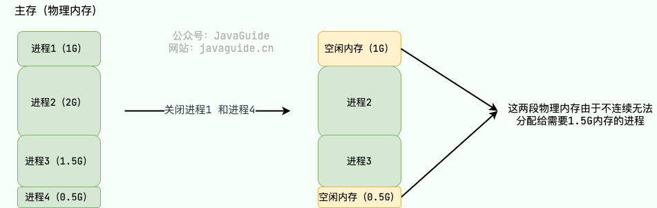

- **页式管理** ：把主存分为**大小相等且固定**的一页一页的形式，页较小，相比于块式管理的划分粒度更小。**将虚拟页映射到物理内存上的任意物理页上，实现了物理内存的离散分配，避免了外部内存碎片。**提高了内存利用率，减少了碎片。页式管理通过**页表**对应逻辑地址和物理地址。页表记录了虚拟内存页面和实际物理内存页框的映射关系，一些常访问的映射会缓存在CPU中的MMU中的TLB（translation lookaside buffer，旁路转换缓冲）中。

> 单级页表可能非常的庞大，以 32 位的环境为例，虚拟地址空间范围共有 2^32（4G）。假设 一个页的大小是 2^12（4KB），那页表项共有 4G / 4K = 2^20 个。每个页表项为一个地址，占用 4 字节，`2^20 * 2^2 / 1024 * 1024= 4MB`。也就是说一个程序啥都不干，页表大小就得占用 4M。要解决上面的问题，就需要采用一种叫作**多级页表**（*Multi-Level Page Table*）的解决方案。但是多级页表会带来时间上的开销。<font color='red'>如果一级页表和二级页表完全创建，实际上占用空间更大，但是基于局部性原理，有的一级页表的页表项没有被用到，那么就不必创建它的二级页表。</font>

- **段页式管理**机制结合了段式管理和页式管理的优点。简单来说段页式管理机制就是把主存先分成若干段，每个段**都看成一个虚拟内存**，又分成若干页，也就是说 **段页式管理机制** 中段与段之间以及段的内部的都是离散的。

总结：

* 分段的好处就是能产生**连续的内存空间**，但是会出现「**外部内存碎片**和**内存交换效率低**」的问题。
* **内存交换效率低**主要指的是，如果有外部内存碎片，想要再整理碎片分配给别的应用进程，需要先把内存数据到硬盘上，再写回来整理好，这个交换效率比较低。虽然页式管理也可能会内存交换，但是段式管理的交换数据量一般比较大，因为段比较大。
* 分页的好处是可以提高内存利用率，**减少外部碎片**；每次swap都是一个或几个页，比较小，**内存交换效率相比于段式高**。但是要通过页表还进行寻址，多级页表也会带来时间上的开销，而且页式管理其中的页并无任何实际意义。
* 综上所述可以用段页式管理。
* 段式、页式、段页式管理，虚拟地址都由**段号/页号 + 段内/页内偏移量**构成。

#### 4. 页表存在的问题

**页表空间问题**：页式管理，页的粒度小了，页表自然占用空间变多了，怎么办？

- 多级页表，上层页表是下层页表的页表，像一棵树；
- 仅仅多级，如果都加入内存，反而占用更多空间，因此，**根据局部性原理，下层的页表不用完整读入内存**。
- 为什么不分级的页表做不到节省空间呢，不能把不分级的页表读一部分到内存里吗？因为页表肯定要覆盖整个虚拟空间，否则OS找不到某些地址，而更高层的页表做到了，在覆盖整个空间的同时，压缩了页表大小。

**页表时间问题**：多级页表从上层到下层，转换多了几层，消耗时间怎么办？

- **根据局部性原理，可以把常用的页表项缓存起来**。	
- 缓存在TLB（Translation Lookaside Buffer）中，转址旁路缓存/页表缓存。位于CPU中，速度快。
- MMU负责虚拟地址和物理地址转换，以及TLB读写


#### 5. 分页机制和分段机制有哪些共同点和区别呢？✅

**共同点** ： 

- 都是非连续内存管理方式。
- 都采用了地址映射的方法，将虚拟地址映射到物理地址，以实现对内存的管理和保护。

**区别** ： 

- 页的大小是固定的，由操作系统决定；而段的大小不固定，取决于我们当前运行的程序。
- 分页仅仅是为了满足操作系统内存管理的需求，而段是逻辑信息的单位，在程序中可以体现为代码段，数据段，能够更好满足用户的需要，保护和共享。

#### 6. 为什么有了分页还要有分段？

- 分段的每个段有实际含义，数据和程序被划分开，可以更好保护。
- 栈段可能随着进程运行，动态增长，而每个进程不同，所需要的最大栈段也不同。如果使用分页方式，将栈段和数据段等都放到虚拟地址空间的固定某块中，那么可能某个进程栈段不够，而数据段太空闲。因此逻辑抽象出各个段，段的增长不会受到别的段的起始位置影响。


#### 7. 说说你对缺页中断的了解？✅

缺页中断是当一个程序尝试访问一个不在物理内存中的页时所产生的中断。

当这种情况发生时，操作系统必须从辅助存储（如硬盘）中找到所需的页，然后将其加载到物理内存中。

为了给新页腾出空间，操作系统可能需要选择一个当前在内存中的页并将其移出，这一过程叫做**页面置换**。缺页中断和相应的页面置换策略对操作系统的性能和程序的执行速度有重要影响

#### 8. 页面大小的设置

- 小页面
  - 优点
    1. 不容易产生**内部碎片**。
    2. 小页面能够**更充分地利用TLB空间**。假设程序使用的内存为1MB，若使 用4KB的页，则程序将至少占用TLB中的16个表项，而使用2MB的页时， 1个TLB表项就足够了
  - 缺点
    1. 小页面的**页表会更大**。
    2. 为一个进程分配页面时，把页面**从磁盘装载进内存时间会更长**。磁盘IO时间主要消耗在**旋转**和**寻道**上，对于连续的4KB还是512B读取时间相差不大。一个进程要8KB的页面，那么4KB/页情况下旋转寻道只要2次，512B/页情况下要16次。

#### 0.1 计算机哪些地方用到了缓存？打开一个软件（比如打开浏览器）的过程是什么？

存储器是分层次的，离CPU越近的存储器，速度越快，每字节的成本越高，同时容量也因此越小。


寄存器最快，离CPU最近；高速缓存（一级二级缓存）；主存（普通内存）；本地磁盘（外存）。

**程序加载的过程：**（博客上看的别人的总结）

一个可执行文件原来存储在硬盘的一个分区中，运用的是内存管理分段模型，其各个段的数据有其相对地址（相对于其段基址的便宜地址，Linux下可以通过nm命令获得），这是逻辑地址。

当程序被加载到内存中时称为进程，因为高速缓冲器cache和其他一些因素的影响，每一个进程自认为占用了内存的几乎所有空间，进程的总地址4GB甚至更多，这个叫做虚拟空间地址。（有时也叫线性地址）

其实此时只是加载了系统所需要的进程的一些页（段进一步映射运用分页模型），当一个段（此时其中内存中是页）引用另一个段的时候，把段选择子放到寄存器中，根据GDT来寻找硬盘中的段数据，该段通过内存分页模型得到相应的页，后经过MMU得到真实内存地址（物理地址）放到内存中供另一个页引用

#### 0.2 常用缓存策略

从操作系统来说的话

常用的缓存淘汰策略有以下

- 先进先出算法（FIFO）
- Least Frequently Used（LFU）
  淘汰一定时期内被访问次数最少的页面，**以次数作为参考**
- Least Recently Used（LRU）
  淘汰最长时间未被使用的页面，**以时间作为参考**

#### 0.3 cache和buffer有什么用

cache 是为了弥补高速设备和低速设备的鸿沟而引入的中间层，最终起到**加快访问速度**的作用。比如寄存器和内存之间速度不匹配所以要加一个缓存。
而 buffer 的主要目的进行流量整形，把突发的大数量较小规模的 I/O 整理成平稳的小数量较大规模的 I/O，以**减少响应次数**（比如从网上下电影，你不能下一点点数据就写一下硬盘，而是积攒一定量的数据以后一整块一起写，不然硬盘都要被你玩坏了）

### IO

#### 0. 不同IO模型见Java IO章节

#### 1. 零拷贝

<font color='red'>详情看[操作系统](https://www.yuque.com/u872571506/zqzte4/nibw3g0ley118e9f#q8YIC)</font>

​	**零拷贝技术用于提升IO效率，Kafka和RocketMQ都用到了。**

​	设想一个文件传输场景，使用传统IO，需要内核态缓存区数据拷贝到用户态缓存区，然后再从用户态缓存区拷贝到内核态socket缓存区，内核态->用户态->内核态，频繁的系统调用和上下文切换，性能不好。


- **mmap**

​	`mmap()`系统调用函数把内核缓冲区的数据映射到用户空间，避免来回状态切换和上下文切换，操作系统内核空间和用户空间不需要额外的数据拷贝，直接把内核态缓存区数据拷到socket缓存区。

​	`mmap()`的零拷贝，指的是从内核态缓存区到用户态缓存区不用拷贝，但是从用户态缓存区到socket缓存区还是要拷贝。


- **sendfile**

​	替代前面的`read()`和`write()`系统调用，直接把内核态缓存区数据拷贝到socket缓存区。

​	`sendfile()`的零拷贝，指的是内核态缓存区直接把数据发往socket缓存区，用不到用户缓存区了，这里比`mmap()`更彻底，性能更好，但是用户态无法感知。


## MySQL

MySQL的学习中，select是重中之重。
查漏补缺：[《面试笔记》——MySQL终结篇（30问与答） (qq.com)](https://mp.weixin.qq.com/s?__biz=MzkxMjE5NzUxNQ==&mid=2247483876&idx=1&sn=3ba83e9184f850c49a0b98e6e49513b3&chksm=c111d300f6665a16af6199d869d715186e969df0a9c207b0c216b91ed299f5f006cdea188a4b&token=1231184118&lang=zh_CN#rd)

[MySQL 三万字精华总结 + 面试100 问，和面试官扯皮绰绰有余（收藏系列）和其它数据库相比，MySQL有点与众不同 - 掘金](https://juejin.cn/post/6850037271233331208?searchId=20241101183504D1AE766A697CA321214E)

### 基础问题
#### 1. 介绍一下MySQL

1. **MySQL 简介**：
   - MySQL 是一种关系型数据库管理系统（RDBMS）。
   - 关系型数据库使用二维表格模型来组织数据，并支持 SQL 语言进行数据操作。
   - MySQL 支持 **ACID** 特性，常用于**持久化存储系统数据**，如用户信息、商品订单信息等。
   - 默认端口号是 3306，可以根据需要进行个性化配置。
2. **SQL 语言**：
   - SQL 是结构化查询语言，用于**管理和操作关系型数据库**。
   - SQL 是一种非过程化语言，用户**只需定义待执行的操作**，而不必关心具体的实现细节。
3. **关系型数据库 vs 非关系型数据库（NoSQL）**：
   - **关系型数据库**：使用**表格形式**存储数据，数据之间通过关系模型（如一对一、一对多、多对多）连接。
   - **非关系型数据库（NoSQL）**：**不使用表格形式**存储数据，而是以对象形式存储，对象之间的关系通过对象自身的属性来确定，适合存储非结构化数据，例如 Redis 是一种键值数据库。

#### 2. **请说下你对MySQL架构的了解？** 

MySQL 的基本架构图：

- **连接层**
- **Server层**：分析器，优化器（解释器），执行器，查询缓存
- **存储引擎层**


#### 3. **InnoDB 和 MyISAM 的比较？两种引擎的应用场景？** 

[MyISAM与InnoDB 的区别](https://blog.csdn.net/qq_35642036/article/details/82820178)

**区别：**

1. **事务**：MyISAM不支持事务，InnoDB支持事务，InnoDB每一条SQL语言都默认封装成事务，自动提交，这样会影响速度；
2. **外键**：MyISAM 不支持外键，InnoDB 支持外键；
3. **锁**：MyISAM 只支持表锁，InnoDB 可以支持行锁；
4. **索引**：InnoDB用的聚簇索引，MyISAM用的二级索引
5. **主键**：MyISAM表可以没有主键，InnoDB表必须有主键（没有指定主键的话会默认指定指定一个主键）
6. **关于 count(*)**：MyISAM会通过一个变量直接存储总行数，InnoDB 则不会，需要按行扫描。意思就是对于 select count(*) from table; 如果数据量大，MyISAM 会瞬间返回，而 InnoDB 则会一行行扫描；
7. **全文索引：**MyISAM 支持全文索引，在**涉及全文索引**的领域上MyISAM的查询效率更高，InnoDB 5.6 之前不支持全文索引；
8. **备份**：InnoDB支持在线热备份
9. **崩溃恢复**：MyISAM崩溃后发生损坏的概率比InnoDB大得多，而且恢复的速度也很慢；

**应用场景：**

1. 是否要支持事务，如果要支持，选择InnoDB，如果不需要可以考虑MyISAM；
2. 如果表中绝大多数都只是读查询，可以考虑MyISAM，如果既有读也有写，请使用InnoDB；（MyISAM不支持事务，缓存设计更简单，锁的粒度更大）
3. 系统崩溃后，MyISAM恢复起来更困难，能否接受；
4. MySQL5.5版本开始Innodb已经成为MySQL的默认引擎(之前是MyISAM)，说明其优势是有目共睹的，如果你不知道用什么，那就用InnoDB，至少不会差。

InnoDB相比MyISAM支持**事务处理**,**分布式事务**,**部分事务回滚**。

#### 4. **数据库的三范式是什么？**

- **第一范式（1NF）**：
  - 强调**列的原子性**，即数据库表的每一列都是不可分割的原子数据项。
- **第二范式（2NF）**：
  - 要求**实体的属性完全依赖于主键**。即一张数据表中的任何非主键字段都必须完全依赖于主键字段，而不能只依赖于主键的一部分。
- **第三范式（3NF）**：
  - 要求任何**非主属性不依赖于其他非主属性**。即非主键字段之间没有依赖关系，所有非主键字段都只依赖于主键字段。

**满足三范式的好处：**

- **减少数据冗余**：通过规范化可以减少不必要的重复数据存储，从而简化数据结构，提高数据的一致性和完整性。
- **提高数据一致性**：减少因数据冗余而导致的更新异常，保证数据的一致性。
- **简化数据操作**：规范化的数据结构使得插入、删除和更新操作更加简单和可靠。

#### 5. **char 和 varchar 的区别？**

**char(n) ：固定长度类型**，比如：定义`char(10)`，当你输入"abc"三个字符的时候，它们占的空间还是 10 个字节，其他 7 个是空字节。char 优点：效率高；缺点：占用空间；适用场景：存储密码的 md5 值，固定长度的，使用 char 非常合适。

**varchar(n) ：**可变长度，**存储的值是每个值占用的字节再加上一个用来记录其长度的字节的长度**。

所以，从**空间上考虑 varcahr 比较合适；从效率上考虑 char 比较合适**，二者使用需要权衡。

#### 6. **什么是内连接、外连接、左连接、右连接、全外连接？** 


- **左连接：**以左表为准，去匹配右表，结果与左表中的数据量相同

  ```sql
  select * from A left join B on A.id = B.id;
  ```

- **右连接：**以右表为准，去匹配左表，结果与右表中的数据量相同

  ```sql
  select * from A right join B on A.id = B.id;
  ```

- **全外连接：**相当于左外连接和右外连接的总和

  ```sql
  select * from A full outer join B on A.id = B.id;
  ```

- **内连接：**保留左表和右表相同的数据

  ```sql
  select * from A inner join B on A.id = B.id;
  ```

外连接包括左连接、右连接、全外连接、内连接。

#### 7. **谈谈你对索引的理解？**

**索引的出现是为了提高数据的查询效率**，就像书的目录一样。对于数据库的表而言，索引其实就是它的“目录”。

同样，索引也会带来很多负面影响：

- **创建索引和维护索引**需要耗费时间，这个时间随着数据量的增加而增加；
- **索引需要占用物理空间**，不光是表需要占用数据空间，每个索引也需要占用物理空间；
- 当**对表进行增、删、改的时候索引也需要动态维护**，这样就降低了数据的维护速度。

#### 8. **哪些情况适合使用索引？哪些情况不适合建立索引？**

**适合使用索引的情况：**

- **表记录条数较多**（中大型表）
- 不需要经常增删改的表
- 最经常查询和最经常排序的字段适合建立索引
- **索引区分度较大的表**

**不适合使用索引的情况：**

- 表记录太少，直接全表扫描比建立索引更高效
- 经常增删改的表，建立索引会降低更新表的速度
- **数据大量重复且分布均匀**的表字段，不适合建立索引

例子：以性别建立索引。

为什么性别不适合建索引呢？因为你访问索引需要付出额外的IO开销，你从索引中拿到的只是地址，要想真正访问到数据还是要对表进行一次IO。假如你要从表的100万行数据中取几个数据，那么利用索引迅速定位，访问索引的这IO开销就非常值了。但如果你是从100万行数据中取50万行数据，就比如性别字段，那你相对需要访问50万次索引，再访问50万次表，加起来的开销并不会比直接对表进行一次完整扫描小。

#### 9. **谈谈你对 B+ 树的理解？**

[B树、B+树、B*树之间的关系](https://blog.csdn.net/u013411246/article/details/81088914)

**B+树**是**多路平衡查找树**，主要用于优化大量数据的检索效率。相较于B树，B+树具有以下特点：

1. **数据存储在叶子节点**：所有的数据记录都存储在叶子节点上，而非叶子节点仅仅存储索引信息。这意味着非叶子节点可以存储更多的索引，从而使树的高度降低，提高了查询效率。
2. **叶子节点链接**：B+树的叶子节点之间通过指针相连，形成一个链表。这种设计使得在执行范围查询时，可以从一个叶子节点快速跳转到另一个叶子节点，极大地提高了区间查询的性能。
3. **平衡性**：B+树继承了B树的平衡性特点，即所有的叶子节点都处于同一层次。这种结构保证了每次查询的时间复杂度相对固定，从而增强了数据检索的稳定性。
4. **高效的区间查询**：由于叶子节点之间相连，进行区间查询时可以从第一个符合条件的叶子节点开始，沿着链表顺序访问，直到找到最后一个符合条件的节点，因此非常适合范围查询。
5. **插入和删除操作**：在**插入或删除数据时，可能会破坏树的平衡性**。为此，B+树设计了**分裂和合并**机制来维持树的平衡性。插入时，如果节点已满，则将其分裂为两个节点，并可能需要调整父节点中的索引；删除时，如果节点元素过少，则可能与其他节点合并。
6. **二分查找**：在B+树中进行查找时，**从根节点开始进行二分查找，找到合适的分支，递归地向下一层继续查找**，直至到达叶子节点，并在叶子节点上进行二分查找，最终找到所需数据。

**以MySQL InnoDB存储引擎为例**，InnoDB默认使用B+树作为索引结构，这是因为B+树特别适合数据库系统中的索引存储，尤其是在处理大量数据和频繁的范围查询时表现出色。


#### 10. **说一下MySQL的行锁和表锁？** 

MyISAM只支持表锁，InnoDB支持表锁和行锁，默认为行锁。

表级锁：开销小，加锁快，**不会出现死锁**。锁定粒度大，发生锁冲突的概率最高，并发量最低；

行级锁：开销大，加锁慢，**会出现死锁**。锁粒度小，发生锁冲突的概率小，并发量最高。

**行级锁导致死锁的例子：**

- 假设有两个事务 A 和 B，事务 A 锁定了行 X，事务 B 锁定了行 Y。
- 如果事务 A 接下来需要锁定行 Y，而事务 B 需要锁定行 X，那么事务 A 和 B 都会等待对方释放锁。
- 这种情况下，事务 A 和 B 形成了死锁。

#### 一条SQL语句的执行过程

1. 客户端发送 SQL 语句给 MySQL 服务器。

2. 如果查询缓存打开则会优先查询缓存，如果缓存中有对应的结果，直接返回给客户端。不过，MySQL 8.0 版本已经移除了查询缓存。
3. 分析器对 SQL 语句进行语法分析，判断是否有语法错误。
4. 搞清楚 SQL 语句要干嘛后，MySQL 还会通过优化器生成执行计划。
5. 执行器调用存储引擎的接口，执行 SQL 语句。


------

### 索引

#### 1. **为什么索引的底层数据结构采用 B+ 树而不是B树？** 

1. **叶节点存储所有数据**
   - **B+树**：在B+树中，所有关键字的实际数据都存储在叶节点上，而内部节点仅用于导航。这意味着一次磁盘I/O操作可以加载更多数据，因为每个块（磁盘页）可以存储更多的关键字和指针。
   - **B树**：在B树中，每个节点都可以存储关键字及其对应的数据（或指向下一层节点的指针），这使得每次查找可能需要多次磁盘I/O操作。
2. **范围查询优化**
   - **B+树**：由于B+树的所有数据都在叶节点上，叶节点之间还有指针链接，因此可以很容易地遍历叶节点来进行范围查询。这对于数据库查询来说非常重要，因为很多查询涉及范围查询。
   - **B树**：B树的节点间没有链接，因此进行范围查询时需要从根节点开始逐层遍历，效率较低。
3. **提高磁盘I/O效率**
   - **B+树**：由于所有数据都存储在叶节点上，内部节点只需要存储索引信息，这使得内部节点可以存储更多的子节点信息（关键字和指针），从而减少了树的高度，提高了查找效率。
   - **B树**：每个节点都需要存储数据，因此内部节点存储的信息较少，树的高度可能更高，需要更多的磁盘I/O操作。
4. **数据冗余减少**
   - **B+树**：关键字在内部节点和叶节点上都存在，但在叶节点上才存储实际的数据。这使得内部节点可以专门用于索引，**而叶节点负责存储数据，减少了数据冗余**。
   - **B树**：**每个节点都可能包含关键字和数据，这可能导致数据冗余**，特别是在节点分裂和合并时。
5. **易于实现顺序访问**
   - **B+树**：由于叶节点之间有指针相连，因此可以方便地实现数据的顺序访问，这对于数据库查询和扫描非常有用。
   - **B树**：没有叶节点之间的链接，顺序访问效率不高。

#### 2. **什么叫聚簇索引（聚集索引）？** 

[聚簇索引与非聚簇索引](https://www.jianshu.com/p/fa8192853184)

**聚簇索引**（Clustered Index）是一种特殊的索引类型，其特点是将索引与实际数据存储在一起。**具体来说，聚簇索引按照索引键的顺序组织数据，因此数据行在物理存储上的顺序与索引键的顺序是一致的。**这意味着，当你定位到了索引，实际上就已经定位到了数据本身。

主要特点：

1. **索引与数据共存**：在聚簇索引中，数据行存储在索引树的叶子节点中，找到索引就意味着找到了数据。
2. **顺序一致性**：数据的**物理存储顺序与索引键的顺序**相同，这有助于提高某些类型查询的效率。
3. **唯一性**：通常情况下，**每张表只能有一个聚簇索引，因为数据行的物理存储位置是唯一的**。然而，可以通过定义主键来创建聚簇索引。
4. **常见应用**：MySQL的InnoDB存储引擎使用聚簇索引来组织数据存储，而MyISAM存储引擎则使用非聚簇索引。

聚簇索引 vs 非聚簇索引：

- **聚簇索引**：索引的叶子节点直接存储了数据行。因此，在使用聚簇索引进行查找时，不需要额外的操作来获取数据。
- **非聚簇索引**：索引的叶子节点存储的是指向实际数据行的指针。这意味着，在使用非聚簇索引查找时，首先需要查询索引文件来获取索引值，然后再根据索引值指向的位置去获取实际的数据行，这个过程通常被称为“回表”。

#### 什么是唯一索引？

**唯一索引**是一种数据库索引，确保索引列中的所有值都是唯一的。这意味着**在一个具有唯一索引的列中，不能有两个或多个行具有相同的值。**唯一索引通常用于确保数据的完整性，特别是在需要保证某列值的唯一性时，如主键或唯一标识符。

主要特点：

1. **唯一性**：索引列中的值必须唯一。
2. **性能提升**：加快查询速度，特别是用于查找特定值的查询。
3. **约束作用**：防止插入重复的值，确保数据的完整性。

#### 3. **什么叫联合索引(复合索引)、覆盖索引？** 

- **联合索引**：**包含多个列的索引**，可以提高涉及多列查询的性能。
- **覆盖索引**：索引包含了查询所需的所有列，这样**查询可以直接从索引中获取数据**，而不需要访问实际的数据行。

**从辅助索引中直接获取查询的数据，叫做覆盖索引**。比如我要查年龄，性别；我建立的索引字段有年龄，班级，性别。这就是一种覆盖索引。 辅助索引不包含整行数据信息，也不需要回表（**直接索引就包含字段了**）。

回表：索引到叶子节点只有，会有一个对应的主键，再去索引主键，找到聚簇索引，即整行数据。聚簇索引只有一个。没有主键，就会自动建立。

#### 4.什么是覆盖索引，什么是索引下推？

**覆盖索引：**假设对表t有一个联合索引 index (id_card, name)

```sql
select id_card,name from t where id_card = "3542742";
```

一般来说，是通过id_card这个索引找到主键id,然后回表找出id_card 和 name返回。

但是由于有 id_card 和 name 的 联合索引，所以直接在用联合索引的时候读到了id_card 和 name两个值，就不需要回表，直接返回就行了。

**索引下推**：

联合索引要符合**最左前缀原则**，当**遇到范围语句时或者模糊查询时，后续的字段就用不上联合索引**了。

传统的查询流程是先根据索引找到符合条件的数据行，然后再回到数据页获取完整的数据行。而**索引下推则是将过滤条件直接应用在索引查找**的过程中，这样在**索引层面就能够过滤掉不符合条件的数据行，减少了从磁盘读取数据页的次数**。

假设对a,b,c做了联合索引, index(a,b,c)

```
select * from t where a = 1 and b = 'hello' and c = 3 -- 可以用上联合索引(a,b,c)
select * from t where a = 1 and b = 'hell%' and c = 3 -- 可以用上联合索引(a,b)，碰到%后续用不了索引
```

假设我有这样一个联合索引 index（name, age）

```sql
select * from tuser where name like '张%' and age=10 and ismale=1; -- 这个语句只能用上name这个索引
```

但是InooDB会把**索引中的值取出来，在索引内部判断age是否等于10**，从而减少回表次数。这就是索引下推的原理。


#### 5. **谈谈你对哈希索引的理解？**

哈希索引能以 O(1) 时间进行查找，但是**失去了有序性**。**无法用于排序与分组**、**只支持精确查找**，**无法用于部分查找和范围查找**。

InnoDB 存储引擎有一个特殊的功能叫“自适应哈希索引”，**当某个索引值被使用的非常频繁时，会在 B+ 树索引之上再创建一个哈希索引**，这样就让 B+Tree 索引具有哈希索引的一些优点，比如：**快速的哈希查找。**

#### 6. **什么情况下索引会失效？即查询不走索引？**


下面列举几种不走索引的 SQL 语句：

1. **索引列参与表达式计算**：

   ```
   SELECT 'sname' FROM 'stu' WHERE 'age' + 10 = 30;
   ```

2. **函数运算**：

   ```
   SELECT 'sname' FROM 'stu' WHERE LEFT('date',4) < 1990; 
   ```

3. %词语%--**模糊查询（前置通配符）**：

   ```
   SELECT * FROM 'manong' WHERE `uname` LIKE '码农%' -- 走索引 
   
   SELECT * FROM 'manong' WHERE `uname` LIKE "%码农%" -- 不走索引 
   ```

4. **字符串类型的变量不加单引号会索引失效**：假设a字段的类型为VARCHAR，则下列语句中的a = 1由于缺少了'1'的单引号，所以会导致索引失效

   ```
   SELECT * FROM table WHERE a = 1;
   ```

5. **违背最左前缀法则会索引失效**：假设索引字段为a、b、c，则下列语句只有a可以使用索引，因为缺少了b字段，所以会索引失效。如果遇到范围查询(>、<、between、like等)，也会停止后边的匹配。

   `SELECT * FROM table WHERE a = 1 AND c = 3;`

6. **存储引擎不能使用索引中范围条件右边的列:**

   `select * from student where name = 'Mitsunari' and age > 44 and class_id = 2`

7. 不等号`!=`或者`<>`会使索引失效；

8. 查询语句中带有IS NULL 或者 IS NOT NULL，没注意字段是否为空。

9. **查询条件中有 OR** ，即使其中有条件带索引也不会使用。换言之，就是要求使用的所有字段，都必须建立索引：

   ```
   select * from dept where dname='xxx' or loc='xx' or deptno = 45;
   ```

10. 正则表达式不使用索引。

11. MySQL 内部优化器会对 SQL 语句进行优化，如果优化器估计使用全表扫描要比使用索引快，则不使用索引。

#### 7. **索引优化的几种方法？**

1. 不在索引列上做任何操作（计算、函数、类型转换）
2. 不要违背最左前缀原则
3. 尽量使用覆盖索引
4. 减少使用`SELECT *`
5. 字符串类型变量不要忘记单引号
6. 少用形如`('%...%')、('%...')`的模糊查询
7. 少用OR，否则会索引失效
8. 少用IS NULL，IS NOT NULL，否则会索引失效

### 分库分表与主从复制

[MySQL 分库分表方案，总结的非常好！数据库分库分表 公司最近在搞服务分离，数据切分方面的东西，因为单张… - 掘金 (juejin.cn)](https://juejin.cn/post/6844903648670007310?searchId=2024090316270702C6DF8D3CABE38FEC9E)

[阿里面试：我们为什么要分库分表前言 大家好，我是捡田螺的小男孩，今天跟大家聊聊分库分表。 什么是分库分表 为什么需要分库 - 掘金 (juejin.cn)](https://juejin.cn/post/7085132195190276109?searchId=2024090316270702C6DF8D3CABE38FEC9E)

#### 1. **为什么要分库分表？分库分表后，主键 ID 怎么设置？** 

1. 因为数据量过大时，数据库的性能会下降，SQL查询会变慢。业界公认MySQL单表容量在1千万以下是最佳状态，因为这时它的B+树高为3。

> Mysql的默认存储引擎是`Innodb` Innodb的最小存储单位是页 一页大小等于16K
>
> 主键占8个字节，指针大小在InnoDB源码中设置为6字节，所以是8+6=14字节，16k/14B=16*1024B/14B =1170
>
> 而对于高度为3的B+树，就可以存放 1170 x 1170 x 16 = 21902400 条数据（两千多万条数据）

2. 数据库连接数是有限的。在**高并发的场景下**，大量请求访问数据库，MySQL单机是扛不住的！

##### **如何分库分表？**

垂直拆分：

- **垂直分库：**根据不同的功能模块**垂直分库**（表变为库）
- **垂直分表：**将每个表中列数据根据**常用和不常用**进行垂直分表

水平拆分

- **水平分库：**将表的数据量切分到不同的数据库服务器上，**每个服务器具有相同的库和表**，只是表中的数据集合不一样。它可以有效的缓解单机单库的性能瓶颈和压力。比如根据用户id进行分片，分散数据库压力。
- **水平分表：**如果一个表的数据量太大，可以**按照某种规则**（如`hash取模、range`），把数据切分到多张表去。比如按月份分订单表。

range+hash取模混合


##### 什么时候分表？

如果你的系统处于快速发展时期，如果每天的订单流水都新增几十万，并且，**订单表的查询效率明变慢时，就需要规划分库分表了。**一般B+树索引高度是2~3层最佳，如果数据量千万级别，可能高度就变4层了，数据量就会明显变慢了。不过业界流传，一般500万数据就要**考虑分表**了。

##### 什么时候分库？

业务发展很快，还是**多个服务共享一个单体数据库，数据库成为了性能瓶颈，就需要考虑分库了**。比如订单、用户等，都可以抽取出来，新搞个应用（其实就是微服务思想），并且拆分数据库（订单库、用户库）。

##### 分库分表后主键ID怎么设置(分布式ID)

1. 建立一个数据库A专门用来存储主键，每次加入之前先往A加入一下，获取到一个数字ID（这个ID一定是自增的），之后往特定分表中插的时候就采用这个ID。不适合高并发。 

2. UUID，一定是唯一的，但是比较长，效率会低 
3. 获取系统当前时间，不太适合高并发的场合，容易重复 
4.  （一般想要这个答案）**snowflake算法**：用一个64位的long数字，一般用一长串二进制表示，有几段意义：**时间戳+机房id+机器id+序列号**（用于区分同一毫秒内的不同的数据，因为时间戳最小单位是毫秒）

##### 分库分表产生的问题？

- 事务问题：本地事务失效，需要采用**分布式事务**
- 跨库关联：跨节点Join失效，需要**分两次查询数据库**再进行Join
- 排序问题: order by、group by无法正常进行，**需要分别在各个节点得到结果后在应用端**进行。
- 分页问题:**查询到结果后在代码端汇总**。
- 分布式ID:**雪花算法**

#### 2. **主从复制中涉及到哪三个线程？** 

主要涉及三个线程：①binlog线程、②I/O线程、③SQL线程。

1. binlog线程：负责将主服务器上的数据更改写入二进制日志(Binary log)中。
2. I/O线程：负责从主服务器上读取二进制日志，并写入从服务器的重放日志(Relay log)中。
3. SQL线程：负责读取重放日志并重放其中的SQL语句。


#### 3. **谈下你对读写分离的理解？** 

读写分离常用代理方式来实现，代理服务器接收应用层传来的读写请求，然后决定转发到哪个服务器。主服务器处理写操作以及实时性要求比较高的读操作，而从服务器处理读操作。

**读写分离能提高性能的原因在于：**

1. **缓解锁竞争**：主从服务器负责各自的读和写，极大程度缓**解了锁的争用**；
2. **MyISAM引擎读更高效：** **从服务器可以使用MyISAM**，提升查询性能以及节约系统开销；
3. **高可用：**增加冗余，提高可用性。

#### 4. **如何解决 MySQL 主从同步延迟问题？**

**问题描述**

在MySQL的主从复制架构中，如果主服务器（Master）频繁接收来自客户端的大并发更新操作，而从服务器（Slave）处理这些操作的能力有限，就可能导致主从同步延迟。

具体表现为：

从服务器的读取Binlog线程只有一个，当某个SQL在从服务器上执行时间较长，或者需要进行锁表操作时，会导致主服务器上的SQL操作大量积压，未能及时同步到从服务器。结果是主从数据出现不一致现象，即主从延迟。

**主从同步延迟的原因**

1. **主库压力过大**：
   - 如果主数据库的写操作非常频繁，尤其是存在大量的大事务时，Binary Log（二进制日志）的生成速度可能会超过从数据库的处理能力，导致延迟。
2. **从库负载过高**：
   - 如果从数据库本身负载较高，即使Binary Log能够快速传输到从数据库，从数据库也可能无法及时处理这些变更，特别是当从库也在执行大量的查询操作时，SQL线程运行缓慢，导致延迟。

**解决主从同步延迟的方法**

虽然不存在一劳永逸的方法来彻底解决主从同步延迟的问题，但我们可以通过一系列措施来减轻延迟的影响：

1. **调整主库和从库的配置**：
   - 主服务器通常承担着数据更新的任务，因此对数据安全性的要求较高。可以适当调整主服务器的一些配置参数，如`sync_binlog`和`innodb_flush_log_at_trx_commit`，以提高安全性。
   - 相反，从服务器的主要任务是接收并执行主服务器发送过来的变更记录，因此可以降低一些配置参数的要求，如将`sync_binlog`设置为0或关闭binlog，将`innodb_flush_log_at_trx_commit`设置为0，以提高SQL执行效率。
2. **增加从服务器**：
   - 通过**增加从服务器的数量**来分散读取请求的压力，降低单个从服务器的负载，从而提高整体的处理能力。
3. **并行复制**：
   - MySQL支持并行复制功能，可以在一定程度上缓解由于单线程执行SQL带来的延迟问题。通过**启用并行复制**，可以让多个SQL线程同时处理不同的Schema（模式）或表的变更记录，提高复制效率。

#### **如果对写数据也有大量需求，有什么解决方案？**

可以配置多个写数据库（数据一致性）.

#### **如果配置多个写库，如何分割，有没有什么思路？**

配置多个写库可以总结成下面四种分法：

1. 按某个属性的范围划分
2. Hash取模
3. 范围划分+Hash取模
4. 一致性哈希

1.按范围划分


优点：便于扩容，当订单数据不断增长，只需要再加入一个`order_4`即可。

缺点：该方案有热点问题，因为订单id是不断增大的，最近一段时间都是汇聚在一张表中，比如最近一个月的订单都在`1000万~2000`万之间，平时用户一般都查最近一个月的订单比较多，请求都打到`order_1`表啦，这就导致表的**数据热点**问题。

2.hash取模

指定的路由key（一般是user_id、订单id作为key）对分表总数进行取模，把数据分散到各个表中。


优点：不好存在明显的热点问题。

缺点：如果一开始按照hash取模分成4个表了，未来某个时候，表数据量又到瓶颈了，需要扩容，这就比较棘手了。比如你从4张表，又扩容成`8`张表，那之前`id=5`的数据是在（`5%4=1`，即第一张表），现在应该放到（`5%8=5`，即第`5`张表），也就是说**历史数据要做迁移了**。

3.range+hash取模

既然range存在热点问题，hash取模扩容迁移数据比较困难，可以综合两种方案一起。可以先用range范围方案，然后再用取模策略，将不同订单分散到不同的表中。一方面通过hash取模的方式可以避免热点数据倾斜，另一方range范围方案有助于数据库扩容。

​	

4.一致性哈希

如果**用hash方式**分表，前期规划不好，需要**扩容二次分表，表的数量需要增加，所以hash值需要重新计算**，这时候需要迁移数据了。

> 比如我们开始分了`10`张表，之后业务扩展需要，增加到`20`张表。那问题就来了，之前根据`orderId`取模`10`后的数据分散在了各个表中，现在需要重新对所有数据重新取模`20`来分配数据

为了解决这个**扩容迁移**问题，可以使用**一致性哈希思想**来解决。

> **一致性哈希**：在移除或者添加一个服务器时，能够尽可能小地改变已存在的服务请求与处理请求服务器之间的映射关系。一致性哈希解决了简单哈希算法在分布式哈希表存在的**动态伸缩**等问题

#### 5.老表迁移到新表的过程中，保证老表业务正常运行，怎么做？ 

[转转上门履约服务拆分库表迁移实践转转上门履约团队在服务拆分过程中数据迁移方案探讨以及实践。方案阐述了切换新旧库时关键操作 - 掘金 (juejin.cn)](https://juejin.cn/post/7397628739885416483)

**数据同步**

1. 新建一个表B，在表A开启一个事务，隔离级别设置为可重复读
2. 将表A的数据读取后同步到表B，读取过程中新建一个日志，将对表A的所有操作记录到日志文件中。（或者找到Binlog的某一个节点）
3. 由于是可重复读，所以开启事务后表A相当于不会改变读取的值，最后再将日志中对表A的操作对表B重做一次，从而实现两个表数据一致。
4. 由于是MVCC控制的，此时表A仍然能对外提供服务。

**双写新旧库**

②**新旧库数据同步**：由DBA协助完成旧库表数据迁移到新库，并使用增量同步工具把旧库表数据同步到新库。

③**开启双写**：业务服务迁库代码改造上线，在业务写入低峰期校验新库与旧库表数据一致后，DBA断开旧库与新库的同步，业务服务同步开启写新库开关，开始双写。

④**读新库**：校验新库与旧库表数据一致后，通过灰度发布，逐步调节读流量切换到新库进行数据验证，验证期间有问题可以随时切换回旧库。

⑤**代码清理**：读写流量全量切换新库，下线写旧库代码。


#### 6.MySQL主从切换，有哪些方案？

**可靠性优先策略**

不会出现数据不一致的问题，但会出现短暂的不可用

1. 判断从库B和主库A之间的主从延迟，是否小于5s，如果小于5s继续下一步，否则重试
2. 把主库A改为只读状态 --- 此时开始系统进入不可用状态
3. 等待备库B和主库A数据完全同步
4. 把备库B改为读写状态
5. 业务请求切换到备库B -- 此时系统重新进入可用状态

**可用性优先策略**

把上述步骤4、5调整到最开始执行，也就是说不等主备数据同步，直接把连接切到备库 B，并且让备库B可以读写，那么系统几乎就没有不可用时间了。但是AB会出现数据不一致的问题。

如果采用可用性优先策略，最后要通过bin log来修复数据不一致的情况。

### 事务与MVCC

#### 什么是事务？

简单来说，事务是逻辑上的一组操作，要么都执行要么都不执行。

#### 简要概括事务的四大特性（ACID）

事务（Transaction）确保一组操作要么全部成功，要么全部失败，保证数据的一致性。四大特性分别是：**原子性**（Atomicity）、**一致性**（Consistency）、**隔离性**（Isolation）和**持久性**（Durability）。

1. **原子性（Atomicity）**
   - **定义**：事务中的所有操作要么全部执行，要么全部不执行。
   - **作用**：确保部分成功时，整个事务回滚，防止数据不一致。

2. **一致性（Consistency）**
   - **定义**：事务执行前后，数据库必须保持一致状态，符合完整性约束。
   - **作用**：确保数据完整性，不违反预定规则（如外键、唯一性等）。

3. **隔离性（Isolation）**
   - **定义**：每个事务的执行不受其他事务的影响，确保并发执行时的独立性。
   - **作用**：避免并发事务之间互相干扰。隔离级别有：
     - **读未提交（Read Uncommitted）**：最低隔离，事务可读取未提交数据。
     - **读已提交（Read Committed）**：只能读取已提交事务的数据。
     - **可重复读（Repeatable Read）**：保证事务中读取的数据不变。
     - **串行化（Serializable）**：最高隔离，事务按顺序执行。

4. **持久性（Durability）**
   - **定义**：事务提交后，修改永久保留，即使系统崩溃也不会丢失。
   - **作用**：确保提交后的更改在系统故障后可以恢复。

通过这四大特性，事务能确保数据库操作的可靠性和一致性。

#### 1. **谈谈你对事务隔离级别的理解？实现方式？** 

1. **READ_UNCOMMITTED（读未提交）**: 最低的隔离级别，允许读取尚未提交的数据变更，可能**会导致脏读、不可重复读或幻读**；
2. **READ_COMMITTED（读已提交）**: 允许读取并发事务已经提交的数据，可以**阻止脏读**，但是幻读或不可重复读仍有可能发生；
3. **REPEATABLE_READ（可重复读）**: **对同一字段的多次读取结果都是一致**的，除非数据是被本身事务自己所修改，可以**阻止脏读和不可重复读**，但**幻读**仍有可能发生；
4. **SERIALIZABLE（串行化）**: 最高的隔离级别，完全服从 ACID 的隔离级别。所有的事务依次逐个执行，这样事务之间就完全不可能产生干扰，也就是说，该级别可以防止脏读、不可重复读以及幻读。但是这将严重影响程序的性能。通常情况下也不会用到该级别。

|   事务隔离级别   | 脏读 | 不可重复读 | 幻读 |
| :--------------: | :--: | :--------: | :--: |
| READ_UNCOMMITTED |  √   |     √      |  √   |
|  READ_COMMITTED  |  √   |     ×      |  √   |
| REPEATABLE_READ  |  ×   |     ×      |  √   |
|   SERIALIZABLE   |  ×   |     ×      |  ×   |

**实现方式**

MySQL 的隔离级别基于**锁和 MVCC 机制共同实现**的。

SERIALIZABLE 隔离级别是通过锁来实现的，READ-COMMITTED 和 REPEATABLE-READ 隔离级别是基于 MVCC 实现的。不过， SERIALIZABLE 之外的其他隔离级别可能也需要用到锁机制，就比如 REPEATABLE-READ 在当前读情况下需要使用加锁读来保证不会出现幻读。


#### 2. **不同隔离级别下会产生什么问题？（解释下什么叫脏读、不可重复读和幻读？）怎么解决？** 

- **脏读**：表示一个事务能够读取另一个事务中还未提交的数据。例如：事务 1 读取某表中的数据 A=20，事务 1 修改 A=A-1，事务 2 读取到 A = 19,事务 1 回滚导致对 A 的修改并未提交到数据库， A 的值还是 20。


- **不可重复读**：同一个事务中，多次读出的同一数据是不一致的。例如：事务 1 读取某表中的数据 A=20，事务 2 也读取 A=20，事务 1 修改 A=A-1，事务 2 再次读取 A =19，此时读取的结果和第一次读取的结果不同。


- **幻读**：指同一个事务内多次查询返回的**结果集数量不一样**。比如同一个事务 A 第一次查询时候有 n 条记录，但是第二次**同等条件下查询**却有 n+1 条记录，这就好像产生了幻觉。发生幻读的原因也是另外一个事务新增或者删除或者修改了第一个事务结果集里面的数据，同一个记录的数据内容被修改了，所有数据行的记录就变多或者变少了。


解决方案：

|  读取问题  |              解决方案              |
| :--------: | :--------------------------------: |
|    脏读    | `READ COMMITTED` 或更高的隔离级别  |
| 不可重复读 | `REPEATABLE READ` 或更高的隔离级别 |
|    幻读    |            InnoDB MVCC             |

#### 幻读和不可重复读有什么区别？

- 不可重复读：重点是内容修改或者记录减少比如多次读取一条记录发现其中某些记录的值被修改；
- 幻读：重点在于记录新增比如多次执行同一条查询语句（DQL）时，发现查到的记录增加了。

幻读其实可以看作是不可重复读的一种特殊情况，单独把幻读区分出来的原因主要是解决幻读和不可重复读的方案不一样。

举个例子：执行 `delete` 和 `update` 操作的时候，可以直接对记录加锁，保证事务安全。而执行 `insert` 操作的时候，由于**记录锁（Record Lock）**只能锁住已经存在的记录，为了避免插入新记录，需要依赖**间隙锁（Gap Lock）**。也就是说执行 `insert` 操作的时候需要依赖 Next-Key Lock（Record Lock+Gap Lock） 进行加锁来保证不出现幻读。

#### 3. **MySQL 默认的隔离级别是什么？**

**MySQL默认采用的 REPEATABLE_READ (可重复读)隔离级别。**

Oracle 默认采用的 READ_COMMITTED 隔离级别。

#### 4. **快照读与当前读了解吗？**

- **快照读**：使用MVCC读取的是快照中的数据，这样可以**减少加锁所带来的开销**。

- **当前读**：读取的是最新的数据，**需要加锁**。

#### 5. **谈谈你对MVCC（多版本并发控制，数据库的乐观锁）的了解？** 

**多版本并发控制（MVCC）**是一种常用于数据库的并发控制机制，它是一种**事务隔离级别的无锁的实现方式**，用于提高事务的并发性能，旨在解决读写冲突和提高数据库性能，特别是在读操作远多于写操作的场景中。MVCC通过为每个事务和数据修改分配时间戳，并保留数据的多个版本，从而允许多个事务并发执行，而不需要传统的锁机制。

**数据库并发场景**：

1. **读-读**：没有问题，无需并发控制。
2. **读-写**：可能产生脏读、不可重复读、幻读等问题。
3. **写-写**：可能产生更新丢失问题。
4. **更新丢失问题**：事务A和B同时修改同一数据，且A事务的回滚覆盖了B事务的修改，导致B的修改丢失。

**MVCC工作原理**：

- **时间戳**：每个事务会被分配一个唯一的时间戳，该时间戳单向增长，所有的数据修改都会与该事务的时间戳关联。
- **数据版本**：每次数据被修改时，数据库会保存一个新的版本，并将其与该事务的时间戳关联。这样，不同事务可以读取不同的版本。
- **快照读取**：读操作不会直接读取当前数据，而是读取事务开始时的**快照**，即数据的历史版本，从而避免了锁的竞争。

**优点**：

- **提高并发性**：通过为每个事务提供独立的版本，避免了对数据的锁竞争，允许更多的并发访问。
- **无锁机制**：解决了传统锁机制中的性能瓶颈，特别是在高并发读取场景下。


**MVCC（多版本并发控制）解决的问题**：

1. **读写并发**：  
   - 通过维护多个数据版本，MVCC允许**读操作与写操作并发执行**，**读不阻塞写，写不阻塞读**。  
   - 读操作读取的是事务开始时的**快照数据**，避免了读写冲突，提高了并发性能。

2. **事务隔离性问题**：  
   - MVCC能有效解决以下事务隔离问题：  
     - **脏读**：防止读取未提交事务的数据。  
     - **不可重复读**：确保同一事务读取的数据一致。  
     - **幻读**：避免读取的数据集在事务过程中发生变化。

3. **不能解决更新丢失问题**：  
   - **更新丢失**：两个事务同时修改同一数据，可能导致一个事务的更新被另一个事务覆盖。  
   - MVCC通过版本控制解决读写冲突，但**无法解决多个事务并发更新同一数据的丢失问题**。需要通过**锁机制**等其他方式解决。


#### 6.快速复习MVCC 

[全网最全的一篇数据库MVCC详解，不全我负责-mysql教程-PHP中文网](https://www.php.cn/faq/460111.html)

MVCC是通过无锁的方式解决不同隔离级别下读写并发问题。

1. 表中有四个隐藏字段：
   1. 事务ID：db_trx_id
   2. 回滚指针：db_roll_pointer
   3. 隐藏主键：db_row_id。或者还有一个删除版本号。历史数据通过回滚指针可以以链表的形式穿起来存在。

2. 每一个事务开启时都会有一个事务ID，它是随时间自增的。
3. 每当一个事务对数据进行操作时，就会把该事务ID记录在字段里面。
4. 当一个事务读操作时，会产生一个 read view（可以简单理解为是一个当前ID号（自增的那一个））

 根据隔离级别不同，会有不同的情况：

 在RR隔离级别下，同一个事务中的第一个快照读才会创建Read View, 之后的快照读获取的都是同一个Read View，之后的查询就不会重复生成了，所以一个事务的查询结果每次都是一样的。

 RC隔离级别下，是每个快照读都会生成并获取最新的Read View，所以如果在第一次第二次读数据之间有其他事务更改了数据，那么第二次读的时候，会发现数据变了，即产生了不可重复读现象。

1. 实际上read view包含的信息比较多，具体可以参考https://[www.php.cn/mysql-tutorials-460111.html](http://www.php.cn/mysql-tutorials-460111.html)。

比如：里面还包含了活跃事务ID，如果发现读的版本号在活跃事务ID里面，也不会算数。

#### 7.MVCC的实现原理是什么？

MVCC的实现依赖于：**隐藏字段中的事务id，Undo Log 、Read View.**

**隐藏字段**：

隐藏字段存储于InnoDB引擎的索引中

- **事务ID** `trx_id`：每次一个事务对某条记录进行更改时，都会把当前的`事务ID`赋值给trx_id，每一个新事务会有一个`事务ID`，**它是保证自增的**。
- **回滚指针** `roll_pointer`:回滚指针，该指针指向上一个修改记录的版本，所有历史版本通过回滚指针相连形成了一个`版本链`。


**Undo Log:**存放历史快照，实现快照读。历史版本存放于Undo日志中。

**Read View**:当一个事务读操作时，会产生一个 Read view。Read view包含了四个重要的字段（简单总结：Read View记录了当前活跃的事务ID）

- `creator_trx_id`:创建这个Read view的事务ID
- `trx_ids`: 记录当前活跃（未提交）的`事务ID列表`
- `max_limit_id` : 分配给下一个事务的`事务ID`值
- `min_limit_id`: 活跃的事务中最小的事务ID值。

 ReadView规则：

1. 如果访问版本的`trx_id`和`creator_trx_id`相同，则读取的事务时本事务修改的，说明可以读取。
2. 如果访问版本的`trx_id`小于`min_limit_id`，则说明读取的事务已提交，可以读取。
3. 如果访问版本的`trx_id`大于等于`max_limit_id`，则说明读取的事务还未创建，不能读取。
4. 如果`trx_id`在`trx_ids`列表中，说明事务还处于活跃中，不能读取。

**查询一条记录时MVCC的整体流程：**

1. 首先获得自身的事务ID
2. 获取ReadView
3. 查询得到的数据，然后看是否满足Read View中事务的版本号进行比较
4. 不符合规则，则根据回滚指针`roll_pointer`从Undo Log中获取历史快照，然后返回符合规则的数据。

**不同隔离级别的MVCC**：

- **读已提交（Read Committed）**：在每次查询前都重新获取一次Read View。**解决脏读**
- **可重复读（Repeatable Read ）**: 只在该事务第一次查询时生成一个Read View，之后查询不再重复生成。**解决不可重复读，幻读**

### MySQL锁

锁是一种常见的并发事务的控制方式。

#### 表级锁和行级锁了解吗？有什么区别？

MyISM仅仅支持表级锁，一锁就锁住整张表，性能非常差，不适合并发写的情况。InnoDB不仅支持表级锁还支持行级锁，默认为行级锁。

行级锁的粒度更小，仅对相关的记录上锁即可，所以对于**并发写的场景下，InnoDB的性能更高。**

**表级锁和行级锁对比**：

- **表级锁：** MySQL 中锁定粒度最大的一种锁（全局锁除外），是针对非索引字段加的锁，对当前操作的整张表加锁，实现简单，资源消耗也比较少，加锁快，不会出现死锁。不过，触发锁冲突的概率最高，高并发下效率极低。表级锁和存储引擎无关，MyISAM 和 InnoDB 引擎都支持表级锁。
- **行级锁：** MySQL 中锁定粒度最小的一种锁，是 **针对索引字段加的锁** ，只针对当前操作的行记录进行加锁。 行级锁能大大减少数据库操作的冲突。其加锁粒度最小，并发度高，但加锁的开销也最大，加锁慢，会出现死锁。行级锁和存储引擎有关，是在存储引擎层面实现的。

#### 行级锁的使用有什么注意事项吗？

InnoDB 的**行锁是针对索引字段加的锁**，**表级锁是针对非索引字段加的锁**。当我们执行 `UPDATE`、`DELETE` 语句时，如果 `WHERE`条件中字段**没有命中唯一索引或者索引失效的话，就会导致扫描全表对表中的所有行记录进行加锁**。这个在我们日常工作开发中经常会遇到，一定要多多注意！！！

不过，很多时候即使用了索引也有可能会走全表扫描，这是因为 MySQL 优化器的原因。

#### InnoDB有几类行锁？

InnoDB 行锁是通过对索引数据页上的记录加锁实现的，MySQL InnoDB 支持三种行锁定方式：

- **记录锁（Record Lock）**：也被称为记录锁，属于**单个行记录上的锁**。
- **间隙锁（Gap Lock）**：**锁定一个范围**，不包括记录本身。
- **临键锁（Next-Key Lock）**：Record Lock+Gap Lock，**锁定一个范围，包含记录本身**，主要目的是为了解决幻读问题（MySQL 事务部分提到过）。记录锁只能锁住已经存在的记录，为了避免插入新记录，需要依赖间隙锁。

在 InnoDB 默认的隔离级别 REPEATABLE-READ 下，行锁默认使用的是 Next-Key Lock。但是，**如果操作的索引是唯一索引或主键，InnoDB 会对 Next-Key Lock 进行优化，将其降级为 Record Lock，即仅锁住索引本身**，而不是范围。

>这是因为唯一索引或主键的特性决定了不会有其他记录插入到现有记录之前的间隙中。这种优化减少了锁定的开销，提高了事务处理的效率。

#### 共享锁和排他锁呢？

不论是表级锁还是行级锁，都存在**共享锁**（Share Lock，S 锁）和**排他锁**（Exclusive Lock，X 锁）这两类：

- **共享锁（S 锁）**：又称**读锁**，事务在读取记录的时候获取共享锁，允许多个事务同时获取（锁兼容）。
- **排他锁（X 锁）**：又称**写锁/独占锁**，事务在修改记录的时候获取排他锁，不允许多个事务同时获取。如果一个记录已经被加了排他锁，那其他事务不能再对这条事务加任何类型的锁（锁不兼容）。

**排他锁与任何的锁都不兼容，共享锁仅和共享锁兼容。**

|      |  S锁   | X锁  |
| :--: | :----: | :--: |
| S锁  | 不冲突 | 冲突 |
| X锁  |  冲突  | 冲突 |

#### 意向锁有什么作用？

如果需要用到表锁的话，**如何判断表中的记录没有行锁呢**，一行一行遍历肯定是不行，性能太差。我们需要用到一个叫做意向锁的东东来快速判断是否可以对某个表使用表锁。

意向锁是表级锁，共有两种：

- **意向共享锁（Intention Shared Lock，IS 锁）**：事务有意向对表中的某些记录加共享锁（S 锁），加共享锁前必须先取得该表的 **IS 锁**。
- **意向排他锁（Intention Exclusive Lock，IX 锁）**：事务有意向对表中的某些记录加排他锁（X 锁），加排他锁之前必须先取得该表的 **IX 锁**。

**意向锁的使用场景**

**加表锁时：**
当需要加表锁（如LOCK TABLES ... READ或LOCK TABLES ... WRITE）时，数据库会先检查是否有事务持有更低粒度的锁（如行锁）。通过意向锁，可以快速判断是否存在冲突。

**加行锁时：**
当需要对表中的某些行加锁时，事务会先对表加意向锁（IS或IX），然后再对具体行加锁（S或X）。这样可以**避免**其他事务在**同一时间加表锁**。

### MySQL日志

#### 1. Redo Log（重做日志）、Binlog（二进制日志）和 Undo Log（回滚日志）各自的作用是什么？

**Redo Log（重做日志）**

**作用**：Redo Log（重做日志）记录了事务对数据库所做的修改，主要用于在系统崩溃后恢复未提交的事务。

**工作原理**：

- **记录修改**：在InnoDB存储引擎中，事务提交时并不会立即将数据页写回到磁盘上，而是将修改记录存储在内存中的重做日志缓冲区（redo log buffer）中。
- **写入磁盘**：这些修改记录会在定期或达到一定条件时被写入磁盘上的重做日志文件（Redo Log File）中。
- **恢复数据**：即使系统崩溃，也可以通过重做日志文件来恢复数据，确保数据的一致性和完整性。

**Binary Log（二进制日志）**

**作用**：Binary Log（二进制日志）记录了所有更改数据的操作，主要用于数据恢复和主从复制。

**工作原理**：

- **记录SQL语句**：MySQL的二进制日志包含了所有修改数据库数据的SQL语句，这些SQL语句以事件的形式保存。
- **事件信息**：每个事件都包含执行SQL语句所需的所有信息，以便在需要时重新执行这些SQL语句。
- **数据恢复和复制**：二进制日志可以用于在数据丢失时恢复数据，也可以用于主从复制，将主数据库上的更改同步到从数据库上。

**Undo Log（回滚日志）**

**作用**：Undo Log（回滚日志）用于支持事务的回滚操作，即当事务执行过程中需要回滚时，可以通过回滚日志将数据恢复到事务开始之前的状态。

**工作原理**：

- **记录事务修改**：InnoDB使用Undo日志来记录事务开始到结束期间所做的修改。
- **撤销修改**：在事务回滚时，可以根据Undo日志撤销所做的修改，确保数据恢复到事务开始前的状态。

**总结**

- **Redo Log**：记录事务的修改，用于**系统崩溃后的数据恢复**。
- **Binary Log**：记录所有更改数据的操作，用于**数据恢复和主从复制**。
- **Undo Log**：记录事务的修改，用于**事务回滚时的数据恢复**。

#### 2.说说MySQL的两阶段提交，为什么要两阶段提交？(2PC)

两阶段提交（Two-Phase Commit）是MySQL中实现分布式事务和确保数据一致性的一种机制。它通常用于**跨多个存储引擎**（如InnoDB和binlog）或**分布式系统**之间的事务。MySQL的两阶段提交可以**确保事务在多个参与者（比如数据库或不同存储系统）之间要么全都成功提交，要么全都回滚，以避免数据不一致的情况。**

在MySQL中，特别是使用InnoDB存储引擎时，事务提交不仅涉及到数据的写入，还涉及到**redo log（重做日志）**和**binlog（归档日志）**的协调。redo log是用于崩溃恢复的，而binlog是用于主从复制和数据恢复的。因此，必须**保证在事务的各个步骤之间保持一致性**。

##### 1. **第一阶段：预提交阶段（Prepare Phase）**

- 当事务执行完所有的SQL语句后，MySQL并不会立即提交事务，而是将**redo log**记录为“预提交”状态（即事务的准备阶段）。
- 在这一阶段，MySQL会写入redo log，但并不会更新实际数据，也不会将binlog同步出去。这一步的作用是确保崩溃恢复后能知道事务是提交还是未提交状态。

##### 2. **第二阶段：提交阶段（Commit Phase）**

- 在完成了预提交后，MySQL会将事务的所有**binlog**写入磁盘并持久化。
- 然后，InnoDB再将redo log标记为提交状态，并正式提交事务。
- 如果在此过程中出现错误（例如binlog写入失败），则可以回滚整个事务。

这两个阶段的主要目标是**确保binlog和InnoDB的redo log的一致性**，从而保证崩溃后能够正确恢复事务状态。

MySQL的两阶段提交主要是为了**确保一致性**，尤其是在以下场景中：

1. **数据一致性**：
   - 在MySQL中，如果没有两阶段提交，binlog和InnoDB的redo log之间可能出现不一致的情况。比如，如果在写入binlog之前系统崩溃，可能redo log已经记录了事务的完成状态，而binlog中却没有这个记录。这会导致主从复制或数据恢复时出现不一致的情况。
2. **崩溃恢复**：
   - 两阶段提交可以确保在系统崩溃时，MySQL能够根据redo log和binlog的状态确定事务是提交还是回滚。特别是，系统在崩溃恢复时可以根据**redo log的预提交状态**判断该事务是否应该被继续提交。
3. **主从复制一致性**：
   - MySQL中的binlog通常用于主从复制，两阶段提交可以确保在主库上的数据提交后，能够正确地同步到从库上。如果没有两阶段提交，可能会出现主从数据不同步的情况。

假设MySQL在这几个阶段宕机：

1. 写redo log前宕机：直接rollback
2. redo log处于prepare阶段 ： 如果 bin log记录了该语句，提交事务。
3. redo log 转为prepare阶段 ：如果bin log没有记录该语句， rollback。
4. redo log处于commit阶段：bin log肯定记录了该数据。


#### 3.bin log的三种格式设置有了解过吗？

MySQL的binlog（二进制日志）记录了所有更改数据库数据的操作，主要用于数据恢复和主从复制。binlog有三种不同的格式设置，分别是**Statement-Based、Row-Based和Mixed**格式。

1. **Statement-Based 格式：**以 SQL 语句为单位记录，记录了 SQL 语句的执行过程。因此， binlog 记录量相对较小，同时由于只记录每个语句的操作命令，因此执行时间比 Row -Based方式快，但**可能会存在主从不一致问题**。
2. **Row-Based 格式： ** **以行为单位记录数据变更操作的细节信息** ，适用于所有类型的语句，能够保持最准确的数据同步，但会导致  **binlog 日志文件比较大**。
3. **Mixed 格式：**综合使用 Row-Based 和 Statement-Based 两种格式，根据待处理的语句来自动选择采用哪一种日志格式进行记录，以便充分发挥各种日志格式的优劣特性，**兼顾效率与主从一致性**。

### SQL优化

#### 1. **EXPLAIN怎么用？有哪些重要的字段？**

在查询语句前加上`EXPLAIN`关键字，可以查看查询语句的执行计划。

```sql
EXPLAIN SELECT * FROM table WHERE column = value;
```

**重要字段解析**

以下是`EXPLAIN`输出中一些重要的字段及其含义：

1. **select_type**：**查询类型**。
   - **SIMPLE**：简单的SELECT查询，没有子查询或联合查询。
   - **PRIMARY**：查询中包含子查询时，最外层查询的类型。
   - **SUBQUERY**：子查询的类型。
   - **DERIVED**：派生表（Derived Table）的类型。
   - **UNION**：联合查询的类型。
   - **DEPENDENT SUBQUERY**：依赖于外层查询结果的子查询。
2. **type**：**访问类型**，表示MySQL访问表的方式。
   - **system**：表只有一行记录，常用于创建临时表时。
   - **const**：通过主键或唯一索引定位记录，通常非常快。
   - **eq_ref**：通过唯一索引引用另一张表的记录。
   - **ref**：使用普通的索引查找记录。
   - **range**：使用索引范围查找记录。
   - **index**：使用索引全表扫描。
   - **all**：全表扫描，性能较差。
3. **key**：**使用的索引**。
   - 显示查询使用了哪个索引，如果没有使用索引，则显示为`NULL`。
4. **key_len**：**索引中使用的字节数**，表示MySQL在索引中使用的长度。
   - 这个字段可以用来判断索引的使用效率。
5. **rows**：MySQL估计**扫描的行数**。
   - 这个字段可以用来评估查询的代价，理想情况下，行数越少越好。
6. **Extra**：**附加信息**。
   - **Using filesort**：表示MySQL需要使用额外的排序操作来获取结果。
   - **Using temporary**：表示MySQL需要使用临时表来存储中间结果。
   - **Using index**：表示查询使用了覆盖索引，即索引中包含了查询所需的所有列。
   - **Using where**：表示MySQL在存储引擎返回结果后，还需要使用WHERE子句的条件来过滤结果。

------

#### 2. **SQL查询性能优化有哪些技巧？** 

[MySQL优化的8种方式](https://blog.csdn.net/zhangbijun1230/article/details/81608252)

[MySQL数据库优化](https://segmentfault.com/a/1190000018631870)

1. 只返回必要的列，尽量不使用`SELECT *`
2. 只返回必要的行，使用LIMIT语句来限制返回的数据。分页查询
3. 在MySQL前加缓存，重复的数据缓存在Redis中。
4. 加索引
5. **变更事务隔离级别**
6. 查看慢查询日志。可以通过调整 `long_query_time` 和启用 `slow_query_log` 来配置。
7. **换存储引擎**


#### 3.MySQL怎么查看一条SQL语句的运行情况？MySQL有哪些调优手段？

`SHOW PROCESSLIST`

**描述**：显示**当前正在运行的线程信息**。

**输出**：包括线程ID、连接的用户、主机、数据库、**命令类型**（如Sleep、Query、Locked等）以及相关的SQL查询。

**使用场景**：

- **当数据库响应缓慢或不响应时，查看当前执行的查询和查询的状态。**
- 查看哪些查询导致了资源的争夺或锁定。
- **查看系统中当前活跃或等待的连接。**

`SHOW PROFILE`

**描述**：提供关于**查询的资源使用情况**的信息。

**设置**:

```sql
SET profiling = 1;
```

**输出**：包括CPU时间、上下文切换次数、页面错误数量等各种详细的资源使用统计信息。

**使用场景**：

- **性能调优，分析查询在哪些部分消耗了大部分的资源**。
- 在开发或测试环境中，检查新查询或对现有查询进行修改后的性能影响。
- 深入分析查询的执行计划和资源消耗，找出性能瓶颈。

总结

- **实时操作查看**：使用 `SHOW PROCESSLIST` 查看当前正在执行的查询及其状态。
- **性能分析与调优**：使用 `SHOW PROFILE` 深入分析查询的资源使用情况。

#### 慢SQL如何定位

[慢SQL优化一点小思路在实际开发过程中，我们经常会遇到慢SQL需要进行优化的问题。那么什么是慢SQL，怎么产生，怎么发现 - 掘金 (juejin.cn)](https://juejin.cn/post/7048974570228809741)

要想定位慢 SQL，需要了解 SQL 的执行过程（面试水时间）：

1. **客户端发送SQL语句给MySQL服务器**。
2. **查询缓存**（已废弃）：在MySQL 8.0版本之前，如果查询缓存开启且缓存中有对应的结果，则直接返回给客户端。MySQL 8.0已经移除了查询缓存功能。
3. **语法分析**：分析器对SQL语句进行**语法分析**，**判断是否有语法错误**。
4. **生成执行计划**：**优化器**根据SQL语句生成执行计划。
5. **执行SQL语句**：执行器调用存储引擎的接口，执行SQL语句

**慢SQL如何产生：**

影响SQL执行效率的关键在于I/O开销和CPU开销。哪些因素会影响到这两点呢？大致可总结以下几点：

1. I/O成本
   - 数据量：数据量越大需要的I/O次数越多。
   - 数据从哪读取：从缓存读取还是从磁盘读取；是否通过索引快速查找；
2. CPU成本
   - 数据处理方式：排序、子查询等，需要先把数据取到临时表中，再对数据进行加工。

**慢查询日志**：

- **开启慢查询日志**：通过配置MySQL的**慢查询日志**功能，**记录执行时间超过指定阈值的SQL语句**。
- **分析慢查询日志**：使用工具如`mysqlslow`、`mysqldumpslow`等**分析慢查询日志**，找出问题的根源。

#### 如何慢SQL优化（非常重要，要详细到细节）

[慢 SQL 分析与优化](https://mp.weixin.qq.com/s/CaSVhAJgycjjbCxAkII2ZA)


**具体定位步骤**

1. **定位慢SQL**：
   - 使用`SHOW PROCESSLIST;`命令查看当前正在执行的SQL语句，查看慢查询日志文件，找出执行时间较长的SQL语句。
2. **使用`EXPLAIN`分析预估执行计划**：
   - 使用`EXPLAIN`关键字查看SQL语句的执行计划，分析`EXPLAIN`输出中的重要字段，如`select_type`、`type`、`key`、`rows`和`Extra`等，判断是否存**在索引缺失、全表扫描**等问题。
3. 使用`performance_schema.events_statements_history`分析执行耗时：
   - 使用`events_statements_history`关键字查看SQL语句的执行细节，分析`events_statements_history`输出，找出执行耗时较长的阶段。
4. **使用`OPTIMIZER TRACE`分析详情**：
   - 使用`OPTIMIZER TRACE`关键字查看**优化器的详细执行过程**，分析优化器的行为，找出可能导致慢SQL的原因。

**EXPLAIN深度解读**
**重点关注type列：**需达到range或ref级别，避免ALL全表扫描14
**检查key_len：**索引实际使用长度，验证是否充分利用复合索引
**Extra列提示优化方向：**Using filesort需优化排序字段索引；Using temporary需避免临时表

#### 慢查询日志怎么看

- 首先需要打开慢查询日志开关，并设置合适的慢查询阈值；可以在配置文件配置，也可以命令行修改变量；


- 然后找到目录下的慢查询日志，打开可以查看到；也可以用MySQL自带的慢查询日志工具mysqldumpslow查看。


慢SQL优化，具体explain看什么关键字


## Redis

[整理好了，Redis面试题](https://mp.weixin.qq.com/s/LkIcGS9kFTXNLFlxASPYUA)

[刨根问底 Redis， 面试过程真好使充满寒气的互联网如何在面试中脱颖而出，平时积累很重要，八股文更不能少！下面带来的这 - 掘金](https://juejin.cn/post/7165359197125607455?searchId=20241104113416E49971031A0653ACB6FE)

#### 1. **Redis 是什么？** 

Redis 是一个开源的、基于内存的 Key-Value 数据库，并**支持网络通信、能够可持久化日志。**

1. 数据存储在内存中，Redis 的读写速度非常快，常用于**缓存**。
2. Redis 也常用于实现**分布式锁**。它提供了多种数据类型以适应不同的业务需求。

#### 2. **Redis 为什么这么快？** 

1. **内存存储**：Redis 是一个内存数据库，这意味着它将数据直接存储在内存中而不是硬盘上。由于内存的读写速度远高于硬盘（尤其是传统的机械硬盘），这使得 Redis 在处理数据时具有极高的速度。
2. **单线程模型**：虽然看起来使用多线程可以提高性能，但Redis选择了单线程模型来避免了上下文切换和多线程同步的开销。**每个命令都是原子性的，保证了线程安全，同时简化了并发控制。**不过需要注意的是，从Redis 6.0开始，通过引入I/O线程等方式，在保持核心命令执行单线程的基础上增强了网络I/O等方面的并行处理能力。
3. **高效的数据结构**：Redis 使用了专门优化的数据结构来实现各种功能，例如哈希表、跳表、压缩列表等。这些数据结构被精心设计以提供快速的操作，如查找、插入和删除等。
4. **非阻塞I/O操作**：Redis 利用多**路复用技术（如epoll, kqueue）实现了高效的I/O操作**，能够同时监听多个文件描述符，从而可以在不阻塞的情况下处理大量客户端连接。
5. **事件驱动架构**：Redis 使用**事件驱动**的方式来处理请求，这种机制允许**它能迅速响应外部事件**（如客户端请求或系统通知），而不需要持续轮询状态变化。

#### 3. **Redis一般都有哪些使用场景？**


**Redis适合的场景**

1. **缓存：**减轻MySQL的查询压力，提升系统性能；

2. **排行榜（SortedSet）**

   使用**有序集合（SortedSet/Zset）**实现，其核心特性是通过分数（score）进行排序，支持范围查询和排名操作。  
   - **典型命令**：`ZADD`（添加成员）、`ZRANGE`（按分数范围获取成员）、`ZREVRANK`（按排名降序查询）。  
   - **应用场景**：游戏积分榜、实时热度排名等，例如用户积分变动时更新分数，通过`ZRANGE`快速获取前N名。

3. **计数器/限速器（String）**

   利用**字符串（String）**的原子性操作实现：  
   - **计数器**：通过`INCR`/`DECR`命令实现原子性自增/自减，适用于统计访问量、点赞数等高频操作。  
   - **限速器**：结合`INCR`和`EXPIRE`命令，例如限制用户每分钟API调用次数：  
     - 首次调用时设置键值并过期时间（`INCR`+`EXPIRE`），后续调用判断次数是否超限。  
   - **优点**：避免数据库频繁读写，性能高且线程安全。

4. **好友关系（Set）**

   基于**集合（Set）**的集合运算（交集、并集、差集）实现：  
   - **典型命令**：`SINTER`（共同好友）、`SUNION`（合并好友列表）、`SDIFF`（差集）。  
   - **应用场景**：社交网络的共同关注、兴趣匹配等，例如计算用户A与用户B的共同好友，点赞。

5. **消息队列（List/Stream）**

   - **简单队列**：使用**列表（List）**的`LPUSH`（生产者入队）和`BRPOP`（消费者阻塞式出队），适用于异步任务解耦（如邮件发送）。  
   - **高级场景**：需持久化或可靠消费时，使用**Stream**数据结构，支持消息确认、消费者组等特性。  
   - **注意**：List不支持消息回溯，Stream更适合复杂消息队列需求。

6. **Session共享（String/Hash）**

   将Session数据存储为**字符串（String）**或**哈希（Hash）**：  
   - **String**：存储序列化的Session对象，通过键过期时间（`EXPIRE`）管理会话有效期。  
   - **Hash**：按字段存储用户信息（如`hset user:1001 name age`），适合部分更新场景。  
   - **优势**：集群环境下统一管理会话，避免用户频繁登录。

7. **时效信息控制（String+EXPIRE）**

   利用**字符串（String）**结合键过期机制：  
   - **实现原理**：通过`SETEX`命令设置键值及过期时间（如验证码、限时优惠信息）。  
   - **典型场景**：短信验证码5分钟内有效、临时访问令牌管理等。

8. **统计十亿用户的登录状态（bitMap）**

   **1. 数据结构选择**

   - Bitmap（位图）
     - 每个用户 ID 对应一个位（bit），`1` 表示在线，`0` 表示离线。
     - **内存占用**：10 亿用户 ≈ 125MB（109/8/10242≈119.2 MB），成本极低。
     - **操作复杂度**：`SETBIT`（设置状态）、`GETBIT`（查询状态）、`BITCOUNT`（统计在线总数）均为 **O(1)** 时间复杂度。

**Redis不适合的场景**

- 数据量太大、数据访问频率非常低的业务都不适合使用Redis，数据太大会增加成本，访问频率太低，保存在内存中会浪费资源。

#### 4.Redis 为什么是单线程的/ Redis的线程模型？

Redis 是基于内存的操作，CPU 不是 Redis 的瓶颈，Redis 的瓶颈最有可能是**机器内存的大小或者网络带宽**。采用单线程，避免了不必要的上下文切换和竞争条件，**也不存在多进程或者多线程导致的切换而消耗 CPU，不用去考虑各种锁的问题**。

#### 5. **Redis 支持的数据类型有哪些？** 

1. **String（字符串）**

   字符串类型是 Redis 最基础的数据结构，首先键是字符串类型，而且其他几种结构都是在字符串类型基础上构建的。字符串类型实际上可以是

   1. 字符串：简单的字符串、XML、JSON；
   2. 数字：整数、浮点数；
   3. 二进制：图片、音频、视频。

   使用场景：缓存、计数器、共享 Session、限速。

2. **Hash（哈希）**

   在 Redis中哈希类型是指键本身是一种键值对结构 ,value是hash结构

   使用场景：哈希结构相对于字符串序列化缓存信息更加直观，并且在更新操作上更加便捷。所以常常用于**存储对象信息**，但是哈希类型和关系型数据库有所不同，**哈希类型是稀疏的，而关系型数据库是完全结构化的**，关系型数据库可以做复杂的关系查询，而 Redis 去模拟关系型复杂查询开发困难且维护成本高。

3. **List(列表)**

   列表类型是用来储存多个有序的字符串，列表中的每个字符串成为元素，一个列表最多可以储存 2 ^ 32 - 1 个元素，在 Redis 中，**可以队列表两端插入和弹出**，还可以获取指定范围的元素列表、获取指定索引下的元素等，列表是一种比较灵活的数据结构，它可以充当栈和队列的角色。

   使用场景：Redis 的 lpush + brpop 命令组合即可**实现阻塞队列**，生产者客户端是用 lpush 从列表左侧插入元素，多个消费者客户端使用 brpop 命令阻塞式的“抢”列表尾部的元素，多个客户端保证了消费的负载均衡和高可用性。


4. **Set（集合）**

   集合类型也是用来保存多个字符串的元素，但**和列表不同的是集合中不允许有重复的元素，并且集合中的元素是无序的，不能通过索引下标获取元素**，Redis 除了支持集合内的增删改查，同时还支持多个集合取交集、并集、差集。合理的使用好集合类型，能在实际开发中解决很多实际问题。

   使用场景：如：**一个用户对娱乐、体育比较感兴趣，另一个可能对新闻感兴趣，这些兴趣就是标签，有了这些数据就可以得到同一标签的人，以及用户的共同爱好的标签，这些数据对于用户体验以及曾强用户粘度比较重要。**

5. **ZSet（Sorted Set：有序集合）**

   有序集合和集合有着必然的联系，它保留了集合不能有重复成员的特性，但不同得是，有序集合中的元素是可以排序的，但是它和列表的使用索引下标作为排序依据不同的是：它**给每个元素设置一个分数，作为排序的依据。**

   使用场景：排行榜是有序集合经典的使用场景。例如：视频网站需要对用户上传的文件做排行榜，榜单维护可能是多方面：按照时间、按照播放量、按照获得的赞数等。
   
   

#### 6.ZSet数据结构说一下(ziplist&&skiplist)

ZSet（sorted set）有两种数据结构，**压缩列表ziplist**和**跳表skiplist**，根据长度动态切换，**长度长就切换成跳表**，长度短就是压缩列表。

**什么是压缩列表？**

压缩列表（ziplist）是Redis中list键、hash键以及zset键的底层实现之一（注意：从Redis 3.0版本开始，list键已经不再直接使用ziplist和linkedlist作为底层实现，而是改用了quicklist）。压缩列表会存储**尾部偏移量**、**列表元素的个数**以及**列表结束标识**，因此可以非常**迅速地取出列表的首尾节点**。


- **有序集合保存的元素数量小于128个**
- **有序集合保存的所有元素的长度小于64字节**

压缩列表详解：[Redis源码分析-压缩列表ziplist](https://www.jianshu.com/p/afaf78aaf615) 

**什么是跳表（有点像B+Tree）？**

- 跳表是一个随机化的数据结构，实质上就是一种**可以进行二分查找的有序链表**。
- 跳表在原有的有序链表上**增加了多级索引，通过索引**来实现快速查找
- 跳表不仅能提高搜索性能，同时也可以提高插入和删除操作的性能
- **从最底层的链表往上，每个节点有50%的概率得以保留。**

跳表详解：[Redis中ZSet的底层数据结构跳跃表skiplist](https://mp.weixin.qq.com/s?__biz=MzU0OTE4MzYzMw==&mid=2247512204&idx=4&sn=8a2a24e139f1c5fdfcc0f017b280bd0e&chksm=fbb13972ccc6b0647387c63c87acb6f638ce8c99dca30d958a4e91ed766224f50a32ec7281ad&scene=27)


跳表查找过程


跳表的特点：表中的节点按照分值大小进行排序。

查找的时间复杂度：O(logn)

1. 是一种多层的有序数据结构，每个节点都有多个指向其他节点的指针；
2. 每一层都是一个有序链表，从上层到下层，每层节点依次增加，每层至少有两个节点，分别是**头节点head和尾节点tail**；
3. 最底层的链表包含了所有的元素；
4. 如果某个元素出现在某一层的链表中，那么在这层之下的所有层中都会出现这个元素；
5. 链表中每个元素包含两个指针，一个是**指向同一层的下一个节点**，另一个是**指向下一层的同一个节点**。

跳表的操作： 

1. 搜索：从最上层链表开始查找，如果**查找的值比当前节点大，同时比下一个节点小，那么就向下找**，和下一层节点的下一个值作比较，一直找到底层的最后一个节点，如果找到则返回，如果没找到则返回空；
2. 插入：确定插入的层数可以采用抛硬币的方法，如果是正面就累加，直到遇到背面为止，记录正面的次数作为插入层数。**确定插入层数k之后，将底层到k层全部插入**；
3. 删除：在各个层中找到包含指定值的节点并删除，如果删除以后只剩下头尾两个节点，则删除这一层

#### 为什么ZSet用跳表不用红黑树？

首先来分析下 Redis 的有序集合支持的操作：

1. 插入元素
2. 删除元素
3. 查找元素
4. 有序输出所有元素
5. **查找区间内的所有元素**

1. **跳表在范围查找时，性能更为优秀**：其中前 4 项红黑树都可以完成，且时间复杂度与跳表一致，但是最后一个红黑树的效率就没有跳表高了。在跳表中，要查找区间的元素，只要定位到两个区间端点在最低层级的位置，然后按顺序遍历元素就可以了，非常高效。
2. **跳表实现比红黑树更为简单**

#### 7. **Redis 内存淘汰策略有哪些？（MySQL中有2000w数据，Redis中只存20w数据，如何保证Redis中的数据都是热点数据？）** 

首先分两种

1. volatile:从设置了过期时间的keys中淘汰
2. allkeys:从所有keys中淘汰

上述两种又细分为：

1. LRU:最近未使用
2. LFU：最近最少使用
3. TTL:即将过期
4. Random:随机选取

（voltile,allkeys）*(LRU,LFU,TTL,Random) = 8

再加一个永不过期：**noeviction**替换allkeys-TTL

首先分为两种，volatile从设置过期时间的keys中淘汰，allkeys从所有keys中淘汰

allkeys和volatile又可以细分：LRU:最近未使用、LFU:最近最少使用、TTL:即将过期、Random:随机。

1. **volatile-lru**：从已设置过期时间的数据集（server.db[i].expires）中挑选最长时间未使用的数据淘汰
2. **volatile-ttl**：从已设置过期时间的数据集（server.db[i].expires）中挑选将要过期的数据淘汰
3. **volatile-random**：从已设置过期时间的数据集（server.db[i].expires）中任意选择数据淘汰
4. **allkeys-lru**：当内存不足以容纳新写入数据时，在键空间中，**移除最长时间未使用的key（这个是最常用的）**
5. **allkeys-random**：从数据集（server.db[i].dict）中任意选择数据淘汰
6. **no-eviction**：禁止驱逐数据，也就是说当内存不足以容纳新写入数据时，新写入操作会报错。这个应该没人使用吧！

4.0版本后增加以下两种：

1. **volatile-lfu**：从已设置过期时间的数据集(server.db[i].expires)中挑选**最不经常使用**的数据淘汰
2. **allkeys-lfu**：当内存不足以容纳新写入数据时，在键空间中，移除**最不经常使用**的key

#### 知道什么是热key吗？热key问题怎么解决？（重要）

热Key是指在短时间内被大量并发请求访问的Redis键。当某个特定的Key突然成为热点，导致大量请求集中访问该Key时，可能会造成以下问题：

1. **网络瓶颈**：流量超过网卡的处理能力，导致**网络拥塞**。
2. **服务器过载**：Redis服务器可能因为**处理请求过多而过载**，甚至宕机。
3. **雪崩效应**：如果**Redis服务器宕机**，可能导致整个系统的服务中断。

针对热Key问题，可以采取以下几种解决方案：

1. **负载均衡：**提前把热key打散到不同的Redis服务器中，以此分散压力。
2.   **二级缓存：**加入二级缓存，当一级缓存失效时，可以用二级缓存来提供数据。

#### 缓存三兄弟（重要）

##### **什么是缓存穿透(不存在的key)？怎么解决？**

缓存穿透简单来说就是大量请求的key根本不在缓存中，这导致这些请求穿透了缓存，直接打到了数据库中使得数据库压力飙升。

**解决办法：**

**布隆过滤器：**布隆过滤器是一个非常神奇的数据结构，通过它我们可以非常方便地判断一个给定数据是否存在与海量数据中。我们需要的就是判断 key 是否合法，有没有感觉布隆过滤器就是我们想要找的那个“人”。具体是这样做的：把所有可能存在的请求的值都存放在布隆过滤器中，当用户请求过来，我会先判断用户发来的请求的值是否存在于布隆过滤器中。不存在的话，直接返回请求参数错误信息给客户端，存在的话才会走下面的流程。

##### 什么是缓存击穿（热点key失效）？怎么解决？

缓存击穿指的是在一个高并发的场景下，**如果某个key非常热点，在它失效的瞬间，大量的请求会同时到达数据库**，从而对数据库造成巨大的压力。

**缓存击穿的原因**：

1. **热点Key的存在**：某些数据非常热门，被频繁访问。
2. **并发请求**：当这个热点Key的缓存失效后，所有对该Key的请求都会直接打到数据库上。
3. **没有有效的流量控制**：缺乏对数据库访问的保护措施。

**解决方案**：

为了解决缓存击穿的问题，可以采取以下几种策略：

1. **加锁**：在缓存失效后，对第一个（写）请求加锁，让它负责更新缓存，如利用Redis的`setnx`命令或者`Redlock`算法等实现分布式锁机制，redission。
2. **设置永不过期**：对于那些非常热的Key，可以考虑将其设置为永不过期。
3. **二级缓存**：设置二级缓存，当一级缓存失效时，查询二级缓存
4. **缓存预热**：在应用启动时提前加载热点数据到缓存中。
5. **限流**：对（读）请求进行限流，防止数据库被瞬时大流量打垮。

##### **什么是缓存雪崩(大量key同时过期)？该如何解决？**

缓存雪崩是指在使用缓存系统（如Redis）时，由于大量缓存数据同时失效导致后端数据库瞬间承受巨大压力的现象

**原因 ：**

1. **大量缓存同时过期**：如果设置了相同的过期时间，那么这些缓存会在同一时刻失效。
2. **高并发请求**：在缓存失效的瞬间，所有请求都直接打到数据库上，造成瞬间高并发。
3. **缓存与数据库双写不一致**：如果缓存更新或删除策略不当，可能会导致缓存和数据库的数据不一致，进一步引发雪崩。如：**缓存更新时直接删除缓存，而不是更新缓存，导致大量请求直接访问数据库。**

**解决方案：**

- **设置不同的过期时间**：避免缓存集体失效，可以为缓存数据设置随机的过期时间。
- **使用分布式锁**：在缓存失效时，使用分布式锁保证同一时间只有一个线程去加载数据。
- **二级缓存**：采用多级缓存机制，如本地缓存（如Ehcache）作为第一级缓存，分布式缓存（如Redis）作为第二级缓存。
- **更换内存淘汰策略**:更换内存淘汰策略，**淘汰那些使用频次低，创建时间早的缓存**。
- **限流降级**：当访问量突增时，对请求进行限流或降级处理，保障核心服务的可用性。

#### Redis与Memcached有哪些区别？

1. **数据结构支持**：
   - Memcached 仅支持简单的键值对存储。
   - Redis 支持多种数据结构，包括字符串、哈希、列表、集合和有序集合等。
2. **持久化**：
   - Memcached 不支持数据持久化，所有数据都存储在内存中，重启后数据会丢失。
   - Redis 支持数据持久化，可以通过 RDB（快照）和 AOF（追加日志）两种方式将数据持久化到磁盘。
3. **内存管理**：
   - Memcached 使用预分配的内存池，通过 slab 分配器管理内存，避免了内存碎片问题。
   - Redis 使用更灵活的内存管理机制，可以根据需要动态分配和释放内存。
4. **多线程与并发**：
   - Memcached 是多线程设计，适合高并发场景。
   - Redis 原先是单线程设计，但在最新版本中引入了多线程 I/O 以提高性能。

#### 12. **怎么保证缓存和数据库数据的一致性（重要）？** 

1. 先更新数据库，再删除缓存，后续把数据库中的数据回存到缓存中。
   1. 短暂时间不一致。
   2. 多线程下，小概率最终不一致。
2. 缓存双删策略。更新数据库之前，删除一次缓存；更新完数据库后，再进行一次延迟删除。
   1. 需要去调整延迟删除的时间，太长和太短都不行。
3. 使用Binlog异步更新缓存，监听数据库的Binlog变化，通过异步的方式更新Redis缓存。


**最终一致性方案：**

1. 通过RocketMQ的**可靠性消息通信来实现最终一致性。**

   

   b. 还可以使用Canal组件**监控MySQL的binlog组件，把更新后的数据同步到Redis里面**，因为这是基于最终一致性来实现的，如果业务场景无法接受数据的短期不一致，那么就不能使用这样一个方案来实现。

#### 13. **Redis 持久化有几种方式(重要)？** 

> **如果同时启用，Redis 在重启时会优先使用 AOF 文件来恢复数据，因为它通常是更完整和最新的。**

**RDB（Redis数据库备份）**：

- RDB 是一种快照机制，它会在指定的时间间隔内生成数据集的时间点快照。比如，你可以配置 Redis 在每15分钟或5分钟内至少有1000次写操作时自动执行一次快照。
- 优点是 RDB 文件紧凑，**适合用于备份和灾难恢复**，并且可以最大化 Redis 的性能，因为 Redis 只需要 fork 出一个子进程来完成 RDB 操作，父进程继续处理客户端请求。
- 缺点是在两次快照之间发生故障可能会导致数据丢失，因为最新或最近的数据没有被保存到磁盘。

**AOF（仅追加文件）**：

- AOF 持久化记录服务器接收到的每个写、删除等命令，当**服务器重启时会重新执行这些命令以恢复原始数据集**。AOF 文件中的命令是以易于理解和解析的格式保存的。
- AOF 默认是关闭的，可以通过配置文件开启，并且可以选择同步的频率（每次修改都同步、每秒同步一次或者让操作系统决定何时同步）。每秒同步一次是一个折衷方案，既能提供较好的安全保证，又能保持较高的性能。
- 优点是可以更好地保证数据的安全性，最大限度地减少数据丢失的风险。
- 缺点是 AOF 文件通常比 RDB 文件要大，并且在相同的写入负载下，AOF 可能会比 RDB 稍慢一些。


#### Redis 高可用

**主从复制（Master-Slave）**

   - **机制**：主节点（Master）处理写请求，从节点（Slave）异步或半同步复制主节点数据，实现数据冗余和读写分离。
   - **特点**：
     - **数据同步**：首次全量同步（RDB快照），后续增量同步（AOF日志命令）。
     - **故障恢复**：主节点宕机时需手动切换从节点，但可通过哨兵模式自动化。

**哨兵模式（Sentinel）**

   - **机制**：独立哨兵进程监控主从节点状态，通过投票机制实现自动故障转移。
   - **流程**：
     - **监控**：定期检测节点健康状态，标记“主观下线”和“客观下线”。
     - **选举新主**：从可用从节点中选出新主节点，并通知客户端更新连接。
   - **适用场景**：**中小规模应用**，需自动故障转移但无需数据分片。

**集群模式（Cluster）**

   - **机制**：分布式数据分片，将数据划分为16384个槽（Slot），分布在多个主节点上，每个节点管理部分槽。
   - **特点**：
     - **高可用性**：主节点故障时，**其从节点自动晋升为主节点**。
     - **负载均衡**：客户端根据哈希算法定位数据所在节点，支持横向扩展。
     - **自动迁移**：新节点加入时**自动重新分配槽**，保证数据均匀分布。

Redis的高可用性依赖于**主从复制提供数据冗余**、**哨兵/集群实现故障自动转移**、**持久化保障数据安全**，三者协同工作。对于不同规模的应用：
- **小规模**：主从+哨兵模式即可满足。
- **大规模**：需采用集群模式，结合数据分片和自动故障转移。

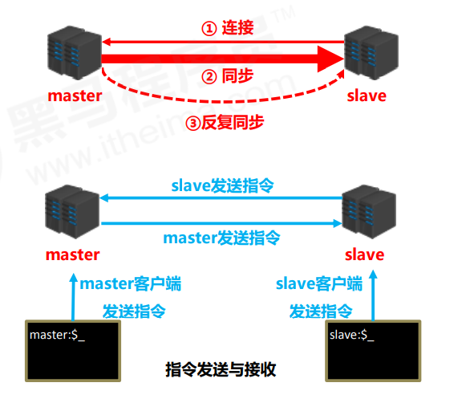

可以搭建主从复制来保证Redis的高可用。

访问压力大的时候可以配置多个读Redis节点，集群配置。Redis高可用那一套在分布式那一节。

#### Redis哨兵机制有了解过吗？ 

> 这个问题和Redis高可用都是被蚂蚁问到过的。

哨兵(sentinel) 是一个**分布式系统**，用于对主从结构中的每台服务器进行**监控**，当出现故障时通过投票机制**选择**新的master并将所有slave连接到新的master。


1. 监控:检查master 和slave是否正常运行。

2. 通知:当被监控的服务器出现问题，向其他哨兵服务器，发送通知以确认监控服务器的异常。

3. 自动故障转移（选举）:断开master与slave的连接，选举一个新的slave作为master，将其他slaver连接到新选举的master，告知客户端服务器地址。


> 注意：哨兵也是一台redis服务器，只是不提供数据服务，配置哨兵一般位单数。

#### Redis集群（Cluster）模式有了解过吗？ 

**解决了什么问题**：Redis cluster是为了提升Redis的并发量，让多台redis机器共同承担缓存压力。它**支持水平扩展**，也就是通过增加节点数量来提高处理能力和容量，以此来满足大规模应用的需求。

**如何分片**：Redis Cluster 通过分片（sharding）来存储数据。每个节点负责维护整个数据集的一部分，这部分数据被称为一个片段（shard）。例如，如果你有 6 个节点，你可以将你的数据分成 6 个片段，每个节点维护一个片段的数据。

**为什么 Redis Cluster 的哈希槽是 16384 个**： 在 Redis Cluster 中，哈希槽的数量固定为 16384，这是为了使分片操作更均匀、更容易管理。16384 是 2 的 14 次方，是一个比较合理的数字，因为它既不是太大也不是太小。太大的哈希槽数可能会带来管理上的复杂性，太小的哈希槽数可能会导致数据分布不均。

**如何确定给定 key 的应该分布到哪个哈希槽中？**：Redis Cluster 使用了 CRC16 算法对 key 进行**哈希运算**，然后将结果对 16384 取模，得到的结果就是 key 对应的哈希槽。

**Redis Cluster 支持重新分配哈希槽吗**：Redis Cluster 支持哈希槽的重新分配。如果你添加、删除或移动节点，Redis Cluster 可以将哈希槽从一个节点移动到另一个节点，以重新平衡数据分布。这种重新平衡的过程可以在不停机的情况下完成。

**Redis Cluster 扩容缩容期间可以提供服务吗？**Redis Cluster 在扩容或缩容期间依然可以提供服务。在哈希槽被重新分配的过程中，Redis Cluster 可以继续处理客户端请求。这使得 Redis Cluster 能够实现无停机时间的容量调整。

> Redis Cluster在扩容和缩容期间仍可以提供服务，原因主要有两方面：
>
> 1. **数据分片**：Redis Cluster通过将数据划分为16384个哈希槽的方式进行数据分片。每个节点负责维护一部分哈希槽及其对应的数据。当进行扩容或缩容时，只需将一部分哈希槽从一个节点迁移到另一个节点。在这个过程中，其他未被迁移的哈希槽和对应的数据仍可对外提供服务。
> 2. **异步迁移**：在Redis Cluster扩容和缩容过程中，哈希槽的迁移是异步进行的，不会阻塞当前的数据读写操作。Redis Cluster支持在数据迁移过程中同时处理客户端的请求，因此扩容和缩容过程对服务的影响非常小。

**Redis Cluster 中的节点是怎么进行通信的**：Redis Cluster 中的节点使用了一种叫做 Gossip 的协议来通信。在这种协议中，每个节点会周期性地与其他节点交换信息，包括它们所负责的哈希槽范围、数据的版本等。这种通信方式使得每个节点都能了解到整个集群的状态，同时也支持集群中节点的动态添加和移除。

#### Redis常用命令

**String数据操作**

```
--添加修改数据
set key value
--获取数据
get key
--删除数据
del key
--添加多个数据 
mset  key1 value1 key2 value2 key 
--获取多个数据
mget  key1 key2
--获取数据字符个数
strlen  key
--追加信息，有就追加，没有就新建
append key value
--键key不存在时将key的值设置为value 若存在则不变
setnx key value

```

**hash数据操作**

```
--添加修改数据
set key value
--获取数据
get key
--删除数据
del key
--添加多个数据 
mset  key1 value1 key2 value2 key 
--获取多个数据
mget  key1 key2
--获取数据字符个数
strlen  key
--追加信息，有就追加，没有就新建
append key value
--键key不存在时将key的值设置为value 若存在则不变
setnx key value

```

**List数据操作**

```
--添加修改数据 左添加，右添加
lpush key value1  [value2]
rpush key value1    [value2]

--获取数据
lrange key start stop
lindex key index
llen key

--获取并移除数据
lpop key
rpop key

-- 规定时间获取并移除数据,在timeout 时间内取数据（可以阻塞一段时间），有数据就取无数据就等待，
blpop key1 [key2] timeout
brpop key1 [key2] timeout

```

**Set数据操作**

```
--添加数据
sadd key member1 [member2]
--获取全部数据
smembers key
--删除数据
srem key member1 [member2]
--获取集合数据总量
scard key
--判断集合中是否包含指定数据
sismember key member

```
**Zset数据操作**

```
--添加数据
zadd key score1 member1 [score2 member2] -- 用score这个字段来排序

--获取全部数据
zrange key start stop [withscores]
zrevrange key start stop [withscores]

--删除数据
zrem key member [member ...]

--按照条件获取数据
zrangebyscore key min max [withscores] [limit]
zrevrangebyscore key max min [withscores]

--条件删除数据
zremrangebyrank key start stop
zremrangebyscore key min max 
```

**Key通用操作**

```
--删除指定key
del key

--获取key是否存在
exists key

--获取key的类型
type key

--为指定key设置有效期
expire key seconds
pexpire key milliseconds
expireat key timestamp
pexpireat key milliseconds-timestamp

--获取key的有效期
ttl key    
pttl key

--切换key从失效性转换为永久性
persist key

-- 为key改名
rename key newkey
-- 如果不存在这个名字再改
renamenx key newkey

-- 对所有key排序，再list，set，zset中。
sort

-- 其他key的通用操作，可以使用tab键进行切换
help @generic

```


#### Redis场景设计题

##### 快手的主播热度排行榜怎么实现。

使用 **Redis有序集合（Sorted Set）**，以主播ID为成员（Member），实时热度值作为分数（Score），实现高效更新与排序。

**示例场景：**

用户赠送礼物 → `ZINCRBY`实时更新分数 → 定时Lua脚本衰减旧数据 → 前端查询Top 10主播。

##### 海量用户，怎么实现检查每天签到的用户有哪些，检查某个用户某天是否签到了。

**Redis Bitmaps**：利用 **每个用户1bit** 的超低存储特性，实现高效签到记录与查询。

**记录签到：**

```
# 用户ID为10086在2023-10-01签到
SETBIT sign:20231001 10086 1
```

**查询签到**

```
GETBIT sign:20231001 10086  # 返回1（已签到）或0（未签到）
```

随着用户数量不断增多，可以用分片策略进行扩展。

##### 大Key问题

大Key问题指的是那些存储的数据量非常大的Key。这样的Key不仅消耗大量的内存资源，而且在执行某些操作（如删除、替换）时可能会导致阻塞，影响其他Key的操作。

解决方案

1. **数据拆分**：将大数据分割成小块，分别存储。
2. **定期清理**：定期清理不再需要的大Key数据。
3. **合理设计数据结构**：避免不必要的复杂数据结构，减少单个Key的大小。
4. **压缩数据**：使用压缩算法减少数据占用的空间。
5. **异步处理**：对于涉及大Key的操作，采用异步处理机制，避免阻塞主线程。

#### 如果库存只有一个key，大量访问怎么（热点Key）？

当库存信息仅由一个Key表示，并且面临大量并发访问时，库存Key很容易成为热点Key。在这种情况下，需要采取适当的策略来优化系统性能并保证库存数据的一致性和正确性。以下是一些具体的解决方案及其实施方法：

##### 解决方案

1. **库存预热**
   - 在系统启动或特定时间点预加载库存数据到缓存中，减少首次访问时的延迟。
2. **库存数据分片**
   - 将库存数据按照某种规则（如商品ID的哈希值）分成多个Key，分散访问压力。
3. **限流**
   - 对访问库存接口的请求进行限流，控制单位时间内允许的最大请求数量。
4. **异步处理**
   - 对于库存更新操作，采用异步方式处理，避免阻塞主线程。
5. **读写分离**
   - 对于读多写少的场景，可以将读操作和写操作分离，减轻写操作对数据库的压力。
6. **库存锁定**
   - 在进行库存扣减操作时，先尝试获取一个锁，只有获得锁的请求才能进行库存操作。

## 分布式微服务重要组件

- 注册中心：Nacos，ZooKeeper，Eureka
- 配置中心：Nacos，Apollo
- 远程调用：
  - RESTful API：Feign
  - RPC：gRPC，Dubbo

- 网关：Netflix Zuul，SpringCloud Gateway
- 服务熔断、降级、限流：Sentinel，Hystrix
- 分布式事务：Seata
- 消息队列，异步通信：RabbitMQ，RocketMQ，Kafka

### 理论&算法&协议

#### CAP理论

> P一定要实现，C和A只能选一个。

- CAP的含义：
  - C：Consistency，**一致性**，所有的节点在同一时刻看到相同的数据。
  - A：Availability，**可用性**，即使某些部分不可用，系统仍然能够正常运行并返回结果。
  - P：Partition Tolerance，**分区容错性**，尽管网络中存在部分消息丢失或延迟的情况，系统依然能够继续运作。
- **网络分区**：
  - 一个分布式系统，节点组成的网络应该是联通的，可能因为一些故障，变得不连通了，整个网络分成了多个区域。
  - 因为我们考虑的是分布式系统，肯定会有网络分区。
- **如何保证P**：如果完整的数据散落在多个不连通的分区中，那么有的分区就访问不到某些数据，无法保证P。**把数据复制到多个节点，能够保证P，数据存在的节点越多，分区容错性越高**。
- 如果不是分布式系统，是可以做到CA兼得的。因为考虑的是分布式系统，所以必须要做到P。
- CAP的内容：
  - 在P的基础上，无法同时保证C和A。**只能保证CP或者AP**。
  - 当追求一致性（C）时，为了确保所有节点上的数据副本在任何时间点都是准确且相同的，系统必须在数据完全同步之后才响应客户端请求。这期间，如果存在网络分区，部分节点可能暂时无法访问最新的数据，从而影响系统的可用性（A），因为某些请求可能不得不等待直至数据同步完成才能得到处理。
  - 反之，若优先保证可用性（A），即使在网络分区导致的数据不一致情况下，系统也会立即对请求作出响应，但这意味着不同节点间的数据可能暂时出现不一致的情况，从而牺牲了一致性（C）。
- 分布式注册中心组件中：ZooKeeper保证CP，Eureka保证AP，Naco支持CP架构或AP架构。

#### BASE理论

- BASE是CAP的延申。

- BASE理论是传统ACID模型的反面，ACID强调强一致性，但是BASE牺牲了强一致性，追求最终一致性。

- BA：Basically Available，**基本可用**，在发生故障时，允许损失部分可用性。

  - **响应时间上的损失**：系统响应时间延长。
  - **系统功能上的损失**：非核心功能可以暂时无法使用。

- S：Soft-state，**软状态**，数据存在不一致的中间状态。

- E：Eventually Consistent，**最终一致**，业内比较推崇的。

  - 一致性的三种级别：
    - 强一致性：系统写入什么，读出来就是什么。
    - 弱一致性：不一定读到写入的最新值，也不之后一定一致，只是尽力保证。
    - 最终一致性：是弱一致性的特殊形式，不一定读到写入的最新值，如果某个对象没有新的更新，最终所有的访问结果将一致。

  - 保证最终一致性的手段：
    - 读时修复：读取数据时检测副本一致性并修复。
    - 写时修复：写入数据时检测副本一致性并修复。
    - 异步修复：通过定时对账检测副本一致性并修复。

#### Paxos

- Paxos算法是第一个被证明完备的**分布式系统共识算法**，或是**分布式一致性算法**，解决分布式的一致性问题。共识算法的作用是让分布式系统中多个节点对某个提案（proposal）达成一致的看法。提案有很多种，比如谁是leader，比如多个事件发生的顺序。
- Paxos算法包括Basic Paxos和Multi-Paxos。Multi-Paxos是对一系列共识达成一致，实际上就是执行多次Basic Paxos。
- Basic Paxos中的三种角色，一个节点可以身兼数职：
  - **提议者（Proposer）**：负责接收客户端请求并提出提案，提案包括提案id和value。
  - **接受者（Accepetor）**：负责对提案投票。
  - **学习者（Learner）**：当提案超过半数投票成功，学习者执行提案并返回客户端结果。
- Basic Paxos流程：
  - **准备阶段（Prepare）**
    - 提议者准备提案id和value，作为**prepare请求**发给接受者超过半数的子集。
    - 接受者收到prepare请求后，如果提案id大于**已经响应过prepare请求的提案**中最大的那个，就给提议者响应，**并且此后不会再接受id小于该提案id的prepare请求和accept请求**。
  - **接受阶段（Accept）**
    - 如果提议者收到半数以上的接受者对prepare请求的响应，那么就会发送该提案的accept请求给接受者。
    - 接受者收到accept，如果没有响应过id更大的prepare请求，那么就会响应这个accept请求。
  - 当提议者收到半数以上接受者对于该accept请求的响应，提案通过，发给学习者。
  - **相当于是接受者会维护一个响应过的prepare提案的max id，之后只会响应更大的prepare请求和accept请求。**


#### Raft

leader选举，日志复制

- Raft中的基础概念

  - 节点类型：

    - **leader**：负责发起心跳，响应客户端，创建日志，同步日志。
    - **candidate**：选举过程中的临时角色，由follower转化而来，参与竞选。
    - **follower**：接受leader心跳和向leader同步日志，投票给candidate。

  - 任期

    - Raft算法把时间分为一个一个任期（term），每个term有自己的编号。term一开始都是选举，一个或多个candidate会参与选举。如果没有leader产生，就会立马开启下一次term，进行选举。

    

  - 日志：多个事件的集合。

- **leader选举**

  - **Raft使用心跳触发选举。**当一个或多个follower收不到leader的心跳后，会认为此时没有可用的leader，于是增加自己的term号，成为candidate，并向所有节点发起选举请求。
  - candidate的身份会保持到：自己当上leader；别的candidate当上leader；无leader产生。
  - 如果一个candidate在等待选票时，收到了别的节点作为leader给自己的心跳，会做以下判断：
    - 这个节点的term号小于自己的term号，那么说明这个leader过时了，则会拒绝请求并让这个节点更新term；
    - 这个节点的term号大于等于自己的term号，那么自己退选，变成follower。

- **日志复制**

  - leader会负责同步日志，会用自己的日志强制覆盖follower日志中不同的部分。


### 注册中心

#### 1 注册中心作用

- 注册中心用于管理和维护分布式系统各个服务的**地址**和**元数据**，用于**服务发现**和服务**注册**。
- 作用：
  - **服务注册**：各个服务在启动时向注册中心注册自身网络地址、服务元数据、实例信息。
  - **服务发现**：某个服务调用别的服务时，通过注册中心获取目标服务的可用实例列表。
  - **负载均衡**：同一个服务可能有多个实例，注册中心可以将请求对应到不同实例上，实现负载均衡。
  - **健康检查**：注册中心能够监控服务实例的状态，当实例故障或者下线时，可以及时更新注册信息。
  - **服务治理**：通过注册中序可以实现服务路由，灰度发布，流量治理等操作。

#### 2 不同注册中心

- Eureka，Zookeeper，Nacos，最大的区别是Eureka支持AP，Zookeeper支持CP，Nacos可支持AP或CP。

#### 3 Eureka实现原理

- 几个注册中心大同小异。
- **服务注册发现**：服务实例启动时，会向注册中心注册信息；服务消费者可以通过注册中心提供的接口查询服务对应的可用实例。
- **服务健康检查**：注册中心通过心跳机制检测服务实例健康状态，实例通过定时向注册中心发送心跳保活，否则会被注册中心从服务列表中移除。
- **服务负载均衡**：注册中心client会从本地缓存中先查询服务注册信息，如果没有则向注册中心server获取实力列表。拿到列表后，注册中心client可以进行负载均衡选择实例。

#### 4 Eureka保证高可用


- 三个方面：
  - **多实例部署**：部署在不同节点上，某个故障，另外的还能用。
  - **服务注册信息复制**：每个Eureka实例保持与其他实例相同的注册信息。
  - **自我保护机制**：Eureka实例一段时间内没接收到心跳时，进入自我保护，不能删除注册信息，防止网络抖动等情况导致的误删除。

### 配置中心

#### 1 配置中心作用

- 为分布式系统的服务提供动态化配置管理，比如数据库连接地址，日志级别等。

#### 2 Nacos原理

- 其实就是配置信息的CRUD


1. **配置注册**：Nacos client在启动时向Nacos server注册配置信息，server将其存入数据库，并生成版本号。
2. **配置存储**：Naocs server使用内嵌Derby数据库存储配置信息，也可以通过MySQL等别的数据库。
3. **配置获取**：Nacos client通过API从server获取配置信息。
4. **配置变化监听**：Nacos client通过监听器监听自己所需配置的变更

#### 3 Nacos长轮询

- 客户端和服务端的交互一般分为推（push）和拉（pull），Nacos在pull基础上添加了长轮询机制，降低服务端压力，避免大量连接占用资源。
- 流程：

1. 客户端发起pull请求，服务端检查配置是否变更。如果没有变更，设置一个定时任务，并将客户端的pull请求加入等待队列。
2. 等待期间，如果配置变更，会触发一个事件机制，server会遍历等待队列，向发生变更的配置项对应的client发送变更后的配置。
3. 等待期间如果配置未变更，那么定时任务执行，返回未变更结果。


### 远程调用

[一起写个Dubbo_何人听我楚狂声的博客-CSDN博客](https://blog.csdn.net/qq_40856284/category_10138756.html)

#### 1 HTTP和RPC

- HTTP：超文本传输协议，是应用层的一个协议。
- RPC：Remote Procedure Call，远程过程调用，是一种调用方式。
- 异同：
  - **传输协议**：HTTP基于TCP协议，RPC底层支持多种协议，比如TCP、UDP、HTTP（grpc基于HTTP2.0）等。
  - **接口定义**：HTTP使用RESTful风格接口定义，比如GET、POST、PUT、DELETE，是一种松散的定义；RPC使用IDL（接口定义语言）定义，比如Protocol Buffers，对接口有强约束性。
  - **跨语言性**：都支持跨语言。
  - **灵活性**：HTTP灵活，适用于不同场景，比如Web开发，API调用；RPC性能好，适用于需要低延迟的分布式系统。
  - **序列化方式**：HTTP一般序列化为JSON，RPC有多中序列化方式，比如pb，hessian，RPC的序列化一般序列化为二进制字节流，性能更好。

#### 2 RPC原理


- RPC角色

  - **客户端（服务消费端）**：调用远程方法。
  - **客户端Stub（桩）**：实际上是个代理类，负责把调用的类、方法、参数等信息打包成网络消息，通过网络传输给服务端。

  - **网络传输模块**：负责底层传输，可以是TCP也可以是HTTP等。

  - **服务端Stub（桩）**：接受客户端发送的请求消息，解包，调用本地方法处理。

  - **服务端（服务提供端）**：提供方法实现。

- 调用流程：

  1. **客户端**调用RPC方法；
  2. **客户端Stub**将调用类、方法、参数**序列化**后，网络传输给**服务端Stub**；
  3. **服务端Stub**将消息反序列化；
  4. 调用**服务端**本地服务进行业务处理，得到结果；
  5. **服务端Stub**将消息序列化后，网络传输给**客户端Stub**；
  6. **客户端Stub**将消息反序列化；
  7. **客户端**得到结果。

#### 3 Dubbo时间轮

- 在Dubbo中，为了增强系统容错能力，有监听机制监听RPC的调用超时，如果超时会把结果返回给应用层。一般可以考虑使用定时任务定时轮询扫描所有调用的返回结果（Future），但是这样会增加很多不必要的遍历开销。
- 因此，Dubbo引入了时间轮算法解决这个问题。
- 时间轮算法：
  - 时钟被分为多个槽位，事件被放在槽中。指针每隔一个固定时间向前走，走到哪个槽内，就出发槽内的时间。
- 用途：调用超时检查；和注册中心的定时心跳任务。

#### 4 Feign和Dubbo

- 区别：

|          | Feign                                       | Dubbo                                        |
| -------- | ------------------------------------------- | -------------------------------------------- |
| 定义     | 声明式的Web服务客户端，用于简化HTTP API调用 | 分布式服务框架，用于构建面向服务的微服务架构 |
| 通信方式 | 基于HTTP协议，使用RESTful风格接口定义和调用 | 基于RPC协议，支持多种序列化协议，默认hessian |
| 服务发现 | 通常结合注册中心进行服务发现和负载均衡      | 同                                           |
| 跨语言性 | 支持跨语言                                  | 支持跨语言                                   |

#### 5 Feign特点

- **声明式API**：支持使用注解定义URL，HTTP方法等。
- **集成负载均衡**：集成Ribbon进行负载均衡，可以根据服务名和可用实例动态路由，提高系统可用性和伸缩性。
- **容错机制**：支持Hystric容错框架，能够服务熔断降级，防止下游服务阻塞。

- **能实现认证传递**：通过自定义拦截器，将认证信息添加到请求头中。

#### 6 有了HTTP为什么还要RPC


- **使用纯裸TCP的问题**：服务端和客户端之间连接基于**纯裸TCP连接**。TCP连接有三个特点：面向连接、可靠、基于字节流。因为面向字节流（01），每个用户数据报之间没有边界，容易产生**粘包问题**。因此最常用的避免粘包的方法是在**消息体前加入消息头表示接下来的消息数据长度**。因此基于TCP衍生了多种协议，比如HTTP和RPC
- 多年以前，HTTP适用于B/S架构，RPC适用于C/S架构（因为自家软件可以自家定义传输接口），不过后来B/S和C/S在慢慢融合，比如百度网盘有网页端也有PC端，于是RPC退居幕后，作为企业内部微服务之间的通讯协议。
- **使用RPC原因1**：RPC和HTTP都是基于TCP，消息都分为**请求头**和**请求体**，HTTP的请求头中内容比较复杂，有的是用于考虑浏览器行为的，比如重定向跳转等。HTTP请求头中很多内容企业微服务通信头用不到，并且使用**JSON做序列化**，而相比之下，**RPC使用ProtoBuf做序列化，且没有冗余信息，体积小性能好**。因此RPC还是多用在企业内微服务通信。
- **使用RPC原因2**：HTTP的RESTful风格是一种松散的定义，但是IDL强约束了接口和参数。
- HTTP2.0在1.1基础上做了优化，但是出现得太晚，企业中已经用上了RPC了。

#### 7 OpenFeign

- OpenFeign是一个声明式的http客户端，是SpringCloud基于Eureka开源的Feign基础改造而来的。能够基于SpringMVC的常见注解，优雅地实现http请求发送。

#### 8 序列化和反序列化协议

- RPC协议跨语言，本质上就是在解决序列化/反序列化问题

1. **JSON**：key-value形式，是一种**文本型**序列化框架。
   - **序列化额外空间开销较大**，使用字符串形式保存键值对。
   - JSON**没有类型**，对于Java这种强类型语言需要反射解决类型的判断问题。
2. Hessian
3. kyro
4. **Protobuf**
   - 优点：
     - 序列化后体积比JSON小很多；
     - IDL能强约束接口参数，清晰描述接口；
     - 包含类型，不用反射获取类型；
   - 缺点：
     - 不支持null；
     - 浏览器支持性不好；

#### 9 RPC心跳

#### 10 gRPC和Dubbo

- **传输协议**：gRPC使用HTTP2.0作为底层传输协议。有很多相比于HTTP1.x更强大的功能，比如**多路复用**、**头部压缩**等；Dubbo使用TCP作为传输协议。
- **序列化方式**：gRPC使用protobuf作为IDL进行消息序列化和反序列化，经过protobuf序列化和反序列化的消息体积很小，再加上HTTP2.0的加持，性能很好。但是protobuf序列化后是二进制数据，不像JSON那样可读性强。Dubbo默认Hessian，可以扩展别的序列化方式。
- **跨语言**：gRPC客户端和服务端可以是不同语言实现的；Dubbo只能用于Java。


### 网关-Spring Cloud Gateway

#### 1 网关基本概念


- 网关是什么：
  - 网关是**客户端（比如前端）访问系统请求及系统响应所要经过的网络关口**，网关封装了系统内部功能架构，为每个客户端访问提供不同的接口。网关在功能上主要是进行请求过滤，具体包括请求路由转发、安全认证、流量控制、负载均衡、日志、监控等功能。
  - 网关也可以是一个微服务，介于服务端和后端其他微服务之间。
- 网关的作用：
  - **实现通用功能**：在分布式系统尤其是微服务架构中，一个应用系统被拆分为多个服务，但是像路由请求、安全认证、流量控制、日志和监控等**通用功能**对每个服务来说都是标准的功能模块。如果没有服务网关，那么每个服务就需要单独实现一套这样的模块，功能重复并且不利于统一管理
  - **动态路由**：根据请求路由到对应的服务上去，如果服务不可用还会有重试机制。多个微服务可能部署在不同的服务器上，有很多ip地址和端口，传统的直接访问应用服务的方式增加了客户端的复杂度，因此需要一个**统一的客户端访问入口**进行标准化管理。比如前端不用向多个ip和端口发送请求，向网关发送即可.
    - **负载均衡**：多服务器提供同一种服务，网关会从配置中心拉取各服务注册信息，然后将请求负载到这些服务器进行处理		
  - **流量控制**：限制并发请求的流量，避免内部系统受到冲击
  - **安全认证**：网关对相关权限验证、脱敏和流量清洗、签名和黑名单功能
  - **熔断降级**：当服务不可用或者访问量过大，网关可以将请求做降级，将流量打到其他服务器或者做其他处理，提示用户暂时不可用
  - **灰度发布**：先进行小部分服务器升级，通过网关将少量的服务路由到已升级的服务器用来测试服务是否正常，大部分请求依旧在老版本服务器上处理
  - **日志服务**：服务访问情况监控和统计报表，请求的吞吐量、并发数、流量监控、性能监控和日常告警等

#### 2 Spring Could Gateway工作流程

1. **路由判断**：配置文件中可以为路由配置**断言**，用于过滤请求的url。客户端的请求到达网关后，会根据路由规则去匹配，映射到对应的后端服务。
2. **请求过滤**：Pre-Filters组成的过滤器链对请求进行过滤。
3. **服务处理**：后端服务对请求处理。
4. **响应过滤**：Post-Filters组成的过滤器链对响应进行过滤。
5. **返回响应**

#### 3 Spring Cloud Gateway的路由和断言


- 一个服务的路由可配置多个断言。当配置了多个断言时，请求必须满足所有断言才能路由到对应服务。
- 一个请求如果满足多个服务路由条件，会被映射到第一个匹配上的服务。
- Spring Cloud Gateway可以通过Nacos实现动态路由，更改断言后可以不用重启服务，网关层的服务不能随意重启。

#### 4 Spring Cloud Gateway过滤器有哪些

- 按照请求/响应分：
  - **Pre类型**
  - **Post类型**
- 按照作用范围分：
  - **GatewayFilter**：局部过滤器，只在单个或部分路由上生效，常用的比如AddRequestHeader Filter，可以添加token。
  - **GlobalFilter**：全局过滤器，常用的比如LoadBalanceClient Filter，整合Ribbon实现负载均衡。


### 分布式ID

#### 分布式ID介绍

- 分布式 ID 是分布式系统下的 ID。当表中的数据量过大时，要进行分库分表，分库之后，数据分布在不同的服务器上，数据库的自增主键已经没办法满足生成的主键唯一了，就引入了分布式ID。

- 分布式ID要满足的的要求

  

  - **高可用**：ID服务的可用性要无限接近100%。
  - **高性能**：生成ID速度要快，资源消耗要小。
  - **全局唯一**
  - **方便易用**：拿来即用。

- 更多要求还有**安全性**（不能一眼看出业务机密，比如订单数量），**拥有具体业务含义**，**有序性**（建立MySQL索引后插入不会页分裂）

#### 数据库实现

- 利用关系数据库比如MySQL的自增主键来实现；有的使用号段模式，一次申请一段ID，存放在内存中使用。开源实现框架有滴滴的Tinyid
  - 优点：实现简单，ID有序递增，消耗空间小。
  - 缺点：数据库单点，支持的并发量不大，如果要集群，复杂度会提升；没有具体业务含义，有安全问题（比如订单号递增，可以算出一天的订单量）。
- NoSQL，比如Redis的`incr`来生成。
  - 优点：性能比数据库自增主键好。
  - 缺点：和数据库自增主键差不多。

#### UUID

- 一种JDK自带的全局唯一ID生成方法。
  - 优点：简单易用，生成速度快。
  - 缺点：存储空间消耗大（128bit）；利用了MAC地址来生成，有MAC地址泄露风险；无序

#### 雪花算法

- 一共64bit的分布式ID生成算法，具体实现的开源框架有美团的Leaf（世界上没有相同的两片树叶）。
- 使用 **符号位**（1bit）+**时间戳**（41）+（**机房号**+**机器号**）（10）+**序列号**（12） 生成。
- 时间戳41bit，2的41次幂ms，大概能用69年。
- 序列号12bit，最高的生成并发数为2的12次幂，4096个线程在1ms内并发生成。
  - 优点：生成速度块；ID有序递增；比较灵活，可以改造后加入业务含义。
  - 缺点：强依赖时间戳，单机的时候是递增的，但是在**分布式集群中无法单调递增，只是整体趋势递增**，需要解决**时钟回拨**带来的重复ID问题。
- 时钟回拨指的是时间被调整回之前的时间，导致雪花算法可能发生重复。遇到直接抛异常，因为是算法的问题，然后可以延迟等待一小段时间再生成。


### 分布式锁

#### 1 分布式锁是什么

- JDK 自带的 **本地锁** 来控制一个 JVM 进程内的多个线程对本地共享资源的访问。
- 分布式系统下，不同的服务/客户端通常运行在独立的 JVM 进程上。如果**多个 JVM 进程**共享同一份资源的话，使用本地锁就没办法实现资源的互斥访问了。于是，**分布式锁** 就诞生了。分布式锁保证了多个线程不在同一个 JVM 进程中也能获取到同一把锁，进而实现共享资源的互斥访问。
- **分布式锁三个特性**：
  - 互斥
  - 避免死锁
  - 容错：避免单点故障，锁服务的可用性。

#### 2 分布式锁常见实现方案

##### 2.1 关系型数据库（如MySQL）实现

- 通过MySQL的唯一索引或者排他锁实现，性能低，并且没有锁失效机制。

##### 2.2 Redis分布式锁

- 使用`SETNX`命令。

  - `SETNX`可以实现互斥，业务逻辑执行前先去Redis`SETNX`，执行完再去`DEL`这个key。
  - 缺点：锁可能无法释放，如果业务逻辑还没执行完，宕机了，那么当前线程就无法正常删除锁。

- 给锁设置**超时时间**，使用`SET NX EX`命令。

  - 为了避免锁无法释放，可以给锁加上超时时间。
  - **要保证加锁和加超时时间是原子操作**，否则仍然可能导致锁无法释放。比如线程A加了锁，宕机了，没有加超时时间。
  - 缺点：如果过期了业务还没执行完，可能导致锁误删除。比如线程A因为某些原因在超时时间内无法完成业务，然后锁自动释放了，此时线程B加上了锁。然后线程A业务做完了，释放了锁，此时线程A删掉的实际上是线程B的锁。

- **让线程只能删除自己的锁**，给锁设置value为UUID之类的。

  - 删除锁之前通过value，类似CAS检查当前的锁是不是自己加的锁，是的话就可以删除。
  - 缺点：仍然有可能业务还没执行完锁过期，别的线程拿到锁。

- **锁自动续期-Redisson**

  - 通过一个Watch Dog线程，不断检查操作共享资源的线程是否执行完成，来进行锁的续期。
  - 如果宕机了，Watch Dog线程就不会继续续期，到期了锁会自动释放。

- **Redlock算法**

  - Redis集群下，如果主节点获取到锁之后没来得及同步给其他节点就挂了，会导致多个应用服务获取到锁。

  - 因此有了Redlock算法，客户端向Redis集群中多个独立的Redis实例一次申请加锁，如果超过半数的实例能成功加锁，那么客户端就成功获得分布式锁。

  - 但是这种方案性能比较差，因此实际中不用。

  - Redlock 是直接操作 Redis 节点的，并不是通过 Redis 集群操作的，这样才可以避免 Redis 集群主从切换导致的锁丢失问题。

    > 为什么半数加锁成功就可以？因为每次都要加锁成功半数以上，假如客户端1加锁成功后，客户端2在未同步的Redis上加锁不可能超过半数，因为客户端1已经加锁了一半了。
    >
    > 但是，还是不能解决故障重启后带来的锁的安全性的问题。你想一下下面这个场景：
    >
    > 我们一共有 A、B、C 这三个节点。
    >
    > 1. 客户端 1 在 A，B 上加锁成功。C 上加锁失败。
    > 2. 这时节点 B 崩溃重启了，但是由于**持久化策略**导致客户端 1 在 B 上的锁没有持久化下来。
    > 3. 客户端 2 发起申请同一把锁的操作，在 B，C 上加锁成功。
    > 4. 这个时候就又出现同一把锁，同时被客户端 1 和客户端 2 所持有了。

    综上所述：

    RedLock的缺点有：

    1. 不能解决故障重启后带来的锁的安全性。如上引用
    2. 持有锁的线程可能会超过过期时间，可能会导致两个客户端同时持有锁。(可通过自动递增的令牌来解决。)
    3. 严重依赖时钟。

    > 1. 客户端 1 从 Redis 节点 A, B, C 成功获取了锁。由于网络问题，无法访问 D 和 E。
    > 2. 节点 C 上的时钟发生了向前跳跃，导致它上面维护的锁过期了。
    > 3. 客户端 2 从 Redis 节点 C, D, E 成功获取了同一个资源的锁。由于网络问题，无法访问 A 和 B。
    > 4. 现在，客户端 1 和客户端 2 都认为自己持有了锁。

##### 2.3 ZooKeeper分布式锁

- 利用ZooKeeper的临时顺序节点来实现锁。
- 如果获取锁失败，客户端不会一直循环加锁，而是在前一个节点注册一个事件监听器。
- 临时节点的生命周期是和客户端会话绑定的，会话消失则消失。如果客户端宕机，zk也会释放这个节点。
- 使用临时顺序节点，是因为顺序节点的创建有顺序性，只需要用zk的Watcher（事件监听器）在前一个节点上监听即可，前一个节点的锁被释放，就可以竞争锁。


### 服务保护容灾

#### 1 雪崩效应

- **雪崩效应是什么**：
  - 在微服务架构中，微服务是完成一个单一的业务功能，这样做的好处是可以做到解耦，每个微服务可以独立演进。
  - 一个应用可能会有多个微服务组成，微服务之间的数据交互通过远程过程调用完成。这就带来一个问题，假设微服务A调用微服务B和微服务C，微服务B和微服务C又调用其它的微服务，这就是所谓的扇出。
  - 如果扇出的**链路上某个微服务的调用响应时间过长或者不可用**，对微服务A的调用就会**占用越来越多的系统资源**，进而**引起系统崩溃**，即所谓的**雪崩效应**。
- **解决方案**：
  - **请求限流：**
    - 通过对**并发请求进行限速**或者**一个时间窗口内的的请求进行限速**来保护系统，一旦达到限制速率则可以拒绝服务（定向到错误页或告知资源没有了）、排队或等待（比如秒杀、评论、下单）、降级（返回兜底数据或默认数据，如商品详情页库存默认有货）。
    - 令牌桶算法、漏桶算法。
  - **线程隔离**
    - 控制业务可用的线程数量，把每一个业务可用的资源（线程数）隔离开，将故障隔离在一定范围内。
    - 比如**业务1需要服务A调用服务B**，**业务2需要服务A调用服务C**。此时服务C出现故障，服务A调用服务C的请求一直卡住，tomcat服务器线程一直分配给业务2，最终导致系统崩溃，影响了无故障的业务1调用链路。
    - 此时可以限制线程数量，比如限制业务1只能用10个tomcat线程，业务2只能用10个，这样依赖业务2由于服务C故障，10个线程用完，也不会侵占业务1的10个线程。
  - **服务熔断和降级**
    - 服务熔断：将异常比例高的，或者慢调用比例高的接口断开，拒绝所有请求，返回默认值或者错误信息。可以使用SpringCloud集成的Netflix Hystrix。
    - 服务降级：熔断拒绝了请求后，用一个fallback兜底策略，保证核心功能，去掉非必需的功能，返回一些默认数据、或使用备用方法返回缓存数据、或执行简化逻辑，而并非 server error 这样不友好的提示。

#### 2 Hystrix如何实现服务容灾

- **服务熔断（Circuit Breaker）**：服务的错误率或响应时间超过阈值，则熔断器打开，请求返回默认值或错误信息。
- **服务降级（Fallback）**：服务熔断打开后，可以提供一个备用的降级方法，可以在降级方法中编写降级逻辑，比如返回缓存数据，简化处理逻辑。
- **请求缓存（Request Caching）**：Hystrix可以缓存请求的结果，如果再有同样的请求，会返回缓存中的值，在高并发场景有效减少请求次数、提高性能。
- **请求合并（Request Collapsing）**：Hystrix可以将多个网络请求合并发送，减少网络IO次数。
- **实时监控和度量（Real-time Monitoring and Metrics)**：Hystrix提供服务监控，方便开发人员发现问题和解决问题。
- **线程池隔离（Thread Pool Isolation）**：Hystrix将每个服务的请求放在相互隔离的线程池中执行，当一个服务故障，请求积压，只会耗尽它所属的线程池的线程，不会耗尽服务器所有线程。

#### 3限流算法


##### 3.1 固定窗口

- 把时间划分为固定的窗口，每个窗口内限制请求次数。比如窗口粒度1s，设置计数器，每过1s计数器清零，如果计数器达到限制就不再处理请求。
- **优点**：简单。
- **缺点**：
  - **限流不够平滑**，比如限制qps60，前0.1s来了60个请求，后0.9s就无法处理请求了。
  - **无法处理流量激增，突刺**，比如限制qps60，窗口粒度是1s，那么如果60个请求在0.1s中到来，qps就变成了600.

##### 3.2 滑动窗口

- 窗口可以滑动，限流粒度更小，限制qps10，可以把1s划分为10个小格子，滑动窗口会随时间移动。划分越细，限流处理越平滑。

- **优点**：
  - 相比于固定窗口，限流更平滑，更精确。
- **缺点**：
  - 仍然不够平滑，划分再细也会有不平滑的情况。

##### 3.3 漏桶算法

- 请求类似水滴，进入桶，底部按照一定速率漏水（处理请求），桶能够容纳一定数量待处理请求，桶满了则新来的请求丢弃，类似MQ的削峰。
- **优点**：
  - 实现简单；可以控制处理速率（设置漏水速率）；
- **缺点**：
  - **请求可能积压**，导致后来的请求丢失；**处理速率固定**，无法应对激增的请求，也无法根据合理利用系统资源情况动态调整；

##### 3.4 令牌桶算法

- 固定速率生成令牌放入令牌桶，到来的请求要先从桶里获得令牌，获取不到令牌的请求在缓冲区等待，缓冲区满则丢弃。桶中的令牌数量也有最大上限。
- **优点**：限制平均速率（通过令牌生成速率）；可以应对激增请求（令牌桶里积攒的令牌）；
- **缺点**：需要考虑令牌生成速率和桶大小；实现较为复杂。

##### 3.5 漏桶和令牌桶

- **令牌桶=漏桶+令牌积攒**；漏桶的桶只是一个缓冲区，令牌桶里的缓冲区就相当于漏桶，令牌桶在这个缓冲区之后又加了另一个桶——令牌桶，相比于**漏桶的固定平均处理速率**，令牌桶通过**固定速率生成令牌**保证固定平均处理速率，又**通过令牌的积攒处理激增流量**，允许一次拿到多个令牌处理多个请求	。	
- 或者说漏桶就是没有令牌积攒的令牌桶。
- 漏桶：

- 令牌桶：


#### 5 限流实践

- 针对什么来进行限流？
  - 针对IP；业务ID（如用户ID）；系统指标（如QPS）
- 单机限流怎么做？
  - 单体架构应用中使用，可以用Guava RateLimiter
- 分布式限流怎么做？
  - **借助中间件**：比如Sentinel或者Redis（需要配合Lua脚本保证批量操作和原子性）
  - **网关**：比如SpringCloud Gateway提供限流，也是基于Redis+Lua的。

#### Guava RateLimiter

- 提供了基于令牌桶算法的限流器。

- ### 分布式事务

  #### Seata

  ##### 1 Seata概述

  - Seata也相当于是一个微服务。Seata的设计目标是对业务无侵入，是在无侵入的传统2PC上改进的。
  - 事务管理中有三个角色，其中，TC 为单独部署的 Server 服务端，TM 和 RM 为嵌入到应用中的 Client 客户端。
    - **TC（Transaction Coordinator）事务协调者**：维护多个全局和分支的事务状态，协助全局事务提交或回滚。TC和TM是一对多的关系。
    - **TM（Transaction Manager）事务管理者**：定义全局事务的范围，开始全局事务、提交或回滚全局事务。
    - **RM (Resource Manager) - 资源管理器**：管理分支事务处理的资源，向TC注册分支事务和报告分支事务的状态，接受TC命令提交或回滚分支事务。

  

  ##### 2 Seata执行流程

  1. 服务A的TM向TC申请开启一个全局事务，TC创建一个全局事务并返回唯一的XID；
  2. 服务A的RM向TC注册分支事务，这个事务会纳入XID管辖的事务之中；
  3. 服务A执行分支事务；
  4. 服务A调用服务B；
  5. 服务B的RM向TC注册分支事务，纳入XID管辖的事务中；
  6. 全局事务执行完后或者需要回滚时，TC协调所有分支事务。

  ##### 3 Seata模式

  - XA：两阶段提交。
  - AT：采用的也是两阶段提交，但是弥补了XA模式中资源锁定周期过长的缺点，但不保证强一致性，只保证最终一致性。回滚靠得是undo log。
    - RM注册分支事务后，会吧SQL更新前的快照和更新后的快照记录到undo log中，然后提交数据库事务（真实落库）。

  


  #### 1 分布式事务实现方案

  ##### 1.1 2PC（标准XA模型）

  - 2PC（two phase commit）两阶段提交，XA协议是一套分布式事务的处理规范，定义了分布式事务的处理接口。
  - XA协议中有三种角色：
    - AP（Application）：应用系统（服务）
    - TM（Transaction Manager）：（全局）事务管理器
    - 多个RM（Resource Manager）：资源管理器（数据库）

  

  - 2PC流程：
    - **准备阶段（Prepare phase）**：TM给每个参与者的RM发送prepare消息，通知每个数据库参与者在本地执行事务，并写undo/redo日志，此时事务并没有提交，RM返回本地事务执行结果给TM。
    - **提交阶段（Commit phase）**：如果TM收到了某个参与者的超时/失败消息，则通知所有RM消息回滚；否则通知所有RM消息提交。
  - 优缺点：
    - 优点：实现成本低，主流数据库都有实现。
    - 缺点：
      - **单点问题**：TM很关键，如果TM故障则有可能RM一直阻塞。
      - **阻塞问题**：所有RM都准备就绪前，准备快的资源会一直阻塞；网络问题导致TM的通知没给到RM的话，分支事务会阻塞。
      - **数据不一致**：最后TM通知各个RM提交事务，如果有的RM没收到提交通知，则会一直阻塞。

  ##### 1.2 3PC

  - 3PC是2PC的改进，能够解决单点问题和阻塞问题。和2PC不同，2PC中，参与者RM会一直等待TM的通知，否则会阻塞，3PC引入了超时机制，参与者会在等待TM超时后做出行动。

  

  - 3PC流程：
    - **CanCommit**：准备阶段，协调者向参与者发送CanCommit请求，如果参与者认为自身可以继续事务，则返回Yes响应。
      - 该阶段相当于提前检查协调者和参与者之间是否通信正常。
    - **PreCommit**：预提交阶段，协调者根据参与者的响应，决定是否进行预提交。发送PreCommit请求给参与者，参与者执行本地事务，并写入undo和redo记录。
      - **该阶段如果参与者接受请求超时，会直接回滚事务。**
    - **DoCommit**：提交阶段，协调者根据参与者的事务执行状态，决定是否提交。发送提交或者回滚消息给参与者。
      - **该阶段如果参与者接受请求超时，会直接提交事务**
  - 优缺点：
    - 优点：
      - 3PC相比于2PC，添加了一个CanCommit阶段，相当于把2PC的准备阶段拆成两个。3PC的CanCommit阶段，由于没有执行业务，没有占用参与者资源，是不会阻塞的，在这个阶段**可以确认协调者是否正常运行**。
      - 在PreCommit和DoCommit阶段，添加了**超时机制**，解决**单体故障**或者**网络不良**情况下的阻塞问题。
    - 缺点：
      - 仍然没有解决数据不一致问题。

  ##### 1.3 TCC

  - TCC（Try Confirm Cancel）
  - TCC流程：
    - **Try**：尝试执行，完成所有业务检查（一致性），预留事务资源（隔离性）。
    - **Confirm**：确认执行业务，使用预留的业务资源，需要保证幂等，失败会无限重试。
    - **Cancel**：取消执行，释放Try阶段预留的资源，需要保证幂等，失败会无限重试。
  - TCC把原本是数据库阶段的两阶段提交交给业务完成。Confirm/Cancel阶段不允许失败，会不断重试。Try阶段实际上是冻结了业务资源，比如冻结了资金，等到Confirm阶段再扣款。
  - 优缺点：
    - 优点：并发度高，性能好，不会长期资源锁定。
    - 缺点：开发成本高，需要改造业务，业务侵入性强。

  ##### 1.4 本地消息表

  - 核心思想是将分布式事务拆成本地事务处理。服务A将需要另一个服务B完成的部分任务落入自己的库中，并用一个定时任务将未完成的任务做成消息发送给服务B，服务B完成后RPC调用修改服务A库中任务状态。容错依赖于定时任务的轮询以及MQ的重试。
  - 流程（以订单业务和库存业务为例）：
    - 订单服务在DB中新增一个消息表，用于记录需要发送的库存扣减消息；
    - 订单服务在一个事务中完成 创建订单 和 创建MQ消息；
    - 用一个定时任务，轮询发送MQ消息；
    - 库存服务接受到消息，修改库存，调用RPC接口修改订单服务DB的消息表，标记消息已完成或者删除。
  - 容错：
    - 订单创建失败后直接本地回滚，不会涉及到库存扣减；
    - 轮询生产消息失败会重试。
  - 优缺点：
    - 优点：通过MQ实现最终一致性；
    - 缺点：
      - 引入了消息表，需要多对DB进行一次操作，性能有损耗；
      - **发完消息后不支持回滚**，除非消费端业务错误能感知到，然后通知生产方回滚。

  ##### 1.5 MQ事务消息

  - 比如RocketMQ的事务消息。通过半消息机制实现事务。
  - 流程：
    - 发送prepare消息（如RMQ中的半消息）到broker
    - 发送成功后，执行本地事务
    - 事务执行后，发送结果给broker
    - broker根据commit/rollback决定推送消息/删除消息
  - 容错：
    - 消费者端消费失败不断重试。
  - 优缺点：
    - 优点：业务侵入性少
    - 缺点：只适合能够接受异步完成的业务场景

  ##### 1.6 最大努力通知

  - 服务A完成后，调用服务B，重试失败超过一定次数后不再重试，服务A提供接口给服务B查询业务执行情况。
  - 适用于不强调最终一致性的业务。比如订单支付和支付通知。订单支付后不强调一定要通知到，可以提供接口让通知服务来查询，客户也能后续查到订单支付结果。

  ##### 1.7 SAGA事务

  - 适用于长事务，有的事务甚至持续几周几月。这类业务不适合用TCC，因为业务改造太多。
  - 核心是给每个事务一个补偿事务，相当于回滚，比如创建订单和删除订单，调用链一旦出现问题，就反向调用之前事务的补偿事务。

  

  

## 消息队列

消息队列分为Kafaka、RocketMQ、RibbitMQ

[ActiveMQ、RabbitMQ、RocketMQ、Kafka四种消息中间件分析介绍](https://baijiahao.baidu.com/s?id=1739184180957162305&wfr=spider&for=pc)

[消息队列](D:\JAVA\Java八股\分布式)

如果重试了16次都是失败的，那么这就是一个死信消息，则会放在一个死信主题里。

### **说说你对消息队列的理解， 消息队列有什么用？** 

消息队列是一种**存放消息的容器**，**参与消息传递的双方称为生产者和消费者**，生产者负责发送消息，消费者负责处理消息。使用消息队列主要有三个作用：**异步，解耦，削峰**。

- **异步**：原来的A服务和B服务进行通信，可能是通过RPC等方式进行的，A服务要等待B服务处理完后才能处理接下来的业务逻辑。使用消息队列后，A服务可以发送消息到消息队列后直接执行自己接下来的业务逻辑，而不用等待B服务的响应。
- **解耦**：解耦顾名思义就是减少通过消息队列减少各个系统的耦合，将生产者和消费者与消息队列进行耦合。A 服务通过接口调用发送数据到 B、C、D 三个服务。如果此时E服务也要接受A服务的数据，就涉及对A服务进行改造，这样对A服务的维护成本非常高。而引入消息队列后，某个系统想要接受A服务的消息直接订阅该topic就行了，A服务只需要负责生产数据。
- **削峰**：先将短时间高并发产生的事务消息存储在消息队列中，然后后端服务再慢慢根据自己的能力去消费这些消息，这样就避免直接把后端服务打垮掉。**举例：在电子商务一些秒杀、促销活动中，合理使用消息队列可以有效抵御促销活动刚开始大量订单涌入对系统的冲击。**

### **消息队列的缺点**

引入消息队列后也会存在一些缺点：

- **系统可用性降低：**服务都依赖了消息队列，消息队列一旦挂掉那服务之间的通信就断掉了，所以要**保证消息队列的高可用**
- **系统的复杂性增高**： 使用MQ之后要处理消息的情况，**消息重复消费**，以及**消息传递的顺序性**等等问题。
- **一致性问题：** A 系统处理完了直接返回成功了，但问题是：要是 B、C、D 三个系统那里，B 和 D 两个系统写库成功了，结果 C 系统写库失败了，就造成数据不一致了。

### **常用的消息队列有哪些**，他们的区别是什么

> 这个问题被阿里云-云原生问了，当时没回答上来

RokcetMQ和Kafka在设计上有什么区别？

RabbitMQ: 时效性强，但是吞吐量低

RokectMQ: 基于Java开发，吞吐量高，拉取模型，可扩展，高可用，更注重**消息顺序性**和严格的**可靠性保证**，适用于需要保证**顺序消息和事务性语义**的业务场景。

Kafka：基于Scale开发，吞吐量高，拉取模型，可扩展，高可用，高吞吐量的消息处理。它通过**分区（partitioning）和并行处理来实现水平扩展，允许多个消费者并行处理消息，适用于日志系统**。

|   **属性**   |             **ActiveMQ**             |                **RabbitMQ**                |                   **Kafka**                    |                  **RocketMQ**                  |
| :----------: | :----------------------------------: | :----------------------------------------: | :--------------------------------------------: | :--------------------------------------------: |
| **架构类型** |          基于代理（Broker）          |             基于代理（Broker）             |                 分布式日志系统                 |                分布式消息中间件                |
| **适用场景** | 需要高可用性和消息持久化的企业级应用 |  需要高可靠消息传递的场景，如金融支付系统  |        实时日志处理、流处理、大数据传输        |        分布式事务、金融支付、电商等场景        |
| **消息模型** |        JMS, Pub/Sub 和 Queue         |                    AMQP                    |                Pub/Sub 和 Queue                |                Pub/Sub 和 Queue                |
|   **性能**   |                 中等                 |                    中等                    |                      极高                      |                       高                       |
|  **持久性**  |                  强                  |           强（消息持久化到磁盘）           |            强（支持分区和副本机制）            |              强（支持消息持久化）              |
| **顺序保证** |                 支持                 |                    支持                    |                 支持分区内顺序                 |                      支持                      |
|  **吞吐量**  |                 中等                 |                    中等                    |                      极高                      |                       高                       |
|   **延迟**   |                 中等                 |                    中等                    |                       低                       |                       低                       |
|   **特点**   |   功能丰富，支持多种协议，成熟度高   | 成熟稳定，支持复杂路由，功能丰富，易于集成 | 高吞吐、适合大数据场景，数据不丢失，高可扩展性 | 高性能，低延迟，适用于大规模场景，阿里巴巴开源 |

> **RocketMQ写入性能上不如kafka, 主要因为kafka主要应用于日志场景，而RocketMQ应用于业务场景，为了保证消息必达牺牲了性能，且基于线上真实场景没有在RocketMQ层做消息合并，推荐在业务层自己做。**

### **怎么保证消息的顺序消费？**

[阿里二面：你在MQ中是如何保证消息顺序性的 ？_哔哩哔哩_bilibili](https://www.bilibili.com/video/BV1Z2421K7f2?spm_id_from=333.788.recommend_more_video.1&vd_source=287131c1ca1ec0bf7e613ba6feddc39d)

**应用情景：**在证券交易系统中，当股票持有者售价相同时，按照股票交易的原则，谁先出价，谁先交易的原则，下游系统在处理订单时需要严格按照这个顺序机制来处理订单，如果MQ系统中出现了消息错乱的问题，这就违背了本身业务的原则。

RocketMQ的顺序消息的顺序关系通过**消息组(Message Group)**判定和识别，发送顺序消息时需要为每条消息设置归属的消息组，**相同消息组的多条消息遵循先进先出**的顺序关系，不同消息组、无消息组的消息之间不涉及顺序性。 	

**生产顺序性**

RocketMQ 通过**生产者和服务端**的协议保障单个生产者**串行**地发送消息，并按序存储和持久化，如需保证消息生产的顺序性，则必须满足以下条件：

- **单一生产者：**消息生产的顺序性仅支持单一生产者，不同生产者分布在不同的系统，即使设置相同的消息组，不同生产者之间产生的消息也无法判定其先后顺序。
- **串行发送：**RocketMQ 生产者客户端支持多线程安全访问，但如果生产者使用多线程并发发送，则不同线程间产生的消息将无法判定其先后顺序。

**消费端顺序性**

1. **消息处理同步化**
   RocketMQ保证消息按照存储顺序投递，消费者需要严格按照接收—处理—应答的顺序处理消息，避免异步处理导致乱序。
2. **消费有限重试：**
   消息最大重试次数有限，超出后将跳过该消息，避免阻塞后续消息的消费。

### 如何保证消息队列的高可用？

在消息队列通过**集群模式**保证消息队列的高可用，集群模式里面存在两种不同的部署方式，`多节点单副本集群`和`多节点多副本集群`。

`多节点单副本集群`：多个master节点，没有slave节点，当一个master节点挂了，该master中的数据将不可用。

`多节点多副本集群`：多个master节点，每个master具有slave节点，slave节点负责读，master负责读与写。master与slave之间的同步包括两种部分：**1.异步复制 2.同步双写**，异步复制的读写效率更大，但是会存在消息丢失的问题，同步双写将牺牲主从复制效率，避免消息丢失的问题。

### 怎么避免消息积压，出现消息积压后怎么处理？

一般认为单条队列消息差值>=10W算堆积问题

消息积压是指在消息队列中，消息的生产速度大于消费速度，导致大量消息积压在队列。消息积压一般原因是**生产者发送得太快**而**消费者消费得太慢**。

1. 生产太快：
   1. **限流：**对消息生产端进行限流，降低生产速率，避免消息咿呀进一步恶化。
   2. **降级：**对非关键消息进行丢弃或延迟处理，只保留高优先级消息，提高系统的响应速度。
2. 消费太慢
   1. **增加消费者线程数量：**提高并发消费能力
   1. **增加消费实例：**在分布式系统中，可以水平扩展多个消费实例，从而提高消费速率。
   1. **优化消费者逻辑：**检查消费者的代码，减少单个消息的处理时间。例如，减少I/O操作、使用批量处理等。

### 假设已经出现了大量消息积压，怎么处理？

1. **创建新的主题**：
   - 在RocketMQ上创建一个新的主题（例如 `BackupTopic`），用于暂存积压的消息。
   - 为这个新的主题配置多个MessageQueue，以增加并行处理的能力。
2. **创建转发消费者**：
   - 创建一个或多个消费者，订阅原主题（假设为 `OriginalTopic`）。
   - 这些消费者从 `OriginalTopic` 中拉取消息，但不进行实际的业务处理，而是将消息快速转发到 `BackupTopic`。
3. **配置多个消费者组**：
   - 为 `BackupTopic` 配置多个消费者组，每个消费者组包含多个消费者实例。
   - 这样可以充分利用多核CPU和多台机器的处理能力，快速消费积压的消息。
4. **调整消费者配置**：
   - 增加消费者的并行度，例如通过**增加每个消费者实例的线程池大小。**
   - 调整消费者的**拉取频率和批量大小**，以提高消息处理的效率。
5. **监控和调优**：
   - 使用RocketMQ的监控工具（如RocketMQ Console）实时监控消息的消费进度和积压情况。
   - 根据监控数据动态调整消费者的数量和配置，确保消息能够尽快被消费掉。

### 怎么保证消息的可靠传递？或者说，如何处理消息丢失的问题？

**RocketMQ**:

- **对生产者：**生产者发送**同步消息**则消息不会丢失。必须等待broker返回信息后才继续之后的业务逻辑，**在broker 返回信息之前，生产者阻塞等待**。
- **对Broker:** broker采用**同步刷盘**的方式，只有刷盘成功才返回给生产者一个ACK。broker采用主从架构，保证其中一个Broker宕机后消息不会丢失（相比异步刷盘，性能有损失）。
- **对消费者：**只有在消费者完整**处理完业务逻辑之后再提交offset**，就可以保证消息不会丢失。
- **定时任务：**在生产者端记录生产的消息，消费者端记录消费的消息，设定一个定时任务定时**检验是否有哪些消息没有被消费**，对这些消息进行补发。


### 如何保证消息不被重复消费？或者说，如何保证消息消费的幂等性？

>  **MQ为了保证消息传递的可靠性，MQ能保证的是消息至少被消费者成功消费一次，RocketMQ的文档中就写了需要消费逻辑自我实现幂等。**

**问题的产生：**

1. 由于网络等问题，**生产者重复投递消息**或者**消费者完成消费后未移动消息队列中的offset**。
2. 消费者方扩容，消费者组产生了reBalance（重平衡）

**解决方案：**

发送方需要给**消息写一个唯一标记（自己业务控制）**，消费者方的处理逻辑需要具有幂等性。

唯一标识：雪花算法或UUID生成唯一的业务orderID。

去重缓存：

1. 使用Redis来记录处理过的消息ID，减少数据库的查询压力。
2. 对Redis中的去重记录设置过期时间，例如7天，以便自动清理历史消息，减小存储压力。

去重表的设计：

1. 在数据库中创建一张**去重表**，用来存储已处理消息的ID以及处理时间。在消费每条消息前，先查询该表。
2. 对于高并发场景，可以结合数据库的**唯一索引**来避免多次插入同一条消息ID，确保去重表的记录唯一。

**什么是幂等性？**

多次操作产生的影响均和第一次操作产生的影响相同

1. 新增：普通的新增操作是非幂等的，唯一索引的新增是幂等的
2. 修改：看情况 （size = 1  // size = size -1 ）
3. 查询：是幂等操作
4. 删除：是幂等操作

### 死信队列你知道吗？死信队列如何使用？

- 当消息因为消费失败、多次重试后未成功处理、消息过期或队列达到最大长度等原因被丢弃，消息可以被转移到死信队列。
- 死信队列用于记录这些未能成功消费的消息，以便后续分析或人工处理。

### Kafka如果有7个分区，你有8个消费者，那多出来的那个消费者怎么办？

其中7个消费者各自会被分配一个分区进行消息的消费。

第8个消费者由于没有多余的分区可供分配，将会处于空闲状态，不处理任何消息。

### MQ

#### 1 MQ之间区别

- RabbitMQ消息被消费了是会出队的，RocketMQ消息不会出队，默认存在48h
- [阿里面试:为什么kafka比RocketMQ吞吐量更高?_kafka为什么比rocketmq快-CSDN博客](https://blog.csdn.net/2301_80102608/article/details/140994639)

#### 2 JMS和AMQP

- JMS（Java Message Service，java消息服务），JMS API是消息服务的一种规范。RocketMQ就是基于JMS的。
- JMS支持消息类型：
  - `StreamMessage：Java` 原始值的数据流
  - `MapMessage`：一套名称-值对
  - `TextMessage`：一个字符串对象
  - `ObjectMessage`：一个序列化的 Java 对象
  - `BytesMessage`：一个字节的数据流
- JMS定义了两种消息传输模型
  - **队列模型（点对点，P2P）**：使用**队列**作为消息载体，多个生产者往一个队列里发消息，多个消费者竞争消费。
  - **发布/订阅模型（Pub/Sub）**：使用**主题**作为消息载体，多个发布者往topic上发消息，多个订阅者不互斥地消费消息，一条消息可以被消费多次。在RocketMQ中，订阅者对应**消费者组**，不互斥地消费消息（但是同一个group内部还是互斥的，除非是广播消息）
  - **区别**：
    - 点对点模型中，一个生产者对应一个消费者，而发布/订阅模型中一个发布者对应多个订阅者。
    - 点对点模型中，消息消费了就从队列中移除，而发布/订阅模型因为可能有多个订阅者，所以消息不会移除，而是每个订阅者维护一个属于自己的offset。

- AMQP（Advanced Message Queuing Protocol，高级消息队列协议）。不受开发语言限制，RabbitMQ就是基于AMQP的。

| **对比方向** | **JMS**                              | **AMQP**                                                     |
| ------------ | ------------------------------------ | ------------------------------------------------------------ |
| 定义         | Java API                             | 协议                                                         |
| 跨语言       | 否                                   | 是                                                           |
| 跨平台       | 否                                   | 是                                                           |
| 支持消息模型 | 队列（P2P）消息模型、Pub/Sub消息模型 | 提供了五种消息模型：①fanout exchange；②direct exchange；③topic change；④headers exchange；⑤system exchange。本质来讲，后四种和 JMS 的 pub/sub 模型没有太大差别，仅是在路由机制上做了更详细的划分； |
| 支持消息类型 | 支持多种消息类型                     | 只支持`byte[]`                                               |

#### 3 RocketMQ和Kafka区别，性能和功能

- RocketMQ牺牲了部分性能，以达到更多功能。比如RocketMQ支持更完善的顺序消费模型。[深度剖析 Kafka/RocketMQ 顺序消息的一些坑-阿里云开发者社区 (aliyun.com)](https://developer.aliyun.com/article/779822#:~:text=如果想要保证 Kafka 在消费时要保证消费的顺序性，可以使用每个线程维护一个 KafkaConsumer 实例，并且是一条一条地去拉取消息并进行消费（防止重平衡时有可能打乱消费顺序）；对于能容忍消息短暂乱序的业务（话说回来， Kafka 集群也不能保证严格的消息顺序），可以使用单,KafkaConsumer 实例 %2B 多 worker 线程 %2B 一条线程对应一个阻塞队列消费线程模型。)
- Kafka会出现非顺序消费情况，比如发消息的时候分区再均衡了，详情看上面文章。
- **核心差异：零拷贝方式不同，IO性能有差异**
  - RocketMQ用`mmap()`，期间消息还是回到用户缓冲区，需要系统调用write写入socket缓冲区，Kafka用`sendfile()`，消息不经过用户缓冲区，直接从内核缓冲区发往socket缓冲区。
  - 如果用`sendfile()`，就无法得知消息的内容，RocketMQ为了一些功能，需要直到消息内容，因此牺牲部分性能，采用`mmap()`。

- **Kafka支持日志压缩**
- 架构不同
- RocketMQ Topic以MessageQueue形式存在，Kafka Topic以Partition形式存在。
- 主从的粒度不同，RocketMQ是broker级别（不要把broker和物理机器搞混，一个物理机器可以启动多个broker实例）的主从，Kafka是Replica级别的主从。
- Kafka在数据吞吐上是远超rocketmq的，但是它的topic很多的情况下，性能又远低于rocketmq。基于这种情况kafka多用于处理海量的日志，历史数据等体量庞大的数据集合体，这样在个体数据庞大的情况下使用的topic点更少；rocketmq有着更加严谨的检查和规则，所以它更适合分散式的短消息和小数据，这也得于它的topic算法和规划，即使有成千上万个topic点，性能下降并不多。 

### RocketMQ

#### 重要概念

- **Producer**：消息的发送者，生产者；举例：发件人
- **Consumer**：消息接收者，消费者；举例：收件人
- **NameServer**：管理Broker；举例：各个快递公司的管理机构** **相当于broker****的注册中心，保留了broker的信息
- **Broker**：暂存和传输消息的通道；举例：快递
- **Queue**：队列，消息存放的位置，一个Broker中可以有多个队列（真实的结构）
- **Topic**：主题，消息的标识分类（虚拟的结构）
- **ProducerGroup：**生产者组 
- **Consumer Group:**消费者组

#### RocketMQ底层设计

换个问题：让你设计一个消息队列，你准备怎么设计


读的情况下，每个broker可以有从机。

##### **RocketMQ主要由四个部分组成：**

`Producer`：消息生产的角色，支持分布式集群部署，Producer通过MQ的**负载均衡**模块选择相应的Broker集群队列进行投递。

`Consumer`: 消息消费的角色，支持分布式集群方式部署。支持以push推，pull拉两种模式对消息进行消费。同时也支持集群方式和广播方式的消费，它提供实时消息订阅机制。说白了就是消费者。

`NameServer` ：RokcetMQ的注册中心，主要实现了**Broker管理**和**路由信息管理**。NameServer通常也是集群的方式部署，各实例间相互不进行信息通讯。**NameServer通过心跳和Broker/Producer/Consmuer保持连接**。

`Broker`:主要负责消息的**存储、投递和查询以及服务高可用保证**。Broker是消息存放的实际位置。一个Broker上可以存放多个Topic，而每个Topic也可以配置在多个Broker上。一个Topic内还配置了多个队列。


##### **RokcetMQ底层存储机制**

RokcetMQ一般是最终是**存储在磁盘**上的。

**CommitLog**:消息的实际存放位置。Broker的物理存储文件。在写入CommitLog时，RocketMQ会将当前消息在CommitLog的偏移量，消息大小写入**ConsumeQueue**和**IndexFile**。

**ConsumeQueue**：相当于CommitLog的索引消息消费队列。引入的目的主要是**提高消息消费的性能**。由于`RocketMQ` 是基于主题 `Topic` 的订阅模式，消息消费是针对主题进行的，如果要遍历 `commitlog` 文件中根据 `Topic` 检索消息是非常低效的。`Consumer` 即可根据 `ConsumeQueue` 来查找待消费的消息。其中，`ConsumeQueue`（逻辑消费队列）**作为消费消息的索引**，**保存了指定 `Topic` 下的队列消息在 `CommitLog` 中的起始物理偏移量 `offset` ，消息大小 `size` 和消息 `Tag` 的 `HashCode` 值**。**`consumequeue` 文件可以看成是基于 `topic` 的 `commitlog` 索引文件**

**IndexFile**： 提供了⼀种可以**通过key或时间区间来查询消息**的方法。


##### 消息队列刷盘策略

消息队列刷盘包括同步刷盘策略和异步刷盘策略。

1. 同步刷盘策略：消息落盘后才返回ACK信息。

2. 异步刷盘策略：消息传递到虚拟内存便返回ACK信息。


### Kafaka

Kafaka与RocketMQ的区别是什么？架构分别是怎么样的?

- RocketMQ牺牲了部分性能，以达到更多功能。比如RocketMQ支持更完善的顺序消费模型。[深度剖析 Kafka/RocketMQ 顺序消息的一些坑-阿里云开发者社区 (aliyun.com)](https://developer.aliyun.com/article/779822#:~:text=如果想要保证 Kafka 在消费时要保证消费的顺序性，可以使用每个线程维护一个 KafkaConsumer 实例，并且是一条一条地去拉取消息并进行消费（防止重平衡时有可能打乱消费顺序）；对于能容忍消息短暂乱序的业务（话说回来， Kafka 集群也不能保证严格的消息顺序），可以使用单,KafkaConsumer 实例 %2B 多 worker 线程 %2B 一条线程对应一个阻塞队列消费线程模型。)
- Kafka会出现非顺序消费情况，比如发消息的时候分区再均衡了，详情看上面文章。
- **核心差异：零拷贝方式不同，IO性能有差异**
  - RocketMQ用`mmap()`，期间消息还是回到用户缓冲区，需要系统调用write写入socket缓冲区，Kafka用`sendfile()`，消息不经过用户缓冲区，直接从内核缓冲区发往socket缓冲区。
  - 如果用`sendfile()`，就无法得知消息的内容，RocketMQ为了一些功能，需要直到消息内容，因此牺牲部分性能，采用`mmap()`。

- **Kafka支持日志压缩**
- 架构不同
- RocketMQ Topic以MessageQueue形式存在，Kafka Topic以Partition形式存在。
- 主从的粒度不同，RocketMQ是broker级别（不要把broker和物理机器搞混，一个物理机器可以启动多个broker实例）的主从，Kafka是Replica级别的主从。
- Kafka在数据吞吐上是远超rocketmq的，但是它的topic很多的情况下，性能又远低于rocketmq。基于这种情况kafka多用于处理海量的日志，历史数据等体量庞大的数据集合体，这样在个体数据庞大的情况下使用的topic点更少；rocketmq有着更加严谨的检查和规则，所以它更适合分散式的短消息和小数据，这也得于它的topic算法和规划，即使有成千上万个topic点，性能下降并不多。 


[消息队列RocketMQ是什么？和Kafka有什么区别？架构是怎么样的？7分钟快速入门_哔哩哔哩_bilibili](https://www.bilibili.com/video/BV1m7421Z7fN/?spm_id_from=333.999.0.0&vd_source=287131c1ca1ec0bf7e613ba6feddc39d)

[消息队列Kafka是什么？架构是怎么样的？5分钟快速入门_哔哩哔哩_bilibili](https://www.bilibili.com/video/BV1TT421y79S/?spm_id_from=333.999.0.0&vd_source=287131c1ca1ec0bf7e613ba6feddc39d)

### RabbitMQ

## Linux与git

### Linux

#### 说说你知道的Linux命令

> 这个内容还是比较重要的，虽然被问的不多，但是一问就知道有没有真正接触过业务。

实际开发用的比较多的：

* top：用来监控linux的系统状况，是常用的性能分析工具，能够实时显示系统中各个进程的资源占用情况。
* cat：用于连接文件并打印到标准输出设备上。
* tail：查看文件的内容。
  * 有一个常用的参数 **-f** 常用于查阅正在改变的日志文件。
  * **-n<行数>** 显示文件的尾部 n 行内容

* find
* grep：查找文件里符合条件的字符串或正则表达式。
* ps
* ls, ll：ll会列出该文件下的所有文件信息，包括隐藏的文件，而ls -l只列出显式文件。
* cd
* less
* wc：word count，统计文件字词，字节，行数的命令。
  * -c 统计字节数。
  * -l 统计行数。
  * -m 统计字符数。这个标志不能与 -c 标志一起使用。
  * -w 统计字数。注意，这里的字指的是由空格，换行符等分隔的字符串。
* awk:`awk` 按照“行”来读取文件，默认情况下以空格（包括空格和制表符）作为字段分隔符，并按指定的规则处理每一行文本。


linux问题总结：

1. 怎么查看日志的最后几行？
   - tail命令。

1. 怎么统计一个文本的单词数量？

1. 写一个 Linux 命令，统计一个一个日志文件存放了请求信息（包括IP、ID等）统计UV和PV

#### 怎么查看Java线程的运行情况

```
cd /home/wzz/Desktop	进入某一个文件夹
ls	查看当前目录下的文件，仅有文件名
ll	查看当前目录下的文件，比较详细，包括用户，创建时间，端口号等
加一个grep可以过滤操作，如
ll|grep wgl命令，只会显示带wgl三个字母的文件夹
mv [选项] 源文件 目标文件	移动文件
cp [选项] 源文件 目标文件	复制文件
如果是文件夹，就
cp -r 要复制的文件夹 即将进入的文件夹
ps -aux显示进程（基本是最全面的）
其中 a代表显示现行终端机下的所有程序，包括其他用户的程序。
u代表以用户为主的格式来显示程序状况
x代表显示所有程序，不以终端机来区分
```

### git

#### git merge和rebase的区别？

[git rebase与git merge图文详解（一文看懂区别）_git rebase 和git merge的区别-CSDN博客](https://blog.csdn.net/weixin_45565886/article/details/133798840)

- 目的一样，都是将多个分支合并成一个。 
- merge会把两个分支的修改合并在一起，保留了版本信息，rebase是提取当前分支的修改，添加到目标分支的最新提交后面。
- <font color='red'>一般都用merge，保留清晰的历史记录</font>
- **Rebase**
  - 考虑场景：从master拉出feature分支后，master变化了。比如下图本来基底是B，feature分支做了C和D，但是master往前走了一个M。Rebase操作是**变基**，把feature分支的基底变成了M，然后处理冲突把C和D放到M后面。
  - 优点：分支干净
  - 缺点：时间线容易错乱，并且基底变了，不知道feature到底从哪里开始修改的。


- **Merge**
  - 保留原来的基底
  - 优点：时间线明确，信息完全。
  - 缺点：历史记录比较复杂。


#### 什么情况下用merge，什么情况下用rebase


#### git的cheerypick怎么用？什么场景用？

​	`git cherry-pick`可以理解为”挑拣”提交，它会获取某一个分支的单笔提交，并作为一个新的提交引入到你当前分支上。

​	当我们需要在本地合入其他分支的提交时，如果我们**不想对整个分支进行合并，而是只想将某一次提交合入到本地当前分支上**，那么就要使用`git cherry-pick`了

#### git怎么回退？有哪些方式？

| **方法**         | **命令示例**                         | **适用场景**                   | **特点**                                                     | **注意事项**                                   |
| ---------------- | ------------------------------------ | ------------------------------ | ------------------------------------------------------------ | ---------------------------------------------- |
| **git reset**    | `git reset --hard <commit_id>`       | 本地分支回退（需强制推送）     | 直接修改提交历史，丢弃目标版本后的提交记录支持 `--soft`/`--mixed`/`--hard` 模式 | 强制推送会覆盖远程历史，团队协作时需谨慎       |
| **git revert**   | `git revert <commit_id>`             | 公共分支回退（保留历史记录）   | 创建新提交反向操作旧提交不修改历史，适合团队协作场景         | 可能引发冲突需手动解决                         |
| **git checkout** | `git checkout <commit_id> -- <file>` | 恢复单个文件到指定版本         | 仅影响指定文件，不修改分支指针适用于局部错误修复             | 切换提交会产生“分离头指针”，需新建分支保存修改 |
| **git reflog**   | `git reflog` + `git reset`           | 误操作恢复（如误删分支或提交） | 显示所有操作记录（包括已删除的）<结合 `reset` 恢复丢失的提交或分支 | 需及时操作，避免日志被清理                     |

```
git add [文件名]	添加到暂存区
git commit -m "commit message" [file name]
git push [远程仓库别名] [分支名]
git clone 使用git clone命令可以从Git仓库拷贝项目
git branch 查看分支
git branch [分支名] 创建分支
git checkout branch [分支名] 切换分支
git branch -d [分支名] 删除分支
添加一个远程仓库	git remote add [别名] [远程地址]
拉取远程仓库项目	git pull [远程库地址别名] [远程分支名]	如果不是基于 GitHub 远程库的最新版所做的修改，不能推送，必须先拉取。
git如果现在要切换到其他分支处理bug，保存当前的工作，用什么命令	git stash (stash是储存的意思)
commit后要撤销这个操作你怎么做	【reset命令】git reset --soft HEAD^
```

## Spring

### Spring基础

#### 1.什么是Spring（Spring有哪些特性）？✅

​	是一个企业开发框架，通过IoC，DI，AOP等特性实现高内聚低耦合。

* 轻量：Spring是轻量级的开源的 JavaEE 框架,可以解决企业应用开发的复杂性。Spring有两个核心部分，IOC和AOP。
  * **控制反转**（Inverse of Control:控制反转）和**依赖注入（DI）**：==借助于“第三方（IOC容器）”实现具有依赖关系的对象之间的解耦==

* **AOP**（Aspect-Oriented Programming:面向切面编程）：Spring支持面向切面的编程，并且==把应用业务逻辑和系统服务分开==。
* **事务管理**：Spring提供一个持续的事务管理接口，可以扩展到上至本地事务下至全局事务(JTA)。
* 容器：Spring包含并管理应用中对象的生命周期和配置；
* 异常处理：Spring提供方便的API把具体技术相关的异常（比如由JDBC，Hibernate或JDO抛出 的）转化为一直的unchecked异常。

Spring架构：

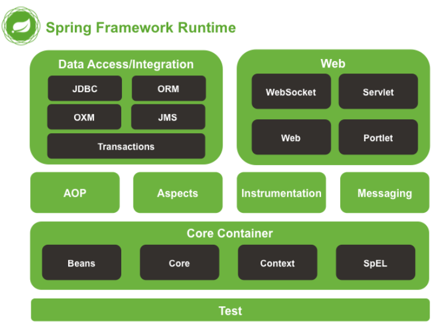

- Spring七大主要模块：
  - Spring Core：提供核心基础功能，提供IoC和DI特性。
  - Spring Context：上下文容器。
  - Spring Web：Web应用开发。
  - Spring MVC：实现Web应用中MVC思想。
  - Spring ORM：支持ORM（Object Relational Mapping，比如把MySQL表结构映射为一个对象）框架，比如MyBatis，Hibernate。
  - Spring AOP：提供AOP功能
  - Spring DAO：提供健壮的JDBC功能。

#### 2. Spring，SpringMVC，Spring Boot之间是什么关系✅

- Spring 包含了多个功能模块（上面刚刚提到过），其中最重要的是 Spring-Core（主要提供 IoC 、DI功能的支持） 模块， Spring 中的其他模块（比如 Spring MVC）的功能实现基本都需要依赖于该模块。

- Spring MVC 是 Spring 中的一个很重要的模块，主要赋予 Spring 快速构建 MVC 架构的 Web 程序的能力。MVC 是模型(Model)、视图(View)、控制器(Controller)的简写，其核心思想是通过将业务逻辑、数据、显示分离来组织代码。

- Spring Boot是Spring的加强版，简化了Spring的开发，启动和部署，内部集成Tomcat等web容器独立运行，并通过自动化配置和注解式配置简化配置。


#### 3. Spring启动流程

Spring启动过程是IOC容器的启动过程，本质是创建和初始化bean工厂(BeanFactory)。BeanFactory是Spring IOC的核心，Spring使用beanFactory来实例化，配置和管理bean。

- 对于web程序，IOC容器启动过程即是建立上下文的过程，web容器会提供一个全局的servletContext上下文环境。主要过程包含三个类：**ContextLoaderListener**，**ContextLoader**，**XmlWebApplicationContext**。

1. web.xml文件中提供ContextLoaderListener上下文监听器，web容器启动时触发容器初始化事件。ContextLoaderListener监听这个事件，通过ContextLoaderListener.contextInitialized()方法，调用父类ContextLoader完成初始化。
2. ContextLoader中完成两件事：创建WebApplicationContext，即 Spring 的 ioc 容器，并放入ServletContext中；加载Spring配置文件中的bean。
3. ContextLoaderListener监听器初始化完之后，开始初始化web.xml中配置的Servlet。如DispatcherServlet，用于匹配、处理每个servlet请求。

#### 4. 谈谈你对IOC的理解？✅

**高内聚，低耦合**：模块之间联系不能紧密，模块之内的元素应该联系紧密。低耦合：如果一个方法改了，另外20个方法都要改，就不行。

IOC是`Inversion of Control`的缩写，多数书籍翻译成“**控制反转**”。IOC 理论提出的观点大体是这样的：==借助于“第三方”实现具有依赖关系 的对象之间的解耦。==

DI是`Dependency Injection`，**依赖注入**。

- **控制** ：指的是对象创建（实例化、管理）的权力
- **反转** ：主要指控制权的反转，控制权交给外部环境（Spring 框架、IoC 容器）

传统方法中A对象用到B对象时，需要A来**new一个B对象，现在这个过程由IOC容器实现**，IOC容器会主动创建一个对象B注入到A需要的地方（通过注解感知到或者xml配置）。这样**A获得依赖对象B的过程就由主动变成了被动行为**，因此叫控制反转。**调用方无需关心组件的具体实现，比如构造函数，也无需在组件功能发生变化时去改变所有调用者的代码，实现高内聚低耦合。**


#### 5. IoC、DI的原理

<font color = 'red'>**反射** + **工厂模式**</font>，通过类的全限定类名，得到类的java.lang.Class对象，并通过工厂模式获取这个类的实例。

#### 6. 什么是Bean，Bean的注解，Bean的生命周期？✅

简单来说，Bean 代指的就是那些**被 IoC 容器所管理的对象**。Bean可以通过xml配置或者注解的方式来定义。通过`getBean`方法来获得该对象。

**把一个类声明为Bean的注解：**

1. @Component：通用注解。
2. @Repository：对应**持久层**（DAO层），用于数据库操作。
3. @Service：对应服务层，设计一些复杂业务逻辑操作，需要用到DAO层。
4. @Controller：对应SpringMVC**控制层**，主要用于处理请求并调用Service层处理请求。

**@Bean和@Component的区别**：

- @Component用于类，@Bean用于方法
- @Component是通过类路径扫描来自动侦测和装配到Spring容器中，**@Bean是通过标注某个方法，这个方法产生了这个Bean**
- @Bean注解自定义性更强。

```java
@Bean
public OneService getService(status) {
    case (status)  {
        when 1:
                return new serviceImpl1();
        when 2:
                return new serviceImpl2();
        when 3:
                return new serviceImpl3();
    }
}
```

- **@Bean注解使用案例**：
  - SpringBoot中，原本的xml配置可以用注解代替。用@Configuration声明一个配置类，再在类的某个方法上面加上@Bean注解，返回一个配置Bean。

```xml
<?xml version="1.0" encoding="UTF-8"?>
<beans xmlns="http://www.springframework.org/schema/beans"
	xmlns:xsi="http://www.w3.org/2001/XMLSchema-instance" xmlns:tx="http://www.springframework.org/schema/tx"
	xmlns:context="http://www.springframework.org/schema/context"
	xmlns:cache="http://www.springframework.org/schema/cache" xmlns:mvc="http://www.springframework.org/schema/mvc"
	xsi:schemaLocation="http://www.springframework.org/schema/beans http://www.springframework.org/schema/beans/spring-beans-3.1.xsd 
	 					http://www.springframework.org/schema/tx http://www.springframework.org/schema/tx/spring-tx-3.1.xsd 
	 					http://www.springframework.org/schema/context http://www.springframework.org/schema/context/spring-context-3.1.xsd
	 					http://www.springframework.org/schema/cache http://www.springframework.org/schema/cache/spring-cache.xsd
	 					http://www.springframework.org/schema/mvc http://www.springframework.org/schema/mvc/spring-mvc-4.0.xsd ">
    <!--实例化bean-->
  <bean id="tokenService" class="TokenService"></bean>
</beans>
```

```java
@Configuration
public class TokenAutoConfiguration {
	@Bean
	public TokenService tokenService() {
		return new TokenService();
	}
}
```

**Bean的生命周期：**

（1）通过构造器创建 bean 实例，实例化（无参数构造，还没有依赖注入） 

（2）为 bean 的属性设置值和对其他 bean 引用（调用 set 方法，属性注入） 

> 如果这个bean实现了**BeanPostProcessor** 接口，实现该接口可以增强的方面是：**在 BeanFactory 已经初始化而 Bean 实例化之前调用该接口的方法可以修改或添加 Bean 的定义**。所以该接口的调用时机是在 Bean **实例化之前**。AOP一般在这个阶段完成的

（3）把 bean 实例传递  bean 前置处理器的方法 postProcessBeforeInitialization  

（4）调用 bean 的初始化的方法（需要进行配置初始化的方法，依赖注入） 

（5）把 bean  实例传递 bean  后置处理器的方法 postProcessAfterInitialization 

（6）bean 可以使用了（对象获取到了） 

（7）当容器关闭时候，调用 bean 的销毁的方法（需要进行配置销毁的方法）

**AOP生成动态代理类发生在BeanPostProcessor期间，@Autowired也和这个有关**


#### 7. 注入Bean的注解有哪些

- @Autowired：优先byType匹配，当某个接口有多个实现类时，再byName，这个name通常是类名（首字母小写），**因此如果一个接口有多个实现类（byType失效），而我们要注入的对象的名称和实现类类名不匹配（byName失效）就会注入失败，无法通过编译。此时要用@Qualifier显示要注入的类的类名。**
- @Resource：优先byName，匹配不到就byType。可以使用name属性显式指定名称。
- @Inject

- AutoWired实现原理，通过Bean后处理器，**AutowiredAnnotationBeanPostProcessor**。

#### 8. Bean的线程安全性✅

​	Spring中的Bean是否线程安全，取决于其作用域和状态。

​	作用域是prototype的没有线程安全问题，因为每次获取bean都是不同的。作用域是singleton的有线程安全问题，因为IoC容器中只有一个，如果该bean有状态（指的是包含可变的成员变量）那就有线程安全问题。

​	不过大部分bean是无状态的（比如Service和DAO），这种情况下线程安全。

#### 9. Bean的作用域？✅

用@Scope配置

1. **singleton** : 唯一 bean 实例，Spring 中的 bean 默认都是单例的；
2. **prototype** : 每次获取bean都会创建一个新的 bean 实例，连续`getBean()`两次得到的是不同的；
3. request：每一次 HTTP 请求都会产生一个新的 bean，该 bean 仅在当前 HTTP request 内有效； 
4. session : 每一次 HTTP 请求都会产生一个新的 bean，该 bean 仅在当前 HTTP session 内有效；
5. application/global-session：每个Web应用启动时创建一个新的Bean，该bean在当前应用启动时间内有效。

#### 10. BeanFactory和ApplicationContext区别

- **功能**：BeanFactory是Spring最底层的接口，ApplicationContext是扩展了BeanFactory的接口。BeanFactory提供了Bean的创建，获取，依赖注入，生命周期管理功能，ApplicationContext在这基础上扩展了ORM框架集成，AOP支持等多种功能。
- **加载形式**：BeanFactory初始化容器的时候并未实例化Bean，直到需要使用时才会实例化，而ApplicationContext则是先把所有的Bean都实例化。因此ApplicationContext运行速度快，但是消耗内存大，不适合一些移动端场景。

#### 11. BeanFactory和FactoryBean区别

- **功能**：BeanFactory是Spring最底层的接口，大部分Bean由它创建管理注入；FactoryBean是一种特殊的Bean，本事是个工厂，用于充当其他Bean的工厂，自定义Bean创建过程。

### Spring AOP

#### 12. 解释下什么是AOP？ ✅

**AOP（Aspect-Oriented Programming，面向切面编程）**够将那些与业务无关，却为业务模块所共同调用的逻辑或责任（==**例如事务处理、日志管理、权限控制等**==）封装起来，便于减少系统的重复代码，降低模块间的耦合度，并有利于未来的可拓展性和可维护性。

AOP把软件系统分为两个部分：核心关注点和横切关注点。业务处理的主要流程是核心关注点，与之关系不大的部分是横切关注点。AOP作用在于分离系统的两个部分，将核心关注点和横切关注点分离开来。

可以用Spring AOP实现或者AspectJ实现（AspectJ是一个AOP框架，Spring已经集成了AspectJ）

**通俗描述**：不通过修改源代码方式，在主干功能里面添加新功能 

==**Spring AOP的底层原理是通过动态代理实现的。**==

#### 13. AOP中切面和切点的概念有了解过吗？✅

* **通知 （Advice）**：增强的逻辑/代码，就是拦截到目标对象的连接点后要做的事情。通知定义了何时，做什么。
* **连接点（Joinpoint）**：目标对象所属的类中，定义的所有方法。 连接点是在应用执行过程中能够插入切面（Aspect）的一个点。
* **切点（PointCut）**:被切面拦截/增强的连接点，切点一定是连接点，连接点不一定是切点。
* **切面（Aspect）**：切面是通知和切点的结合，通知规定了在什么时机干什么事，切入点规定了在什么地方。
* **目标对象（Target Object）**：被一个或者多个切面所通知的对象。 
* **AOP代理（AOP Proxy）**：目标对象应用通知后创建的代理对象。在Spring AOP中有两种代理方式，JDK动态代理和CGLIB代理。
* **织入（Weaving）**：将通知应用到目标对象，进而生成代理对象的过程。

#### 14. AspectJ定义的通知类型有哪些

- Before（前置通知）：目标对象方法调用前触发。
- After（后置通知）目标对象方法调用后使用触发。
- AfterReturning（返回通知）：目标对象方法调用完成，在返回结果值之后触发。
- AfterThrowing（异常通知）：目标对象方法中触发/抛出异常后触发。
- Around（环绕通知）：可以直接通过形参拿到目标对象和方法，可以自己控制方法执行前后的操作，甚至可以不调用目标对象的方法。

#### 15. AOP 的代理有哪几种方式？ ✅

==AOP 思想==的实现一般都是==基于代理模式== ，在 Java 中一般采用 JDK 动态代理模式，但是我们都知道， **JDK 动态代理模式只能代理接口而不能代理类**。因此，==Spring AOP 会按照下面两种情况进行切换==，因为 Spring AOP 同时支持 CGLIB、ASPECTJ、JDK 动态代理。

1. 如果==目标对象的实现类实现了接口==，Spring AOP 将会采用 ==JDK 动态代理==来生成 AOP 代理类； 
2. 如果目标对象的实现类==没有实现接口==，Spring AOP 将会采用 ==CGLIB== 来生成 AOP 代理类。不过这个选择过程对开发者完全透明、开发者也无需关心。
3. CGLIB动态代理创建代理对象消耗更大，要用到CGLIB库，但是运行更快。一般如果类实现了接口，首选JDK动态代理。


#### 16. JDK动态代理如何实现？✅

动态代理和静态代理：代理类和代理对象编译时不知道/知道。

简洁版：

1. 动态**代理类**实现**InvocationHandler接口**，**重写invoke方法**，通过**反射**机制调用被代理类的方法。

   > 并且每个代理类的实例都关联到了一个 handler，当我们通过代理对象调用一个方法的时候，这个方法的调用就会被转发为由InvocationHandler 这个接口的 invoke 方法来进行调用

2. 创建Proxy工厂类，调用**Proxy.newProxyInstance**方法创建**代理对象**。

动态具体代理过程(JDK实现)：

1. 定义一个接口及其实现类；
2. 自定义 `InvocationHandler` 并重写`invoke`方法`invoke(Object proxy, Method method, Object[] args)`，在 `invoke` 方法中我们会调用原生方法（被代理类的方法）并自定义一些处理逻辑；
   * proxy：被代理的类的实例
   * method：调用被代理的类的方法
   * args：该方法需要的参数
3. 通过 `Proxy.newProxyInstance(ClassLoader loader,Class<?>[] interfaces,InvocationHandler h)` 方法创建代理对象；
   * loader：被代理的类的类加载器
   * interfaces：被代理的接口数组
   * invocationHandler：调用处理器类的对象实例

```java
class ProxyFactory{
    //调用此方法，返回一个代理类的对象。解决问题一
    public static Object getProxyInstance(Object obj){//obj:被代理类的对象
        MyInvocationHandler handler = new MyInvocationHandler();
        handler.bind(obj);
        return Proxy.newProxyInstance(obj.getClass().getClassLoader(),obj.getClass().getInterfaces(),handler);//创建一个代理类的对象，分别传入被代理类的类加载器，接口，和方法
    }
}
class MyInvocationHandler implements InvocationHandler{

    private Object obj;//需要使用被代理类的对象进行赋值
    public void bind(Object obj){
        this.obj = obj;
    }
    //当我们通过代理类的对象，调用方法a时，就会自动的调用如下的方法：invoke()
    //将被代理类要执行的方法a的功能就声明在invoke()中
    @Override
    public Object invoke(Object proxy, Method method, Object[] args) throws Throwable {
        //method:即为代理类对象调用的方法，此方法也就作为了被代理类对象要调用的方法
        //obj:被代理类的对象
        Object returnValue = method.invoke(obj,args);
        //上述方法的返回值就作为当前类中的invoke()的返回值。
        return returnValue;

    }
}
```


- JDK动态代理步骤：

1. **代理类**通过实现`InvocationHandler`接口，重写`invoke`方法，通过反射调用**被代理类**的方法，并增强。
2. 通过`Proxy.newProxyInstance()`返回一个**代理类对象**。


- 补充 CGLIB动态代理步骤：

1. 定义一个**拦截器**并实现接口 `MethodInterceptor`，重写`intercept`方法，用于拦截被代理类的方法，和JDK代理中的`invoke`有点像，但不是用反射。
2. 代理工厂类通过`Enhancer`类设置回调，并`create()`创建代理类。
3. 通过代理对象调用方法。


- 区别：

1. JDK代理只能代理实现了接口的类。没有实现接口的由CGLIB动态代理。
2. JDK代理使用了反射，CGLIB没有，所以CGLIB快一些。


- AspectJ代理底层也是通过jdk/cglib代理实现的。
  - 每个切面的优先级可以通过`@Order`注解实现。

### Spring MVC

#### 17. 谈谈对SpringMVC的理解？有哪些组件？✅

​	MVC是一种软件设计规范（也可以是一种设计模式）。Model（模型），View（视图），Controller（控制器）的简写，通过将业务逻辑、数据、显示分离来组织代码。**方便了分工合作，解耦了MVC各自的职责**。

​	SpringMVC是Spring的一个核心组件，实现了Web开发中的MVC思想。

​	**SpringMVC的核心类：DispatcherServlet**

**核心组件**：

- **DispatcherServlet：核心中央处理器**，用于接收、分发请求，并给客户端响应。
- **HandlerMapping：处理器映射器**，用于根据URL去匹配能处理的Handler。
- **HandlerAdapter：处理器适配器**，处理HandlerMapping找到的Handler，适配执行对应的Handler。使用适配器模式，使DispatcherServlet能够用统一的方式使用不同的Handler。
- **Handler：请求处理器**，处理实际请求。
- **ViewResolver：视图解析器**：将Handler返回的逻辑视图渲染，通过DispatcherServlet返回给客户端。


​	

### Spring事务

#### 18. 谈谈你对 Spring 中的事务的理解？ ✅

**事务**是逻辑上的一组操作，**要么都执行，要么都不执行**。

**事务的特性**：和InnoDB一样，ACID

ACID:

* 原子性
* 一致性
* 隔离性
* 持久性

#### 19. Spring 中的事务传播行为？ ✅

[深入浅出Spring事务的实现原理 - 掘金 (juejin.cn)](https://juejin.cn/post/7106158883055353870#heading-19)

场景看这个：[Spring事务传播行为详解（有场景） - 明叶师兄。 - 博客园 (cnblogs.com)](https://www.cnblogs.com/renxiuxing/p/15395798.html#:~:text=Spring事务传播)

​	当事务方法被另一个事务方法调用时，必须指定事务应该如何传播。例如：方法可能继续在现有事务中运行，也可能开启一个新事务，并在自己的事务中运行。

1. **required：(默认传播行为)**，如果当前有事务，则加入该事务。如果当前没有事务，则新增一个事务。
   例如：方法A调用方法B，它们用同一个事务。（如果A没有事务，会创建一个事务并加入B）（只要有一个回滚，整体就会回滚）

2. **requires_new**：如果当前存在事务，不会加入该事务，而是把当前事务挂起，新增一个事务。两个事务互相独立不干扰。
   例如：方法A调用方法B，它们用不同的事务。(B不会用A的事务，会新增事务。)

3. **nested**：如果当前已经存在一个事务，那么该方法将会在嵌套事务中运行。嵌套的事务是子事务，依赖于外层事务，外层事务回滚，子事务会回滚，而子事务回滚不会导致外层事务回滚。如果当前事务不存在，那么其行为与Required一样。
   例如：方法A中调用了方法B，B中try catch手动回滚，A不会回滚。

   > requires_new和nested区别，requires_new是内层和外层事务独立，A事务回滚B事务不会被影响，相反也是，nested是内层事务为外层事务的子事务，因此内层事务回滚不影响外层事务，但是nested外层事务回滚，会使内层事务回滚。

4. **mandatory**：如果当前存在事务，则加入该事务；如果当前 没有事务，则抛出异常。
   支持当前事务，如果当前没有事务就会抛出异常。
   例如：方法A调用方法B，如果方法A没有事务，那么就会抛出异常。

5. **supports**：如果当前存在事务，则加入该事务；如果当前没有事务，则以非事务的方式继续运行；
   例如：方法A调用方法B，如果A没有事务，那么B就以非事务运行。
   如果A有事务就以A事务为准。如果A没有事务，那么B就会以非事务执行。

6. **not_supported**：以非事务方式运行，如果当前存在事务， 则把当前事务挂起。
   例如：方法A调用方法B，方法B会挂起事务A以非事务方式执行。

7. **never**：以非事务执行，如果存在事务，抛出异常。
   总是以非事务执行，如果存在事务，那么就抛出异常。

#### 20. Spring 中的事务隔离级别？ ✅

**`TransactionDefinition.ISOLATION_DEFAULT`** :使用后端数据库默认的隔离级别，MySQL 默认采用的 `REPEATABLE_READ` 隔离级别 Oracle 默认采用的 `READ_COMMITTED` 隔离级别.

**`TransactionDefinition.ISOLATION_READ_UNCOMMITTED`** :最低的隔离级别，使用这个隔离级别很少，因为它允许读取尚未提交的数据变更，**可能会导致脏读、幻读或不可重复读**

**`TransactionDefinition.ISOLATION_READ_COMMITTED`** : 允许读取并发事务已经提交的数据，**可以阻止脏读，但是幻读或不可重复读仍有可能发生**

**`TransactionDefinition.ISOLATION_REPEATABLE_READ`** : 对同一字段的多次读取结果都是一致的，除非数据是被本身事务自己所修改，**可以阻止脏读和不可重复读，但幻读仍有可能发生。**

**`TransactionDefinition.ISOLATION_SERIALIZABLE`** : 最高的隔离级别，完全服从 ACID 的隔离级别。所有的事务依次逐个执行，这样事务之间就完全不可能产生干扰，也就是说，**该级别可以防止脏读、不可重复读以及幻读**。但是这将严重影响程序的性能。通常情况下也不会用到该级别。


#### 21. Spring事务失效的几种情况✅

1. 没被Spring管理

2. 用于不是 public 的方法上，事务会失效，无法动态代理

3. 用于 final 的方法上，事务会失效

   - `Spring`事务底层使用了`AOP`，也就是通过`JDK`动态代理或者`cglib`，帮我们生成了代理类，在代理类中实现的事务功能。但如果某个方法用`final`修饰了，那么在它的代理类中，就无法重写该方法，从而无法添加事务功能。这种情况事务就会在`Spring`中失效。

4. 同一个类中的方法相互调用（自身调用事务方法，事务会失效）：因为Spring通过AOP代理来实现事务，一个类内部方法互相调用，没有生成代理对象。

   > 怎么解决？ 
   >
   > 1. 本地注入一个bean 
   > 2. 把方法拆到另一个bean去

5. 事务传播行为propagation设置不当

6. 异常内部捕捉，没有抛出

7. 异常类型错误

#### 22. Spring 框架中用到了哪些设计模式？ ✅

1. 工厂设计模式 : Spring 使用工厂模式通过 BeanFactory、ApplicationContext 创建 bean 对象； 
2. 代理设计模式 : Spring AOP 功能的实现； 
3. 单例设计模式 : Spring 中的 Bean 默认都是单例的；
4. 模板方法模式 : Spring 中 jdbcTemplate，redisTemplate 等以 Template 结尾的对数据库操作的类，它们就使用到了模板模式；
5. 适配器模式：Spring MVC中的HandlerAdapter允许DispatcherServlet用统一的方式使用不同的Handler。

#### 23. Spring常用注解和作用？

* 针对Bean管理创建对象提供注解(在类上面声明)

  * @Component
  * @Service
  * @Controller
  * @Repository

  上面四个注解功能是一样的，都可以用来**创建 bean 实例**

  * @Bean：创建一个bean并交给Spring容器，也可以在xml文件中配置

  * @DependsOn注解表示当前Bean的实例化依赖于另一个Bean的实例化。下面是一个使用@dependson的示例代码

  ```JAVA
  public class BeanA {
        private BeanB b;
  }
  
  public class BeanB {
  
  }
  
  @Configuration
  public class Config {
        @Bean
        public BeanB beanB() {
              return new BeanB();
        }
  
        @Bean
        @DependsOn("beanB")
        public BeanA beanA() {
              return new BeanA();
        }
  }
  ```

  

* 属性注入

  * @Autowired：根据属性类型进行自动装配
  * @Qualifier：根据名称进行注入
  * @Resource：可以根据类型注入，可以根据名称注入，但是不是Spring框架提供的

* AOP

  * Aspect：生成代理对象，进行切面编程
    * @Before:前置通知
    * @AfterReturning：后置通知
    * @After:最终通知
    * @AfterThrowing:异常通知
    * @Around：环绕通知

* 事务

  * @Transactional：开启一个事务

  * propagation

    * REQUIRED
    * REQUIRED_NEW
    * SUPPORTS
  * ioslation：隔离级别，和InnoDB相同

  * timeout：超时时间
  * rollbackFor：对哪些异常进行事务回滚
  * noRollbackFor：对哪些异常不进行事务的回滚

#### 24.Spring循环依赖怎么解决？

⾸先，Spring 解决循环依赖有两个前提条件： 

1. 不全是构造器方式的循环依赖
2. 必须是单例

基于上⾯的问题，我们知道Bean的⽣命周期，本质上解决循环依赖的问题就是三级缓存，通过三级缓存 提前拿到未初始化的对象。 

- 第⼀级缓存(SingletonObject)：用来保存创建完成的Bean，可被其他对象注入。
- 第⼆级缓存：⽤来保存实例化完成，但是未初始化完成的**代理对象**/**普通对象**。 
- 第三级缓存：对象工厂，存放获取对象的**Lambda表达式**(匿名内部类)，会根据是否被切AOP返回代理对象与否。

另有一个Creating Set用于记录正在创建中的Bean，若依赖注入的对象出现在了Creating Set里，这就意味着出现了循环依赖。


假设⼀个简单的循环依赖场景，A、B互相依赖。


A对象的创建过程： 1. 创建对象A，实例化的时候把A对象⼯⼚放⼊三级缓存


2. A注⼊属性时，发现依赖B，转⽽去实例化B 
3. 同样创建对象B，注⼊属性时发现依赖A，从一级到三级缓存查询A，发现A在三级缓存，从三级缓存通过对象工厂拿到A，把A放⼊⼆级缓存，同时删除三级缓存中的A，此时，B已经实例化并且初始化完成，把B放入一级缓存。
4. 接着创建对象A，顺利从一级缓存拿到实例化且初始化完成的B对象，A对象创建也完成，删除二级缓存中的A，同时把A放入一级缓存。
5. 最后，一级缓存中保存着实例化、初始化都完成的A、B对象。


由于上述方案将初始化与实例化的流程分开了，所以如果都是用构造器的话，就没办法分离这个操作了，也就无法解决循环依赖的问题。

#### 25.为什么要三级缓存？二级不行吗？

不行，如果没有三级缓存，就无法解决循环依赖的问题。不可以，主要是为了⽣成代理对象。 因为三级缓存中放的是⽣成具体对象的匿名内部类，他可以⽣成代理对象，也可以是普通的实例对象。 使⽤三级缓存主要是为了保证不管什么时候使⽤的都是⼀个对象。 假设只有⼆级缓存的情况，往⼆级缓存中放的显示⼀个普通的Bean对象， BeanPostProcessor 去⽣成 代理对象之后，覆盖掉⼆级缓存中的普通Bean对象，那么多线程环境下可能取到的对象就不⼀致了。

1. **初始化 A**：
   - A 需要 B，但 B 尚未初始化。
   - 将 A 的部分初始化状态存放在三级缓存中。
   - 初始化 B。
   - B 需要 A，从三级缓存中获取 A 的部分初始化状态。
   - 完成 B 的初始化，将 B 存放到二级缓存中。
   - 完成 A 的初始化，将 A 存放到二级缓存中。
   - 生成 A 和 B 的代理对象，存放到一级缓存中。
2. **生成代理对象**：
   - 使用三级缓存中的匿名内部类生成 A 和 B 的代理对象。
   - 确保在多线程环境下，取到的对象始终是一致的。

## SpringBoot

### 1.为什要用SpringBoot

简化Spirng的开发、配置、部署

Spring Boot 简化了 Spring 应用的开发，遵循“约定大于配置”的原则，减少了繁琐的配置。它内置了 Tomcat，不需要单独部署 WAR 文件，简化了 Maven 配置,可以快速创建独立的、可生产的应用。

### 2.SpringBoot核心注解

​	**启动类注解@SpringBootApplication**包含了3个注解：

- @SpringBootConfiguration：组合了@Configuration注解，实现配置文件的功能。
- @EnableAutoConfiguration：打开自动配置的功能，也可以关闭某个自动配置的选项。
- @ComponentScan：Spring组件扫描。

### 3. SpringBoot自动配置原理

1. `@SpringBootApplication`注解中有一个`@EnableAutoConfiguration`注解，这个注解又实现了`@Import`注解。
2. `@Import`注解实现了`AutoConfigurationImportSelector`类，里面有个`selectImports`方法，这个方法通过找到`spring.factories`文件来把类加载到IoC容器中。

### 4.SpringBoot的启动流程

启动流程主要分为三个部分：

> - 第一部分进行SpringApplication的初始化模块，配置一些基本的环境变量、资源、构造器、监听器；
> - 第二部分实现了应用具体的启动方案，包括启动流程的监听模块、加载配置环境模块、及核心的创建上下文环境模块；
> - 第三部分是自动化配置模块，该模块作为springboot自动配置核心，在后面的分析中会详细讨论。在下面的启动程序中我们会串联起结构中的主要功能。

1. 首先从main找到run()方法，在执行run()方法之前new一个SpringApplication对象
2. **启动监听器**：进入run()方法，创建**应用监听器**SpringApplicationRunListeners开始监听
3. **创建配置环境，加载配置文件**：然后加载SpringBoot**配置环境**(ConfigurableEnvironment)，然后把配置环境(Environment)加入监听对象中
4. **配置应用上下文**：然后加载**应用上下文**(ConfigurableApplicationContext)，当做run方法的返回对象
5. 最后**创建Spring容器**，refreshContext(context)，实现starter自动化配置和bean的实例化等工作。

监听器、环境、上下文

### 4.SpringBoot starter是什么？怎么自己实现一个？

- SpringBoot Starter是一种简化SpringBoot开发的**自动配置机制**，能够通过引入一些预定义的依赖和配置，更方便地集成一些功能和模块。
- 比如spring-boot-starter-web，能够自动配置好Tomcat和Spring MVC。

**自己实现**：

【简略版】：创建一个**属性类**，对应`spring.factories`配置文件的属性；再创建一个**业务功能类**，根据属性配置实现业务逻辑；再创建一个**自动配置类**，根据属性类读取到的配置文件内容，返回业务功能类对象给IoC容器作为Bean；最后创建一个`spring.factories`文件，用于使SpringBoot启动时能够扫描到这个自动配置类；最后打成jar包，给别人用，别人可以在自己的配置文件（一般是properties文件）中配置属性。

1. 创建一个maven项目，引入spring-boot-starter依赖；

2. 创建一个**属性类**，类名和成员变量对应之后`spring.factories`文件中要配置的属性，用来保存配置的内容。

   - 需要使用@ConfigurationProperties注解来指定配置文件中的前缀。

   ```java
   package com.woniu.util.autoconfigure;
    
   import org.springframework.boot.context.properties.ConfigurationProperties;
    
   // 这里获取配置文件中前缀为woniu的配置
   @ConfigurationProperties(prefix = "woniu")
   public class WoniuProperties {
    
       private String pattern = "yyyy-MM-dd hh:mm:ss"; // 日期格式，默认为"yyyy-MM-dd hh:mm:ss"
    
       // 省略getter和setter方法
   }
   ```

3. 创建一个**业务功能类**，这个类中用到了之前的属性类，来读取`spring.factories`文件中的属性配置，并根据不同配置执行不同业务功能。

   ```java
   package com.woniu.util.util;
    
   import java.text.SimpleDateFormat;
   import java.util.Date;
    
   // 这个类的功能是根据配置文件的日期格式配置，将日期转为不同格式字符串
   public class WoniuUtil {
    
       private String pattern; // 日期格式
    
       public WoniuUtil(String pattern) {
           this.pattern = pattern;
       }
    
       public String dateToStr(Date date){
           SimpleDateFormat sdf = new SimpleDateFormat(pattern);
           String format = sdf.format(date);
           return format;
       }
   }
   ```

4. 接下来需要一个**自动配置类**，用于根据**属性类**创建**业务功能类**的对象，将属性类和业务功能类联系在一起，并返回一个Bean交给IoC容器。

   - 使用@EnableConfigrationProperties注解启用属性类
   - 使用@ConditionalOnClass来判断业务功能类是否存在
   - 使用@ConditionalOnProperties来实现根据`spring.factories`中的配置来开关这个自动配置。

   ```java
   package com.woniu.util.autoconfigure;
    
   import com.woniu.util.util.WoniuUtil;
   import org.springframework.boot.autoconfigure.condition.ConditionalOnClass;
   import org.springframework.boot.autoconfigure.condition.ConditionalOnProperty;
   import org.springframework.boot.context.properties.EnableConfigurationProperties;
   import org.springframework.context.annotation.Bean;
   import org.springframework.context.annotation.Configuration;
    
   @Configuration
   // 启用日期格式配置的属性类
   @EnableConfigurationProperties(WoniuProperties.class)
   // 判断业务功能类是否存在
   @ConditionalOnClass(WoniuUtil.class)
   // 根据配置文件中的woniu.enabled是否为true来开关这个自动配置
   @ConditionalOnProperty(prefix = "woniu", name = "enabled", havingValue = "true")
   public class WoniuAutoConfiguration {
    
       private final WoniuProperties woniuProperties;
    
       public WoniuAutoConfiguration(WoniuProperties woniuProperties) {
           this.woniuProperties = woniuProperties;
       }
    
       @Bean
       public WoniuUtil woniuUtil() {
           return new WoniuUtil(woniuProperties.getPattern());
       }
   }
   ```

5. 在resources/META-INF目录下创建一个`spring.factories`文件，用于我们的自动配置类，使SpringBoot启动时能扫描并加载它。

   ```
   org.springframework.boot.autoconfigure.EnableAutoConfiguration=\
   com.woniu.util.autoconfigure.WoniuAutoConfiguration
   ```

6. 打jar包，给别人依赖用，别人可以在自己的`spring.factories`文件中配置属性。

#### Transactional注解

- 用来开启事务，常用属性有`propagation`和`isolation`
- 实现原理：是基于AOP实现的，使用一个`TransactionInterceptor`，事务的入口是它的`invoke`方法。根据是否出现异常决定回滚或者提交事务。

伪代码：

```java
public Object invoke(MethodInvocation invocation) throws Throwable {
    
    // 获取事务资源
  Object transaction = transactionManager.getTransaction(txAttr);    
    Object retVal;
    
    try {
        // 执行业务代码
      retVal = invocation.proceedWithInvocation();
        
        // 提交事务
        transactionManager.commit(txStatus);
    } catch (Throwable ex){
        // 先判断异常回滚策略，然后调用事务管理器的 rollback
      rollbackOn(ex, txStatus);
    } 
}
```

## 其他框架和分布式理论

## Mybatis

### 什么是MyBatis？

- MyBatis是一款优秀的持久层框架，用于简化JDBC开发
- MyBatis本是Apache的一个开源项目iBatis，2010年这个项目由apache software foundation迁移到了google code，并且改名为MyBatis。2013年11月迁移到Github

JDBC缺点：

1. 硬编码--->（写到配置文件中）
   1. 注册驱动与获取连接的位置是硬编码
   2. SQL语句
2. 操作繁琐--->（自动完成）
   1. 手动设置参数
   2. 手动封装结果集

> Mybatis免除了几乎所有的JDBC代码以及设置参数和获取结果集的工作

### **三种参数传递的方式**


### 动态条件查询

**多条件动态条件查询**

在很多业务中，用户没有用到所有的条件，那么有一部分输入的条件信息将会等于Null，为了解决这个问题。


**动态单条件查询**


或者将where变为<where></where>标签将<choose></choose>包裹起来。

### MyBatis完成操作需要几步？

共三步

1. 编写接口方法
2. 编写SQL
3. 执行方法


### 你知道什么是SQL注入吗？

SQL 注入是一种代码注入技术，通过在**输入字段中插入专用的 SQL 语句，从而欺骗数据库执行恶意 SQL**，从而**获取敏感数据、修改数据，或者删除数据**等。

1. 使用参数化查询

   参数化查询通过预编译SQL语句并将用户输入作为参数传递给数据库引擎。这样，数据库引擎可以自动识别并处理输入数据，而不会将输入数据误认为是SQL代码的一部分。

   ```Java
   String query = "SELECT * FROM users WHERE username = ?";
   PreparedStatement pstmt = connection.prepareStatement(query);
   pstmt.setString(1, userName);  // userName 是用户输入
   ResultSet rs = pstmt.executeQuery();
   ```

   `?` 是一个参数占位符，userName 是外部输入。这样即便用户输入了恶意的 SQL 语句，也只会被视为参数的一部分，不会改变查询的结构。

   2.限制用户输入:对用户输入进行验证和过滤，只允许输入预期的数据，不允许输入特殊字符或 SQL 关键字。

3. 使用 ORM 框架:比如，在 MyBatis 中，使用`#{}`占位符来代替直接拼接 SQL 语句，MyBatis 会自动进行参数化处理。

   ```Java
   <select id="selectUser" resultType="User">
     SELECT * FROM users WHERE username = #{userName}
   </select>
   ```

   假如 userName 传入的值是 `9;DROP TABLE SYS_USER;`，传入的删除表 SQL 也不会执行，因为它会被当作参数值。

   ``` SQL
   SELECT * FROM users WHERE username = '9;DROP TABLE SYS_USER;'
   ```

### 为什么Mapper接口不需要实现类?

[一文搞懂Java动态代理：为什么Mybatis Mapper不需要实现类？在学习Java动态代理之前，我想让大家先思考这 - 掘金](https://juejin.cn/post/7349427412356546560?searchId=20241105194750B928ACC345DA9CB83EC2)

**Mapper接口不需要实现类**的原因是，MyBatis框架通过JDK动态代理技术自动生成接口的实现类。当你定义了一个Mapper接口时，MyBatis会在运行时根据接口定义创建一个代理类，该代理类会实现接口中的方法，并执行相应的SQL操作。

在使用时，我们只需要通过`@Mapper`注解（或XML配置）标识接口，MyBatis会根据SQL映射配置文件或注解中定义的SQL语句来动态生成代理类并执行相应的数据库操作。这样，开发者无需手动编写实现类，简化了代码。

## Docker

### 什么是Docker

Docker 是一个开源平台，基于 Go 语言实现，旨在简化应用的构建、分发和运行。通过**镜像**和**容器**的方式，Docker 确保应用能够在不同环境中一致地运行。

**核心概念：**

- **镜像（Image）**：只读模板，包含应用及其依赖。镜像是容器的“源代码”，可用于创建多个容器。
- **容器（Container）**：镜像运行的实例，提供隔离的运行环境。容器保证应用在不同操作系统中的一致性。
- **仓库（Repository）**：存放镜像的地方，支持镜像的存储和分享。

**Docker 工作流程：**

- **Build（构建镜像）**：将应用和其依赖打包成镜像，就像一个集装箱。
- **Ship（运输镜像）**：通过 Docker 仓库传输镜像，方便迁移和共享。
- **Run（运行镜像）**：启动镜像形成容器，在容器中运行应用。

Docker 的优势是“一次配置，处处运行”，大大简化了部署、管理和跨平台运行。

### 为什么需要Docker？

在传统的开发和部署中，开发环境和生产环境可能存在差异，导致项目在不同系统上运行不一致。Docker通过将应用及其依赖打包成统一的**镜像**，确保在任何环境中都能一致地运行，避免了环境配置的问题。

具体好处：

1. **一致的运行环境**：Docker将开发、测试、生产环境标准化，确保应用在不同机器上有相同的运行环境。
2. **简化部署**：无需重新配置运行环境，直接使用容器部署应用。
3. **提升开发效率**：开发者可以专注于业务代码，无需关注系统环境的配置。

### Docker镜像原理

Docker 镜像是一个只读文件系统，包含应用运行所需的程序、库、资源和配置等文件。它是容器的基础，相当于一个独立的文件系统，提供运行时的环境。Docker 镜像本身不会改变，一旦构建后就固定不变。

- **分层存储：** Docker 镜像采用 **Union FS**（联合文件系统）技术，镜像由多个层组成，每一层都建立在上一层之上。每层是不可变的，这使得镜像可以复用并且高效。修改和定制仅会发生在新增的层上。
- **镜像和容器层：** 镜像本身是只读的，容器运行时会在镜像上加一个可写的“容器层”。**所有对容器的更改，如文件修改或添加，只会影响容器层，底层的镜像层保持不变**。**这样多个容器可以共享相同的镜像层，节省存储空间。**
- **构建过程：** 每构建一层都会基于前一层，并且每一层都会被缓存。Docker 镜像的分层存储特性支持镜像的快速构建和高效的重用。

这种分层架构使得**镜像构建、存储和分发**变得更加高效，同时也方便了镜像的定制与扩展。


### 说说你对容器的理解？

**一句话概括容器：容器就是将软件打包成标准化单元，以用于开发、交付和部署。**

- **容器镜像是轻量的、可执行的独立软件包** ，包含软件运行所需的所有内容：代码、运行时环境、系统工具、系统库和设置。
- **容器化软件适用于基于 Linux 和 Windows 的应用，在任何环境中都能够始终如一地运行。**
- **容器赋予了软件独立性**，使其免受外在环境差异（例如，开发和预演环境的差异）的影响，从而有助于减少团队间在相同基础设施上运行不同软件时的冲突。

### Docker和虚拟机的区别

1. 虚拟机通常是虚拟出一套硬件，并在硬件上运行一个完整的操作系统，在系统上在运行应用进程。
2. 而docker是一种轻量级的虚拟化技术，它没有进行硬件虚拟，通过共享系统内核（所以docker必须部署在linux内核的系统行）来在操作系统层面上运行多个隔离的应用程序。
3. 虚拟机是硬件层的抽象，而容器是应用层的抽象。docker容器内部只保留所以容器相比于虚拟机占用的空间更小，启动更快。

### 什么是DockerFile

**Dockerfile** 是一个文本文件，包含了一系列构建 Docker 镜像的指令和参数。它定义了镜像的构建过程，从基础镜像的选择到软件的安装、配置及文件的复制等。每一条指令都会在镜像的构建过程中创建一个新的层。

构建三步骤

- 编写Dockerfile文件

- docker build命令构建镜像

- docker run依镜像运行容器实例


### DockerFile有哪些命令？


### Dokcer有哪些常用命令

#### 1. **镜像相关命令**

- `docker build -t <image-name> .`
  构建镜像，`-t` 标记为镜像命名，`.` 表示当前目录。
- `docker pull <image-name>`
  从 Docker Hub 或其他仓库拉取镜像。
- `docker images`
  查看本地镜像列表。
- `docker rmi <image-id>`
  删除本地镜像。
- `docker tag <image-name> <new-image-name>`
  为镜像打标签，创建镜像的别名。

#### 2. **容器相关命令**

- `docker run <image-name>`
  创建并启动一个容器。
- `docker ps`
  查看当前正在运行的容器。
- `docker ps -a`
  查看所有容器，包括停止的容器。
- `docker start <container-id>`
  启动一个已停止的容器。
- `docker stop <container-id>`
  停止一个运行中的容器。
- `docker restart <container-id>`
  重启一个容器。
- `docker exec -it <container-id> <command>`
  在容器中执行命令，`-it` 表示交互式终端。
- `docker logs <container-id>`
  查看容器的日志输出。
- `docker rm <container-id>`
  删除一个容器（必须停止后才能删除）。

#### 3. **容器与镜像管理**

- `docker run -d <image-name>`
  后台运行容器，`-d` 表示以分离模式运行。
- `docker run -p <host-port>:<container-port> <image-name>`
  映射容器的端口到主机，便于访问容器内的应用。
- `docker exec -it <container-id> /bin/bash`
  进入容器内部的终端进行交互。

#### 4. **网络与卷管理**

- `docker network ls`
  查看 Docker 网络。
- `docker volume ls`
  查看 Docker 卷。
- `docker volume create <volume-name>`
  创建 Docker 卷，用于持久化数据。

#### 5. **其他命令**

- `docker info`
  查看 Docker 的系统信息。
- `docker version`
  查看 Docker 的版本信息。


## 分布式/微服务

#### 基础理论

##### 说说对CAP理论的理解

**CAP** 表示 **Consistency（一致性）**、**Availability（可用性）**、**Partition Tolerance（分区容错性）** 这三个单词首字母组合。

**一致性（Consistency）** : 数据在多个副本之间能够保证一致的状态。

**可用性（Availability）**: 非故障的节点在合理的时间内返回合理的响应（不是错误或者超时的响应）。

**分区容错性（Partition Tolerance）** : 某节点或网络分区故障的时候，仍然能够对外提供服务。

CAP 理论中分区容错性 P 是一定要满足的，在此基础上，只能满足可用性 A 或者一致性 C。

因此，**分布式系统理论上不可能选择 CA 架构，只能选择 CP 或者 AP 架构。**强一致性的系统采用CP架构，高可用的系统采用AP架构（会产生数据不一致的问题）。


##### 说说对BASE理论的理解

**BASE** 是 **Basically Available（基本可用）** 、**Soft-state（软状态）** 和 **Eventually Consistent（最终一致性）**

**基本可用**：基本可用是指分布式系统在出现不可预知故障的时候，允许损失部分可用性。但是，这绝不等价于系统不可用。

**软状态**：软状态指允许系统中的数据存在中间状态（**CAP 理论中的数据不一致**），并认为该中间状态的存在不会影响系统的整体可用性，即允许系统在不同节点的数据副本之间进行数据同步的过程存在延时。

**最终一致性**：最终一致性强调的是系统中所有的数据副本，在经过一段时间的同步后，最终能够达到一个一致的状态。因此，最终一致性的本质是需要系统保证最终数据能够达到一致，而不需要实时保证系统数据的强一致性。

### 分布式锁

什么是分布式锁

JDK 自带的 **本地锁** 来控制一个 JVM 进程内的多个线程对本地共享资源的访问。分布式系统下，不同的服务/客户端通常运行在独立的 JVM 进程上。如果多个 JVM 进程共享同一份资源的话，使用本地锁就没办法实现资源的互斥访问了。于是，**分布式锁** 就诞生了。分布式锁保证了多个线程不在同一个 JVM 进程中也能获取到同一把锁，进而实现共享资源的互斥访问。

##### 简介

**分布式锁**是一种在分布式系统中协调多个进程或线程访问共享资源的技术。在分布式环境中，由于系统可能由多个节点组成，这些节点之间需要协同工作以保证数据的一致性和事务的完整性。分布式锁就是解决这类问题的关键技术之一。

##### 1. **为什么需要分布式锁？**

在多节点环境中，如果多个节点同时尝试修改同一个数据，可能会导致数据不一致或其他并发问题。例如，在分布式数据库系统、分布式缓存系统（如 Redis）、分布式文件系统等场景下，为了确保数据的一致性，需要使用分布式锁来控制对共享资源的访问。

##### 2. **分布式锁的特点**

- **互斥性**：在任何时刻，只有一个线程或进程可以持有锁。
- **可靠性**：即使某个节点发生故障，其他节点仍然能够正常获取和释放锁。
- **性能**：在高并发环境下，锁的获取和释放应该尽可能快，以减少阻塞。

##### 3. **实现方式**

分布式锁可以通过多种方式实现，常见的有以下几种：

###### 3.1 基于数据库的分布式锁

- **乐观锁**：通过版本号或时间戳来检测并防止并发冲突。
- **悲观锁**：直接锁定数据表或行，直到操作完成。

###### 3.2 基于 ZooKeeper 的分布式锁

- **ZooKeeper**：利用 ZooKeeper 的顺序节点特性来实现分布式锁。

###### 3.3 基于 Redis 的分布式锁

- **Redis Lock**：使用 Redis 的 SET 命令来实现简单的分布式锁。
- **Redlock**：通过多个 Redis 实例来提高分布式锁的可靠性。


##### 实现原理

[Redis锁从面试连环问](https://mp.weixin.qq.com/s?__biz=Mzg3NjU3NTkwMQ==&mid=2247505097&idx=1&sn=5c03cb769c4458350f4d4a321ad51f5a&source=41#wechat_redirect)

分布式锁是一种协调工具，用于在分布式系统中实现对共享资源的独占访问。在多个进程或服务需要访问同一份资源时，分布式锁可以防止并发冲突，确保同一时刻只有一个进程能够执行特定的操作。

#### 为什么需要Redission而不是Redis？

下面为简答版：

相较于原生`Redis`的`SetNX+Expire`实现的分布式锁而言，`Redisson`的分布式锁组件可以解决原生`Redis`组合命令带来的一些缺陷，即在执行`SetNX`命令之后，在还没来得及执行`Expire`操作之前，如果此时`Redis`的服务器节点恰好出现宕机或者服务不能用的情况，那将会导致相应的`Key`永远存于缓存中，即处于所谓的“永久被锁死”的状态！

而`Redisson`的分布式锁则可以很好地解决这种问题，其底层的实现机制在于：`Redisson`内部提供了一个监控锁的看门狗`WatchDog`，其作用在于`Redis`实例被关闭之前，不断延长锁的有效期。除此之外，`Redisson`还通过加锁的方法提供了`leaseTime`等参数来指定加锁的有效时间，即超过这个时间后“锁”便自动解开了。

**sentx的四大问题**
基于setnx实现的分布式锁存在下面的问题：

**重入问题：**重入问题是指 获得锁的线程可以再次进入到相同的锁的代码块中，可重入锁的意义在于防止死锁，比如HashTable这样的代码中，他的方法都是使用synchronized修饰的，假如他在一个方法内，调用另一个方法，那么此时如果是不可重入的，不就死锁了吗？所以可重入锁他的主要意义是防止死锁，我们的synchronized和Lock锁都是可重入的。

**不可重试：**是指目前的分布式只能尝试一次，我们认为合理的情况是：当线程在获得锁失败后，他应该能再次尝试获得锁。

**超时释放：**锁超时释放虽然可以避免死锁，但如果是业务执行耗时较长，也会导致锁释放，存在安全隐患。

**主从一致性：** 如果Redis提供了主从集群，当我们向集群写数据时，主机需要异步的将数据同步给从机，而万一在同步过去之前，主机宕机了，就会出现死锁问题。

**分布式锁redission**

**分布式锁-redission可重入锁原理**
在Lock锁中，他是借助于底层的一个voaltile的一个state变量来记录重入的状态的，比如当前没有人持有这把锁，那么state=0，假如有人持有这把锁，那么state=1，如果持有这把锁的人再次持有这把锁，那么state就会+1 ，如果是对于synchronized而言，他在c语言代码中会有一个count，原理和state类似，也是重入一次就加一，释放一次就-1 ，直到减少成0 时，表示当前这把锁没有被人持有。

**分布式锁-redission锁的MutiLock原理**
为了提高redis的可用性，我们会搭建集群，现在以主从集群为例（共有三种集群，详见此处）

此时我们去写命令，写在主机上， 主机会将数据同步给从机，但是假设在主机还没有来得及把数据写入到从机去的时候，此时主机宕机，哨兵会发现主机宕机，并且选举一个slave变成master，而此时新的master中实际上并没有锁信息，此时锁信息就已经丢掉了。


Redis提供了多种命令来实现分布式锁。其中，`SETNX` 命令是一个常用的实现互斥操作的手段。

**使用`SETNX`实现互斥**

- **`SETNX` 命令**：`SETNX` 即 SET if Not eXists，表示只有在键不存在时才设置键的值。如果键已经存在，则`SETNX` 命令不会做任何事情。
- **获取锁**：如果希望获取一个分布式锁，可以使用`SETNX` 命令尝试设置一个特定的键。如果设置成功，则获得了锁；否则，说明已经有其他客户端获得了锁。
- **释放锁**：要释放锁，可以直接通过`DEL` 命令删除对应的键即可。

**设置过期时间的重要性**

为了避免锁永远持有而导致其他客户端无法获取锁的情况，通常会在获取锁的同时设置一个过期时间。这样即使持有锁的客户端出现异常，锁也会自动释放。

- **原子操作**：为了保证设置键的值和设置过期时间这两个操作是原子性的，可以**使用Lua脚本**来实现。Lua脚本在Redis服务器端执行，确保了操作的原子性。

**Lua脚本实现原子性**

```Java
local lockKey = KEYS[1]
local expire = tonumber(ARGV[1])
local currentValue = redis.call('get', lockKey)
if not currentValue then
    redis.call('set', lockKey, 'locked', 'NX', 'EX', expire)
    return 'OK'
else
    return 'LOCKED'
end
```

此脚本首先尝试获取锁键的当前值，如果没有值（即锁未被占用），则设置键的值为`locked`并设置过期时间为`expire`秒；如果有值，则返回`LOCKED`，表示锁已被占用。


**锁的续期机制**

为了防止锁因为持有者未能在规定时间内释放而过期，可以使用续期机制来延长锁的过期时间。

- **续期机制**：可以使用类似于Redission库提供的续期机制来实现。Redission内部实现了一个叫做**Watch Dog（看门狗）**的机制，如果操作共享资源的线程还未执行完成，Watch Dog会不断地延长锁的过期时间，从而确保锁不会因为超时而被释放。

**Watch Dog的工作原理**

1. **初始化锁**：当客户端首次获取锁时，它会设置一个过期时间。
2. **续期操作**：客户端会定期检查锁的状态。如果锁仍然被持有并且客户端还没有完成操作，则Watch Dog会自动延长锁的过期时间。
3. **释放锁**：当客户端完成操作后，它会释放锁。如果客户端异常退出，则锁将在设定的过期时间后自动释放。

**Redisson**: Redisson 中的分布式锁自带自动续期机制，使用起来非常简单，原理也比较简单，其提供了一个专门用来监控和续期锁的 **Watch Dog（ 看门狗）**，如果操作共享资源的线程还未执行完成的话，Watch Dog 会不断地延长锁的过期时间，进而保证锁不会因为超时而被释放。

**RedLock:** 由于 Redis 集群数据同步到各个节点时是异步的，如果在 Redis 主节点获取到锁后，在没有同步到其他节点时，Redis 主节点宕机了，此时新选举出来的 Redis 主节点依然可以获取锁，所以多个应用服务就可以同时获取到锁。


RedLock算法流程：让客户端向 Redis 集群中的多个独立的 Redis 实例依次请求申请加锁，**如果客户端能够和半数以上的实例成功地完成加锁操作，那么我们就认为，客户端成功地获得分布式锁**，否则加锁失败。即使部分 Redis 节点出现问题，只要保证 Redis 集群中有半数以上的 Redis 节点可用，分布式锁服务就是正常的。

Redlock 是直接操作 Redis 节点的，并不是通过 Redis 集群操作的，这样才可以避免 Redis 集群主从切换导致的锁丢失问题。

> 为什么半数加锁成功就可以？因为每次都要加锁成功半数以上，假如客户端1加锁成功后，客户端2在未同步的Redis上加锁不可能超过半数，因为客户端1已经加锁了一半了。
>
> 但是，还是不能解决故障重启后带来的锁的安全性的问题。你想一下下面这个场景：
>
> 我们一共有 A、B、C 这三个节点。
>
> 1. 客户端 1 在 A，B 上加锁成功。C 上加锁失败。
> 2. 这时节点 B 崩溃重启了，但是由于持久化策略导致客户端 1 在 B 上的锁没有持久化下来。
> 3. 客户端 2 发起申请同一把锁的操作，在 B，C 上加锁成功。
> 4. 这个时候就又出现同一把锁，同时被客户端 1 和客户端 2 所持有了。

综上所述：

RedLock的缺点有：

1. 不能解决故障重启后带来的锁的安全性。如上引用
2. 持有锁的线程可能会超过过期时间，可能会导致两个客户端同时持有锁。(可通过自动递增的令牌来解决。)
3. 严重依赖时钟。

> 1. 客户端 1 从 Redis 节点 A, B, C 成功获取了锁。由于网络问题，无法访问 D 和 E。
> 2. 节点 C 上的时钟发生了向前跳跃，导致它上面维护的锁过期了。
> 3. 客户端 2 从 Redis 节点 C, D, E 成功获取了同一个资源的锁。由于网络问题，无法访问 A 和 B。
> 4. 现在，客户端 1 和客户端 2 都认为自己持有了锁。

[用大白话的方式，带你彻底搞懂Redis分布式锁！_哔哩哔哩_bilibili](https://www.bilibili.com/video/BV1nk4y1u781/?spm_id_from=333.337.search-card.all.click&vd_source=287131c1ca1ec0bf7e613ba6feddc39d)

#### 分布式事务

2PC TCC 事务消息

分库分表后，假设两个表在不同的数据库，那么**本地事务已经无效**啦，需要使用**分布式事务**了。

常用的分布式事务解决方案有：

- 两阶段提交
- 三阶段提交
- TCC
- 本地消息表
- 最大努力通知
- saga

大家可以看下这几篇文章：

- [后端程序员必备：分布式事务基础篇](https://link.juejin.cn?target=https%3A%2F%2Fmp.weixin.qq.com%2Fs%3F__biz%3DMzg3NzU5NTIwNg%3D%3D%26mid%3D2247487969%26idx%3D1%26sn%3D1a7c255439810aa12d0417a69c709bce%26chksm%3Dcf21cec8f85647dee38af93bb6747fc4e597c9918ad83f5ad30fe726f2918e017e390b2b7413%26token%3D162724582%26lang%3Dzh_CN%26scene%3D21%23wechat_redirect)
- [看一遍就理解：分布式事务详解](https://link.juejin.cn?target=https%3A%2F%2Fmp.weixin.qq.com%2Fs%3F__biz%3DMzg3NzU5NTIwNg%3D%3D%26mid%3D2247498358%26idx%3D1%26sn%3Daa6c7ceb61b73267d68d1b4fb7ccc2ed%26chksm%3Dcf22255ff855ac495861d57df276517e89779006267fa8413fe925cc15b0c3e0b0f1b1a5675e%26token%3D810040944%26lang%3Dzh_CN%23rd)
- [框架篇：分布式一致性解决方案](https://link.juejin.cn?target=https%3A%2F%2Fmp.weixin.qq.com%2Fs%3F__biz%3DMzg3NzU5NTIwNg%3D%3D%26mid%3D2247490468%26idx%3D2%26sn%3D91b8e5dd2ce3db218708b5c736fce700%26chksm%3Dcf21c48df8564d9b30164e1dbf9b5ebcc1847a9450d08ee146c98eb53107af475149ad12a748%26token%3D810040944%26lang%3Dzh_CN%23rd)

#### 分布式ID

##### 说说对分布式ID的理解

分布式 ID 是分布式系统下的 ID。当表中的数据量过大时，要进行分库分表，分库之后，数据分布在不同的服务器上，数据库的自增主键已经没办法满足生成的主键唯一了，就引入了分布式ID。


**全局唯一** ：ID 的全局唯一性肯定是首先要满足的！

**高性能** ： 分布式 ID 的生成速度要快，对本地资源消耗要小。

**高可用** ：生成分布式 ID 的服务要保证可用性无限接近于 100%。

**方便易用** ：拿来即用，使用方便，快速接入！

##### Snowflake(雪花算法)

Snowflake 是 Twitter 开源的分布式 ID 生成算法。Snowflake 由 64 bit 的二进制数字组成，这 64bit 的二进制被分成了几部分，每一部分存储的数据都有特定的含义：

- **第 0 位**： 符号位（标识正负），始终为 0，没有用，不用管。
- **第 1~41 位** ：一共 41 位，用来表示时间戳，单位是毫秒，可以支撑 2 ^41 毫秒（约 69 年）
- **第 42~52 位** ：一共 10 位，一般来说，前 5 位表示机房 ID，后 5 位表示机器 ID（实际项目中可以根据实际情况调整）。这样就可以区分不同集群/机房的节点。
- **第 53~64 位** ：一共 12 位，用来表示序列号。 序列号为自增值，代表单台机器每毫秒能够产生的最大 ID 数(2^12 = 4096),也就是说单台机器每毫秒最多可以生成 4096 个 唯一 ID。

我们再来看看 Snowflake 算法的优缺点 ：

- **优点** ：生成速度比较快、生成的 ID 有序递增、比较灵活（可以对 Snowflake 算法进行简单的改造比如加入业务 ID）
- **缺点** ： 需要解决重复 ID 问题（依赖时间，当机器时间不对的情况下，可能导致会产生重复 ID，当世界时间出现闰秒时，时钟回拨会造成很大的影响）。

**解决雪花算法时钟回拨的问题？**

1. 抛出异常
2. 延时等待，如果没问题就继续
3. 按当前最大时间继续生成序列号

[Leaf——美团点评分布式ID生成系统 - 美团技术团队 (meituan.com)](https://tech.meituan.com/2017/04/21/mt-leaf.html)


#### RPC

##### RPC远程调用有了解过吗？

**RPC（Remote Procedure Call）** 即远程过程调用。

##### 既然有了HTTP协议，为什么还要有RPC?

或者换个问题，HTTP和RPC有什么区别？

- **RPC 本质上不算是协议，而是一种调用方式**，而像 gRPC 和 Thrift 这样的具体实现，才是协议，它们是实现了 RPC 调用的协议。目的是希望程序员能像调用本地方法那样去调用远端的服务方法。同时 RPC 有很多种实现方式，**不一定非得基于 TCP 协议**。
  
- 从发展历史来说，**HTTP 主要用于 B/S 架构，而 RPC 更多用于 C/S 架构。但现在其实已经没分那么清了，B/S 和 C/S 在慢慢融合。** 很多软件同时支持多端，所以对外一般用 HTTP 协议，而内部集群的微服务之间则采用 RPC 协议进行通讯
  
- RPC 其实比 HTTP 出现的要早，且比目前主流的 HTTP1.1 性能要更好，所以大部分公司内部都还在使用 RPC。


#### 分布式事务

Seate

#### 负载均衡策略

- 轮询：把请求轮流发送到每个服务器上
- 加权轮询：根据服务器的性能差异，为服务器赋予一定的权值，性能高的服务器分配更高的权值
- 最少连接：将请求发送给当前连接数最少的服务器上
- 源地址哈希法：通过对客户端IP计算哈希值之后，对服务器数量取模，得到目标服务器的序号。

#### 一致性哈希

[五分钟看懂一致性哈希算法 - 掘金 (juejin.cn)](https://juejin.cn/post/6844903598694858766?searchId=20240801110014B402265C0186D83B2790)

哈希算法最简单的做法就是进行取模运算，比如分布式系统中有 3 个节点，基于 `hash(key) % 3` 公式对数据进行了映射。

传统Hash算法有什么问题？

**如果节点数量发生了变化，也就是在对系统做扩容或者缩容时，必须迁移改变了映射关系的数据**，否则会出现查询不到数据的问题。而且迁移成本非常高，因为**大部分映射关系发生了改变**了。


哈希算法是对**节点的数量**进行取模运算，而**一致哈希算法是对 2^32 进行取模运算，是一个固定的值**。


一致性哈希要进行两步哈希：

- 第一步：对存储节点进行哈希计算，也就是对存储节点做哈希映射，比如根据节点的 IP 地址进行哈希；
- 第二步：当对数据进行存储或访问时，对数据进行哈希映射，将数据映射到hash环上，顺时针找到第一个存储节点进行存储。

**如果增加或者移除一个节点，仅影响该节点在哈希环上顺时针相邻的后继节点，其它数据也不会受到影响**

缺点：一致性哈希算法虽然减少了数据迁移量，但是存在节点分布不均匀的问题，当服务节点较少时，容易因为节点分布不均匀而导致数据倾斜。


解决方案：通过虚拟节点映射到实际节点，建立两层映射关系，如在节点`A`后加标号变为`A-01`、`A-02`、`A-03`。而虚拟节点在Hash环上是均匀分布的。


一致性哈希算法实现源代码：

```Java
package com.itheima;
import java.util.Collection;
import java.util.HashSet;
import java.util.Iterator;
import java.util.Set;
import java.util.SortedMap;
import java.util.SortedSet;
import java.util.TreeMap;
import java.util.TreeSet;

public class ConsistentHash<T> {
    private final int numberOfReplicas;// 节点的复制因子,实际节点个数 * numberOfReplicas =
    // 虚拟节点个数
    private final SortedMap<Integer, T> circle = new TreeMap<Integer, T>();// 存储虚拟节点的hash值到真实节点的映射

    public ConsistentHash( int numberOfReplicas,
                           Collection<T> nodes) {
        this.numberOfReplicas = numberOfReplicas;
        for (T node : nodes){
            add(node);
        }
    }

    public void add(T node) {
        for (int i = 0; i < numberOfReplicas; i++){
            // 对于一个实际机器节点 node, 对应 numberOfReplicas 个虚拟节点
            /*
             * 不同的虚拟节点(i不同)有不同的hash值,但都对应同一个实际机器node
             * 虚拟node一般是均衡分布在环上的,数据存储在顺时针方向的虚拟node上
             */
            String nodestr =node.toString() + i;
            int hashcode =nodestr.hashCode();
            System.out.println("hashcode:"+hashcode);
            circle.put(hashcode, node);

        }
    }

    public void remove(T node) {
        for (int i = 0; i < numberOfReplicas; i++)
            circle.remove((node.toString() + i).hashCode());
    }

    /*
     * 获得一个最近的顺时针节点,根据给定的key 取Hash
     * 然后再取得顺时针方向上最近的一个虚拟节点对应的实际节点
     * 再从实际节点中取得 数据
     */
    public T get(Object key) {
        if (circle.isEmpty())
            return null;
        int hash = key.hashCode();// node 用String来表示,获得node在哈希环中的hashCode
        System.out.println("hashcode----->:"+hash);
        if (!circle.containsKey(hash)) {//数据映射在两台虚拟机器所在环之间,就需要按顺时针方向寻找机器
            SortedMap<Integer, T> tailMap = circle.tailMap(hash);
            hash = tailMap.isEmpty() ? circle.firstKey() : tailMap.firstKey();
        }
        return circle.get(hash);
    }

    public long getSize() {
        return circle.size();
    }

    /*
     * 查看表示整个哈希环中各个虚拟节点位置
     */
    public void testBalance(){
        Set<Integer> sets = circle.keySet();//获得TreeMap中所有的Key
        SortedSet<Integer> sortedSets= new TreeSet<Integer>(sets);//将获得的Key集合排序
        for(Integer hashCode : sortedSets){
            System.out.println(hashCode);
        }

        System.out.println("----each location 's distance are follows: ----");
        /*
         * 查看相邻两个hashCode的差值
         */
        Iterator<Integer> it = sortedSets.iterator();
        Iterator<Integer> it2 = sortedSets.iterator();
        if(it2.hasNext())
            it2.next();
        long keyPre, keyAfter;
        while(it.hasNext() && it2.hasNext()){
            keyPre = it.next();
            keyAfter = it2.next();
            System.out.println(keyAfter - keyPre);
        }
    }

    public static void main(String[] args) {
        Set<String> nodes = new HashSet<String>();
        nodes.add("A");
        nodes.add("B");
        nodes.add("C");

        ConsistentHash<String> consistentHash = new ConsistentHash<String>(2, nodes);
        consistentHash.add("D");

        System.out.println("hash circle size: " + consistentHash.getSize());
        System.out.println("location of each node are follows: ");
        consistentHash.testBalance();

        String node1 =consistentHash.get("apple");
        System.out.println("node----------->:"+node1);

        String node2 =consistentHash.get("banana");
        System.out.println("node----------->:"+ node2);
    }

}

```

### 服务治理（Zookeeper）

#### 谈一下你对Zookeeper的认识？

> 当分布式系统的节点过多，此时需要引入一个节点管理机制——Zookeeper

Apache ZooKeeper 是一个分布式的协调服务，用于大型分布式系统中的协调和管理。它提供的功能包括命名服务、分布式配置、集群管理、组服务、锁服务和队列服务等。ZooKeeper 的核心是它的原子广播协议（Atomic Broadcast Protocol），也被称为 ZooKeeper 协议，它保证了系统的顺序一致性、原子性、单一系统映像和可靠性。

ZooKeeper 的主要特性包括：

1. **一致性**：客户端会看到一致的数据视图，所有的读请求都会返回最后更新的数据值。
2. **原子性**：更新请求要么成功完成，要么失败，不存在中间状态。
3. **单一系统映像**：无论客户端连接到哪个服务器，它都将看到相同的视图。
4. **可靠性**：一旦一个更新被应用，它将永远保持，除非有另一个更新覆盖它。
5. **实时性**：如果一个服务器没有故障，客户端最终会收到更新或错误响应。

ZooKeeper 使用一个简单的文件系统来存储数据，其中数据节点被称为 znode。znode 可以包含数据和子节点，类似于文件系统中的目录。ZooKeeper 还提供了 Watcher 机制，允许客户端注册监听器，当 znode 发生变化时，ZooKeeper 会发送通知给客户端。

ZooKeeper 在许多场景中都非常有用，比如：

- **分布式锁**：允许多个进程在竞争同一资源时进行协调。
- **配置管理**：集中存储和管理应用程序的配置信息。
- **命名服务**：为分布式系统中的组件提供命名和查找服务。
- **集群管理**：监控集群成员的状态，实现服务发现和负载均衡。
- **队列管理**：实现分布式系统的消息队列和任务调度。

由于 ZooKeeper 的高可用性和一致性，它成为了构建复杂分布式系统时不可或缺的工具之一。然而，正确使用 ZooKeeper 需要深入理解其工作机制和限制，以避免常见的陷阱，例如处理网络分区和数据冲突的情况。

在Node节点不多的时候，Zookeeper会显得太复杂，那么此时，我们可以给每个节点引入Raft，Raft可以在节点间同步数据，让所以Node看到就集群数据都是一致的，这样集群内的Node就可以参与选组过程，还能了解到集群内的Node是不是挂了等信息。

### 服务熔断

服务熔断本质上是一种软件设计模式，用于分布式系统中处理服务调用失败的情况。假设有个A服务调用B服务的场景，如果B服务已经出现频繁失败的情况，A继续调用只会加剧B服务的负担，严重的时候，有可能导致B服务崩溃，甚至出现B服务重启后立马被打崩的情况。因此，最好的做法是在一段时间内不要再频繁调用B服务。为了实现这个保护效果，我们可以在A和B之间加一个熔断器，当B服务频繁失败时，熔断器可以防止A继续频繁调用B服务，相当于阻断服务间的请求，并且可还能在B服务恢复正常之后，恢复A对B的调用。

### 接口限流（Sential）

#### Sential是怎么实现限流的？

Sentinel 是阿里巴巴开源的一个用于 Java 的流量控制组件，它主要用于对微服务架构进行流量控制、熔断降级、系统保护等。Sentinel 提供了多种策略来实现限流，包括但不限于滑动时间窗口、令牌桶算法以及漏桶算法。

#### 滑动时间窗口

这是 Sentinel 最常用的限流算法。它将时间划分为一系列小的时间片，每个时间片都有自己的计数器。当请求到来时，Sentinel 会检查当前时间窗口内的请求计数，如果超过了设定的阈值，则触发限流，拒绝后续请求直到下一个时间窗口开始。这种方法比固定窗口更加精细，因为它能够平滑地处理瞬时的流量峰值。

#### 令牌桶算法
令牌桶算法是一种允许突发流量的限流算法。Sentinel 维护一个令牌桶，**桶内有一定数量的令牌**。请求到达时，需要从桶中获取令牌，如果没有足够的令牌，则请求被限流。令牌桶会以恒定的速率填充令牌，这样**可以允许一定程度的突发流量。**

优点：

- **精确的控制**：可以精准控制每个时间段内事件的频率。
- **动态适应**：可以根据时间的推移动态调整窗口内的事件数。

#### 漏桶算法
漏桶算法则是另一种限流算法，它将请求看作是流入一个有固定容量的桶中的水，桶底有一个固定的排水速率。如果桶满了，那么额外的水流（即请求）会被丢弃。这种方式可以限制系统的处理能力不超过一定的速率，适合于需要**严格控制请求速率**的场景。

#### Sentinel 的限流实现
在 Sentinel 中，无论是哪种算法，限流的基本流程通常包括以下步骤：

1. **定义资源**：首先，你需要定义哪些方法或接口是需要限流的资源。这可以通过代码或者配置文件来完成。

2. **配置规则**：接下来，配置限流规则，包括限流算法的选择、限流阈值的设定等。这些规则可以在代码中定义，也可以通过 Sentinel 控制台动态调整。

3. **入口检查**：在资源的入口处，使用 `SphU.entry` 方法进入资源。如果此时触发了限流，`SphU.entry` 方法会抛出异常，表示请求被限流了。

4. **处理异常**：在代码中捕获并处理 `BlockException` 异常，这表示请求被限流，你可以选择返回错误信息给客户端或者执行备选逻辑。

例如，使用滑动时间窗口算法的代码片段可能如下所示：

```java
import com.alibaba.csp.sentinel.Entry;
import com.alibaba.csp.sentinel.SphU;
import com.alibaba.csp.sentinel.Tracer;
import com.alibaba.csp.sentinel.slots.block.BlockException;
import com.alibaba.csp.sentinel.slots.block.flow.FlowException;

public class ResourceExample {

    public void processRequest() {
        Entry entry = null;
        try {
            // 进入资源，这里使用了默认的资源名
            entry = SphU.entry("resourceName");
            // 执行业务逻辑
            System.out.println("Processing request...");
        } catch (FlowException e) {
            Tracer.trace(e, () -> "Caught a FlowException");
            // 处理限流异常
            System.out.println("Request is rejected due to flow control.");
        } finally {
            if (entry != null) {
                entry.exit();
            }
        }
    }
}
```

通过上述机制，Sentinel 能够有效地控制和管理系统的流量，避免系统过载或崩溃。

## 设计模式

[五分钟学设计模式.01.单例模式哔哩哔哩bilibili](https://www.bilibili.com/video/BV1af4y1y7sS?spm_id_from=333.788.videopod.sections&vd_source=287131c1ca1ec0bf7e613ba6feddc39d)

### 单例模式

[单例模式（Singleton Pattern）：购物车实战案例分析](https://mp.weixin.qq.com/s?__biz=MzU2OTcxODA1NQ==&mid=2247483884&idx=1&sn=8d2d6509164ae09d2cdbe9cf5478410d&chksm=fcfb25a4cb8cacb2bbe0c0615ff3fbf04d5463428d776949a0d9de36594a9d36e97df4fa2b07&scene=178&cur_album_id=3531446929970806786#rd)

**描述：**它**确保一个类只有一个实例**，并提供一个全局访问点来访问这个唯一的实例。这种模式特别适用于需要严格控制资源使用的情况，如数据库连接、线程池等。

根据单例模式的实例化时机不同，单例模式可以分为**饿汉式**和**懒汉式**。

**饿汉式与懒汉式的区别**

| 特性       | 饿汉式单例模式                             | 懒汉式单例模式                              |
| ---------- | ------------------------------------------ | ------------------------------------------- |
| 实例化时机 | 类加载时就初始化实例                       | 只有在调用 getInstance() 方法时才初始化实例 |
| 线程安全   | 线程安全（由于实例在类加载时就创建）       | 需要通过加锁来确保线程安全                  |
| 内存消耗   | 不支持懒加载，即使实例不使用，也会占用内存 | 支持懒加载，仅在需要时创建实例              |
| 适用场景   | 适用于类加载时就需要实例的情况             | 适用于实例创建成本较高、资源消耗大的场景    |

**饿汉式：在类加载的时候就进行实例化。**在类加载时便进行实例化，线程安全。

```Java
public class Singleton {
    private static final Singleton instance = new Singleton();

    // 私有构造函数，防止外部实例化
    private Singleton() {}

    public static Singleton getInstance() {
        return instance;
    }
}
```

**懒汉式：**在类加载的时候不进行实例化，在**第一次使用类的时候进行实例化**。

通过`synchronized`加锁来保证在多线程环境下只实例化一次。

**synchronized修饰**

```Java
public class Singleton {
    private static Singleton instance;

    private Singleton() {}

    public static synchronized Singleton getInstance() {
        if (instance == null) {
            instance = new Singleton();
        }
        return instance;
    }
}
```

直接加synchronized在getInstance上会导致每次调用getInstance时都需要进行同步，性能消耗大。

**双重检查锁+volatile修饰避免重排序**

```Java
public class Singleton {
    private static volatile Singleton instance;

    private Singleton() {}

    public static Singleton getInstance() {
        if (instance == null)   //1
            synchronized (Singleton.class) { //2
                if (instance == null) {
                    instance = new Singleton();
                }
            }
        }
        return instance;
    }
```

双重判定锁解决不必要的同步操作

1. **第一次检查**：在进入同步块之前先检查实例是否已经存在。如果实例已经存在，则直接返回实例，无需进入同步块。
2. **同步块**：只有当实例尚未创建时，才进入同步块。
3. **第二次检查**：在同步块内，再次检查实例是否已经被其他线程创建。这是因为如果有另一个线程刚刚在这个线程进入同步块之前创建了实例，那么这个线程就不需要再创建新的实例了。

要加 volatile 修饰，singleton = new Singleton() 可以拆解为3步：1、分配内存，2、初始化对象，3、指向刚分配的地址，若发生重排序，假设 A 线程执行了1和3，还没有执行2，此时对象未被初始化，但是已经有内存地址了，即对象不等于null。B线程来到**步骤1**判断 NULL，B线程就会直接返回还没初始化的instance了。volatile 可以避免重排序。

### 策略模式

[策略模式（Strategy Pattern）：电商平台的优惠券系统实战案例分析](https://mp.weixin.qq.com/s?__biz=MzU2OTcxODA1NQ==&mid=2247483989&idx=1&sn=48dd5edc07c6a63189447990513d3d80&chksm=fcfb261dcb8caf0bc0699514373aad1cc3b8371b6d43432eac381b7166443b9694c55df51970&cur_album_id=3531446929970806786&scene=189#wechat_redirect)

**描述**：当有多个相似但又有细微差别的算法需要切换时，策略模式可以提供一种方法来定义一系列算法，并将每一个算法封装起来，使它们可以互相替换。

**应用场景**：例如，不同的排序算法可以选择使用策略模式来实现，**不同的业务走不同的订单导出逻辑**。

1. 定义策略方法接口
2. 实现策略方法接口
3. 定义策略控制类Context


### 责任链

[SpringBoot责任链与自定义注解：优雅解耦复杂业务使用SpringBoot整合@Qualifier、自定义注解、责 - 掘金](https://juejin.cn/post/7326920430589722639?searchId=202411051952336367D754D09EAABF42D4)

**责任链设计模式**（Chain of Responsibility Pattern）是一种**行为型设计模式**，通过将请求沿着一个**链**传递，直到有对象处理这个请求为止。每个处理对象都包含对下一个处理对象的引用，形成一条链。

**主要特点：**

1. **解耦**：请求的发送者不知道哪个对象会处理请求，增强系统灵活性和可扩展性。
2. **链式传递**：多个对象有机会处理请求，每个对象决定是否处理请求及是否传递给下一个对象。
3. **动态组合**：运行时可以动态调整链的顺序或增减责任对象，具有较好的可扩展性。

**结构：**

1. **抽象处理者（Handler）**：
   1. `handleRequest()`：处理请求的方法。
   2. `setNext()`：设置下一个处理者的方法。
2. **具体处理者（ConcreteHandler）**：
   1. 继承抽象处理者，实现实际的请求处理逻辑。
   2. 如果不能处理请求，传递给下一个处理者。
3. **客户端（Client）**：
   1. 创建处理链。
   2. 将请求发送到链上的第一个处理者。

### 代理模式

[一文搞懂Java动态代理：为什么Mybatis Mapper不需要实现类？在学习Java动态代理之前，我想让大家先思考这 - 掘金](https://juejin.cn/post/7349427412356546560?searchId=20241105194750B928ACC345DA9CB83EC2)

代理模式：为其他对象提供一种代理以控制对这个对象的访问。	

1. 目标对象：ReadSubject
2. 代理：Proxy
3. 目标接口：Subject

目标对象和代理同时实现目标接口，好处是可以实现多态，客户（client）通过代理类来实现对目标对象的间接访问，在代理类`Proxy`中，还有包括`preRequest()`，`afterRequest()`的方法可以与目标对象`RealSubject`建立连接。


**静态代理：**

- 目标对象固定，在执行前就能确定目标对象
- 代理对象会对目标对象的行为增强
- 每个目标对象都需要一个代理，**会造成代理泛滥**

**动态代理：**

- 目标对象不确定，在执行时动态创建
- 代理对象会对目标对象的行为增强

> *由动态代理和静态代理的特点，我们能够很轻易的得出一个结论：它们最大不同点是目标对象在执行前是否确定。*

要实现了InvocationHandler接口，就能接口对象自身达到通用目标对象的标准，以达到被通用代理对象使用的目的。

动态代理主要有两种实现方式：

- JDK动态代理
  - 实现InvocationHandler接口
  - 使用`Proxy.newProxyInstance()`生成一个代理类，它会返回代理对象。这个代理对象已经不是从前自己创建的目标对象了，它是被增强过的。
- Mybatis使用JDK动态代理从而实现不用创建类即可执行，因为执行Sql所需要的所有的JDBC操作都在Mybatis的MapperProxy中实现了，所以不需要实现类。
- CGLIB动态代理

### **工厂模式**

简单工厂模式根据参数不同返回不同类的实例，简单工厂模式专门定义了一个类来创建其他类的实例，被创建的实例通常都具有共同的父类。传入参数A则生成产品A，传入参数B则生成产品B。


## 场景题

### 海量数据排序问题：归并

100亿个数进行排序，内存只能放下1亿个数

1. **数据分块**：首先，将100亿个数分成100个1亿个数的小块。你可以一次读入1亿个数到内存，对这些数进行排序。
2. **内部排序**：对每个1亿个数的小块进行排序。这一步通常使用内存中的快速排序、堆排序或其他高效的排序算法。
3. **存储排序结果**：将每个排序完成的1亿个数的小块写回到磁盘的临时文件。
4. **归并排序**：在所有小块都排序并保存回磁盘后，使用归并排序对这些小块进行合并。归并排序需要维护一个输入缓冲区和一个输出缓冲区。
   - **输入缓冲区**：每个临时文件（即每个小块）有一个输入缓冲区，用于从磁盘中读取数据到内存。
   - **输出缓冲区**：用于保存即将写回到磁盘的已排序数据。
5. **多路归并**：一次从每个输入缓冲区中取出一个数，找出其中最小的数，将其放入输出缓冲区。当输出缓冲区满时，将其写回磁盘。
6. **迭代**：重复以上步骤，直到所有的数都被排序。
7. **最终输出**：将所有已排序的小块合并成一个大的排序文件。

这样，即使内存非常有限，你也能有效地对100亿个数进行排序。注意，这里只是一个简化的说明，实际操作会更加复杂和优化，比如用最小堆来进行多路归并排序等。

### 海量数据缺失一个，内存有限：Bitmap快速检索关键字

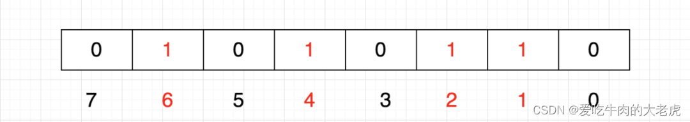

- 第x位为0说明没有数字x，为1说明有数字x。

### 海量数据找中位数（桶排序）

1. 创建多个小文件桶，**设定每个桶的取值范围**，将海量数据分散到对应的桶中。
2. 计算每个桶元素的个数，然后找到中位数所在的桶。
3. 把这个桶进行排序，就能找到中位数。

### 100亿个url找重复的

1. 布隆过滤器
2. 先用算出url的hash,然后根据其hash存放到不同的位置，假设要将源文件拆分成1000个小文件才能放进内存，那就算出hash之后 hash%1000标记其存放的文件，最后将一千个小文件依次分别放入内存，重复的一定在一个小文件里面的。

### 100亿个数找最大的前100个（topK问题）

*  如果不能全部放进内存：先取任意100个数字，维护一个**小根堆**，**小顶堆的顶是100个数里最小的**，然后从第101个数字开始，遇到比根节点大的元素就删除堆顶元素并把该数字放入堆。时间复杂度N*logK N是数据量，K是堆大小。
*  如果能全部放进内存：快速选择 、 计数排序

### 海量数据，提取出访问次数最多的IP

- 分而治之：针对大文件的IP，进行**哈希映射**，映射到一个个小文件中，这样**保证相同的IP会在同一个文件中**。
- 小文件排序：每个小文件内部根据频次降序。
- 统计：得到每个小文件中出现最多的IP，然后依靠常规排序算法得到频次最高的IP。

### 1个G的文件，里面有一堆ip地址，机器内存只有512M，如何找到频率前10的ip

> (哈希分片，存为小文件，小顶堆)

要处理一个1GB大小的文件，其中包含大量的IP地址，并且机器内存只有512MB，我们需要采用一种外部排序或多阶段处理的方法来找出频率最高的前10个IP地址。这里可以采用以下步骤：

**步骤1：哈希分片**

1. **读取文件**：逐行读取文件中的IP地址。
2. **哈希分片**：根据IP地址计算哈希值，将不同的IP地址分配到不同的小文件中。假设我们使用10个小文件，那么每个文件的大小大约为100MB（1GB / 10），这样每个文件都可以在内存中处理。
3. **写入小文件**：将每个IP地址写入对应的分片文件中。

**步骤2：统计每个分片文件中的IP频率**

1. **读取每个分片文件**：逐个读取每个分片文件。
2. **统计频率**：使用字典（哈希表）统计每个IP地址在文件中出现的次数。
3. **写入临时文件**：将每个IP地址及其频率写入一个新的临时文件中。

**步骤3：合并所有临时文件**

1. **读取所有临时文件**：读取所有临时文件，每个文件包含IP地址及其频率。
2. **使用小顶堆**：维护一个大小为10的小顶堆，用于存储频率最高的10个IP地址。
   - 读取每个临时文件中的IP地址及其频率。
   - 如果堆未满，则直接将当前IP地址及其频率加入堆中。
   - 如果堆已满，比较当前IP地址的频率与堆顶元素的频率：
     - 如果当前IP地址的频率大于堆顶元素的频率，则替换堆顶元素。
     - 否则，继续读取下一个IP地址。

**步骤4：输出结果**

1. **输出小顶堆中的元素**：最终堆中的10个元素即为频率最高的10个IP地址。

### 至少需要几只老鼠能测1000瓶中的一瓶毒药？

假设我们有n个老鼠，我们可以为1000瓶药水标上从1到1000的数字，然后把这些数字转换为一个n位的二进制数。

例如，如果我们有10只老鼠，那么编号为13的瓶子可以被表示为：0011001（这是13的二进制表示）。这意味着编号为3、4和7的老鼠会喝这瓶药水，因为这些位置上的位是1。

现在，根据哪只老鼠死亡，我们可以确定哪瓶药水有毒。例如，如果第3、4和7只老鼠死亡，我们就知道编号13的药水有毒。

所以问题是，我们需要多少位的二进制数来表示1000？答案是10位，因为2^10 = 1024，而2^9 = 512是不足够的。这意味着我们需要10只老鼠来测试1000瓶中的一瓶毒药。

### 五种接口幂等方案

| 方案名称           | 实现原理                                                     | 适用场景                     | 优点                                           | 缺点                                                 |
| ------------------ | ------------------------------------------------------------ | ---------------------------- | ---------------------------------------------- | ---------------------------------------------------- |
| **Token 机制**     | 服务端生成唯一 Token，客户端请求时携带 Token，服务端校验后删除或标记 | 表单提交、支付接口等         | 实现简单，可有效防止重复提交；支持高并发场景   | Token 存储依赖缓存（如 Redis），需处理过期和续期问题 |
| **MySQL 唯一索引** | 利用数据库唯一索引约束，插入重复数据时触发唯一性冲突拦截请求 | 数据插入类操作（如订单创建） | 无需额外组件，直接利用数据库特性；强一致性保障 | 高并发下数据库压力大；不适用于更新类操作             |
| **Redis SETNX**    | 基于 Redis 的 `SETNX` 命令实现原子性锁，设置唯一键标识请求   | 分布式高并发场景（如秒杀）   | 高性能，支持分布式；自动过期避免死锁           | 依赖 Redis 高可用性；需处理网络分区和超时问题        |
| **乐观锁**         | 通过版本号或时间戳校验数据变更，仅当版本一致时更新           | 数据更新类操作（如库存扣减） | 无锁设计，减少资源竞争；适用于读多写少场景     | 需额外维护版本字段；高并发下可能触发重试机制         |
| **状态机幂等**     | 基于业务状态流转（如订单状态：待支付→已支付），仅允许单向状态变更 | 有明确状态流转的业务流程     | 与业务逻辑强关联，天然支持幂等；无需额外存储   | 需设计严谨的状态机逻辑；不适用于无状态变化的操作     |


### 如何设计登录功能


### 设计一款日志系统

[从ES到ClickHouse：B站海量日志分析场景迁移的实践与思考_哔哩哔哩_bilibili](https://www.bilibili.com/video/BV1tB4y1p7j7/?spm_id_from=333.337.search-card.all.click&vd_source=287131c1ca1ec0bf7e613ba6feddc39d)

1. 开发环境：日志输出在控制台
2. 生产环境：日志输出在文件中/mysql/ES，专门搭建一个日志系统，业务向日志系统的MQ发送单向消息，日志系统的MQ异步地将日志写入到ES中，这样可以最大程度降低日志对于正常业务的性能影响，同时可以便于问题排查。
3. 数据冷热分离：近期的日志数据存储在ssd中，较为早期的日志数据存储在hdd中。

### 定时任务系统设计

#### 定时任务通用优化方案实战

[定时任务通用优化方案实战(从半个小时优化到秒级)-京东团队_哔哩哔哩_bilibili](https://www.bilibili.com/video/BV18J4m1N7Hd?spm_id_from=333.788.recommend_more_video.1&vd_source=287131c1ca1ec0bf7e613ba6feddc39d)


#### **淘宝的7天自动收货怎么设计？**


#### 订单未支付自动取消如何设计？


### 如何设计一款秒杀系统？

#### 概念

秒杀系统指的是，在很短的时间内要处理高并发请求。

1. 硬件：很重要，但是硬件很贵
2. 考虑软件层面：在有限的硬件上提高性能

QPS(query per second):每秒钟处理请求的数量

每个Tomcat服务器的QPS是有限的，当接口处理时间为10ms内，Tomcat的QPS大概为4k左右，此时我们需要增加Tomcat的数量，并使用nginx做负载均衡。

一个nginx的QPS约为5W/s，一个nginx对应的tomcat约为25个，若我们一个接口的QPS是20W/s，那么一个nginx将顶不住压力，在nginx前面用Lvs/F5（硬件）顶住并发压力。

如果QPS到100W，那么怎么解决？

通过流量分发，将流量拆分到全国各地机房。用域名---DNS轮询策略，将流量分发到各个地方的机房，

我们做大促/秒杀/抢购，需要尽量减少接口的处理时间，50ms 30ms。

如何优化接口的响应时间？

1. 能异步就异步
2. 减少IO
   1. 统一查
   2. 统一写
3. 尽早return
4. 加锁粒度尽可能小
5. 事务控制粒度尽可能小

如果真的要做秒杀，需要前端配合做流量分流

1. 滑块
2. 短信验证码

redis的实际读QPS有8W，写QPS有6W，

在秒杀开始前先同步redis与mysql中的库存，当秒杀开始时，库存现在redis中进行预扣减，然后redis将（商品Id、用户Id）发到MQ中并直接返回，MQ异步地将库存扣减的信息写入MySQL中。（若MySQL消费失败则重试，一直消费失败则信息进入死信队列，人工操作）

通过MQ进行解耦和连接。


一人一单如何实现?

一人一单指的是在优惠券或者限购商品的场景下，一个人针对一件商品只能抢一次。总结起来就是用户的去重（幂等）

解决方案：

1. mysql 去重表
2. redis setNx（当key太多会有大量的冗余信息，可以用redis的set类型保证唯一性，但是用set来做，set秒变大key）


一图流


#### 并发线程安全防止超卖

##### 方案一

在事务的外面加锁，可以实现线程安全，但是没有办法组集群，因为synchronized锁是在一个JVM中互通的，但是对于分布式集群来说，这个锁并不互通，因此，该方案中只能在单机中使用。


##### 方案二

分布式锁：

1. mysql:用mysql的行锁（innodb）对于秒杀数据的那一行进行上锁，在并发不高的情况下可以使用该方案，当并发量很大时，这种做法会大大加大数据库的压力，并不实用，为了保证数据库的可用性，不要让数据库直接承接较大的压力。（并发量几百+上千）
2. redis:redis分布式锁（setNx)，自旋锁，然后异步IO写入mysql，若service自旋时间太短，会导致有部分秒杀请求无法被执行。
3. redis:redission

如果redis挂了怎么办，redis拥有组建集群的功能，可以设置一主二从的方式来设置redis，

在全国分布式的情况下，秒杀应该如何进行？

nginx单机qps有5w，


#### 总结

技术选型：springboot + Redis + MySQL + RocketMQ

设计（抢优惠券）：

- 设计seckill-web 接收处理秒杀请求。
- 设计seckill-service处理秒杀真实业务

部署细节：

- 用户量：50W
- 日活量：2-3W / 5%
- qps: 2W+ [打日志 | 打日志]
- 几台服务器：8C16G  seckill-web:4台  seckill-service:2台
- 带宽：100M

技术要点：

1. 通过redis的setNx对用户和商品做去重判断，防止用户刷接口行为
2. 每天晚上8点通过定时任务，把mysql 中参与秒杀的库存商品，同步到redis中去，做库存的预扣减，提升接口性能。
3. 通过RocketMQ消息中间件的异步消息，来将秒杀的业务异步化，进一步提升系统性能（通过RocketMQ的并发模式，设定线程数量来设定合理的模式）
4. seckill-service使用并发消费模式，并且设置合理的线程数量，快速处理队列中堆积的消息。
5. 使用redis的分布式锁+自旋锁，对商品的库存进行并发控制，把并发压力转移到程序中和redis中去，减少数据库压力。
6. 使用声明式事务注解Trancational,并且设置异常回滚类型，控制数据库的原子操作。
7. 使用jmeter压测工具，对秒杀接口进行压力测试，在8C16G的服务器上，qps 2k+,达到压测预期。


### 如何从零搭建10万级QPS大流量、高并发优惠券系统

1.QPS和TPS概念混淆，最关键的扣减库存和发放记录都是高TPS操作，应对高TPS基本操作首先是利用mq削峰填谷，以及死信队列这种兜底方案；其次是mysql参数调优，例如innodb_thread_concurrency提升吞吐量；其次才是你说的多主架构。这个分析过程必不可少，肯定不是上来直接拆多个主库

 2.每个mysql主库又搞了2个从库属实没看懂，如果是为了查询方便为什么不把多个主库用canal之类的同步到1个库或者Elasticsearch中？OLAP模型有很多解决方案的，你这样搞如果遇到关键字查询，分页等需求要怎么做？ 

3.redis扣减库存那里是因为TPS过高所以把库存拆成多个redis实例，这个没问题，但是扣减库存竟然要挨个库存去试，那不是TPS更高了？用布隆过滤器查询redis有无库存，不香吗

xxx万级QPS的yyy系统”一律按“xxx万级QPS的SQL insert操作

### 当QPS突然提升十倍，应该如何设计？

当QPS（每秒查询率）突然提升十倍时，系统的负载会急剧增加，如果不进行适当的优化和扩展，可能会导致系统响应时间延长、服务不可用等问题。你提到的四个步骤是应对这种情况的有效策略，下面我会详细解释每个步骤，并引用相关资料中的细节来支持这些策略。

**1. 微服务架构重构**

将单体应用转变为微服务架构可以提高系统的可扩展性和灵活性。在微服务架构中，每个服务都是独立部署的，可以单独扩展以满足流量需求。这种架构还允许团队根据业务需求快速迭代和部署新功能，而不会影响其他服务。此外，通过引入微服务网关（API Gateway），可以统一管理所有微服务的入口点，提供诸如身份验证、限流等功能。

**2. 高性能RPC框架**

随着服务的拆分，服务间通信变得至关重要。选择合适的远程过程调用（RPC）框架对于保持高性能至关重要。gRPC和Dubbo等框架提供了高效的序列化机制和内置的负载均衡、熔断降级等特性，能够有效减少延迟并提高吞吐量。例如，有测试表明Dubbo RPC的性能是Feign RPC的10倍。

**3. 存储层与业务逻辑层优化**

**存储层优化**

- **硬件层面**：可以通过增加数据库服务器数量来分散负载，这通常意味着实施读写分离和主从复制策略。
- **软件层面**：
  - 实施读写分离，使用如MySQL的主从复制技术来分配只读请求到副本上。
  - 对于大规模数据存储，考虑采用分布式数据库解决方案，如TiDB或OceanBase。
  - 使用Redis作为缓存层来减轻数据库的压力，尤其是在处理热点数据时。

**业务逻辑层优化**

- 审查关键路径代码，去除不必要的计算和资源消耗。
- 对于非实时性要求的任务，采用异步处理模式，利用消息队列（如RabbitMQ、Kafka）来削峰填谷，降低峰值时段的压力。
- 设计合理的流量控制和服务降级策略，确保在高负荷情况下核心服务仍能正常运行。

**4. 监控体系构建**

为了保证系统的稳定性和可靠性，必须建立一套完善的监控系统。该系统应该能够实时监测QPS、响应时间和错误率等关键指标，并设置相应的报警阈值。一旦检测到异常情况，比如QPS异常增长，应立即触发报警以便及时采取措施。

综上所述，面对QPS突然提升十倍的情况，上述四步策略不仅有助于短期内缓解压力，而且为长期的系统扩展和维护打下了坚实的基础。每个步骤都需要仔细规划和执行，以确保系统的高效运行和持续可用性。

### 设计一个RPC协议


### 设计一个消息队列（消息队列的原理）


### 100亿个url找重复的

1. 布隆过滤器
2. 先用算出url的hash,然后根据其hash存放到不同的位置，假设要将源文件拆分成1000个小文件才能放进内存，那就算出hash之后 hash%1000标记其存放的文件，最后将一千个小文件依次分别放入内存，重复的一定在一个小文件里面的。

### 100亿个数找前100个（topK问题）

topK问题

- 如果不能全部放进内存：维护一个小根堆，比根节点大的元素放入堆。时间复杂度N*logK N是数据量，K是堆大小。
- 如果能全部放进内存：快速选择 、 计数排序

### 100M内存怎么读取10G文本？如果统计数字重复次数，拿到最大的重复数，要怎么做？

1. 通过缓冲输入流分块读取10 GB的文件（解决读取比内存大的文件的问题），对读进来的内容进行hash映射，具体来说：对每个数字计算hash值，计算得到的哈希值对 1000取模，根据结果将数据存到1000个文件中（1000个文件在磁盘里），这样就把大文件转换成了小文件，每个小文件大约10MB（因为用的是hash取模，所以10GB的数字取模后分布是相对均匀的，如果有某一个数字巨多，100MB也存不下，那就特殊对待吧）哈希取模可以保证相同的数字一定存放在同一个小文件里 
2. 小文件可以直接读入内存中了，此时采用HashMap方法统计出现次数最高的，对每个小文件都计算出现频率最高的数字，那么就统计了1000个在各自的小文件中出现次数最高的数字
3. 然后在1000个数字里找到出现次数最高的数字（如果只是找最高的，那么一次遍历就好了；如果是要找频率最高的前 K 个数字，那么用堆排序，并且第二步也用堆排序）


## 智力题

### 有很多不规则的绳子，一条绳子烧完需要1小时，怎么得到1小时15分钟

把第一根绳子两头同时点燃,同时把第二根绳子点燃一头,当第一根绳子烧完时,时间为半个小时,这时把第二根绳子的另一头也点燃,开始计时,当第二根绳子烧完时,停止计时,那么这段时间就是15分钟.

### 至少需要几只老鼠能测1000瓶中的一瓶毒药？

假设我们有n个老鼠，我们可以为1000瓶药水标上从1到1000的数字，然后把这些数字转换为一个n位的二进制数。

例如，如果我们有10只老鼠，那么编号为13的瓶子可以被表示为：0011001（这是13的二进制表示）。这意味着编号为3、4和7的老鼠会喝这瓶药水，因为这些位置上的位是1。

现在，根据哪只老鼠死亡，我们可以确定哪瓶药水有毒。例如，如果第3、4和7只老鼠死亡，我们就知道编号13的药水有毒。

所以问题是，我们需要多少位的二进制数来表示1000？答案是10位，因为2^10 = 1024，而2^9 = 512是不足够的。这意味着我们需要10只老鼠来测试1000瓶中的一瓶毒药。


3.  

## 计算机基础知识


#### 十大排序


##### 快速排序

核心思想:

1.在待排序的元素任取一个元素作为基准(通常选第一个元素，称为基准元素）

2.将待排序的元素进行分块，比基准元素大的元素移动到基准元素的右侧，比基准元素小的移动到作左侧，从而一趟排序过程，就可以锁定基准元素的最终位置

3.对左右两个分块重复以上步骤直到所有元素都是有序的（递归实现）。


##### 归并排序

##### 堆排序

##### 桶排序

#### 快速排序时间复杂度推导

**最好情况：**

 T(N) = 2 * T(N/2) + O(N)

 O(N)表示完成一次元素交换的时间复杂度

 T(N)可以一直递归下去，如果每次都是二分，一共可以递归LogN次；

 最后T(N) = logN*O(N)

**最坏情况：**


#### 常用字符编码所占字节数？

`utf8` :英文占 1 字节，中文占 3 字节，`unicode`：任何字符占 4 个字节，`gbk`：英文占 1 字节，中文占 2 字节

#### Unicode和UTF-8

**Unicode**：它是一个字符集，为世界上的每一个字符指定了一个唯一的数字。这意味着使用 Unicode，你可以使用一个通用的数字来表示任何语言中的任何字符。通常用4个字节来表示

**UTF-8**：这是一个字符编码方法，用于将 Unicode 字符集中的字符转换为字节流。除了 UTF-8 之外，还有其他方法如 UTF-16 和 UTF-32 可以用于此目的。

**设计目标**：

**Unicode**：为世界上所有的字符和符号提供一个统一和唯一的数字。

**UTF-8**：提供一种有效的方式来存储和传输 Unicode 字符。UTF-8 被设计为与 ASCII 兼容，这意味着所有 ASCII 字符在 UTF-8 中都使用一个字节，并且这些字节与 ASCII 中的相应字节相同。使

- UTF-8使用变长字节来编码字符。ASCII 字符（0-127）使用一个字节，拉丁文和其他字符可能使用两个或三个字节，而其他一些字符可能使用四个字节。

UTF-8工作原理：

**多字节编码**:

- 对于超出 ASCII 范围的字符，UTF-8 使用多个字节进行编码。这些字节的最高位用于标识该字节在整个编码序列中的位置。
- 开始字节的高位标识了字节的数量，而后续字节则始终以 `10` 开始。

以下是字节格式的摘要：

- `0xxxxxxx`: 单字节字符（ASCII 范围）
- `110xxxxx 10xxxxxx`: 2字节字符
- `1110xxxx 10xxxxxx 10xxxxxx`: 3字节字符
- `11110xxx 10xxxxxx 10xxxxxx 10xxxxxx`: 4字节字符

这种设计的好处是，即使在多字节序列中的某个位置发生错误或丢失数据，仍然可以确定后续字节的开始位置，这有助于恢复或同步数据流。

例如，如果你看到一个字节 `110xxxxx`，你就知道接下来会有一个字节，并且这个字节应该是 `10xxxxxx` 的形式。如果不是，那么你就知道在某个地方发生了错误。

这种设计也使得 UTF-8 与 ASCII 完全兼容，因为 ASCII 字符仅使用单字节，并且不会出现在多字节序列中。因此，任何有效的 ASCII 文本也都是有效的 UTF-8 文本。

## 项目

根据简历，确定重点八股。

苍穹外卖可以是较为初级的方案，通过直接查询缓存的方式查询用户名，短链接项目中可以加入布隆过滤器显得更加高级一些。

在苍穹外卖中，用户量并不大，所以可以用直接缓存的方式查询用户名，但是短链接项目的并发量大很多，因此需要想办法节省内存，用布隆过滤器的方式可以大幅度节省内存，但是布隆过滤器可能存在误判的情况。

在注册用户名的时候，判断用户名是否存在这个业务，可以容忍布隆过滤器的误判性，比如注册用户名为aa，系统返回不可用，此时大可以换其他用户名进行注册。

布隆过滤器

布隆过滤器需要设置初始容量， 容量设置越大，冲突几率越低。

 谈到了异步任务 -> 异步任务一些八股


